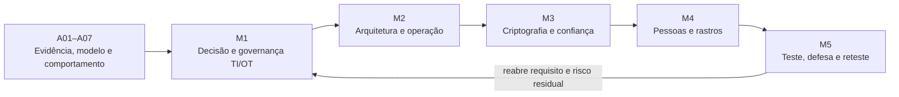

# Proposta de macroorganização — A08 a A31

**Decisão vigente — 10 set. 2026:** A08 foi confirmada como ministrada. A09 foi reformulada para comprometimento de conta e ransomware, encerrando análise, tratamento e avaliação de controles em 100 min (60T/40P). A atividade A08–A09 inclui a revisão por evidências e fecha em A09. A10 fica pendente; sua antiga função nas tabelas abaixo é memória da proposta, não plano autorizado para produção. A reserva de carga não define seu novo conteúdo. Ver arquitetura e detalhamento atualizados.

**Estado: macroorganização utilizada como base do detalhamento solicitado pelo docente; não publicada no GitHub Pages.**

O [detalhamento temático A08–A31](detalhamento-conteudos-por-aula.md) especifica objetivos, conteúdos e condução de cada aula, com [revisão técnica IT/OT](parecer-tecnico-detalhamento.md). Mantêm-se os cinco blocos e as cinco atividades abaixo. Gestão de riscos e definição de controles integram M1, com análise, decisão e avaliação de controles encerradas em A09; A10 aguarda replanejamento e a adaptação OT de A11–A12 exige revalidar suas dependências. A [confrontação histórica](confrontacao-a01-a07-a08-a10.md) motivou a redução da retomada e o início de SGSI já em A08.

**Base confirmada:** A07 foi a última aula ministrada. Restam 24 encontros de 100 minutos: **2.400 minutos, ou 40 horas-relógio**. Aulas temáticas seguem como unidades de navegação e condução; a avaliação se concentra em **cinco atividades principais**, uma por macrocomponente. Não há nova tarefa a cada encontro.

As prioridades declaradas foram reunidas numa mesma sequência: fechamento breve da modelagem; governança logo em seguida; centralidade de NIST SP 800-82 Rev. 3 no eixo OT; profundidade em criptografia/assinaturas; participação significativa de segurança ofensiva e defensiva. O [agente revisor](parecer-revisor.md) foi solicitado pelo docente e trabalhou de modo independente; sua crítica foi incorporada na distribuição de OT, na redução da nuvem e nos limites de profundidade.

## 1. Diagnóstico do ponto de partida

A01–A07 foram reconsultadas diretamente na pasta oficial do Drive. A confirmação docente de realização até A07 não comprova, por si só, que todas as duplas concluíram os produtos. Usar entregas existentes quando disponíveis; se faltarem, o professor fornece o caso e o identifica como tal.

| Acumulado nas apresentações | O que permite aproveitar | O que não presumir |
|---|---|---|
| A01–A03: evidência, ativo, ameaça, hipótese e triagem | linguagem comum e necessidade de sustentar decisões | investigação completa, atribuição comprovada ou controle implantado |
| A04–A05: fluxo de cestas, fronteira, sessão e propriedade | caso web conhecido, política de acesso e estrutura de testes | arquitetura interna conhecida nem todos os testes aprovados |
| A06: DFD/STRIDE e ameaças candidatas | modelo mínimo e perguntas testáveis | tratamento e revisão do risco já concluídos |
| A07: ATT&CK Enterprise/ICS a partir de relato consolidado | descrição de comportamento rastreável | Red Team executado, Blue Team testado ou detecção eficaz |

A ponte final da A06 prometia tratamento na A07, que efetivamente trabalhou mapeamento ATT&CK. Porém A02 e A05 já ensinaram controles e testes: a justificativa anterior superestimou a lacuna. A08 fará uma ponte de 15 minutos com exemplo resolvido e entrará em SGSI; A09 conclui avaliação/decisão de risco e avaliação de controles; A10 aguarda replanejamento. Não haverá outro encontro inteiro de modelagem ou autorização de cestas.

A divergência histórica entre o “modelo industrial da A06” citado na A07 e o modelo real de cestas permanece explicitada. O processo industrial usado prospectivamente é cenário fornecido, não resultado atribuído retroativamente à A06.

## 2. O que o GitHub Pages já oferece e o que falta

Foram abertas páginas públicas do percurso, criptografia, assimétricos, hash, certificados, governança, riscos e pentest. A revisão independente também examinou navegação e ementa. Trata-se de análise de cobertura e amostra substantiva, não auditoria técnica de cada frase da biblioteca inteira.

| Conteúdo público | Aproveitar | Complementação necessária no novo percurso |
|---|---|---|
| [Percurso A01–A07](https://rafaelrezo.github.io/seguranca-digital/percurso/) | casos, vocabulário e fontes já familiares | fechar tratamento; separar estudo publicado e competência demonstrada |
| [Governança](https://rafaelrezo.github.io/seguranca-digital/governanca/introducao/) e [riscos](https://rafaelrezo.github.io/seguranca-digital/gestao_riscos/introducao/) | papéis, política, critérios, residual e acompanhamento | SGSI trabalhado no caso; NIST/OT aplicado; requisito e evidência relacionados |
| [Criptografia](https://rafaelrezo.github.io/seguranca-digital/criptografia/) | ampla base de consulta | experimentos cumulativos, gestão de chaves e consequências de falha |
| [Assimétricos](https://rafaelrezo.github.io/seguranca-digital/criptografia/assimetricos/) e [hash](https://rafaelrezo.github.io/seguranca-digital/criptografia/hash/) | distinções iniciais de mecanismos | aprofundar confiança na chave, digest de referência e limites de atribuição |
| [Certificados](https://rafaelrezo.github.io/seguranca-digital/criptografia/certificados_digitais/) | campos, cadeia e revogação | diagnóstico comparado, finalidade, confiança e efeito operacional |
| [Pentest](https://rafaelrezo.github.io/seguranca-digital/pentest/visaogeral/) | objetivo, escopo, processo e ética | execução instrumentada, prova mínima, defesa, correção, relatório e reteste |
| Biblioteca de malwares/engenharia social | famílias e conceitos de consulta | caminho progressivo com mensagens e telemetria realmente fornecidas |
| OT, normas industriais, Red/Blue/Purple | menções e conexões iniciais | unidades próprias com decisão e evidência; não contar citação como domínio |

**Correções conceituais a fazer quando a revisão do site for autorizada:** assinatura digital não requer universalmente uma PKI; o que importa para atribuir identidade inclui confiança na chave pública e no seu vínculo. Hash isolado detecta divergência em relação a uma referência, mas não autentica uma referência que o adversário também pode substituir. Verificação de assinatura não prova automaticamente autoria humana, ausência de comprometimento nem não repúdio jurídico. Certificado e canal válidos não tornam seguro todo conteúdo ou endpoint. Estas são prioridades de revisão, não alterações feitas agora. Referências: [FIPS 186-5](https://csrc.nist.gov/pubs/fips/186-5/final), [gestão de chaves](https://csrc.nist.gov/pubs/sp/800/57/pt1/r5/final) e [TLS 1.3](https://www.rfc-editor.org/rfc/rfc8446.html).

## 3. Macroorganização proposta

| Macrocomponente | Encontros | Quantidade | Carga | Prática principal |
|---|---|---:|---:|---|
| **M1 — Da modelagem à governança e ao programa de segurança TI/OT** | A08–A12 | 5 | 8h20 | P1 — decisão de tratamento e governança |
| **M2 — Arquiteturas, perímetro e continuidade TI/OT** | A13–A15 | 3 | 5h | P2 — revisão da arquitetura |
| **M3 — Criptografia, assinaturas e confiança** | A16–A21 | 6 | 10h | P3 — pacote de verificação criptográfica |
| **M4 — Pessoas, endpoint, logs e operação defensiva** | A22–A24 | 3 | 5h | P4 — análise de um caminho e sua detecção |
| **M5 — Segurança ofensiva e defensiva: pentest, Red, Blue e Purple Team** | A25–A31 | 7 | 11h40 | P5 — avaliação integrada e reteste |
| **Total** | **A08–A31** | **24** | **40h** | **5 atividades** |

Criptografia ocupa 25% dos encontros; o bloco ofensivo/defensivo, aproximadamente 29%. Juntos são 13 encontros, ou 54% da carga restante. Segurança OT permanece transversal em M1/M2 e retorna operacionalmente no exercício final. O bloco M5 inclui defesa e recuperação; não são sete encontros exclusivamente de exploração.

## 4. Conteúdo e condução de cada encontro

Os minutos T/P são uma distribuição de planejamento entre construção conceitual e prática conduzida: não significam dois blocos separados nem 50 minutos de exposição contínua. A prática inclui demonstração, leitura de evidência, decisão e validação guiadas. Não representa 20 horas de operação individual; o enquadramento institucional precisa respeitar o plano de ensino. O histórico possui cargas distintas e não foi recontado como se todas as aulas tivessem 100 minutos.

### M1 — Da modelagem à governança e ao programa de segurança TI/OT

Fechar o modelo e atribuir escopo, prioridade, responsável e evidência; ISO/IEC 27001 como estrutura de gestão, NIST SP 800-82r3 como referência central OT e ISA/IEC 62443 como complemento por função.

| Encontro temático | Conteúdo a construir | Demonstração e participação conduzidas | Registro que segue adiante | T/P min |
|---|---|---|---|---|
| **A08 — Quem governa a segurança depois que a falha é conhecida?** | Ponte de 15 min com modelagem/OWASP já trabalhadas; ISO/IEC 27001 e SGSI: escopo organizacional, partes interessadas, liderança, autoridade, recursos, objetivos, informação documentada e acompanhamento | Professor recebe exemplo técnico resolvido, compara dois escopos do SGSI e conduz a definição de papéis, objetivo e rotina de acompanhamento diante de uma falha de gestão | Escopo do SGSI, papéis com autoridade e recurso, objetivo verificável e rotina de acompanhamento. **Ponte:** Escopo e autoridade de decisão para avaliar dois riscos fornecidos em A09 | 50/50 |
| **A09 — Decidir e avaliar controles de segurança digital** | Comprometimento de conta e ransomware; critérios, tratamento, cobertura, desenho/implantação/resultado e residual | Professor compara E1–E4, conduz plano de 12 h, avalia T1–T3 e apresenta V1 | Registro único A08–A09 concluído, incluindo revisão de R02 e autoridade. Sem etapa de controles na A10 | 60/40 |
| **A10 — Replanejamento pendente** | Função anterior absorvida por A09; novo conteúdo não definido | A definir após decisão docente | Nenhuma ampliação da entrega A08–A09; revalidar dependências futuras | Reserva anterior 50/50; a revalidar |
| **A11 — O que muda no programa de segurança quando há processo físico?** | NIST SP 800-82r3 como referência central OT; processo, função, confiabilidade, safety, legado; equipe multidisciplinar e programa | Professor fornece e percorre processo normal com HMI/CLP/sensor/atuador, em simulador previamente preparado ou captura; compara interrupção administrativa e efeito físico | Função normal, consequência física e responsável operacional. **Ponte:** Condição operacional que limita o tratamento em A12 | 50/50 |
| **A12 — Como usar NIST SP 800-82 e ISA/IEC 62443 na mesma decisão?** | Risco OT, seleção e adaptação de controles; ISA/IEC 62443 por papéis, ciclo de vida, zonas/conduítes e requisitos; diferença entre guia, norma e comprovação | Leitura guiada de trechos selecionados: uma decisão de acesso remoto, uma recomendação NIST e uma referência ISA/IEC; nenhuma equivalência automática | Matriz fonte→decisão→responsável→evidência; fechamento conceitual M1. **Ponte:** Fluxo autorizado e restrição operacional para A13 | 40/60 |
### M2 — Arquiteturas, perímetro e continuidade TI/OT

Observar processo e comunicação; controlar fluxos e manutenção; validar operação preservada e recuperação. Nuvem é transferência curta, sem atividade adicional.

| Encontro temático | Conteúdo a construir | Demonstração e participação conduzidas | Registro que segue adiante | T/P min |
|---|---|---|---|---|
| **A13 — Como o processo físico depende dos fluxos de comunicação?** | Processo normal; HMI, CLP, sensor/atuador e telemetria; endereço, porta, serviço e protocolo por função; fluxo legítimo e dependência | Professor opera processo OT virtual previamente preparado, localiza variável e fluxo na telemetria/captura e compara topologias. Turma prevê o efeito de perder uma comunicação; sem configuração autônoma | Matriz origem/destino/serviço/finalidade. **Ponte:** Regras de filtragem e acesso remoto para A14 | 55/45 |
| **A14 — Como controlar o acesso remoto sem perder a operação?** | Defesa em profundidade, firewall/ACL, DMZ, VPN, jump host; autenticação/autorização; disponibilidade, exceção e recuperação | Demonstração de fluxo permitido e negado em laboratório isolado e de restauração de acesso; interpretar regra e resultado | Diagrama antes/depois e testes de função. **Ponte:** Transferência de responsabilidade e identidade em A15 | 45/55 |
| **A15 — Como preservar manutenção, continuidade e recuperação?** | Acesso remoto temporário, identidade e privilégio; backup/restauração e estado confiável; responsabilidade compartilhada e IAM/nuvem como transferência curta | Professor concede e encerra acesso de manutenção no cenário isolado e valida retorno ao estado esperado. Transfere a mesma decisão a política/grupo de segurança e evento AWS previamente capturados, sem laboratório de nuvem adicional | Revisão arquitetural P2 com acesso, fluxo, restauração e propriedade do canal ainda pendente. **Ponte:** Dados e mensagens que exigem proteção criptográfica na A16 | 50/50 |
### M3 — Criptografia, assinaturas e confiança

Aprofundar propriedades, mecanismos, assinaturas, certificados, canal e ciclo das chaves por testes positivos e negativos.

| Encontro temático | Conteúdo a construir | Demonstração e participação conduzidas | Registro que segue adiante | T/P min |
|---|---|---|---|---|
| **A16 — O que a criptografia precisa proteger neste fluxo?** | Confidencialidade, integridade e autenticidade; estados do dado, codificação versus cifra; atacante, chave, aleatoriedade e limite | Professor compara o mesmo arquivo em claro, codificado, cifrado e resumido; turma prevê qual adversário cada mecanismo enfrenta | Matriz propriedade→mecanismo→limite. **Ponte:** Proteção de conteúdo e adulteração para A17 | 60/40 |
| **A17 — Cifrar impede adulterar? Criptografia simétrica autenticada** | Cifra de bloco/fluxo em nível funcional; AES, modos, IV/nonce, AEAD/tag; reutilização e gestão de chave | Ferramenta/biblioteca pronta: cifrar, decifrar e rejeitar alteração; contraste didático de nonce reutilizado, sem implementar primitivas | Resultados comparados: correto, adulterado e chave errada. **Ponte:** Diferença entre hash, MAC e verificador de senha em A18 | 45/55 |
| **A18 — Hash, HMAC, senha e segredo resolvem o mesmo problema?** | Digest e referência confiável, colisão/preimagem; HMAC; salt, KDF e custo; senha versus segredo recuperável | Comparar arquivo alterado e digest também substituído; verificar MAC; comparar registros fictícios de senha e função de derivação | Decisão de armazenamento e evidência de autenticidade da mensagem. **Ponte:** Limite de atribuição com segredo compartilhado para A19 | 45/55 |
| **A19 — O que uma assinatura digital permite verificar?** | Par de chaves, assinatura/verificação, hash na assinatura; RSA-PSS/ECDSA/EdDSA por função; chave pública confiável; limites de autoria e não repúdio | Assinar arquivo fictício; verificar original, arquivo adulterado e chave pública errada; contrastar com HMAC; não reduzir assinatura a “cifrar com a chave privada” | Tabela de verificação e conclusões condicionadas. **Ponte:** Vínculo entre chave, identidade e finalidade para A20 | 50/50 |
| **A20 — Certificado válido significa confiança suficiente?** | Certificado X.509, cadeia, âncora, SAN, validade, uso, revogação; vínculo identidade/chave; assinatura de artefato versus canal | Professor inspeciona cadeia e certificados preparados válidos e inválidos; diferencia assinatura matematicamente válida e emissor não confiável | Diagnóstico de certificado e requisito de confiança. **Ponte:** Negociação de canal e ciclo das chaves para A21 | 50/50 |
| **A21 — Como TLS, assinaturas e gestão de chaves trabalham juntos?** | Troca autenticada de chaves, solução híbrida, TLS e mTLS; geração, armazenamento, rotação, revogação/comprometimento e recuperação | Observar canal preparado; comparar identidade errada e cadeia inválida; validar pacote de atualização assinado recebido pelo canal; concluir P3 | Decisão criptográfica integrada com testes positivos e negativos. **Ponte:** Eventos necessários para reconhecer uso indevido na A22 | 50/50 |
### M4 — Pessoas, endpoint, logs e operação defensiva

Relacionar engenharia social, comportamento do endpoint, auditabilidade e ação defensiva; preparar evidências para o exercício final.

| Encontro temático | Conteúdo a construir | Demonstração e participação conduzidas | Registro que segue adiante | T/P min |
|---|---|---|---|---|
| **A22 — Como uma mensagem leva uma pessoa a tomar a decisão errada?** | Pretexto, urgência, autoridade, impersonificação, phishing e verificação independente; conscientização, finalidade, minimização e feedback | Professor compara mensagens fictícias e conduz verificação por canal independente; desenha pequena ação educativa sem envio real | Protocolo de verificação e métrica de processo. **Ponte:** Ação da pessoa e possível execução no endpoint para A23 | 55/45 |
| **A23 — Que comportamento diferencia manutenção de comprometimento?** | Malware por comportamento; execução, persistência, conexões e impacto; proteção/EDR funcional, coleta e contenção reversível | Professor consulta pacote sanitizado de processos, conexões e eventos; compara manutenção e comportamento anômalo sem executar malware | Hipótese e sequência de evidências do endpoint. **Ponte:** Campos e relógios para a trilha auditável de A24 | 45/55 |
| **A24 — Que registros permitem detectar, auditar e responder?** | Accounting, contexto, tempo, integridade, retenção e acesso; evento/alerta/incidente; lógica de detecção, falso positivo/negativo; auditoria e resposta | Correlacionar logs e testar regra simples contra exemplos positivos/negativos; escolher coleta/ação e condição de recuperação; fechar P4 | Trilha e detecção candidata com limitações. **Ponte:** Critérios de êxito da defesa a testar no bloco final | 50/50 |
### M5 — Segurança ofensiva e defensiva: pentest, Red, Blue e Purple Team

Executar avaliação autorizada no laboratório, observar a defesa, revisar detecção, validar OT e comunicar tratamento. Papéis e objetivos diferentes ficam explícitos.

| Encontro temático | Conteúdo a construir | Demonstração e participação conduzidas | Registro que segue adiante | T/P min |
|---|---|---|---|---|
| **A25 — Pentest, Red Team, Blue Team e Purple Team: qual é a missão?** | Avaliação de vulnerabilidade versus pentest; Red Team orientado a objetivo, Blue Team defesa, Purple Team colaboração; autorização, regras e métricas | Professor recebe demanda derivada de P1/P2, delimita alvo, contas, técnicas, janela, parada, telemetria e recuperação; turma decide o que fica fora | Plano de avaliação com objetivos ofensivos e defensivos. **Ponte:** Superfície em escopo para A26 | 55/45 |
| **A26 — O que o reconhecimento permite afirmar?** | Inventário, descoberta e enumeração restrita; hipótese versus achado; limites de scanner; priorização orientada pelo modelo | Mapear serviços e endpoints somente do laboratório e inspecionar tráfego; se scanner for usado, professor limita alvo e confronta alerta com evidência | Inventário e casos candidatos, com falsos positivos possíveis. **Ponte:** Casos selecionados para verificação manual em A27 | 45/55 |
| **A27 — O controle de acesso resiste a variações que ainda não testamos?** | WSTG, autorização por objeto/função, isolamento entre usuários, contexto e fluxo; prova mínima; correção e regressão | Professor executa variação nova além de Ana→A/Bruno→B, como ação de alteração ou papel, escolhida no laboratório ensaiado; demonstra correção em variante preparada | Achado reproduzível com teste legítimo e teste de abuso. **Ponte:** Segundo contexto de entrada e limite da defesa em A28 | 45/55 |
| **A28 — Quando o dado passa a ser interpretado como instrução?** | Validação de entrada, parametrização e codificação de saída por contexto; injeção e impacto sustentado; WSTG/Cheat Sheets | Professor compara entrada normal e variação controlada em um caso ensaiado do Juice Shop; acompanha execução e correção fornecida, preservando função | Segundo achado e contraprova; sem coleção de flags. **Ponte:** Caminho adversário curto e telemetria prevista para A29 | 45/55 |
| **A29 — A defesa percebe o caminho que o exercício Red Team percorreu?** | Emulação adversária limitada, objetivo de negócio, ATT&CK; Blue Team telemetria e investigação; diferença entre êxito de ataque e cobertura defensiva | Professor conduz duas ou três ações autorizadas da trilha já preparada; turma alterna previsão Red e análise Blue sobre rastros visíveis | Mapa ação→rastro→detecção/ausência→limite. **Ponte:** Ajuste colaborativo de detecção e validação em A30 | 50/50 |
| **A30 — Como validar defesa OT sem comprometer o processo?** | Aplicação OT de zonas/conduítes, mudança, contenção e estado seguro; Purple Team por objetivo compartilhado; restauração e disponibilidade | Professor usa OpenPLC/FUXA isolado ou reprodução de tráfego/estado: testa decisão de acesso, observa variável de processo, ajusta monitoramento e restaura. Sem exploração de controlador real | Comparação antes/depois da defesa e do processo. **Ponte:** Eficácia demonstrada, incerteza e decisão final na A31 | 55/45 |
| **A31 — O reteste sustenta a decisão da organização?** | Relatório técnico/executivo, severidade contextual, causa, remediação, regressão, aceitação residual e melhoria | Professor reabre requisitos P1, arquitetura P2, confiança P3 e rastros P4; retesta achados e contesta conclusões; consolida P5 sem apresentação extra por dupla | Dossiê final enxuto e decisão revisável. **Ponte:** Plano de acompanhamento pós-curso, sem nova entrega | 55/45 |

**Somatório verificável:** 1.200 min de teoria aplicada + 1.200 min de prática conduzida = 2.400 min. A distribuição está em [encontros.json](encontros.json). As 40 horas futuras não demonstram sozinhas cumprimento da carga institucional global de 30h teóricas + 30h práticas; essa conciliação depende do registro acadêmico efetivo, sem inventar equivalências.

## 5. Fechar modelagem e entrar em governança

### A08: ponte curta e entrada efetiva em governança

A [confrontação A01–A07](confrontacao-a01-a07-a08-a10.md) mostrou que A02 já conectou exposição, controle e reteste; A05 já trabalhou correção no servidor, quatro casos e Cheat Sheets. Portanto, o fechamento de modelagem ocupa **15 minutos**, com exemplo pronto: 5 de recuperação e 10 de síntese OWASP/requisito/verificação. Não repetir DFD, STRIDE, ATT&CK ou configuração do laboratório.

Os 85 minutos seguintes tratam SGSI: escopo organizacional, dependências, liderança, autoridade, recursos, objetivos e acompanhamento. A09 recebe esse arranjo para avaliar riscos; A10 recebe o tratamento escolhido para justificar e avaliar controles. A dificuldade pontual no exemplo inicial recebe apoio focal, sem reiniciar a sequência histórica. A consulta aprofundada a Cheat Sheets ocorre quando o controle técnico exigir, especialmente em M3/M5.

## 6. Profundidade em criptografia e assinaturas

O bloco usa um fluxo estável: a empresa recebe do fornecedor um pacote de atualização fictício e troca mensagens administrativas. Trata-se de novo insumo didático, não de firmware real nem produto atribuído às aulas passadas. O mesmo arquivo é cifrado, alterado, autenticado, assinado, verificado e transportado por um canal preparado. Scripts e ferramentas são fornecidos; os estudantes não implementam primitivas.

A profundidade virá de explicar por que resultados diferem. Os casos incluem original válido, conteúdo alterado, chave errada, referência substituída, emissor não confiável e chave comprometida. Nem todos os casos cabem no mesmo encontro. Assinaturas possuem um encontro central (A19) e aplicações em certificados (A20), canal/pacote (A21) e reteste (A31).

Limites do núcleo: compreender escolhas, executar/acompanhar verificações e justificar confiança. Demonstrações matemáticas extensas, implementação de AES/RSA, blockchain, mineração e um catálogo de algoritmos pós-quânticos ficam como extensão, sem consumir a única prática de assinatura ou gestão de chaves.

## 7. Parte ofensiva e defensiva significativa, com propósitos distintos

O bloco final recebe requisitos de P1, arquitetura P2, confiança P3 e rastros P4. A A05 serve apenas como linha de base breve: os novos testes precisam mudar ação, contexto, propriedade ou controle observado, não repetir a troca de cesta por 100 minutos.

- **Pentest:** verifica vulnerabilidades sob escopo, com evidência e relatório; usa [WSTG](https://owasp.org/www-project-web-security-testing-guide/) e planejamento apoiado no [NIST SP 800-115](https://csrc.nist.gov/pubs/sp/800/115/final).
- **Red Team:** introduz objetivo adversário e emulação curta; a referência ATT&CK da A07 ganha função operacional. A [MITRE apresenta planos de emulação](https://attack.mitre.org/resources/adversary-emulation-plans/) que apoiam validação das defesas; a aula adapta um recorte seguro e não executa uma campanha completa.
- **Blue Team:** acompanha telemetria, valida hipóteses, reconhece lacunas e testa resposta. Contar alertas não mede sozinho eficácia.
- **Purple Team:** colaboração para comparar ação e visibilidade, ajustar uma defesa e repetir o teste. É uma forma de trabalho conjunto, não uma exigência de terceira equipe permanente.

O professor opera o cenário; a turma alterna decisões a partir das perspectivas. Não se exige competição, instalação simultânea de uma distribuição de segurança nem desenvolvimento de ferramenta ofensiva. Primeiramente DevTools; proxy ou scanner somente se o caso exigir e após instrumentação. O recorte TI usa Juice Shop local. OT usa simulação isolada, observação/telemetria e validação de estado seguro, sem varredura ativa indiscriminada ou técnicas destrutivas. Não confundir isso com formação completa de red teamer ou SOC.

## 8. Cinco atividades, sem fragmentação por aula

Cada macrocomponente tem uma prática principal em dupla, realizada fora da aula depois que o professor demonstrou o percurso mínimo. Durante os encontros, o professor desenvolve o exemplo; estudantes respondem a previsões e decisões curtas. O mesmo documento recebe ajustes ao longo do bloco, com apenas uma submissão final. Não há pontuação extra por cada checkpoint.

| Atividade | Momento proposto | Produto e limites | Esforço externo estimado por dupla |
|---|---|---|---:|
| P1 — governança e tratamento | preparado A08; enunciado e fechamento ao final de A09 | 3–4 páginas: escopo, papéis, objetivo/acompanhamento, dois riscos, uma decisão para R02, autoridade, residual estimado e revisão; sem exigir implementação ou conteúdo futuro | 2h |
| P2 — arquitetura | apresentado A13; após A15 | diagrama e até 2 páginas: fluxos, acesso remoto, evidências permitido/negado e condição de recuperação | 2h |
| P3 — criptografia | apresentado A16; após A21 | tabela de verificações e até 3 páginas de justificativa; arquivo fictício e insumos fornecidos | 3h |
| P4 — operação defensiva | apresentado A22; após A24 | até 3 páginas: mensagem, hipótese de endpoint, trilha, detecção e limites; pacote único | 2h |
| P5 — avaliação integrada | apresentado A25; após A31 | até 5 páginas novas: no máximo dois achados, evidência Red/Blue, uma melhoria/reteste e residual; referenciar P1–P4 sem reescrever | 3h |

**Total indicativo:** 12 horas externas por dupla, adicionais às 40 horas presenciais; estimativas de planejamento, não prazos definidos. Não há um sexto projeto final. As datas dependem do calendário; não sobrepor prazos. Se não houver trabalho anterior disponível, fornecer uma versão mínima, sem exigir recuperação retroativa de todas as atividades históricas.

Rubrica comum enxuta, sem pesos fechados: evidência rastreável; interpretação e limites; decisão contextual; validação de segurança e função; participação individual identificada. Cada aluno assina uma justificativa dentro do produto compartilhado. A devolutiva é incorporada ao próximo bloco, sem abrir outra tarefa.

## 9. Ritmo do encontro e redução da carga operacional

Referência de 100 minutos, ajustável ao tema: 10 de reentrada/previsão; 20 de primeira demonstração; 15 de leitura e conceito; 25 de demonstração contrastante; 20 de decisão/validação coletiva; 10 de síntese e atualização do registro. T/P é classificado pelo trabalho realizado, não pelo nome da faixa. Evitar fala contínua ou uma execução trivial que sustente artificialmente todo o tempo.

Antes de cada ação: professor aponta estado, ferramenta, ação, local do rastro e limite; depois congela a evidência para a turma explicar. Respostas podem ser orais ou breves no caderno, sem formulário a cada pausa. Quem quiser reproduzir pode fazê-lo, mas problemas da máquina não impedem acompanhar a análise.

Análise de carga cognitiva: pressupõe estudantes com contato introdutório A01–A07, sem presumir fluência em Linux, redes ou código. A complexidade intrínseca é alta quando se relacionam sistema, confiança e consequência; a carga desnecessária cresce com muitas ferramentas e entregas. Mitigações: uma superfície principal por encontro; exemplo completo antes da variação; rastro e explicação juntos; insumos persistentes; apoio progressivamente reduzido. Alunos avançados recebem uma extensão de diagnóstico sem nova submissão. Essa análise do desenho não diagnostica a causa da preferência da turma.

## 10. Cobertura da ementa e decisões de escopo

| Item da ementa | Herança/consulta | Aprofundamento proposto | Evidência principal |
|---|---|---|---|
| Visão geral no contexto produtivo | A01–A03 | A08–A12 e retomadas OT | P1 |
| Criptografia | biblioteca temática | A16–A21 | P3 |
| Normas e padrões industriais | menções OT históricas | A11–A12, A13–A15 e A30 | P1/P2/P5 |
| Arquiteturas de comunicação seguras | fluxo A04 e referência A07 | A13–A15, A20–A21 | P2/P3 |
| Defesa de perímetro | consulta dispersa | A13–A15, A26/A29–A30 | P2/P5 |
| Controle e automação industrial | A01 e relato A07 | observação A11, processo A13, controles A14–A15 e validação A30 | P2/P5 |
| Malwares | biblioteca | A23 e emulação/defesa A29 | P4/P5 |
| Autenticação, autorização e accounting | A05 | A08/A14–A15, A24/A27 | P1/P2/P4/P5 |
| Logs e auditoria | A01/A05 e consulta | A10/A24/A29–A31 | P4/P5 |
| Noções de técnicas de penetração | referências de processo | A25–A28 e A31 | P5 |
| Políticas e gestão de riscos | A01–A03 e consulta | A08–A12 e decisão A31 | P1/P5 |
| Engenharia social e conscientização | biblioteca | A22 e retomada do caminho na A29 | P4/P5 |

Segurança física e terceiros aparecem no acesso remoto e no processo, sem encontro enciclopédico próprio. AWS Academy permanece opção de demonstração/transferência com insumos equivalentes e encerramento verificado quando houver recursos; não terá atividade autônoma neste desenho. Não se excluem fundamentos para ampliar ofensiva: arquitetura, criptografia e evidências precisam vir antes do exercício final.

## 11. Portões antes de produzir materiais

1. Usar o detalhamento A08–A31 solicitado pelo docente como referência prospectiva; a matriz antiga permanece como memória. Antes da produção, fechar a ficha-base e ensaiar os insumos de cada aula.
2. A08 pronta com exemplo técnico já resolvido para ponte de 15 minutos e caso de gestão para os 85 restantes; A09 com riscos e restrições fornecidos; A10 com evidências contrastantes de desenho, implantação e operação.
3. A11/A13 prontas somente com processo normal compreensível, captura/telemetria fornecida e alternativa operacional equivalente; reservar preparação docente antes da aula.
4. Bloco criptográfico pronto somente após ensaiar ferramentas, versões, arquivos positivos/negativos e preservação de chaves descartáveis; não exigir autenticação em novos serviços.
5. Bloco final pronto somente com alvo isolado, escopo, estado inicial, caso ensaiado, controle/reteste e recuperação. Se a correção estiver em variante didática, distingui-la do Juice Shop original.
6. Não iniciar a entrega principal antes de demonstrar o percurso indispensável. Não classificar demonstração observada como habilidade de execução individual comprovada.
7. Materiais normativos: registrar edição e seção consultada, finalidade e limite. Não prometer certificação nem equivalência entre normas.

**Publicação:** nesta etapa não foram alterados `docs/`, `mkdocs.yml`, slides ou PDFs, nem executado deploy ou enviado conteúdo ao Classroom. A proposta permanece em `docente/` para discussão. O formato e os 24 encontros estão confirmados; a distribuição é a base do detalhamento solicitado. O planejamento não implica que os materiais estejam prontos ou que datas e instrumentos de avaliação tenham sido publicados.
