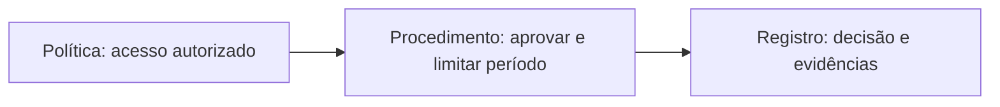
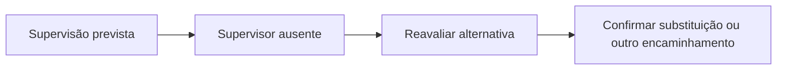

# Proposta de revisão temática e visual — A08 e A09

**Data:** 10/09/2026. **Estado:** aprovada pelo docente em 10/09/2026 para aplicação à A08/A09 e adoção nas produções futuras. O texto abaixo preserva a proposta apreciada; a implementação e sua validação são registradas em `revisao-tematica-a08-a09-2026-09-10.md`.

O docente confirmou a realização da A08 e relatou dificuldade em usar o Pages como referência durante a explicação. Este parecer analisa a organização dos materiais locais vigentes, identificados no menu do MkDocs. Não reconstrói o que foi apresentado ou produzido em sala. A08 realizada não implica execução de todos os checkpoints ou entrega comprovada. Os antigos slides A08 de injeção e A09 de escopo de testes pertencem a outra organização curricular e não fundamentam esta revisão de SGSI/riscos.

## 1. Diagnóstico e mudança recomendada

**Reorganizar a leitura por conceitos e decisões, com uma síntese visual por tema e explicação completa imediatamente acessível.** O caso continua como exemplo de aplicação. A explicação deixa de depender de acompanhar personagens e episódios em sequência.

| Local observado | Problema para conduzir a aula | Mudança proposta |
|---|---|---|
| A08, abertura e seções 1–2 | A retirada de agosto, a publicação de setembro e as lacunas reaparecem em prosa, chamado, tabela e imagem. | Uma abertura breve: situação, evidência e pergunta. Chamado completo na consulta do caso; síntese por conceito. |
| A08, seção 3, política 4.1 e seção 7 | Disputam a navegação as seções da aula, os itens 1–10 da política, as seções da ISO e os oito passos autorais. | Uma sequência temática principal. Correspondências normativas em um quadro; oito passos como checklist final. |
| A08, caixas “Ideias-chave” | Já existem, mas várias resumem IDs e episódios: “G01 e G02”, “S01”, “G04”. Exigem recordar o caso para explicar o conceito. | Começar por propriedade ou distinção: autoridade, operação, medição. ID acompanha a evidência no exemplo. |
| A08, política integral | Dez itens e a tabela de correspondência ficam entre a explicação de escopo e a aplicação de responsabilidades. | Manter texto integral em seção própria de consulta na mesma página, com âncora. Projetar a distinção política/procedimento/registro e o trecho necessário. |
| A08, responsabilidades | Nomes pessoais se somam a papéis, documentos e estados. | Usar o papel como rótulo principal nos esquemas. Nomes permanecem na ficha completa, onde ajudam a rastrear o exercício. |
| A09, seções 1–3 | Fichas, conceitos, critérios, matriz e exemplo estão distribuídos por um percurso longo, sem sínteses como as da A08. | Dar síntese própria a formulação, critérios e prioridade; manter categorias e justificativa juntas no exemplo. |
| A09, seção 4 | Estratégias, cinco opções, horas disponíveis e ausência do supervisor aparecem no mesmo bloco. | Separar estratégias de tratamento, viabilidade e revisão de premissas. Cada bloco tem uma decisão. |
| Ambas, figuras | Há recursos úteis; faltam agrupamento consistente com a síntese e seleção da figura central de cada tema. O CSS prevê imagens entre 480 e 660 px e rolagem interna. | Integrar síntese e esquema; conferir projeção e zoom. Trocar diagramas excessivamente altos/largos por relações compactas quando necessário. |

As fontes Markdown têm aproximadamente **9 mil palavras na A08 e 4,3 mil na A09**, por contagem de tokens separados por espaços (`wc -w`, incluindo marcação). Isso indica volume editorial, não tempo de fala ou medida de carga cognitiva. A extensão pode servir ao estudo; o problema é usar a mesma sequência extensa para localizar apoios durante a explicação.

**Preservar:** objetivos, conceitos, critérios, exemplos trabalhados, incertezas, documentos completos, atividade de 3–4 páginas e âncora `#atividade`. Manter 100 minutos e a divisão vigente dos planos: A08 50T/50P; A09 60T/40P. A revisão proposta muda apresentação e navegação; eventual redistribuição de tempo deverá ser explicitada no plano, sem reescrever a execução da A08.

## 2. Como ficaria a página

1. **Título temático:** “A08 — Governança e SGSI” / “A09 — Avaliação e tratamento de riscos”. A pergunta atual pode funcionar como subtítulo.
2. **Abertura curta:** um problema concreto e os dados indispensáveis, sem recapitulação longa.
3. **Índice por tema:** links diretos para escopo, política, responsabilidades, medição etc.
4. **Em cada tema:** síntese de 3–5 itens, esquema adjacente e uma aplicação/checkpoint. A explicação completa fica sob “Explicação e exemplo”, com identificação visual consistente.
5. **Consulta de documentos:** política e fichas integrais em seções identificadas e vinculadas no ponto de uso.
6. **Atividade e referências:** mantêm escopo, critérios e links estáveis.

Primeira implementação recomendada: Markdown, tabelas e SVG existentes, sem criar uma segunda versão da aula. O texto explicativo fica aberto por padrão. Se a rolagem continuar prejudicando a condução, avaliar um comando opcional para recolher explicações; impressão, busca e abertura de âncoras precisam revelar o conteúdo. Não esconder instruções indispensáveis à atividade em blocos recolhidos por padrão.

Meta editorial inicial, a conferir na projeção: síntese e esquema devem ser compreensíveis numa mesma tela, com fonte legível. Não reduzir a fonte para cumprir essa meta. Separar dois conceitos quando o bloco ficar grande. Os limites são orientação de composição, não cotas rígidas de texto.

## 3. A08 — proposta de sínteses por tema

Os itens abaixo são exemplos de redação pública. As indicações de figura são orientações de produção. Os esquemas compactos mostram relações; não substituem as definições completas.

### 1. Governança: decidir, executar e acompanhar

- **Decidir:** estabelecer regra, autoridade e recursos.
- **Executar:** aplicar a proteção e registrar a ação.
- **Acompanhar:** verificar resultado e corrigir desvios.
- Uma correção pontual não demonstra proteção nas mudanças seguintes.

**Esquema:** `Decisão → Execução → Evidência → Revisão ↺`

**Aplicação:** a planilha foi retirada; qual decisão continua faltando para a próxima publicação?

**Composição:** condensar abertura/seções 1–2; reaproveitar o ciclo SGSI da seção 3. Deixar a ilustração narrativa como apoio do caso, sem repeti-la como explicação central.

### 2. SGSI e estrutura da ISO/IEC 27001

- **SGSI:** integra política, pessoas, processos e recursos.
- **Requisitos:** orientam contexto, liderança, planejamento, apoio, operação, avaliação e melhoria.
- **Controles:** são selecionados conforme riscos e requisitos; a aplicabilidade precisa ser justificada.
- Um esboço documentado não comprova implantação ou conformidade.

**Esquema:** `Contexto e liderança → Planejamento e apoio → Operação → Avaliação → Melhoria ↺`

**Aplicação:** localizar onde entram a autoridade para aprovar e a evidência de acompanhamento.

**Composição:** um mapa funcional com referências 4–10 discretas; Anexo A/Declaração de Aplicabilidade em um ramo ligado ao tratamento. Conservar edição, emenda e explicação das seções 1–3 na consulta normativa existente. Não desenhar a numeração como ordem obrigatória de implantação.

### 3. Contexto e escopo

- Identificar serviço, informações e partes interessadas.
- Delimitar pessoas, processos e recursos abrangidos.
- Incluir dependências e interfaces relevantes.
- Distinguir o serviço contratado da empresa que o fornece.

**Esquema:** `[Escopo: pedidos + portal + manutenção contratada] ← serviço prestado por → [Fornecedor externo]`

**Aplicação:** comparar “servidor do portal” com um escopo que explicita o serviço de pedidos.

**Figura:** reaproveitar `A08-passo1-escopo.svg`; manter a relação com embalagem como pendência, sem criar ligação técnica.

### 4. Política, procedimento e registro

- **Política:** estabelece compromisso e orientação.
- **Procedimento:** define como cumprir a orientação.
- **Registro:** documenta ação e resultado.
- Uma diretriz adequada pode ser mantida; detalhes operacionais vão ao procedimento.

**Aplicação:** ler o item 8 da política; localizar o que ainda precisa ser definido no procedimento.

**Composição:** novo esquema acima; política completa preservada em `#politica-exemplo`, com acesso direto. Explicar que o registro de uma aprovação não comprova execução.

### 5. Responsabilidade, autoridade e recursos

- Quem responde pelo serviço decide dentro de sua autoridade.
- TI verifica condições técnicas; o executor realiza o autorizado.
- A conferência exige evidência e responsável definido.
- Ausência de autoridade ou recurso exige encaminhamento.

**Esquema:** `Gestor aprova → TI verifica condições → Prestador executa → TI confere`

**Aplicação:** identificar quem recebe a pendência quando o aprovador está ausente.

**Composição:** usar papéis como rótulos principais e indicar “arranjo proposto”. Nomes ficam na tabela de referência. Reutilizar o esquema de autoridade como base, sem confundir funções com pessoas diferentes obrigatórias.

### 6. Risco candidato e informação pendente

- **Evidência:** há autorização vencida sem encerramento comprovado.
- **Pergunta:** o acesso permanece disponível?
- **Risco candidato:** uso fora do período autorizado.
- A classificação e o tratamento exigem avaliação adicional.

**Esquema:** `Falta de comprovação → Verificar estado do acesso → Avaliar risco`

**Aplicação:** separar o dado conhecido da hipótese.

**Figura:** simplificar `A08-passo3-risco.svg`; não destacar medida candidata como tratamento já escolhido. Este bloco é a ponte conceitual para A09.

### 7. Objetivo, apoio e indicador

- **Objetivo:** resultado esperado com responsável e momento de avaliação.
- **Apoio:** tempo, competência, registros e procedimento disponível.
- **Indicador:** regra de cálculo e conjunto observado.
- **Linha de base:** quatro encerramentos comprovados entre cinco autorizações vencidas.

**Esquema:** `[4 comprovadas + 1 pendente] = 5 vencidas → 4/5 = 80%` · `[1 vigente: fora do cálculo]`

**Aplicação:** explicar por que a prorrogação vigente fica fora do denominador.

**Figura:** reutilizar `A08-medida-evidencia.svg` junto à fórmula. Manter corte temporal, meta didática de 100% e limite da conclusão na explicação; 80% não mede segurança global nem efeito da proposta.

### 8. Operação: aprovação, condições e execução

- O pedido informa finalidade, identidade e período.
- A autoridade registra decisão e limites.
- A execução depende de aprovação e condições verificadas.
- Execução e encerramento exigem evidências próprias.

**Esquema:** `Pedido → Aprovação? → Condições verificadas? → Executar → Conferir encerramento`

**Ramo de impedimento:** `Sem aprovação ou condição → Manter pendente e encaminhar`

**Aplicação:** comparar S01 no acordo original e no arranjo proposto.

**Figura:** manter `A08-passo5-aprovacao.svg` com ênfase nos estados. O exercício continua sendo simulação em papel.

### 9. Monitoramento, auditoria e análise crítica

- **Monitoramento:** acompanha medidas e pendências.
- **Auditoria:** compara evidências com critérios, com imparcialidade.
- **Análise crítica:** a direção avalia adequação, mudanças e recursos.

**Esquema:** `Medidas + Achados de auditoria + Mudanças do contexto → Decisões da direção`

**Aplicação:** distinguir “faltou comprovação” de “precisamos alterar recursos ou responsabilidades”.

**Composição:** tabela de três funções e um fluxo curto. Evitar sugerir que toda decisão da direção depende de auditoria prévia. UCL/LNCC permanecem como exemplos institucionais de consulta.

### 10. Correção, ação corretiva e melhoria

- **Correção:** tratar a situação identificada.
- **Causa:** investigar por que o desvio ocorreu.
- **Ação corretiva:** agir sobre a causa confirmada.
- **Eficácia:** avaliar nova evidência e revisar quando necessário.

**Esquema:** `Desvio → Correção → Causa → Ação corretiva → Verificação ↺`

**Aplicação:** indicar quando atribuir um responsável resolveria a causa e quando seria insuficiente.

**Figura:** reaproveitar `A08-passo8-melhoria.svg`. Encerrar com checklist dos registros construídos; os oito passos deixam de funcionar como uma segunda navegação temática.

## 4. A09 — proposta de sínteses por tema

### 1. Componentes de um risco

- Identificar processo, informação e condição.
- Descrever evento e consequência no contexto.
- Separar evidência fornecida de informação desconhecida.
- Manter visíveis os controles existentes e seus limites.

**Esquema:** `Condição → Evento possível → Consequência` · `Evidência sustenta; incerteza limita`

**Aplicação:** localizar uma evidência e uma incerteza em R01/R02.

**Figura:** usar `A09-cadeia-risco.svg` com legenda breve; fichas completas disponíveis ao lado do ponto de aplicação ou por âncora próxima.

### 2. Consequência, plausibilidade e incerteza

- **Consequência:** o que muda se o evento ocorrer?
- **Plausibilidade:** que evidência sustenta considerar sua ocorrência?
- **Incerteza:** o que falta saber e pode mudar a avaliação?
- Aplicar os mesmos critérios aos dois riscos.

**Esquema:** `Consequência + Plausibilidade → Avaliação justificada`, com `Incerteza` anotada sobre a conclusão.

**Aplicação:** identificar a informação necessária para sustentar uma consequência grave em R02.

**Composição:** reunir as escalas qualitativas em um quadro legível. Manter a convenção didática explícita e o exemplo “2 em 10 publicações não é probabilidade de ataque”.

### 3. Prioridade e critérios de decisão

- Justificar as categorias antes de consultar a matriz.
- Usar a matriz para encaminhar a decisão.
- Comparar urgência, dependências e efeito operacional em empates.
- A decisão continua exigindo autoridade e acompanhamento.

**Esquema:** `Categorias justificadas → Matriz → Encaminhamento + responsável`

**Aplicação:** R01 como exemplo resolvido; R02 como extensão com premissas explícitas.

**Figura:** preservar a matriz existente, com células rotuladas; não depender apenas de cores nem criar pontuação numérica artificial.

### 4. Estratégias de tratamento

- **Evitar:** descontinuar ou substituir a atividade que cria o risco.
- **Reduzir:** atuar na plausibilidade ou na consequência.
- **Compartilhar:** distribuir parte das consequências ou responsabilidades.
- **Reter/aceitar:** manter o risco por decisão informada e autorizada.

**Esquema:** quatro alternativas saem de `Risco avaliado` e convergem em `Função preservada + condições + acompanhamento`.

**Aplicação:** explicar por que contratar um terceiro não elimina automaticamente a condição técnica.

**Composição:** tabela comparativa de quatro linhas; custo e limites detalhados na explicação. Não criar quatro histórias novas para exemplificar as estratégias.

### 5. Viabilidade e restrição de recursos

- Comparar esforço, prazo e dependências.
- Verificar a função que precisa continuar disponível.
- Declarar a premissa que torna cada opção viável.
- Caber nas horas disponíveis não comprova prontidão operacional.

**Esquema:** `[C1: 2h][C3: 6h] = 8h` → `Supervisão + aprovação confirmadas?`

**Aplicação:** comparar C3, C4 e C5 nas seis horas restantes após C1.

**Figura:** compactar `A09-recurso-premissa.svg`, mantendo barras proporcionais e as condições junto delas. Conservar a tabela C1–C5 completa para a decisão.

### 6. Aceitação e risco residual

- O tratamento pode deixar risco remanescente.
- Antes da implementação e avaliação, o residual é estimado.
- Aceitar exige autoridade, justificativa e limites.
- A conclusão deve declarar a evidência ainda necessária.

**Esquema:** `Tratamento planejado → Implementação → Avaliação → Residual revisto`

**Aplicação:** distinguir aprovação da medida de redução demonstrada.

**Figura:** reaproveitar `A09-residual-revisao.svg`; manter estados visíveis e não apresentar a sequência como garantia de redução.

### 7. Mudança de premissa e revisão

- Identificar a condição que sustentava a escolha.
- Reabrir a decisão quando essa condição mudar.
- Confirmar autoridade, disponibilidade e limites da alternativa.
- Registrar pendência e encaminhamento enquanto faltar confirmação.

**Aplicação:** V1 mantém as 48 horas adicionais, troca de técnico e falta de confirmação; a resposta da atividade continua aberta à justificativa.

**Composição:** quadro antes/depois, diferenciando a mudança simples de supervisor no exemplo e as condições adicionais de V1. Não acrescentar novos personagens ou incidentes.

### 8. Registro de decisão e entrega

- **Avaliação:** risco, evidências, categorias, incerteza e prioridade.
- **Escolha:** alternativa selecionada e outra comparada.
- **Governança:** proprietário, autoridade e condições.
- **Acompanhamento:** residual estimado, evidência necessária e revisão.

**Esquema:** `Avaliação → Escolha justificada → Autoridade → Acompanhamento`

**Aplicação:** conferir se outra equipe consegue entender e reabrir a decisão.

**Composição:** checklist final associado ao modelo existente. Manter atividade única A08–A09, PDF de 3–4 páginas, justificativas individuais, rubrica e registro do uso de IA.

## 5. Alterações propostas no AGENTS.md

### Inserir após “Transposição do padrão de POO”

Texto sugerido, ainda não vigente:

> ### Síntese temática para condução e estudo
>
> - Organizar cada aula por conceitos e decisões identificáveis no índice. Preferir títulos que nomeiem o tema e indiquem a ação, como “Escopo: delimitar o que será protegido”.
> - Abrir cada ponto temático central com uma síntese itemizada de 3–5 ideias, acompanhada de esquema, comparação ou evidência anotada quando isso esclarecer a relação. Ajustar a quantidade à complexidade; não transformar parágrafos longos em marcadores.
> - Escrever itens conceituais que possam ser compreendidos sem recordar personagens ou IDs. Usar o caso em um exemplo curto e identificado; manter seus dados completos acessíveis.
> - Aproximar síntese, esquema e aplicação. Evitar repetir a mesma explicação integralmente em lista, figura, legenda e texto. Cada representação deve cumprir uma função.
> - Manter explicações completas, definições, limites, exemplos trabalhados, instruções e referências para estudo. A síntese apoia a condução; não substitui o material referencial.
> - Usar situações concretas breves para motivar uma pergunta. Continuidade significa reutilizar dados, artefatos e decisões relevantes; não exige enredo contínuo, suspense ou recapitulação a cada seção.
> - Apresentar o conceito diretamente quando a pergunta já estiver clara. Não criar um novo episódio apenas para justificar a introdução de uma definição.
> - Aplicar as cadeias didáticas ao planejamento e à coerência do encontro. Não exigir sua reprodução completa em cada bloco público.
> - Manter uma única organização temática principal. Numeração de normas, itens de políticas, IDs e passos operacionais são referências locais, sem competir com o índice da aula.
> - Conferir a página em projeção: título, ideias centrais e relação visual devem ser legíveis juntos quando viável. Dividir o bloco antes de reduzir fonte. Garantir leitura em tela pequena, texto alternativo e acesso por teclado.
> - Usar rótulos públicos como “Síntese”, “Exemplo” e “Explicação”. Mediação, respostas e decisões editoriais permanecem no plano docente.

### Ajustar regras existentes para evitar conflito

| Trecho atual | Substituição ou complemento proposto |
|---|---|
| Transposição: “Cada bloco responde: de onde partimos; qual problema apareceu...” | “O percurso do encontro explicita problema, conceito, aplicação, validação e continuidade. Cada bloco desenvolve a parte necessária, sem recontar a cadeia inteira.” |
| §1.0: “Todo pacote futuro deve declarar a cadeia...” | Acrescentar: “Declarar no plano docente; na página pública, explicitar somente os elos necessários à compreensão e à execução.” |
| §8: “Explicar na ordem evidência → conceito → impacto → ação → validação.” | “Conectar evidência, conceito, impacto, ação e validação. Escolher a ordem local pela necessidade de compreensão, sem repetir etapas já estabelecidas.” |
| §5.1: regras de progressão narrativa para slides | Acrescentar: “Estas regras se aplicam a apresentações solicitadas. Sua transposição ao MkDocs preserva relações e progressão conceitual, sem exigir narrativa de personagens ou suspense.” |
| §1.0: consulta de apresentação no Drive antes de descrever aula ministrada | Acrescentar: “Quando a aula tiver sido conduzida pelo MkDocs, consultar a versão publicada usada no encontro, se identificável, e o relato docente. Slides de sequência curricular superada não prevalecem sobre esse material. Registrar incerteza sobre a versão utilizada; publicação continua sem comprovar execução ou entrega.” |

O último ajuste resolve uma incompatibilidade entre a autoridade histórica universal dos slides e a decisão de conduzir novas aulas integralmente pelo Pages. Nesta análise, não foi determinada a versão exata projetada na A08; isso não impede propor melhorias editoriais nas páginas atuais.

### Acrescentar ao checklist de publicação

- [ ] Cada tema central tem uma síntese útil para explicar o conceito, sem depender do enredo.
- [ ] A relação principal está visível em esquema, comparação ou evidência legível quando pertinente.
- [ ] O estudante continua encontrando explicação completa e instruções suficientes.
- [ ] O índice permite localizar conceitos sem lembrar nomes, IDs ou episódios.
- [ ] Não há repetição extensa entre síntese, legenda, explicação e retomada do caso.
- [ ] Figuras e texto foram conferidos em projeção, zoom, tela estreita e impressão.
- [ ] Âncoras existentes, documentos de referência e atividade continuam acessíveis.

## 6. Critérios para avaliar a futura implementação

Fazer primeiro um ensaio com política/procedimento/registro da A08 e viabilidade de tratamento da A09. Verificar se o professor consegue explicar usando os itens e o esquema, e se um estudante consegue aprofundar a mesma ideia no texto. Depois aplicar aos demais temas, sem criar slides paralelos ou novas entregas.

Na validação editorial, conferir que nenhum conceito ou limite relevante foi perdido ao mover conteúdo; que não surgiram respostas prontas para R02/V1; e que os rótulos do esquema não confundem proposta, aprovação, execução e resultado. Na validação técnica, conferir links e âncoras, build estrito e visualização real. Essas verificações são propostas para a implementação: não foram executadas sobre páginas modificadas, pois esta etapa entrega um parecer.

## Cognitive Load Analysis

### Task Summary

Conduzir explicação oral e análise de evidências a partir de duas páginas integrais sobre SGSI e riscos. Considera-se familiaridade inicial com segurança e conhecimento de gestão ainda em construção; o domínio individual dos estudantes não foi medido.

### Load Breakdown

**Intrinsic Load: High**
- Uma decisão de tratamento articula aproximadamente sete componentes: risco, evidência, consequência, plausibilidade, alternativa, restrição operacional e autoridade. É uma estimativa analítica de componentes da tarefa, não medida de memória.
- Relacioná-los é parte necessária da aprendizagem; a proposta mantém as decisões e justificativas.

**Extraneous Load: High**
- A08 combina múltiplas numerações, papéis/nomes e repetições do episódio; exige localizar e integrar informações dispersas.
- A09 concentra estratégias, recursos e mudança de condições em uma seção extensa. A síntese visual existente não organiza todos os temas.

**Germane Load: High**
- Comparar escopos, justificar categorias, preservar função e rever premissas são esforços produtivos já presentes. Devem permanecer na revisão.

### Overall Assessment

O desenho oferece boas decisões, mas a navegação pode competir com a explicação e a análise. O relato docente confirma dificuldade de condução; não permite afirmar que a turma teve sobrecarga ou não aprendeu. A prioridade é reduzir busca e repetição.

### Problem Areas

1. Múltiplas referências e numerações na A08.
2. Repetição do caso e dispersão entre síntese, figura e explicação.
3. Muitas decisões dentro do bloco de tratamento da A09.

### Modification Suggestions

- **Problem:** numerações concorrentes. **Principle:** complexidade desnecessária. **Fix:** índice temático único e quadro de correspondências para consulta.
- **Problem:** busca entre representações. **Principle:** atenção dividida e redundância. **Fix:** agrupar itens conceituais e esquema, deixando o exemplo completo identificado abaixo.
- **Problem:** estratégias, esforço e mudança de condição simultâneos. **Principle:** segmentação da tarefa. **Fix:** três blocos consecutivos com uma decisão em cada um, preservando a mesma tabela de opções.

### Expertise Reversal Check

Definições completas e exemplos resolvidos ajudam quem inicia gestão de riscos. Para o professor e estudantes que já dominam a definição, a síntese permite avançar diretamente à comparação. O apoio detalhado permanece disponível, sem exigir sua releitura antes de cada decisão.

## Base documental consultada

- [A08 vigente no menu local](../../docs/aulas/A08-governanca-sgsi.md) e [A09 vigente no menu local](../../docs/aulas/A09-decisao-de-riscos.md).
- [Arquitetura curricular](../arquitetura-geral-da-experiencia.md), [registro de publicação](../publicacao-google-drive.md), [detalhamento aprovado](detalhamento-conteudos-por-aula.md) e [confrontação histórica](confrontacao-a01-a07-a08-a10.md).
- [Plano A08](../A08-governanca-sgsi/plano-de-aula.md), [plano A09](../A09-decisao-de-riscos/plano-de-aula.md), [revisão visual anterior](revisao-visual-a08-a09.md), SVGs referidos e CSS local.
- [AGENTS.md](../../AGENTS.md), especialmente transposição, continuidade histórica, estrutura das páginas, apresentações e estilo.

Trata-se de análise editorial dos materiais disponíveis, não de revalidação normativa ou auditoria da versão online. As referências técnicas completas permanecem nas páginas; uma futura alteração de afirmação normativa exige sua verificação em fonte primária.
