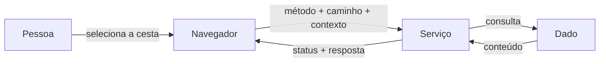

# A04 — Onde a aplicação decide?

Esta página aprofunda a reconstrução feita em aula. Ela não presume acesso ao código-fonte: parte do comportamento legítimo e do rastro HTTP para separar o que o navegador observa daquilo que o servidor precisa decidir.

Na A02, o OWASP Juice Shop tornou ativos, ameaças e vulnerabilidades observáveis. Na A03, a turma treinou como separar evidência, hipótese e ameaça candidata, mas sem continuar na aplicação. Agora retomaremos o Juice Shop com uma tarefa mais básica e decisiva: explicar corretamente uma ação legítima antes de procurar uma falha.

Ana entra na loja com uma conta fictícia e abre sua cesta. A interface mostra os itens esperados. Entre o clique e a tela preenchida, porém, o navegador enviou uma requisição, um serviço interpretou o pedido, um dado foi consultado e alguma parte do sistema decidiu que aquela resposta podia ser devolvida.

!!! question "Pergunta mobilizadora"
    Como o pedido para abrir a cesta percorre a aplicação e onde precisa ocorrer a decisão de acesso?

## Objetivos de aprendizagem

- Reconstruir um fluxo legítimo da ação do usuário até o dado, sem antecipar ataque ou controle.
- Coletar e interpretar rastros de uma troca HTTP, relacionando método, caminho, contexto, status e conteúdo.
- Separar observação de inferência e formular uma pergunta verificável sobre a decisão de acesso.

**Tempo estimado:** 104 minutos — 52 minutos de construção conceitual e 52 minutos de investigação.  
**Organização:** duplas; uma pessoa opera e a outra registra, com troca de papéis.  
**Entrega:** diagrama de uma página e uma captura interpretada.

## O comportamento que precisamos explicar

Cada estudante executa uma instância isolada em seu próprio computador:

- **Windows:** abra o Docker Desktop, espere o estado *Engine running* e abra o PowerShell.
- **Linux:** confirme que o Docker Engine está ativo e abra o terminal.

Nos dois sistemas, inicie ou confirme o contêiner:

```bash
docker run --rm -d --name juice-shop-a04 \
  -p 127.0.0.1:3000:3000 \
  bkimminich/juice-shop
```

Se o nome já estiver em uso, confirme com `docker ps --filter name=juice-shop-a04` e reutilize o contêiner em execução. Não publique a porta em `0.0.0.0`.

Acesse `http://127.0.0.1:3000` e crie a identidade fictícia:

| Campo | Valor local descartável |
|---|---|
| E-mail | `ana@a04.test` |
| Senha | `Ana-A04!2026` |
| Confirmação | `Ana-A04!2026` |
| Pergunta de segurança | qualquer pergunta disponível |
| Resposta fictícia padronizada | `azul` |

Esses valores existem somente no contêiner local. Se a conta já existir, use **Login**; se o contêiner tiver sido recriado, registre-a novamente.

Depois reproduza o caminho normal, sem abrir ainda o painel Network:

1. abra a URL do Juice Shop indicada pelo professor;
2. selecione **Login**;
3. autentique-se como Ana;
4. adicione dois produtos quaisquer à cesta;
5. abra a cesta de compras;
6. confirme que a página abre sem erro e apresenta os dois itens adicionados.

Essa senha é deliberadamente descartável e não pode ser reutilizada em qualquer outro serviço. Se a autenticação ou a cesta não funcionar, pare e use a evidência alternativa fornecida.

Depois de confirmar esse resultado, registre a linha de base funcional:

| Elemento | Registro |
|---|---|
| Estado inicial | Ana autenticada; dois produtos anotados na cesta |
| Ação executada | selecionar a opção da cesta |
| Resultado esperado | página aberta sem erro, mostrando os mesmos dois produtos |

Essa linha de base define o que deveria acontecer. Nos passos seguintes, a requisição e a resposta HTTP serão comparadas com esse resultado, sem ainda inferir como a aplicação está organizada internamente.

## Do clique à requisição

Ao abrir a cesta, o código executado no navegador solicita dados ao serviço da aplicação. O painel **Network** das ferramentas do desenvolvedor torna parte dessa conversa observável.

Para localizar a evidência:

1. abra somente o Juice Shop fornecido para a disciplina;
2. autentique-se com a conta fictícia indicada;
3. abra as ferramentas do desenvolvedor e selecione **Network**;
4. limpe a lista de requisições;
5. abra a cesta;
6. selecione a requisição relacionada e examine seus detalhes.

Se a interface, o idioma ou os nomes diferirem, procure os mesmos elementos conceituais:

| Pergunta | Campo a observar | O que permite afirmar |
|---|---|---|
| Qual ação foi solicitada? | método HTTP | intenção operacional aproximada, como leitura ou alteração |
| Qual recurso foi indicado? | caminho/URL | alvo declarado na requisição |
| Que contexto acompanha a ação? | cookie ou cabeçalho de autorização, quando visível | existência de informação de sessão; não prova autorização correta |
| Qual foi o resultado? | status e corpo da resposta | resposta entregue pelo serviço naquele teste |

Registre sempre **valor observado** e **interpretação** separadamente. Um método `GET`, por exemplo, é uma observação; dizer que ele solicita uma leitura é interpretação baseada na semântica HTTP.

## Por que precisamos de um modelo de arquitetura

A captura do navegador mostra uma conversa, mas não revela sozinha onde a regra de acesso foi aplicada. Para responder a essa nova pergunta, ampliamos o desenho:

```text
pessoa → interface no navegador → requisição HTTP → rota/API → regra no servidor → dado da cesta
                                               ← resposta HTTP ←
```

Neste encontro, **arquitetura** significa o menor mapa de componentes e responsabilidades capaz de explicar o caso. Não é um inventário completo da aplicação.

- O **navegador** inicia a solicitação e apresenta a resposta.
- A **rota/API** recebe método, caminho e contexto da requisição.
- O **serviço no servidor** interpreta a ação e deve aplicar regras que não podem depender da cooperação do cliente.
- O **recurso** é o objeto sobre o qual a ação ocorre: neste caso, uma cesta e seus itens.
- A **decisão de acesso** relaciona identidade, ação e recurso antes da liberação ou negação.

## Autenticação não encerra a decisão

Reconhecer Ana no início da sessão responde a uma pergunta: há evidência suficiente para associar esta interação a uma identidade? Ao abrir uma cesta, surge outra: essa identidade pode executar esta ação sobre este recurso específico?

| Decisão | Pergunta | Exemplo no caso |
|---|---|---|
| Autenticação | Quem está interagindo? | a sessão está associada à conta fictícia de Ana? |
| Autorização | Essa identidade pode realizar esta ação sobre este recurso? | Ana pode consultar esta cesta? |
| Resposta | O que o serviço deve devolver? | os dados permitidos ou uma negação controlada |

A A05 aprofundará identificação, autenticação, autorização e accounting. Aqui basta localizar onde a segunda pergunta precisa ser respondida.

## A fronteira aparece quando a confiança anterior não basta

Valores vindos do navegador podem estar ausentes, alterados ou fora da sequência esperada. Por isso, a afirmação do cliente sobre identidade, cesta ou permissão não deve ser aceita como decisão final.

A passagem do navegador para o serviço é uma **fronteira de confiança**: ao cruzá-la, o servidor precisa validar novamente as condições relevantes. Fronteira não é necessariamente uma parede ou equipamento; é o ponto em que a confiança anterior deixa de ser suficiente.

## Investigação e diagrama

Escolha uma ferramenta antes de iniciar:

| Opção | Melhor uso | Esforço/custo | Evidência ou entregável | Limitação/risco |
|---|---|---|---|---|
| [diagrams.net](https://www.drawio.com/) | iniciantes e edição visual por caixas e setas | gratuito; baixa curva inicial | PDF exportado e, opcionalmente, fonte `.drawio` | alterações são menos fáceis de revisar como texto |
| [Mermaid Flowchart](https://mermaid.js.org/syntax/flowchart.html) | estudantes que preferem diagrama como texto | gratuito; exige aprender sintaxe curta | PDF/SVG e fonte Mermaid | erro de sintaxe pode consumir tempo da atividade |
| papel ou ferramenta de slides | contingência ou familiaridade prévia | baixo; depende do recurso disponível | fotografia legível ou PDF | alinhamento e revisão podem ser mais trabalhosos |

**Recomendação:** use diagrams.net se não tiver preferência. Mermaid é uma alternativa para quem já trabalha confortavelmente com texto estruturado. A ferramenta não compõe a nota.

Se usar Mermaid, este esqueleto é suficiente para começar:



Construa a entrega nesta ordem:

1. escreva a ação da pessoa e o resultado legítimo esperado;
2. registre método, caminho, contexto de sessão observável, status e uma síntese do conteúdo;
3. desenhe `navegador → API/serviço → dado` e rotule as setas;
4. marque identidade, ação solicitada, recurso e componente que deveria decidir;
5. desenhe a fronteira entre cliente e servidor;
6. registre uma pergunta que a captura não responde;
7. indique qual evidência poderia responder a essa pergunta: código da rota, log de decisão, documentação ou teste autorizado com duas contas fictícias.

!!! danger "Escopo autorizado"
    Use somente o Juice Shop e as contas fornecidas. Não altere identificadores para acessar dados de terceiros, não automatize tentativas e pare diante de alvo divergente, dado real ou comportamento inesperado. Nesta aula, a investigação termina na reconstrução do fluxo legítimo.

## HTTP como rastro, não como explicação completa

HTTP organiza a interação em mensagens. O cliente envia uma requisição com método, alvo, campos e, quando aplicável, conteúdo; o servidor devolve uma resposta com status, campos e representação. Esses elementos permitem reconstruir **o que foi solicitado e devolvido**, mas não revelam automaticamente a lógica interna.

| Campo observado | O que ajuda a responder | O que não prova sozinho |
|---|---|---|
| método, como `GET` | intenção semântica da solicitação | quem está autorizado |
| caminho do recurso | alvo aparente da requisição | proprietário real do objeto |
| Cookie ou Authorization presente | existe contexto enviado pelo cliente | contexto válido ou identidade correta |
| status `2xx`, `4xx` ou `5xx` | classe do resultado HTTP | causa interna precisa |
| corpo da resposta | representação devolvida neste teste | que todos os controles foram aplicados |

Um `200 OK` em resposta a `GET` indica sucesso na transferência da representação selecionada naquele momento. Ele não demonstra, por si só, que a regra de autorização estava correta. Da mesma forma, um `403` sugere recusa, mas a validação precisa confirmar que o fluxo legítimo continua funcionando.

## Cliente, servidor e autoridade

O navegador controla a interface e constrói a solicitação; por isso, valores enviados pelo cliente devem ser tratados como entrada, não como decisão confiável. A aplicação pode ocultar um botão, mas um cliente alternativo ainda pode construir a mensagem. A regra precisa ser aplicada no componente que possui autoridade e dados suficientes para decidir.

Para a cesta, a decisão pode ser expressa como uma relação:

```text
sujeito reconhecido + ação solicitada + recurso carregado + contexto
                         ↓
                  permitir ou negar
```

Esse modelo evita três confusões frequentes:

- **autenticação** responde quem a aplicação acredita que está interagindo;
- **sessão** mantém um contexto entre interações;
- **autorização** decide se aquele sujeito pode executar aquela ação sobre aquele recurso, agora.

## Fronteira de confiança

Uma fronteira de confiança aparece onde muda a autoridade, o controle administrativo, a identidade ou a consequência. No caso mínimo, a passagem navegador–servidor é uma fronteira porque o usuário controla dados da requisição, enquanto o serviço deve validar identidade, recurso e regra de negócio.

Fronteira não é sinônimo de firewall nem exige uma máquina separada. Ela é uma marca analítica: “a partir daqui, qual afirmação precisa ser verificada novamente?”. Outras fronteiras podem surgir entre serviço e banco de dados, entre serviços com identidades diferentes ou entre TI e OT, mas só devem entrar no modelo quando modificarem uma decisão relevante.

## Do diagrama à próxima evidência

O diagrama é útil quando torna lacunas explícitas. Se a captura mostra `navegador → serviço → resposta`, o processamento interno deve permanecer como hipótese. Para reduzir a incerteza, pode-se consultar código da rota, regra de autorização, log de decisão ou um teste diferencial autorizado. A A05 escolhe este último: mantém o sistema e a ação, mas varia sessão e propriedade com Ana e Bruno.

## Critérios de conclusão

A entrega está concluída quando outra dupla consegue:

- seguir o clique até a resposta sem depender de explicação oral;
- distinguir campos observados de inferências sobre o funcionamento interno;
- localizar navegador, serviço, dado e fronteira de confiança;
- explicar por que autenticação não substitui a decisão sobre o recurso;
- identificar uma dúvida real e uma evidência capaz de reduzi-la.

## Revisão rápida

1. O que uma captura de rede permite observar e o que ela não comprova?
2. Por que a decisão sobre a cesta deve ser aplicada no servidor?
3. Qual evidência diferenciaria uma verificação de autorização correta de uma confiança indevida no cliente?

## Fontes oficiais

- [OWASP Juice Shop](https://owasp.org/www-project-juice-shop/) — aplicação condutora e documentação do projeto. Acesso em 13 ago. 2026.
- [OWASP Application Security Verification Standard](https://owasp.org/www-project-application-security-verification-standard/) — requisitos de autenticação, sessão e controle de acesso. Acesso em 13 ago. 2026.
- [RFC 9110 — HTTP Semantics](https://www.rfc-editor.org/rfc/rfc9110) — semântica de métodos, recursos, representações e códigos de status.
- [Firefox Source Docs — Network Monitor](https://firefox-source-docs.mozilla.org/devtools-user/network_monitor/) — referência oficial da ferramenta usada para observar requisições e respostas.
- [OWASP Authorization Cheat Sheet](https://cheatsheetseries.owasp.org/cheatsheets/Authorization_Cheat_Sheet.html) — validação de permissão em cada requisição e negação por padrão.
