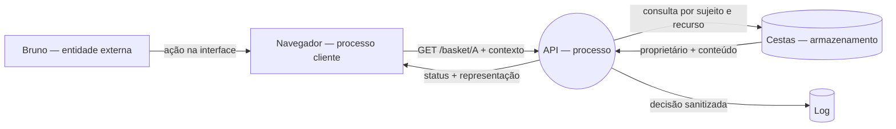

# Do fluxo observado às ameaças: o que ainda pode dar errado?

A04 tornou visível uma requisição de cesta e a representou como `pessoa → navegador → serviço → dado`. A05 mostrou que sessão válida e autorização sobre o recurso são decisões diferentes. A06 não repete o DevTools nem transforma o desenho em fim: usa esse mapa para procurar ameaças sistematicamente.

!!! question "Pergunta mobilizadora"
    Como sair de “um atacante pode invadir” e escrever uma ameaça com ativo, condição, caminho, consequência e evidência?

## Objetivos de aprendizagem

- Formalizar o fluxo conhecido em um DFD mínimo, sem inventar arquitetura interna.
- Aplicar STRIDE seletivamente a dois pontos do fluxo.
- Formular três ameaças testáveis com evidência discriminante e limite.

**Tempo:** 90 minutos — 40 min de teoria aplicada e 50 min de oficina.  
**Herança:** diagrama e pergunta da A04; quatro testes e accounting da A05.  
**Produto:** DFD mínimo anotado e três ameaças candidatas.

## Por que modelar ameaças?

Uma evidência mostra o que ocorreu em determinado teste; não enumera todos os modos relevantes de falha. Modelagem de ameaças delimita o sistema, recupera o funcionamento esperado, identifica condições plausíveis e transforma hipóteses em decisões verificáveis. Ela não prevê o futuro nem prova vulnerabilidade: reduz pontos cegos e explicita premissas.

Uma forma simples de organizar o processo é responder, nesta ordem:

1. **O que estamos analisando?** Define o escopo.
2. **O que precisa ser preservado?** Identifica ativos e funções.
3. **O que pode dar errado?** Formula ameaças.
4. **Como saberemos?** Declara evidências capazes de confirmar ou refutar.

Nesta aula, o escopo é deliberadamente pequeno: Ana e Bruno, o navegador, a requisição da cesta, o serviço, os dados e o evento de decisão. Infraestrutura não observada e sistemas externos ficam fora do modelo. Essa borda impede que a análise se transforme numa lista ilimitada de possibilidades.

## DFD: uma formalização breve

DFD significa **Diagrama de Fluxo de Dados**. Representa quem interage, quem processa ou decide, onde o estado persiste e o que circula. Em segurança, fronteiras indicam mudanças de controle ou autoridade.

| Elemento | Pergunta no caso |
|---|---|
| Entidade | Quem inicia ou recebe? Ana ou Bruno |
| Processo | Quem interpreta ou decide? Serviço/API |
| Armazenamento | Onde está o estado? Cestas e registros |
| Fluxo | O que circula? Requisição, contexto, resposta e evento |
| Fronteira | Onde o valor deixa de ser confiável sozinho? Navegador → servidor |

A notação cabe em poucos minutos porque A04 já construiu o raciocínio. O ganho novo começa quando usamos o mapa para localizar ameaças.

### Como ler a figura

O desenho deve ser lido seguindo as setas, e não como um mapa físico da rede:

- **entidade externa** inicia ou recebe informação, mas está fora do processamento modelado;
- **processo** transforma dados ou toma uma decisão;
- **armazenamento** mantém estado além de uma interação;
- **fluxo de dados** nomeia o que atravessa entre elementos;
- **fronteira de confiança** marca onde identidade, autoridade, administração ou consequência mudam.

O navegador pode ser desenhado como processo porque transforma ações em mensagens. Bruno permanece entidade externa porque é uma pessoa fora do software. O banco é armazenamento, não “a cesta” abstrata: o ativo inclui conteúdo, propriedade e função, enquanto a forma descreve o papel arquitetural.

### Qual nível de detalhe usar

Um DFD mínimo precisa responder à pergunta da análise. Detalhe insuficiente esconde decisões; detalhe excessivo cria ruído e envelhece rapidamente. Para A06, não é necessário representar DNS, balanceador, bibliotecas ou tabelas internas se eles não alterarem as ameaças examinadas. Registre premissas quando a arquitetura real não foi observada.

## O que é um ativo neste caso?

Ativo não significa apenas servidor ou banco de dados. É algo que precisa permanecer protegido ou funcionando:

- o conteúdo e a propriedade da cesta;
- a decisão que vincula identidade e recurso;
- a função legítima que permite a cada pessoa acessar sua própria cesta;
- o registro necessário para reconstruir uma decisão.

Perguntar “o que seria perdido?” ajuda a tornar a consequência concreta.

## Ameaça, vulnerabilidade e evidência

- **Ameaça:** possibilidade de uma condição produzir consequência indesejada sobre um ativo.
- **Vulnerabilidade:** fraqueza que torna um caminho possível ou mais provável.
- **Evidência:** observação que confirma, enfraquece ou delimita a hipótese.

Exemplo completo:

| Peça | Formulação |
|---|---|
| Ativo | conteúdo e propriedade da cesta de Ana |
| Condição | o serviço aceita o identificador enviado sem verificar o proprietário |
| Caminho | Bruno, autenticado, solicita o identificador A |
| Consequência | conteúdo de Ana é divulgado a outro usuário |
| Evidência | comparar Bruno→B e Bruno→A mantendo a sessão de Bruno |

Note a progressão: a vulnerabilidade é a fraqueza hipotética; a ameaça descreve como ela pode ser usada; a consequência declara o que se perde; o teste fornece evidência sobre aquele caminho.

Use a estrutura:

> Se **[condição]** ocorrer em **[ponto]**, **[ator ou evento]** pode seguir **[caminho]**, causando **[consequência]** sobre **[ativo]**. A evidência **[X]** confirmaria ou enfraqueceria a hipótese.

## STRIDE como perguntas

**STRIDE** é um acrônimo usado pela Microsoft para organizar seis categorias de ameaça: **S**poofing, **T**ampering, **R**epudiation, **I**nformation Disclosure, **D**enial of Service e **E**levation of Privilege. Ele serve como um conjunto de lentes: selecione um elemento ou fluxo do DFD, formule as perguntas pertinentes e registre somente caminhos que possam ser descritos por condição, caminho e consequência. O método ajuda a procurar ameaças; não comprova que elas existem.

| Lente | Pergunta útil |
|---|---|
| Spoofing | alguém ou algo pode ser representado indevidamente? |
| Tampering | dado, decisão ou registro pode ser alterado? |
| Repudiation | faltaria evidência confiável sobre uma ação? |
| Information Disclosure | informação chegaria a quem não deveria? |
| Denial of Service | uma função necessária ficaria indisponível? |
| Elevation of Privilege | alguém obteria autoridade maior? |

Não aplique todas as lentes mecanicamente. “Não aplicável” justificado é melhor que ameaça inventada.

Por exemplo, **divulgação de informação** é plausível quando Bruno recebe conteúdo da cesta A. Já **negação de serviço** não está sustentada apenas pelo mesmo rastro: faltam condição de volume, exaustão ou interrupção. A lente abre uma pergunta, mas o modelo e a evidência determinam se ela pertence ao recorte.

### Das seis letras para cenários verificáveis

| Lente | Propriedade ameaçada | Pergunta no caso | Evidência que poderia discriminar |
|---|---|---|---|
| Spoofing | autenticidade | o contexto pode representar outra pessoa? | validação da sessão e correlação de identidade |
| Tampering | integridade | requisição, cesta ou registro pode ser alterado indevidamente? | comparação antes/depois e trilha íntegra |
| Repudiation | responsabilização | uma ação pode ser negada sem evidência suficiente? | sujeito, ação, recurso, decisão, horário e `request_id` |
| Information Disclosure | confidencialidade | a resposta pode chegar a quem não deveria? | comparação controlada `B→B` e `B→A` |
| Denial of Service | disponibilidade | o fluxo pode ser esgotado ou interrompido? | métricas, limites e comportamento sob teste seguro |
| Elevation of Privilege | autorização | o sujeito consegue autoridade superior à prevista? | matriz de permissões e caso permitido/negado |

Não se deve preencher seis ameaças por obrigação. Algumas lentes serão irrelevantes ao recorte; registre `não aplicável` somente com justificativa. Contar categorias também não mede risco: prioridade depende de condição, exposição, consequência, controles existentes e incerteza.

### Estado epistemológico do modelo

Cada afirmação deve carregar um estado:

- **observado:** sustentado por rastro identificado;
- **premissa:** adotado para permitir o modelo, mas ainda não verificado;
- **desconhecido:** requer coleta;
- **refutado:** contradito por evidência e removido ou marcado.

Essa disciplina impede que um diagrama elegante seja confundido com a implementação real. Modelos de ameaça são artefatos vivos: mudam quando o sistema, o escopo ou a evidência mudam.

### Percurso prático com OWASP Threat Dragon

O [OWASP Threat Dragon](https://www.threatdragon.com/) é a ferramenta principal desta oficina porque funciona no navegador, permite construir DFDs e gera ameaças candidatas a partir do tipo e do contexto dos elementos. Há dois comandos diferentes: **New Threat by Type** percorre categorias STRIDE compatíveis, mas deixa a formulação por conta da dupla; **New Threat by Context** apresenta título, descrição e mitigação sugeridos a partir das propriedades marcadas no diagrama. Nesta prática usaremos primeiro a geração por contexto. A sugestão é um ponto de partida, não prova de vulnerabilidade.

1. Abra a aplicação e escolha **Login to Local Session**.
2. Antes de criar um modelo, abra **Explore a Sample Threat Model** e localize ator, processo, armazenamento, fluxo e fronteira.
3. Crie um modelo local e selecione o tipo de diagrama **STRIDE**.
4. Desenhe apenas o recorte da cesta: pessoa, navegador, API do Juice Shop, armazenamento de cestas, fluxos nomeados e fronteira de confiança.
5. Prepare o contexto que alimenta o gerador. Selecione a **API** (processo) e marque **Web Application**; ajuste **Privilege Level** somente se houver uma premissa explícita. A opção **Provides Authentication** pertence a atores, não ao processo: não a atribua à API. No fluxo navegador→API, registre **Protocol: HTTP**, deixe **Encrypted** e **Public Network** desmarcados, pois o laboratório publicado usa `http://127.0.0.1:3000`. Isso descreve o laboratório, não uma implantação recomendada. No armazenamento, marque **Stores Credentials**, **Encrypted**, **Signed**, **Is a Log** ou **Stores Inventory** somente quando a propriedade estiver observada ou declarada como premissa.
6. Selecione novamente a API, o fluxo ou o armazenamento e clique em **New Threat by Context**. Se o botão não produzir uma sugestão específica, volte às propriedades: sem contexto suficiente, a ferramenta pode mostrar somente uma ameaça genérica.
7. Leia a candidata completa antes de aceitar: **Title**, **Type**, **Description** e **Mitigations**. Use **Previous** e **Next** para percorrer as sugestões. Para cada uma, responda: “qual propriedade do desenho fez esta ameaça aparecer?” e “essa propriedade representa o nosso caso?”.
8. Use **Apply** somente quando conseguir adaptar a candidata ao formato `elemento + condição + caminho + consequência + evidência necessária`. Mantenha **Status: Open** enquanto o tratamento não foi decidido. Não copie a sugestão sem relacioná-la à cesta de Ana e Bruno.
9. Quando uma candidata não pertencer ao caso, não a aceite apenas para completar uma lista. Registre fora da ferramenta `descartada — propriedade ou condição ausente`. Depois compare com **New Threat by Type**: esse segundo comando serve para verificar se alguma lente STRIDE compatível ficou sem pergunta, não para gerar um cenário detalhado.
10. Repita a geração por contexto em pelo menos dois pontos do DFD e preserve três candidatas aplicáveis. Exporte o diagrama em PNG ou SVG e o relatório/modelo local quando disponíveis.

#### Checkpoint: a ferramenta realmente sugeriu uma ameaça?

Antes de seguir, confirme que a janela aberta contém um **título já preenchido**, uma **descrição** e uma **mitigação**. Se aparecem apenas a categoria STRIDE e campos vazios, você abriu **New Threat by Type**; cancele e escolha **New Threat by Context**. Se aparece uma sugestão genérica, revise as propriedades do elemento selecionado.

| Elemento selecionado | Propriedade que orienta a sugestão | Decisão no caso da cesta |
|---|---|---|
| API/processo | Web Application; Privilege Level | marcar somente funções representadas no recorte |
| Ator que autentica, se existir no recorte | Provides Authentication | não atribuir esta propriedade à API/processo |
| Fluxo navegador→API | Protocol; Encrypted; Public Network | registrar HTTP; criptografia e rede pública não são fatos no laboratório local |
| Armazenamento | Stores Credentials; Encrypted; Signed; Is a Log; Stores Inventory | não marcar por suposição silenciosa |

O gerador contextual atual usa regras derivadas do **OWASP Automated Threats to Web Applications (OATs)**. Por isso ele sugere candidatas coerentes com propriedades declaradas, mas não lê o código do Juice Shop, não observa o tráfego e não confirma que a ameaça é explorável.

Exemplo completo:

> **Elemento:** fluxo API → navegador. **Lente:** Information Disclosure. **Pergunta:** a resposta pode chegar a quem não deveria? **Cenário:** se a API aceitar o identificador da cesta sem comparar a sessão de Bruno com a propriedade de Ana, Bruno pode receber o conteúdo da cesta A. **Evidência:** comparar Bruno→B e Bruno→A, registrando requisição, status e resposta.

Se a aplicação online não estiver disponível, use a folha de DFD fornecida e mantenha a mesma sequência cognitiva: elemento → lente → pergunta → cenário → evidência → estado.

## Oficina em dupla

1. Normalize em até 15 minutos o fluxo A04/A05.
2. Marque serviço, dado, log, sessão, propriedade e fronteira navegador–servidor.
3. Escolha dois pontos do fluxo e aplique somente lentes plausíveis.
4. Escreva três ameaças completas.
5. Para cada uma, declare evidência discriminante e limite.
6. Faça revisão cruzada sem explicação oral.

## Critérios de conclusão

- DFD representa apenas o necessário;
- ameaças pertencem ao fluxo;
- ativo, condição, caminho e consequência estão explícitos;
- hipótese não aparece como fato;
- cada sugestão aceita informa qual propriedade do elemento a originou;
- uma candidata descartada declara a propriedade ou condição ausente;
- a revisão cruzada produz uma correção identificável;
- a evidência proposta poderia alterar a conclusão.

## Ponte para A07

A07 recebe uma narrativa técnica consolidada e muda a pergunta: em vez de procurar novas ameaças ou escolher controles, a turma aprenderá a reconhecer **comportamentos observáveis** e a localizá-los no MITRE ATT&CK. O produto da A06 — modelo, ameaças e limites — permanece como referência, mas não será tratado como evidência de incidente.

## Fontes

- [OWASP Threat Modeling Project](https://owasp.org/www-project-threat-modeling/)
- [OWASP Threat Modeling Cheat Sheet](https://cheatsheetseries.owasp.org/cheatsheets/Threat_Modeling_Cheat_Sheet.html)
- [Microsoft — STRIDE e categorias de ameaças](https://learn.microsoft.com/en-us/azure/security/develop/threat-modeling-tool-threats)
- [OWASP Threat Dragon](https://owasp.org/www-project-threat-dragon/)
- [Repositório oficial do OWASP Threat Dragon](https://github.com/OWASP/threat-dragon) — código, versões, implantação e histórico do projeto.
- [Threat Dragon — criação de diagramas](https://www.threatdragon.com/docs/usage/diagrams.html)
- [Threat Dragon — registro de ameaças](https://www.threatdragon.com/docs/usage/threats.html)
- [DFD3 — cinco símbolos para modelagem de ameaças](https://github.com/adamshostack/DFD3)
- [Referência visual em português sobre DFD](https://diariouml.wordpress.com/2014/04/03/o-que-e-um-diagrama-de-fluxo-de-dados/)
