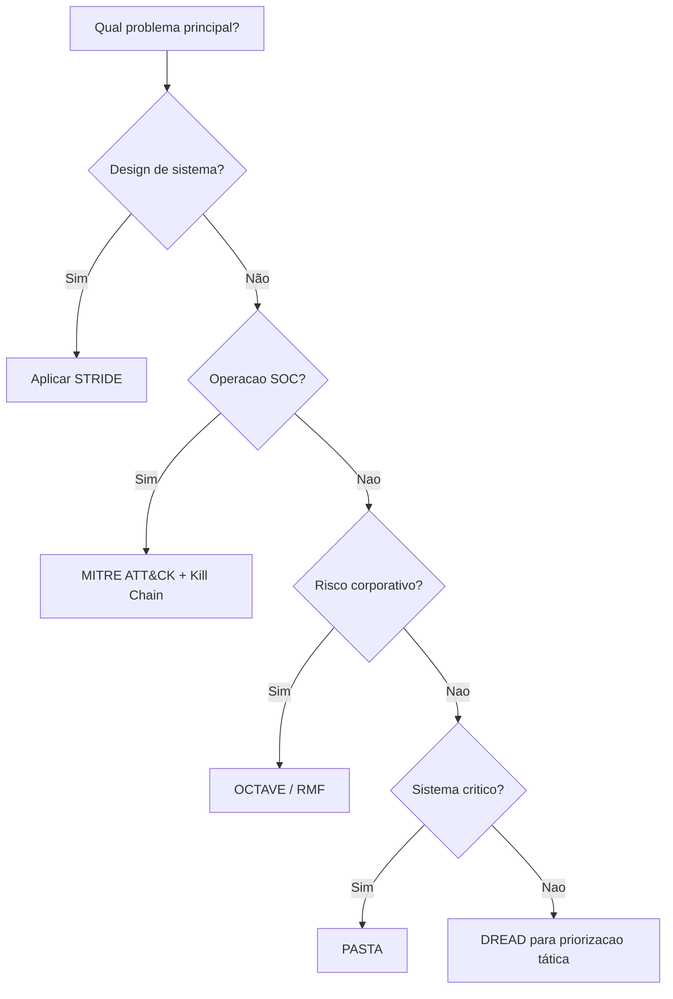

# Comparativo de Metodologias de Análise de Ameaças

> **Objetivos de aprendizagem**
> - Comparar metodologias por esforço, profundidade e resultado esperado.
> - Selecionar combinações adequadas ao contexto da organização.
> - Evitar erros comuns na aplicação em sala, laboratório e empresa.
>
> **Tempo estimado:** 15 minutos

## Vídeo de contexto

## 1. Comparativo rápido

| Metodologia | Melhor uso | Esforço | Entregável típico | Limitação principal |
|---|---|---|---|---|
| **STRIDE** | Projeto de software e revisão de arquitetura | Baixo a médio | Lista de ameaças por categoria | Não prioriza negócio sozinho |
| **DREAD** | Ranqueamento de riscos técnicos | Baixo | Score de risco por ameaça | Subjetividade alta |
| **PASTA** | Sistemas críticos e análise aprofundada | Alto | Cenários de ataque + plano de mitigação | Exige maturidade e tempo |
| **OCTAVE** | Governança e risco institucional | Médio | Matriz de risco por ativo crítico | Pouco detalhamento de baixo nível |
| **MITRE ATT&CK** | SOC, hunting, resposta e purple team | Médio | Mapa de cobertura por TTP | Não substitui modelagem no design |
| **Kill Chain** | Comunicação e interrupção do ataque por fase | Baixo a médio | Estratégia de detecção por etapa | Menos granular que ATT&CK |

---

## 2. Escolha por cenário

### 2.1 Cenário acadêmico (disciplina/laboratório)

- Comece com **STRIDE** para treinar modelagem.
- Use **DREAD** para priorizar correções.
- Introduza **ATT&CK** para conectar com detecção real.

### 2.2 Cenário corporativo com SOC

- **ATT&CK + Kill Chain** para operação diária.
- **STRIDE** em novos sistemas.
- **OCTAVE/RMF** para risco institucional e auditoria.

### 2.3 Cenário de alta criticidade (saúde, finanças, indústria)

- **PASTA** para análise profunda orientada ao negócio.
- **ATT&CK** para monitoramento contínuo.
- **Kill Chain** para playbooks de contenção por fase.

---

## 3. Erros comuns ao aplicar metodologias

- Usar apenas uma metodologia para tudo.
- Tratar ATT&CK como checklist estático e não como base viva.
- Fazer STRIDE no início do projeto e nunca revisar.
- Priorizar por “achismo”, sem critérios explícitos.
- Ignorar risco de terceiros e cadeia de suprimentos.

---

## 4. Fluxo de decisão sugerido

---

## 5. Mini-caso de seleção

Uma faculdade quer melhorar segurança em 90 dias:

1. **Semana 1-2:** STRIDE no portal acadêmico e API de notas.
2. **Semana 3-4:** priorização com DREAD + impacto de negócio.
3. **Semana 5-8:** mapeamento ATT&CK no SIEM e regras de detecção.
4. **Semana 9-12:** playbooks por fase da Kill Chain e exercício de resposta.

Resultado esperado: redução de exposição técnica e melhoria de tempo de detecção/resposta.

---

## 6. Perguntas de revisão rápida

1. Qual metodologia gera mais valor imediato para um SOC?
2. Em que contexto PASTA é justificável?
3. Por que STRIDE e ATT&CK não são concorrentes diretos?
