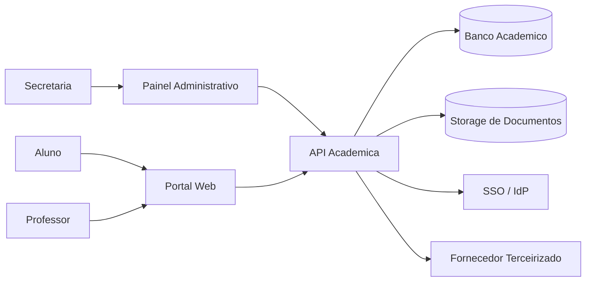

# Prática Guiada de Avaliação de Ameaças

> **Objetivos de aprendizagem**
> - Aplicar STRIDE, DREAD e PASTA no mesmo cenário de forma complementar.
> - Produzir artefatos profissionais de análise de ameaças com ferramentas reais.
> - Explicar por que cada metodologia responde a perguntas diferentes da defesa.
>
> **Tempo estimado:** 60 minutos

## Vídeo da aula

## 1. Cenário real da atividade

Nesta atividade, você e seu grupo atuarão como equipe de segurança de uma **instituição de ensino com portal acadêmico em nuvem**. O ambiente atende alunos, professores e secretaria, e integra autenticação corporativa, banco de dados acadêmico, armazenamento de documentos e um fornecedor terceirizado.

### 1.1 Componentes do cenário

- **Portal web** para acesso de alunos e professores.
- **Painel administrativo** usado pela secretaria.
- **API acadêmica** para notas, matrículas, faltas e documentos.
- **Banco de dados acadêmico** com dados pessoais e históricos.
- **Armazenamento em nuvem** com boletins e declarações.
- **SSO/IdP** para autenticação institucional.
- **Fornecedor terceirizado** para emissão de boletos e integrações financeiras.

### 1.2 Ativos mais sensíveis

- credenciais e sessões;
- dados pessoais de alunos e docentes;
- notas e histórico acadêmico;
- documentos institucionais;
- registros de auditoria;
- disponibilidade do portal em período de matrícula.

### 1.3 Diagrama inicial do ambiente

Esse diagrama já é suficiente para iniciar a atividade. Se o grupo quiser aprofundar a análise, ele pode ser refinado com **fronteiras de confiança**, fluxos autenticados e dependências externas.

---

## 2. Organização da atividade

Uma divisão eficiente é trabalhar em grupos de 4 a 5 alunos, com papéis explícitos:

- **Facilitador:** mantém o foco no método.
- **Arquiteto:** desenha o fluxo e identifica fronteiras.
- **Analista de risco:** conduz a discussão de impacto.
- **Redator:** consolida o artefato final.
- **Relator:** apresenta os achados na discussão final.

### 2.1 Sequência sugerida

| Etapa | Tempo | Saída esperada |
|---|---|---|
| Entendimento do cenário | 10 min | Escopo, ativos e atores |
| STRIDE | 20 min | Registro inicial de ameaças |
| DREAD | 10 min | Priorização das ameaças principais |
| PASTA | 15 min | Cenário de ataque e plano de resposta |
| Fechamento | 5 min | Apresentação curta da equipe |

---

## 3. Ferramentas reais e artefatos profissionais

| Ferramenta | Uso na atividade | Artefato gerado | Observação prática |
|---|---|---|---|
| **OWASP Threat Dragon** | Modelar o sistema e registrar ameaças STRIDE | Diagrama e lista de ameaças | Boa opção multiplataforma e visual |
| **Microsoft Threat Modeling Tool** | Alternativa guiada para STRIDE em laboratório Windows | Modelo de ameaça com catálogo inicial | Útil para ambientes baseados em Windows e ecossistema Microsoft |
| **diagrams.net** ou **Mermaid** | Refinar diagrama para relatório final | DFD/contexto em PNG, SVG ou Markdown | Simples para padronizar entrega |
| **LibreOffice Calc / Excel / Google Sheets** | Aplicar DREAD com notas e justificativas | Matriz de priorização | Facilita consenso e apresentação |
| **Markdown / Google Docs / editor institucional** | Consolidar o raciocínio PASTA | Relatório executivo e técnico | Mantém rastreabilidade |
| **OWASP pytm** | Automação opcional para grupos com perfil mais técnico | DFD, sequência e relatório gerado por código | Excelente para DevSecOps e versionamento |

### 3.1 Pacote de entrega sugerido

Ao final da atividade, cada grupo deve entregar um conjunto simples e profissional:

- `01-contexto-e-dfd.pdf`
- `02-registro-stride.xlsx`
- `03-matriz-dread.xlsx`
- `04-relatorio-pasta.md` ou `.pdf`
- `05-plano-de-tratamento.csv`

Esses nomes ajudam a padronizar as entregas e facilitam revisão, comparação entre grupos e reaproveitamento em portfólios ou evidências de laboratório.

---

## 4. Passo a passo com STRIDE

STRIDE é a melhor porta de entrada para a prática porque obriga a equipe a olhar para **componentes, fluxos e fronteiras de confiança** antes de discutir prioridade.

### 4.1 Preparação

1. Liste os componentes do cenário.
2. Marque onde há mudança de confiança: Internet, SSO, storage, terceiro, painel administrativo.
3. Identifique quais dados circulam entre os elementos.
4. Registre as premissas: MFA parcial, fornecedor externo, períodos críticos de matrícula.

### 4.2 Perguntas-guia

| Categoria | Pergunta orientadora | Exemplo no cenário |
|---|---|---|
| **Spoofing** | Alguém pode se passar por outro usuário ou serviço? | Reuso de sessão de professor em login federado |
| **Tampering** | Alguém pode alterar dados ou parâmetros? | Mudança indevida de nota ou boleto |
| **Repudiation** | É possível negar uma ação sem evidência confiável? | Secretaria altera cadastro sem trilha forte |
| **Information Disclosure** | Dados podem vazar para quem não deveria vê-los? | Exposição de documentos no storage |
| **Denial of Service** | O serviço pode ser degradado ou indisponibilizado? | API indisponível em período de matrícula |
| **Elevation of Privilege** | Um usuário comum pode ganhar privilégio maior? | Professor acessa função administrativa |

### 4.3 Registro STRIDE esperado

| ID | Elemento | Categoria | Cenário de abuso | Impacto | Controle atual | Ação recomendada |
|---|---|---|---|---|---|---|
| TM-01 | SSO / Portal | Spoofing | Conta docente comprometida por phishing reutiliza sessão | Alto | MFA opcional | MFA obrigatório e revisão de sessão |
| TM-02 | API / Banco | Tampering | Alteração indevida de notas via falha de autorização | Alto | Controle parcial por perfil | Revisar autorização e trilhas por função |
| TM-03 | Painel administrativo | Repudiation | Mudança de dados sem log confiável | Médio | Log incompleto | Log assinado e trilha de auditoria |
| TM-04 | Storage | Information Disclosure | Documento acadêmico acessado por link exposto | Alto | Links compartilháveis | Expiração, escopo mínimo e DLP |
| TM-05 | API pública | Denial of Service | Picos de requisição derrubam matrícula online | Alto | Rate limit insuficiente | WAF, fila e proteção anti-DDoS |
| TM-06 | Painel / API | Elevation of Privilege | Usuário comum obtém função de secretaria | Alto | Perfis amplos | RBAC, revisão periódica e aprovação dupla |

O artefato profissional aqui não é apenas a lista. Ele precisa trazer **evidência, hipótese e ação recomendada**.

---

## 5. Priorização com DREAD

DREAD entra depois de STRIDE para evitar discussão vaga. A lógica é simples: as ameaças já identificadas passam por uma pontuação explícita.

### 5.1 Critérios

- **Damage:** quão grave é o dano?
- **Reproducibility:** o ataque pode ser repetido com facilidade?
- **Exploitability:** o esforço técnico para explorar é baixo ou alto?
- **Affected Users:** quantos usuários ou processos são impactados?
- **Discoverability:** a fraqueza é fácil de descobrir?

### 5.2 Matriz exemplo

| ID | Ameaça | Damage | Reproducibility | Exploitability | Affected Users | Discoverability | Média | Prioridade |
|---|---|---:|---:|---:|---:|---:|---:|---|
| TM-01 | Reuso de sessão no SSO | 9 | 8 | 7 | 8 | 7 | 7,8 | Alta |
| TM-02 | Alteração de notas via falha de autorização | 9 | 6 | 6 | 7 | 6 | 6,8 | Alta |
| TM-04 | Exposição de documentos no storage | 8 | 9 | 8 | 9 | 8 | 8,4 | Crítica |
| TM-05 | Indisponibilidade na matrícula | 8 | 7 | 7 | 10 | 7 | 7,8 | Alta |

### 5.3 Como aplicar em grupo

1. Defina uma escala comum de `1 a 10`.
2. Exija uma justificativa curta para cada nota.
3. Peça consenso do grupo, não votação apressada.
4. Converta a média em fila de ação.

Uma prática madura reconhece a limitação do DREAD: ele ajuda muito a **priorizar conversas**, mas não deve substituir evidência técnica, contexto regulatório e impacto institucional.

---

## 6. Construindo o raciocínio com PASTA

PASTA é útil quando o grupo já tem ameaças identificadas e precisa transformar isso em **cenários de risco defendíveis para gestão, auditoria ou priorização estratégica**.

### 6.1 Sete etapas resumidas

| Etapa PASTA | Pergunta principal | Saída esperada |
|---|---|---|
| 1. Objetivos de negócio | O que precisa continuar confiável, íntegro e disponível? | Critérios de impacto |
| 2. Escopo técnico | O que está dentro e fora da análise? | Escopo validado |
| 3. Decomposição | Como os dados e os componentes se relacionam? | DFD/contexto |
| 4. Análise de ameaças | Quem atacaria, por qual motivação e por qual vetor? | Catálogo de atores e caminhos |
| 5. Análise de vulnerabilidades | Quais fraquezas tornam o ataque viável? | Evidências e lacunas |
| 6. Simulação de ataque | Como a cadeia de ataque ocorreria de ponta a ponta? | Narrativa de ataque |
| 7. Tratamento | O que reduzirá risco com melhor retorno? | Plano priorizado |

### 6.2 Exemplo de cenário consolidado

**Cenário PASTA:** um atacante obtém credenciais docentes por phishing, acessa o portal, encontra uma falha de autorização na API, altera notas e exfiltra documentos acadêmicos antes de apagar rastros operacionais.

Esse cenário é mais forte do que uma lista isolada de ameaças porque:

- relaciona motivação, vetor e vulnerabilidade;
- mostra dependência entre autenticação, autorização e monitoramento;
- evidencia impacto acadêmico, reputacional e regulatório;
- justifica investimento em controles com linguagem de negócio.

### 6.3 Artefato PASTA esperado

| Campo | Exemplo |
|---|---|
| Objetivo de negócio afetado | Continuidade da matrícula e integridade do histórico escolar |
| Ator de ameaça | Cibercriminoso com acesso inicial por phishing |
| Caminho de ataque | Roubo de sessão -> API sem autorização robusta -> exfiltração -> manipulação de registros |
| Evidência principal | MFA opcional, RBAC incompleto, logs sem correlação |
| Impacto | Parada operacional, retrabalho institucional, incidente de privacidade |
| Contramedidas | MFA obrigatório, revisão de RBAC, trilha imutável, proteção do storage |
| Dono da ação | TI + Segurança + Secretaria acadêmica |
| Prazo | 30, 60 e 90 dias |

---

## 7. Diferenças e potencialidades

| Método | Pergunta que responde melhor | Potencialidade | Limitação prática |
|---|---|---|---|
| **STRIDE** | O que pode dar errado em cada fluxo ou componente? | Excelente para descobrir lacunas cedo | Gera volume alto se o escopo estiver mal definido |
| **DREAD** | O que tratar primeiro? | Simples para priorizar backlog e debate em grupo | Sofre com subjetividade sem critérios claros |
| **PASTA** | Qual cenário ameaça de fato o negócio? | Conecta técnica, impacto e decisão executiva | Requer mais maturidade e documentação |

### 7.1 Recomendação prática

Para uma aula orientada a resultado, a combinação mais eficiente é:

1. **STRIDE** para descobrir.
2. **DREAD** para ordenar.
3. **PASTA** para justificar e comunicar.

Essa sequência evita que o grupo pule da arquitetura direto para controles genéricos.

---

## 8. Entregáveis consistentes e profissionais

Um bom trabalho final precisa permitir auditoria e reaproveitamento. Por isso, os artefatos devem conter:

- identificador único da ameaça;
- ativo ou componente afetado;
- premissa usada na análise;
- evidência ou lacuna observada;
- impacto técnico e impacto no negócio;
- controle atual;
- ação recomendada;
- responsável e prazo.

### 8.1 Critérios de qualidade da entrega

| Critério | O que observar |
|---|---|
| Clareza do escopo | O grupo delimitou o sistema analisado |
| Qualidade do diagrama | Há fluxos, componentes e fronteiras de confiança |
| Consistência do STRIDE | As ameaças fazem sentido para o elemento avaliado |
| Rigor do DREAD | As notas têm justificativa e coerência |
| Maturidade do PASTA | O cenário conecta técnica e negócio |
| Tratamento proposto | Há ações viáveis com responsável e prioridade |

---

## 9. Mini-caso prático

Para testar a robustez da análise, considere esta variação: o fornecedor terceirizado de boletos sofre comprometimento e passa a receber tokens válidos da API acadêmica.

- **STRIDE** ajuda a discutir spoofing do terceiro, tampering em dados financeiros e information disclosure.
- **DREAD** mostra se o problema deve subir acima das falhas internas já identificadas.
- **PASTA** evidencia que o incidente afeta não só tecnologia, mas cobrança, reputação e continuidade administrativa.

Esse fechamento é útil para mostrar que ameaças de terceiros não são apenas “mais uma integração”, mas um multiplicador de superfície de ataque.

---

## 10. Perguntas de revisão rápida

1. Por que STRIDE deve começar pelo diagrama e não pela lista de controles?
2. Em que situação DREAD ajuda, mas não é suficiente para decidir sozinho?
3. O que PASTA acrescenta quando a equipe já possui uma lista de ameaças priorizadas?

---

## 11. Fontes de referência

- OWASP Threat Dragon  
  https://owasp.org/www-project-threat-dragon/
- OWASP Threat Modeling  
  https://owasp.org/www-community/Threat_Modeling
- OWASP pytm  
  https://owasp.org/www-project-pytm/
- Microsoft Threat Modeling (STRIDE)  
  https://learn.microsoft.com/en-us/azure/security/develop/threat-modeling-tool-threats
- Risk-Centric Threat Modeling: Process for Attack Simulation and Threat Analysis (PASTA)  
  https://www.oreilly.com/library/view/risk-centric-threat/9780470500965/
