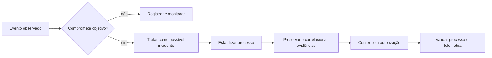

# A01 — O incidente que parou a linha

Às 09:17, uma linha de envase deixa de produzir. A rede corporativa continua acessível, o supervisório registra um *timeout* de comunicação e um alarme é reconhecido segundos depois. A equipe precisa agir, mas uma contenção precipitada também pode impedir a operação segura.

!!! question "Pergunta mobilizadora"
    Que evidência permite distinguir uma falha técnica de uma ação indevida sem atribuir causa antes da hora?

## Objetivos de aprendizagem

Ao final do encontro, você será capaz de:

- distinguir observação, hipótese e conclusão em registros de um incidente;
- explicar como CIA, AAA e safety influenciam o impacto em TI e OT;
- propor uma coleta ou intervenção reversível e indicar como validar seu efeito.

**Tempo estimado:** 104 minutos — 52 minutos de conceituação ativa e 52 minutos de prática.

**Pré-requisitos:** leitura de horários, navegação em arquivos e noções básicas de redes.

**Recursos:** página da aula, roteiro prático, pacote fictício de logs e editor de texto. O Juice Shop local é opcional neste primeiro encontro.

## O que a evidência permite afirmar?

Considere o trecho fictício:

```text
09:16:52  HMI-01  login_success  operador_turno
09:17:03  PLC-01  comm_timeout   3200 ms
09:17:05  LINE-01 state_change   RUN -> STOP
09:17:08  HMI-01  alarm_ack      ALM-204
```

O registro mostra uma sequência temporal. Ele não prova que a autenticação causou a interrupção, que a conta representa a pessoa indicada ou que o *timeout* foi malicioso. Essa separação é essencial:

| Elemento | Pergunta profissional | Exemplo no cenário |
|---|---|---|
| Observação | O que foi registrado diretamente? | Houve *timeout* antes da mudança para `STOP`. |
| Hipótese | Que mecanismo poderia explicar os fatos? | Uma perda de comunicação pode ter acionado parada segura. |
| Lacuna | O que falta medir? | Tráfego, lógica do PLC e histórico completo de alarmes. |
| Conclusão | O que as evidências sustentam após testes? | Ainda não há dados suficientes para atribuir causa. |

Correlação é a ocorrência conjunta ou ordenada de fatos. Causalidade exige demonstrar um mecanismo e excluir explicações concorrentes. Em resposta a incidentes, declarar limites aumenta a qualidade da decisão.

## Do evento ao risco

- **Ameaça** é uma condição ou agente capaz de produzir dano.
- **Vulnerabilidade** é uma fragilidade que pode ser explorada ou acionada.
- **Evento** é uma ocorrência observável em um sistema ou processo.
- **Incidente** é um ou mais eventos que comprometem objetivos de segurança ou operação.
- **Consequência** é o efeito sobre pessoas, produção, qualidade, ambiente ou negócio.
- **Risco** representa a incerteza associada à probabilidade e ao impacto de consequências.

Uma falha de comunicação é um evento. Ela se torna parte de um incidente quando compromete objetivos relevantes. O risco existia antes da parada; o incidente torna parte desse risco observável e exige resposta.



## CIA, AAA e o processo físico

A tríade **CIA** organiza propriedades da informação:

- **confidencialidade:** somente entidades autorizadas acessam a informação;
- **integridade:** dados e comandos permanecem corretos e alterações são detectáveis;
- **disponibilidade:** sistemas e informações estão acessíveis quando necessários.

**AAA** complementa a análise de acesso:

- **autenticação:** confirmar a identidade apresentada;
- **autorização:** limitar o que essa identidade pode fazer;
- **accounting:** registrar ações para auditoria e responsabilização.

Em OT (*Operational Technology*, tecnologia operacional), software observa ou altera o ambiente físico. Por isso, **safety** — proteção de pessoas, ambiente e processo contra condições perigosas — condiciona a resposta. Desligar ou isolar um componente pode reduzir um risco cibernético e, ao mesmo tempo, remover visibilidade ou controle necessários ao estado seguro.

| Perspectiva | Pergunta no cenário | Impacto possível |
|---|---|---|
| Confidencialidade | Dados de produção foram expostos? | Espionagem ou vantagem competitiva. |
| Integridade | Comandos, estados ou horários foram alterados? | Ação incorreta e investigação enganosa. |
| Disponibilidade | HMI, PLC e comunicação estão utilizáveis? | Parada ou perda de supervisão. |
| AAA | Quem acessou, o que podia fazer e o que ficou registrado? | Uso indevido sem rastreabilidade. |
| Safety | A resposta mantém o processo em estado seguro? | Dano físico, ambiental ou humano. |

## Como agir sem destruir a evidência

Uma resposta inicial proporcional segue cinco movimentos:

1. **Estabilizar:** confirmar o estado do processo e envolver quem possui autoridade operacional.
2. **Preservar:** registrar horários, fontes e integridade dos dados disponíveis.
3. **Correlacionar:** comparar HMI, PLC, rede e processo; um único log raramente basta.
4. **Conter:** escolher ação autorizada, reversível e compatível com disponibilidade e safety.
5. **Validar:** observar tanto a telemetria de segurança quanto o comportamento do processo.

### Comparando próximas ações

| Opção | Melhor uso | Esforço/custo | Evidência ou entregável | Limitação/risco |
|---|---|---|---|---|
| Preservar logs | Há risco de sobrescrita | Baixo | Cópia identificada e horário registrado | Log isolado pode induzir conclusão prematura |
| Capturar tráfego | É preciso observar comunicação | Médio | PCAP em ponto autorizado | Exige posição de captura e análise |
| Consultar alarmes | A sequência do processo é decisiva | Baixo | Linha do tempo operacional | Alarmes podem não registrar a causa raiz |
| Isolar a HMI | Há evidência de propagação e caminho seguro | Alto | Contenção registrada | Pode reduzir visibilidade ou operação |

Neste cenário, preserve primeiro os registros voláteis e correlacione as fontes. Isole a HMI somente após confirmar estado seguro, impacto operacional, autorização e alternativa de supervisão.

## Ponte para a prática

No roteiro distribuído no Google Classroom, sua dupla ordenará evidências, comparará duas hipóteses e recomendará a próxima coleta. A entrega não é uma “resposta certa”: é uma linha do tempo defensável, com limites explícitos e decisão compatível com o processo.

## Evidências e critérios de conclusão

A atividade estará concluída quando a dupla apresentar:

- linha do tempo em ordem e com fatos separados de inferências;
- hipótese principal e alternativa, ambas relacionadas às evidências;
- lacuna que impeça atribuição definitiva;
- próxima ação justificada por risco, reversibilidade, disponibilidade e safety;
- forma de validar a hipótese sem testar terceiros nem expor dados sensíveis.

## Síntese

Segurança digital é uma disciplina de risco e evidência. Um evento só ganha significado quando relacionado a objetivos; uma sequência temporal não prova causa; e uma intervenção só é defensável quando reduz risco sem criar consequência operacional inaceitável. Em TI e OT, observar, formular, correlacionar, intervir e validar formam um único ciclo.

## Perguntas de revisão rápida

1. Por que o `login_success` não prova autoria da parada?
2. Como disponibilidade e safety podem limitar uma ação de contenção?
3. Que nova evidência diferenciaria falha de comunicação e ação indevida?

## Fontes oficiais

- [NIST Cybersecurity Framework 2.0](https://www.nist.gov/cyberframework) — gestão de risco de segurança cibernética. Acesso em 4 ago. 2026.
- [NIST SP 800-82 Rev. 3 — Guide to Operational Technology Security](https://csrc.nist.gov/pubs/sp/800/82/r3/final) — características, ameaças e controles para OT. Acesso em 4 ago. 2026.
- [NICE Framework Resource Center](https://www.nist.gov/itl/applied-cybersecurity/nice/nice-framework-resource-center) — linguagem comum para trabalho, conhecimentos e habilidades em segurança. Acesso em 4 ago. 2026.
- [OWASP Juice Shop](https://owasp.org/www-project-juice-shop/) — aplicação intencionalmente insegura usada na trilha web do curso. Acesso em 4 ago. 2026.
