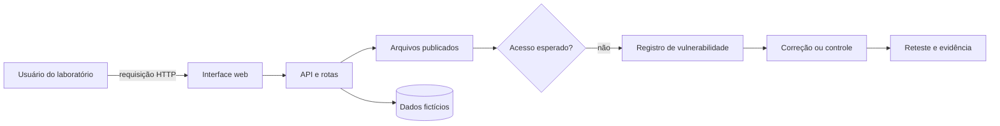

# A02 — O que realmente está exposto?

Uma equipe acaba de publicar uma loja de testes. O catálogo funciona, mas um arquivo que deveria permanecer interno pode ser alcançado pelo navegador. Antes de chamar isso de “ataque”, a equipe precisa responder: **qual ativo foi exposto, qual fraqueza permitiu o acesso e qual consequência justifica agir primeiro?**

## Objetivos de aprendizagem

Ao final do encontro, você será capaz de:

- inventariar ativos de TI e OT relacionando proprietário, função e consequência;
- distinguir ameaça, fraqueza, vulnerabilidade, exposição e exploit em uma evidência concreta;
- registrar e priorizar uma vulnerabilidade, propondo controle e validação compatíveis com o risco.

## Tempo, pré-requisitos e recursos

- **Tempo presencial:** 104 minutos — 52 minutos de conceituação ativa e 52 minutos de prática.
- **Organização:** duplas, com os papéis de investigador e revisor trocados na metade da prática.
- **Pré-requisitos:** A01; navegador com ferramentas de desenvolvedor; ambiente local da disciplina.
- **Recurso principal:** OWASP Juice Shop local. Burp Suite Community é opcional.
- **Alternativa:** pacote de evidências do roteiro prático, sem exploração ao vivo.

!!! danger "Escopo autorizado"
    Investigue somente o Juice Shop fornecido para a disciplina. Não teste a demonstração pública, sistemas institucionais ou terceiros. Use contas e dados fictícios. Pare e avise o professor se o endereço não for o alvo indicado, se houver dados reais ou se o comportamento alcançar outro sistema.

## Evidência inicial

Considere esta observação fictícia, preparada para a aula:

```text
GET /ftp/acquisitions.md HTTP/1.1
Host: juice-shop.local

HTTP/1.1 200 OK
Content-Type: text/markdown
```

Antes de prosseguir, registre individualmente:

1. o que a evidência mostra diretamente;
2. qual ativo pode estar envolvido;
3. uma hipótese sobre a condição que tornou o acesso possível;
4. o que ainda seria necessário observar para sustentar essa hipótese.

Uma resposta defensável separa observação de inferência. Um código `200` mostra que o servidor entregou um recurso naquela requisição; sozinho, ele não prova autoria, intenção, alcance total nem impacto de negócio.

## Do ativo à consequência

**Ativo** é algo que tem valor para a organização ou sustenta seus objetivos. Um inventário útil não é uma lista de equipamentos: ele conecta cada item à função, ao responsável e ao dano possível.

| Ativo | Tipo | Função no cenário | Consequência se comprometido | Evidência de inventário |
|---|---|---|---|---|
| catálogo e API | aplicação/serviço | vender e consultar produtos | fraude, indisponibilidade ou decisão com dados alterados | rotas observadas e responsável definido |
| dados de clientes fictícios | informação | sustentar contas e pedidos | exposição de dados e perda de confiança | classificação e localização registradas |
| container do Juice Shop | plataforma | executar a aplicação | ampliação do incidente ou parada do laboratório | imagem, versão e configuração |
| controlador de uma linha simulada | ativo OT | comandar o processo físico | perda de produção ou condição insegura | inventário, lógica e zona de rede |

O NIST CSF 2.0 reúne em **ID.AM — Asset Management** resultados como manter inventários de hardware, software, serviços, dados e fluxos, além de priorizar ativos conforme classificação, criticidade e impacto para a missão. O inventário deve ser atualizado por evidência, não por memória.

### TI e OT pedem consequências diferentes

Em TI, um servidor pode ser priorizado por confidencialidade, integridade e disponibilidade. Em OT, essas dimensões continuam válidas, mas a análise também deve considerar continuidade do processo, qualidade, meio ambiente e **safety** — proteção de pessoas e do processo físico. A mesma exposição técnica pode receber prioridades distintas conforme a consequência.

## Termos que não são sinônimos

| Termo | Pergunta operacional | Aplicação ao cenário |
|---|---|---|
| ativo | o que tem valor ou sustenta o processo? | arquivo, aplicação, dados, serviço ou plataforma |
| ameaça | quem ou o que pode causar dano? | usuário não autorizado, erro de publicação ou automação abusiva |
| fraqueza (CWE) | que condição de projeto ou implementação pode originar falhas? | controle de acesso inadequado ou arquivo colocado em área pública |
| vulnerabilidade | qual instância concreta pode ser explorada? | recurso interno acessível sem a restrição esperada |
| exposição | por qual caminho o ativo ficou alcançável? | rota web acessível pelo navegador |
| exploit | que técnica ou artefato usa a vulnerabilidade? | uma requisição cuidadosamente construída; nem toda vulnerabilidade exige código especial |
| controle | o que previne, detecta, limita ou corrige? | retirar o arquivo da raiz pública, autorizar a rota e monitorar acessos |

A **CWE** descreve classes de fraquezas em software ou hardware. Uma **CVE** identifica publicamente uma vulnerabilidade específica em um produto. Nem toda falha didática do Juice Shop possui um CVE, e não se deve inventar um identificador. Primeiro descreva a evidência e a causa; depois relacione taxonomias quando houver correspondência verificável.

## Superfície de ataque e caminho de acesso

A **superfície de ataque** é o conjunto de pontos pelos quais um sistema pode receber interações: interfaces web, APIs, arquivos, portas, identidades, dependências e conexões físicas ou lógicas. Ela muda com configuração, versão e arquitetura.



Inventariar a superfície não significa varrer a Internet. Nesta aula, o caminho autorizado começa no navegador e termina no único ambiente local fornecido.

## Investigação controlada

Na prática, a dupla deverá:

1. confirmar o alvo e registrar o estado inicial;
2. prever qual recurso pode estar exposto e qual evidência confirmaria a hipótese;
3. observar uma requisição e resposta sem automatizar enumeração;
4. relacionar ativo, fraqueza, vetor, ameaça e consequência;
5. comparar controles e escolher um tratamento;
6. retestar ou definir um teste de validação reproduzível.

O objetivo não é obter uma flag. O produto é um registro técnico que outra equipe consiga revisar.

## Da descoberta à ação defensiva

| Opção | Melhor uso | Esforço/custo | Evidência ou entregável | Limitação/risco |
|---|---|---|---|---|
| remover o arquivo da área pública | recurso não deveria ser servido | baixo a médio | rota retorna `404`/`410` e arquivo permanece disponível apenas no repositório autorizado | pode quebrar dependências não inventariadas |
| aplicar autorização na rota | recurso é necessário a um papel específico | médio | acesso negado sem sessão e permitido ao papel correto | política incorreta mantém ou cria bloqueios |
| reduzir conteúdo sensível | publicação é necessária, mas há excesso de dados | baixo | revisão mostra somente dados necessários | não corrige outros arquivos expostos |
| detectar e alertar acessos | correção não pode ser imediata | médio | log e alerta testados com requisição controlada | detecta, mas não impede a exposição |

**Recomendação condicionada:** se o recurso não faz parte da função pública da aplicação, retire-o da área servida e reteste. Se o acesso é funcionalmente necessário, aplique autorização no servidor e valide casos permitido e negado. Monitoramento complementa a correção; não a substitui.

## Registro mínimo de vulnerabilidade

Um registro verificável inclui:

- ativo, proprietário e função;
- evidência reproduzível e sanitizada;
- comportamento esperado e observado;
- fraqueza provável, sem afirmar causa não comprovada;
- ameaça e caminho de acesso dentro do escopo;
- consequência e prioridade justificadas;
- controle escolhido, responsável e teste de validação;
- limites da análise e próximo passo.

## Critérios de conclusão

A atividade está concluída quando a dupla entrega inventário priorizado e registro de vulnerabilidade que:

- separam evidência de hipótese;
- usam corretamente os termos ativo, ameaça, fraqueza, vulnerabilidade, exposição e exploit;
- justificam prioridade pela consequência, incluindo safety quando aplicável;
- propõem controle compatível com a causa provável;
- definem reteste capaz de demonstrar o efeito do controle;
- não contêm credenciais, tokens, IPs públicos ou dados pessoais.

## Reflexão e transferência

Se um arquivo de configuração semelhante estivesse em uma HMI de uma célula industrial, o controle web ainda seria suficiente? Identifique uma consequência física possível e uma restrição operacional que mudaria a intervenção.

## Revisão rápida

1. Por que um ativo sem proprietário e consequência conhecida é difícil de priorizar?
2. Qual é a diferença entre CWE e CVE, e por que nem toda evidência recebe um CVE?
3. Que resultado de reteste demonstraria que uma exposição de arquivo foi efetivamente tratada?

## Fontes oficiais

- [NIST Cybersecurity Framework 2.0](https://doi.org/10.6028/NIST.CSWP.29) — função Identify e categoria ID.AM.
- [CVE Program](https://www.cve.org/) — identificação pública de vulnerabilidades específicas.
- [CWE — Common Weakness Enumeration](https://cwe.mitre.org/) — linguagem comum para fraquezas de software e hardware.
- [OWASP Juice Shop](https://owasp.org/www-project-juice-shop/) — aplicação vulnerável intencionalmente criada para treinamento.
- [OWASP Juice Shop — guia oficial](https://help.owasp-juice.shop/) — instalação, uso e desafios; consulte apenas no ambiente autorizado.
