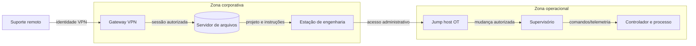

# A03 — Por onde o incidente atravessa o sistema?

Na A02, a equipe registrou uma exposição no ambiente da empresa fictícia. Agora surge uma evidência adicional: a conta de suporte usada na loja também aparece em um acesso ao servidor de arquivos, pouco antes de arquivos receberem extensões incomuns. A produção ainda opera, mas a estação de engenharia compartilha uma conexão com a rede corporativa.

O desafio não é adivinhar “o ataque correto”. É construir um modelo que mostre **o que precisa ser verdade para um caminho de ataque alcançar uma consequência relevante** e decidir onde interrompê-lo.

## Objetivos de aprendizagem

Ao final do encontro, você será capaz de:

- representar ativos, fluxos, processos, armazenamentos e fronteiras de confiança em um diagrama;
- usar STRIDE para formular ameaças verificáveis e relacionar CAPEC, ATT&CK e ATT&CK for ICS sem confundir suas funções;
- priorizar caminhos de ataque por consequência e registrar tratamento, responsável e validação.

## Tempo, pré-requisitos e recursos

- **Tempo presencial:** 104 minutos — 52 minutos de conceituação ativa e 52 minutos de prática.
- **Organização:** grupos de três ou quatro, com papéis de arquiteto, adversário autorizado, defensor e relator.
- **Pré-requisitos:** inventário e registro da A02; noções de autenticação, redes e evidência.
- **Ferramentas:** diagrams.net, OWASP Threat Dragon ou Mermaid; papel A3 é uma alternativa completa.
- **Cenário:** tabletop de ransomware simulado, sem código malicioso, criptografia de arquivos ou indisponibilidade real.

!!! danger "Escopo e segurança"
    Modele somente o cenário fictício e os ambientes fornecidos. Não execute malware, payload, persistência, varredura, força bruta ou testes contra terceiros. Cartões do tabletop descrevem eventos; não autorizam reproduzi-los. Pare se surgir dado real, destino externo ou efeito operacional.

## Evidência inicial

```text
08:42  VPN-SUPORTE  login_success  conta=svc_support  origem=externa
08:51  FILE-01      auth_success   conta=svc_support
09:03  FILE-01      bulk_rename    287 arquivos
09:07  ENG-WS-01    session_open   destino=OT-JUMP-01
```

Antes de desenhar, registre:

1. duas observações que os registros sustentam;
2. uma hipótese de caminho de ataque;
3. uma hipótese alternativa não maliciosa;
4. a evidência que diferenciaria as duas explicações.

Os registros não provam ransomware, comprometimento da conta ou acesso ao processo OT. Eles indicam eventos correlacionados que justificam modelagem e coleta adicional.

## O modelo começa no sistema, não no atacante

Um **modelo de ameaças** é uma representação orientada a decisões. Ele explicita o que precisa ser protegido, como os componentes interagem, onde a confiança muda e que condições permitem abuso.

### Elementos mínimos do diagrama

| Elemento | Pergunta | Exemplo no cenário |
|---|---|---|
| entidade externa | quem interage sem ser controlado pelo sistema? | suporte remoto, cliente, fornecedor |
| processo | onde dados ou comandos são transformados? | loja, VPN, servidor de arquivos, jump host |
| armazenamento | onde informação ou configuração persiste? | banco, arquivos, backup, projeto do controlador |
| fluxo | o que atravessa a conexão e em qual direção? | credencial, pedido, arquivo, comando, log |
| fronteira de confiança | onde muda identidade, autoridade, administração ou consequência? | Internet/DMZ, TI/OT, fornecedor/empresa |
| ativo/consequência | o que tem valor e o que ocorre se for comprometido? | dados, produção, qualidade, safety |



Uma linha sem rótulo esconde decisões. Nomeie o dado ou comando, direção, protocolo quando conhecido e controle relevante. Uma fronteira não é apenas firewall: pode representar mudança de proprietário, privilégio, tecnologia, disponibilidade ou consequência física.

## STRIDE como gerador de perguntas

STRIDE ajuda a examinar cada elemento e fluxo. Não é uma lista de respostas nem uma pontuação automática.

| Categoria | Pergunta aplicada | Evidência/controle possível |
|---|---|---|
| Spoofing — falsificação | alguém pode se passar pela conta de suporte? | identidade, MFA, origem, sessão e autenticação forte |
| Tampering — adulteração | arquivos, projeto ou comandos podem ser alterados? | integridade, assinatura, revisão e controle de mudança |
| Repudiation — repúdio | a ação pode ocorrer sem rastreabilidade suficiente? | logs correlacionados, horário e identidade individual |
| Information Disclosure — divulgação | o fluxo revela informação além do necessário? | classificação, criptografia e minimização |
| Denial of Service — indisponibilidade | o abuso remove acesso, visão ou controle? | redundância, limitação, backup e recuperação |
| Elevation of Privilege — elevação | uma identidade obtém autoridade além da função? | privilégio mínimo, separação e autorização contextual |

Escreva ameaças como uma frase testável:

> Um agente com **[capacidade]** pode explorar **[condição]** em **[elemento/fluxo]** para causar **[consequência]**, observável por **[evidência]**.

## Como as taxonomias se complementam

| Recurso | Melhor uso | Esforço/custo | Evidência ou entregável | Limitação/risco |
|---|---|---|---|---|
| STRIDE | descobrir classes de ameaça no desenho | baixo; exige contexto | perguntas e ameaças por elemento | não descreve comportamento real nem prioridade |
| CAPEC | compreender padrões de ataque e pré-condições | médio | padrão relacionado e mitigação candidata | não é inventário de grupos nem vulnerabilidades específicas |
| ATT&CK Enterprise | relacionar objetivos e comportamentos observados em TI | médio | tática/técnica com fonte e telemetria | não substitui modelagem do sistema |
| ATT&CK for ICS | analisar comportamentos e impactos em ambientes industriais | médio/alto | caminho OT e fontes de detecção | aplicabilidade depende da arquitetura e do processo |
| Kill Chain | narrar progressão e pontos de interrupção | baixo | sequência executiva do cenário | lineariza caminhos que podem ser paralelos ou iterativos |

**Recomendação condicionada:** use STRIDE para gerar perguntas no diagrama; CAPEC para aprofundar um padrão; ATT&CK/ICS para relacionar comportamento e telemetria; e uma narrativa de cadeia apenas para comunicar progressão. Não force uma correspondência quando a evidência não sustentar.

## Do caminho de ataque ao risco

Um caminho é uma sequência de condições, ações e travessias de fronteira. No tabletop, cada grupo deve construir três caminhos:

- um caminho que afeta dados ou serviços de TI;
- um caminho que tenta alcançar a estação de engenharia ou o jump host;
- um caminho alternativo interrompido por um controle existente.

Priorize usando perguntas, não falsa precisão:

- a consequência atinge dados, receita, produção, ambiente ou pessoas?
- quantas fronteiras precisam ser vencidas?
- quais condições já são observadas e quais são suposições?
- existem controles preventivos, detectivos ou de recuperação?
- o tratamento reduz risco sem criar condição insegura?

## Tratamento e validação

| Tratamento | Quando considerar | Exemplo | Validação |
|---|---|---|---|
| evitar | atividade não é necessária | retirar acesso direto de fornecedor | confirmar ausência do fluxo e continuidade por alternativa |
| mitigar | função precisa permanecer | MFA, jump host, segmentação, backup imutável | testar permitido/negado, alerta e restauração |
| transferir/compartilhar | contrato ou serviço divide responsabilidade | requisitos e SLA de fornecedor | evidência contratual e exercício conjunto |
| aceitar | risco residual está dentro da tolerância | exceção temporária autorizada | prazo, proprietário, monitoramento e reavaliação |

O registro final deve declarar ativo, caminho, consequência, evidências, suposições, controles existentes, tratamento escolhido, proprietário, prazo e teste de validação.

## Critérios de conclusão

- diagrama contém elementos, fluxos nomeados e pelo menos duas fronteiras de confiança;
- três ameaças são expressas de forma testável e relacionadas ao desenho;
- três caminhos distinguem evidência de suposição e incluem consequência;
- taxonomias são usadas com finalidade correta e fonte oficial;
- registro de risco contém tratamento condicionado, responsável e validação;
- tabletop permanece não destrutivo e dentro do cenário fictício.

## Reflexão e transferência

Se a conexão entre TI e OT fosse removida, quais riscos diminuiriam e quais atividades operacionais deixariam de funcionar? Que novo risco poderia surgir com uma solução manual ou acesso emergencial?

## Revisão rápida

1. O que caracteriza uma fronteira de confiança e por que ela não é sinônimo de firewall?
2. Em que STRIDE, CAPEC e ATT&CK diferem quanto à pergunta que respondem?
3. Que evidência demonstra que um controle interrompe um caminho sem comprometer a operação?

## Fontes oficiais

- [NIST Cybersecurity Framework 2.0](https://doi.org/10.6028/NIST.CSWP.29).
- [MITRE CAPEC](https://capec.mitre.org/).
- [MITRE ATT&CK — Enterprise Matrix](https://attack.mitre.org/matrices/enterprise/).
- [MITRE ATT&CK for ICS](https://attack.mitre.org/matrices/ics/).
- [OWASP Threat Modeling](https://owasp.org/www-community/Threat_Modeling).
