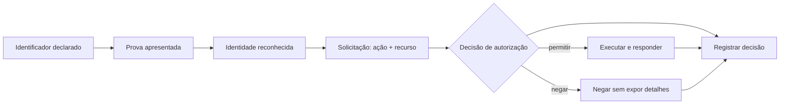

# A05 — Quem é você e pode fazer isto?

Esta aula começa no último registro da A04. Ana abriu sua cesta, a turma reconstruiu o caminho `pessoa → navegador → serviço → dado` e marcou o serviço como uma lacuna: a captura mostrou a requisição e a resposta, mas não mostrou **como o serviço relaciona a sessão de Ana à cesta e decide quais dados pode devolver**.

Na primeira parte da A05, continuaremos exatamente a investigação de Ana até decompor a decisão em identificação, autenticação, autorização e registro. Somente depois que esse modelo estiver preenchido introduziremos Bruno: não como um novo cenário, mas como uma variação controlada do mesmo fluxo para verificar se o modelo explica outra sessão legítima.

## Objetivos de aprendizagem

Ao final do encontro, você deverá conseguir:

- distinguir identificação, autenticação, autorização e registro de auditoria em uma interação observável;
- comparar duas sessões legítimas e relacionar `sujeito`, `ação`, `recurso` e `resultado` sem expor credenciais ou tokens;
- especificar o evento de log mínimo necessário para revisar uma decisão de acesso, declarando o que a captura do navegador não comprova.

**Tempo estimado:** 104 minutos — 52 minutos de construção conceitual e 52 minutos de investigação prática.  
**Organização:** duplas; alternem os papéis de operador e registrador ao trocar de conta.  
**Produto:** mapa de evidências AAA com dois casos legítimos e uma especificação de evento auditável.

## Antes de começar

Você precisará de:

- computador com Docker e navegador com DevTools;
- diagrama e registro HTTP produzidos na A04;
- contêiner local do OWASP Juice Shop;
- roteiro prático da A05.

Use somente o Juice Shop em `http://127.0.0.1:3000`. As contas são fictícias e descartáveis. Não altere URLs, identificadores de recurso, cookies ou tokens; isso será tratado apenas quando houver objetivo, escopo e procedimento próprios.

## 1. Recupere a evidência que chegou da A04

O diagrama anterior deve conter pelo menos:

1. Ana executando a ação de abrir a cesta;
2. o navegador enviando método, caminho e algum contexto de interação;
3. o serviço como responsável por processar a solicitação;
4. a resposta contendo status e dados;
5. a fronteira entre o navegador, controlado pelo usuário, e o serviço.

A captura permite afirmar que determinado contexto acompanhou uma solicitação. Ela **não demonstra, sozinha**, que a senha foi validada corretamente, que a cesta pertence à pessoa autenticada ou que o servidor registrou a decisão.

Essa limitação cria o trabalho da A05: associar cada afirmação à fonte capaz de sustentá-la.

## 2. Aprofunde primeiro o fluxo de Ana

Retome a mesma conta, os mesmos dois produtos e a mesma ação da A04. A diferença é a pergunta feita à evidência: antes queríamos localizar componentes e fronteiras; agora queremos explicar quais decisões de identidade e acesso precisam ocorrer dentro daquele caminho.

Preencha, ainda sem Bruno:

```text
Ana declarou ser quem? → que prova apresentou? → como passou a ser reconhecida?
→ qual ação solicitou? → sobre qual cesta? → qual resultado recebeu?
```

Só depois dessa cadeia estar sustentada por registros, adicione Bruno como comparação.

## 3. Introduza uma variação controlada no mesmo fluxo

As duas contas executarão ações equivalentes, mas cada uma terá seu próprio estado:

| Caso | Identidade declarada | Ação legítima | Recurso esperado | Resultado esperado |
|---|---|---|---|---|
| Ana | `ana@a04.test` | entrar e abrir a cesta | cesta criada na sessão de Ana | apenas os itens adicionados por Ana |
| Bruno | `bruno@a05.test` | entrar e abrir a cesta | cesta criada na sessão de Bruno | apenas os itens adicionados por Bruno |

Antes de abrir o painel de rede, crie um estado conhecido: entre com Ana, confirme seus itens e saia; depois cadastre ou entre com Bruno, adicione um produto diferente e confirme sua cesta. Essa preparação permite interpretar a resposta sem adivinhar a quem os dados deveriam pertencer.

## 4. Quatro perguntas diferentes no mesmo fluxo

### Identificação: quem a conta declara representar?

Identificação associa um nome ou identificador a uma entidade no contexto do sistema. O e-mail digitado no formulário indica qual conta a pessoa pretende usar. Isso ainda é uma **declaração**, não uma prova.

Termos próximos não são equivalentes:

- **identidade:** conjunto de atributos usados para representar uma entidade em um contexto;
- **conta:** registro local que permite ao sistema administrar essa identidade;
- **identificador:** valor que distingue a conta, como um e-mail;
- **credencial:** objeto ou dado associado à autenticação, como uma senha ou chave;
- **conta de serviço:** identidade usada por software, que também precisa de proprietário, finalidade e ciclo de vida.

### Autenticação: que prova foi aceita?

Autenticação é o processo de verificar uma alegação de identidade. No laboratório, a aplicação compara a prova apresentada no login com o verificador associado à conta. A senha é um fator do tipo **algo que você sabe**. Outros fatores podem usar algo que você possui ou uma característica inerente, mas quantidade de etapas não garante independência entre fatores.

O resultado observável no navegador — a aplicação passou a reconhecer Ana — sustenta que um fluxo de autenticação ocorreu. A captura não revela necessariamente como a senha foi armazenada, quais controles contra tentativas foram aplicados ou qual garantia de identidade foi alcançada.

Nunca registre a senha ou o valor de um token na entrega. Para a investigação, basta indicar `prova apresentada: senha` e `resultado observado: sessão reconhecida`.

### Autorização: esta identidade pode executar esta ação sobre este recurso?

Autorização avalia uma solicitação depois que existe um contexto de identidade. Uma decisão completa pode ser representada por:

```text
sujeito + ação + recurso + contexto → decisão permitida ou negada
```

No caso de Ana:

```text
Ana + consultar + cesta de Ana + sessão vigente → permitir
```

A interface pode sugerir essa associação, mas a decisão de segurança deve ser aplicada no lado confiável da fronteira — normalmente o serviço — e não apenas por ocultação de botões no navegador. A regra precisa continuar válida quando a requisição chega diretamente ao serviço.

Princípios importantes:

- **negação por padrão:** ausência de uma permissão explícita resulta em negação;
- **menor privilégio:** conceder somente as ações e recursos necessários;
- **verificação por requisição:** não presumir que uma decisão anterior autoriza automaticamente outra ação;
- **controle no servidor:** dados enviados pelo cliente são entradas a verificar, não autoridade sobre a decisão;
- **separação entre autenticação e autorização:** uma conta válida ainda pode tentar uma ação não permitida.

Papéis (RBAC) e atributos (ABAC) são formas de expressar políticas. Eles não substituem a pergunta concreta sobre sujeito, ação, recurso e contexto, nem corrigem uma aplicação que deixa de executar a verificação.

### Accounting e auditoria: qual decisão ficou registrada?

No modelo AAA, *accounting* é a produção de registros que permitem revisar o uso do sistema. Um log de acesso útil deve responder, dentro dos limites do sistema:

- **quando** ocorreu, com horário e fuso normalizados;
- **quem** foi reconhecido, por identificador interno estável;
- **qual ação** foi solicitada;
- **sobre qual recurso**, evitando conteúdo sensível desnecessário;
- **qual decisão** ocorreu e por qual regra ou motivo;
- **qual foi o resultado** técnico da operação;
- **como correlacionar** o evento com a requisição e outros componentes.

Um esquema mínimo para o caso poderia ser:

```json
{
  "timestamp": "2026-08-13T14:05:22-03:00",
  "request_id": "req-ficticio-1042",
  "subject_id": "user-ficticio-ana",
  "action": "basket.read",
  "resource_type": "basket",
  "decision": "allow",
  "reason": "subject_owns_basket",
  "status": 200
}
```

Esse exemplo descreve um requisito, não um resultado que você deve encontrar no Juice Shop. Senha, cookie, token de sessão e conteúdo integral da cesta não devem ser colocados no log. Registros excessivos aumentam exposição e custo; registros insuficientes impedem investigação e prestação de contas.

## 5. Onde obter cada evidência

| Afirmação a avaliar | Ação anterior necessária | Fonte adequada | O que registrar | O que não concluir ainda |
|---|---|---|---|---|
| a conta declarou ser Ana | preencher o identificador no login | formulário e registro do operador | identificador fictício | que a prova foi validada |
| a aplicação reconheceu Ana | concluir o login e observar a interface | interface + requisição posterior | conta reconhecida e presença de contexto, sem valor secreto | como a senha foi verificada |
| Ana consultou uma cesta | limpar o Network e abrir a cesta | método, caminho, status e resposta | ação, alvo declarado e resultado | que a regra de propriedade está correta |
| a cesta observada corresponde ao estado de Ana | anotar antes os itens de Ana | comparação entre linha de base e resposta | correspondência ou divergência | que outros recursos seriam negados |
| a decisão ficou auditável | definir os campos necessários e procurar uma fonte de log autorizada | log de aplicação ou especificação de evento | campos presentes e ausentes | que ausência na interface significa ausência de log |

Essa tabela impõe uma disciplina: **a pergunta vem depois da preparação e da coleta**.

## 6. Investigação guiada

### Reentrada no caso de Ana

1. Confirme que `http://127.0.0.1:3000` abre no navegador.
2. Se necessário, inicie o ambiente com o mesmo comando da A04:

```powershell
docker run --rm -d --name juice-shop-a04 -p 127.0.0.1:3000:3000 bkimminich/juice-shop
```

```bash
docker run --rm -d --name juice-shop-a04 -p 127.0.0.1:3000:3000 bkimminich/juice-shop
```

3. Abra o diagrama A04 e destaque a pergunta anotada sobre a decisão do serviço.
4. Confirme o estado de Ana e anote seus produtos.
5. Não use dados pessoais e não reutilize essas senhas fora do laboratório.

### Coleta do caso de Ana

1. Entre como Ana.
2. Abra DevTools → **Network/Rede** e selecione **Fetch/XHR**.
3. Limpe a lista de requisições.
4. Abra a cesta.
5. Selecione a requisição correlacionada à ação e registre método, caminho, presença ou ausência de contexto, status e descrição da resposta.
6. Oculte valores de `Cookie` ou `Authorization` em qualquer captura.
7. Saia pela interface e confirme que a aplicação deixou de exibir Ana como conta ativa.

### Construa o primeiro mapa com Ana

Antes de criar outra conta, associe os registros de Ana a `identificação → autenticação → solicitação → autorização → resposta`. Marque decisão interna e evento de auditoria como requisitos quando não houver observação direta.

### Introduza Bruno e repita a coleta

Cadastre Bruno com `bruno@a05.test`, senha descartável `Bruno-A05!2026` e resposta fictícia `verde`; adicione um produto diferente. Depois, repita exatamente o procedimento usado com Ana. A repetição controlada é importante: se ferramenta, ação e registro mudarem ao mesmo tempo, a comparação perde força.

### Leitura orientada

Para cada caso, preencha:

| Campo | Ana | Bruno | Fonte |
|---|---|---|---|
| identificador declarado |  |  | formulário/registro |
| prova apresentada | senha, sem registrar valor | senha, sem registrar valor | ação de login |
| identidade reconhecida |  |  | interface após login |
| ação |  |  | clique + método |
| recurso declarado |  |  | caminho + resposta |
| resultado |  |  | status + conteúdo esperado |
| decisão inferida |  |  | conjunto das evidências |
| limite da conclusão |  |  | análise da dupla |

Não haverá teste de acesso à cesta de outra conta nesta aula. Os dois casos comprovam linhas de base legítimas; não comprovam o comportamento do sistema diante de uma solicitação indevida.

## 7. Atualize o mapa AAA com a variação

Use diagrams.net, Mermaid, apresentação ou papel legível. O mapa deve mostrar:



Diferencie no desenho:

- evidência observada no navegador;
- funcionamento necessário inferido;
- requisito de auditoria proposto;
- informação ainda não comprovada.

## 8. Especifique o evento de auditoria

Crie dois exemplos sem segredos: um evento `allow` sustentado pelo caso observado e um evento `deny` tratado explicitamente como **especificação para um futuro teste**, não como fato observado.

Justifique cada campo usando três critérios:

1. ele ajuda a reconstruir a decisão;
2. ele não coleta segredo ou dado desnecessário;
3. existe um componente responsável por produzi-lo e protegê-lo.

## Evidências e critérios de conclusão

Entregue um PDF com:

- tabela comparativa preenchida para Ana e Bruno;
- mapa AAA que associe cada etapa à evidência ou ao requisito correspondente;
- especificação dos eventos `allow` e `deny`, sem credenciais ou tokens;
- uma conclusão no formato: `observamos ___; isso sustenta ___; ainda não comprova ___; a próxima evidência necessária é ___`.

A atividade estará concluída quando outra dupla conseguir identificar onde cada afirmação surgiu, distinguir observação de inferência e revisar a especificação sem depender de explicação oral.

## Encerramento do ambiente

Ao terminar, saia da conta e encerre o contêiner:

```powershell
docker stop juice-shop-a04
```

```bash
docker stop juice-shop-a04
```

Como o contêiner foi iniciado com `--rm`, ele será removido após a parada. Confirme com `docker ps --filter name=juice-shop-a04`.

## Revisão rápida

1. Por que uma autenticação bem-sucedida não prova que toda ação posterior está autorizada?
2. Qual evidência observada sustenta que a aplicação reconheceu Ana, e qual detalhe interno permanece desconhecido?
3. Quais campos permitem auditar uma decisão sem registrar senha, cookie ou token?

## Fontes oficiais

- [NIST SP 800-63-4 — Digital Identity Guidelines](https://pages.nist.gov/800-63-4/) — identidade e autenticação. Acesso em 13 ago. 2026.
- [OWASP Authentication Cheat Sheet](https://cheatsheetseries.owasp.org/cheatsheets/Authentication_Cheat_Sheet.html) — controles de autenticação. Acesso em 13 ago. 2026.
- [OWASP Authorization Cheat Sheet](https://cheatsheetseries.owasp.org/cheatsheets/Authorization_Cheat_Sheet.html) — decisões de autorização no servidor. Acesso em 13 ago. 2026.
- [OWASP Logging Cheat Sheet](https://cheatsheetseries.owasp.org/cheatsheets/Logging_Cheat_Sheet.html) — conteúdo e proteção de registros. Acesso em 13 ago. 2026.
- [OWASP ASVS](https://owasp.org/www-project-application-security-verification-standard/) — requisitos verificáveis de autenticação, sessão, controle de acesso e logging. Acesso em 13 ago. 2026.
