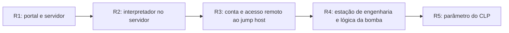

# A07 — Da aplicação web ao processo industrial: como o adversário avança?

Um relatório técnico já consolidado descreve um caminho que começa num portal público, atravessa a rede corporativa e alcança um CLP. Nesta aula, não investigaremos se o incidente ocorreu nem escolheremos controles. A pergunta é mais delimitada: **como localizar e justificar esses comportamentos no MITRE ATT&CK?**

!!! question "Pergunta mobilizadora"
    Como transformar uma frase de um relatório em domínio, tática e técnica sem escolher uma célula apenas porque o nome parece adequado?

## Objetivos de aprendizagem

- Diferenciar domínio, tática, técnica, subtécnica e procedimento.
- Localizar técnicas pelos caminhos de busca e de navegação da matriz.
- Justificar mapeamentos Enterprise e ICS pela correspondência entre narrativa e definição oficial.

**Tempo:** 100 minutos de explicação aplicada e prática guiada.  
**Entrada:** habilidade de distinguir modelo, hipótese e evidência trabalhada na A06; relato industrial fornecido nesta página. O modelo de cestas não comprova a arquitetura industrial.  
**Produto:** tabela `trecho → comportamento → domínio → tática → técnica → justificativa` e layers simples no Navigator.

## Relato técnico usado na aula

O exercício recebe como dados os seguintes acontecimentos:

1. o ator explorou uma vulnerabilidade no portal público e obteve acesso ao servidor;
2. executou comandos por meio de um interpretador;
3. utilizou uma conta de manutenção válida para acessar remotamente o *jump host* da DMZ industrial;
4. consultou tags, relações entre variáveis e a lógica da bomba P-101;
5. modificou um parâmetro utilizado pelo CLP, produzindo um valor diferente do definido pelos operadores.

O aluno não precisa provar autoria, causalidade ou consequência. Sua tarefa é mapear aquilo que o relato já afirma.


## Prepare a primeira busca

Abra um documento com colunas `trecho / comportamento / domínio / tática / técnica / justificativa / fonte`. Chame os cinco trechos acima de R1 a R5. Sublinhe verbo e objeto de R1 e R2 antes de procurar códigos. Uma pessoa faz o mapeamento e a outra confere a correspondência; invertam os papéis após R2.

Use somente esta narrativa fictícia e consulta às páginas públicas indicadas. Não execute comandos do relato, conexões, varreduras ou alterações em sistemas. Os acontecimentos são dados do exercício, e não resultados de uma investigação feita pela dupla.

O portal recebe solicitações de serviço; o servidor atende a aplicação; o jump host é um ponto intermediário de acesso administrativo; a DMZ industrial separa acessos entre redes; a estação de engenharia trabalha com a lógica do controlador. CLP significa controlador lógico programável; ele interage com o processo físico. Esse funcionamento orienta o domínio de cada comportamento.



As setas organizam o **relato fornecido**. Não demonstram por si mesmas que a arquitetura permite esses caminhos.

## O que o ATT&CK é — e o que não é

O [MITRE ATT&CK](https://attack.mitre.org/) é uma base de conhecimento sobre comportamentos adversários observados. Ele fornece vocabulário e relações para descrever como adversários perseguem objetivos em diferentes ambientes.

ATT&CK não é um scanner, não examina nosso sistema e não gera automaticamente as ameaças de uma arquitetura. Também não reconstrói sozinho um incidente, determina causalidade ou escolhe o tratamento do risco.

Nesta aula, o ATT&CK será usado como referência para **classificar e comunicar comportamentos já descritos**.

## Quem é a MITRE e de onde veio o ATT&CK

A MITRE é uma organização privada sem fins lucrativos que opera centros de pesquisa e desenvolvimento financiados pelo governo dos Estados Unidos. O ATT&CK começou em 2013 no projeto de pesquisa FMX, que estudava telemetria e análise para reconhecer comportamentos pós-comprometimento. A base foi disponibilizada publicamente em 2015 e passou a servir como linguagem comum para diferentes atividades de segurança.

- [MITRE — Who We Are](https://www.mitre.org/who-we-are)
- [MITRE ATT&CK — FAQ](https://attack.mitre.org/resources/faq/)

## Como a matriz está organizada

A página inicial permite entrar por **domínio**, **matriz** ou **busca**. Na matriz, as colunas são táticas e as células abaixo delas são técnicas.

| Nível | Pergunta respondida | Exemplo |
|---|---|---|
| domínio | em qual ecossistema o comportamento ocorre? | Enterprise ou ICS |
| tática | por que a ação é útil ao adversário? | obter acesso inicial |
| técnica | como esse objetivo pode ser alcançado? | explorar aplicação pública |
| subtécnica | qual variação mais específica foi usada? | depende da técnica e do relato |
| procedimento | como um ator ou software realizou a técnica num caso observado? | exemplo documentado na página da técnica |

Nem toda técnica possui subtécnicas. Táticas também não constituem fases obrigatórias: uma operação pode omitir, repetir ou retornar a objetivos anteriores.

## As 15 táticas Enterprise

A matriz Enterprise consultada em 8 de setembro de 2026 organiza quinze objetivos. Use a tabela como referência durante a busca; não é necessário memorizar todas as colunas antes de mapear o caso:

| Grupo de leitura | Tática | O que significa |
|---|---|---|
| preparar | Reconnaissance | coletar informações para planejar operações futuras |
| preparar | Resource Development | estabelecer contas, infraestrutura ou capacidades de apoio |
| entrar e agir | Initial Access | conseguir o primeiro ponto de entrada |
| entrar e agir | Execution | executar código ou comandos controlados pelo adversário |
| manter e ampliar | Persistence | manter o ponto de apoio |
| manter e ampliar | Privilege Escalation | obter permissões superiores |
| ocultar e enfraquecer | Stealth | ocultar ações ou fazê-las parecer normais |
| ocultar e enfraquecer | Defense Impairment | prejudicar sensores, registros e mecanismos defensivos |
| conhecer e mover | Credential Access | obter credenciais ou outros meios de autenticação |
| conhecer e mover | Discovery | compreender sistemas, identidades, serviços e rede |
| conhecer e mover | Lateral Movement | avançar entre sistemas |
| atingir o objetivo | Collection | reunir dados de interesse |
| atingir o objetivo | Command and Control | comunicar-se com sistemas comprometidos |
| atingir o objetivo | Exfiltration | retirar dados do ambiente |
| atingir o objetivo | Impact | manipular, interromper ou destruir sistemas e dados |

Os agrupamentos ajudam a leitura, mas não transformam a matriz numa linha do tempo.

## Processo de mapeamento

O treinamento oficial de inteligência de ameaças do ATT&CK apresenta cinco movimentos: encontrar o comportamento, pesquisá-lo, traduzi-lo em uma tática, identificar técnica ou subtécnica e comparar o resultado com outros analistas. Para esta introdução, aplicamos esses movimentos a uma narrativa pronta.

```text
trecho do relatório
        ↓
ação expressa por verbo e objeto
        ↓
domínio e objetivo do adversário
        ↓
busca de técnicas candidatas
        ↓
comparação com a definição oficial
        ↓
justificativa do mapeamento
```

### 1. Separe os comportamentos

Uma frase pode conter mais de uma ação:

> O ator explorou o portal público e executou comandos no servidor.

Ela deve ser dividida em:

- explorar uma aplicação pública;
- executar comandos no servidor.

O comportamento vem da narrativa, não do ATT&CK. A base será consultada somente depois que a ação estiver descrita de forma clara.

### 2. Escolha domínio e tática

Pergunte onde a ação ocorreu e qual objetivo imediato ela realizou.

| Comportamento | Domínio | Objetivo | Tática |
|---|---|---|---|
| explorar aplicação pública | Enterprise | conseguir entrar | Initial Access |
| executar comandos no servidor | Enterprise | fazer código ou comandos rodarem | Execution |
| modificar parâmetro do CLP | ICS | prejudicar o controle do processo | Impair Process Control |

### 3. Localize técnicas candidatas

Existem dois caminhos complementares:

1. **Busca:** clique em **Search**, no canto superior direito, e pesquise termos do comportamento em inglês, como `public-facing application`.
2. **Matriz:** abra **Matrices → Enterprise**, localize **Initial Access** e percorra as técnicas da coluna.

Não pesquise pelo código quando ele ainda for desconhecido. O procedimento real parte do comportamento e descobre o identificador.

### 4. Compare a página da técnica

Para o primeiro comportamento, os dois caminhos conduzem a [T1190 — Exploit Public-Facing Application](https://attack.mitre.org/techniques/T1190/). A página deve ser lida como um teste de correspondência:

1. a descrição representa a ação do relatório?
2. o domínio e a tática são compatíveis?
3. as plataformas ou ativos correspondem ao elemento citado?
4. os *Procedure Examples* ajudam a compreender como a técnica aparece em relatos reais?

Encontrar um nome semelhante não basta. A justificativa deve indicar qual parte da definição corresponde ao trecho.

### 5. Compare justificativas

Duas pessoas podem propor técnicas diferentes porque uma frase contém várias ações ou porque escolheram níveis de abstração diferentes. A revisão deve retornar ao trecho e à definição:

> Qual trecho específico esta técnica representa e qual parte da definição sustenta a escolha?

O registro mínimo contém trecho, comportamento, domínio, tática, técnica e justificativa.

!!! question "Checkpoint — o nome encontrado explica qual verbo?"
    Compare o registro de R1 com R2. Se ambos receberam a mesma técnica, confira se a descrição cobre de fato os dois comportamentos. Antes de avançar, seu colega deve localizar o trecho e a definição que sustentam cada escolha.

## Quando o domínio ICS entra

Estar numa DMZ industrial não muda automaticamente o domínio. Sessão, identidade e acesso remoto continuam podendo ser descritos no domínio Enterprise. A matriz ICS se torna necessária quando a narrativa passa a tratar de ativos, funções e efeitos próprios do sistema de controle.

No relato, a mudança ocorre quando aparecem estação de engenharia, tags, lógica, CLP e processo físico.

### Exemplo: T0836 — Modify Parameter

O trecho afirma que o ator modificou um parâmetro utilizado pelo CLP. Na matriz ICS:

| Campo | Mapeamento |
|---|---|
| comportamento | modificar parâmetro usado pelo controlador |
| domínio | ICS |
| tática | Impair Process Control |
| técnica | [T0836 — Modify Parameter](https://attack.mitre.org/techniques/T0836/) |

A correspondência é sustentada porque a definição descreve a modificação de parâmetros que instruem dispositivos de controle e podem produzir resultados diferentes dos pretendidos pelos operadores.

## ATT&CK Navigator

O [ATT&CK Navigator](https://navigator.attack.mitre.org/) permite selecionar, anotar e exportar técnicas numa representação visual da matriz.

Na aula, a dupla cria uma layer Enterprise e outra ICS, seleciona somente as técnicas justificadas e registra nos comentários o trecho correspondente. A layer comunica o resultado; ela não investiga o incidente nem seleciona técnicas automaticamente.

## Atividade {#atividade}

**Missão:** produzir um mapa rastreável de R1–R5 para outra equipe de análise. **Referência do roteiro:** 100 minutos, incluindo a prática guiada acima. **Equipe:** dupla com papéis rotativos. **Recursos:** navegador, esta página, ATT&CK e Navigator.

### Aplicar o método com apoio progressivamente menor

1. **10 min — orientação:** abra a matriz Enterprise e a ICS; aponte uma coluna e uma técnica, explicando a relação.
2. **12 min — decomposição:** separe verbo, objeto e contexto de R1/R2. Não acrescente mecanismo ausente do relato.
3. **12 min — enquadramento:** escolha domínio e objetivo imediato; use o exemplo de R1 para justificar a diferença em R2.
4. **15 min — busca:** encontre a candidata de R1 tanto pela busca quanto pela matriz, conforme os passos desta página.
5. **15 min — correspondência:** leia a descrição oficial e registre por que ela coincide com R1; a semelhança do nome não basta.
6. **15 min — extensão:** mapeie R2 e R3. R3 pode conter mais de uma ação; mantenha cada técnica ligada à frase que a sustenta.
7. **12 min — ICS:** repita com R4/R5, usando o exemplo de T0836 para orientar a leitura de R5 e decidindo R4 com menor apoio.
8. **5 min — comunicação:** registre no Navigator somente as técnicas justificadas.
9. **4 min — revisão:** outra dupla refaz um mapeamento. Corrija uma inconsistência ou melhore a justificativa.

### Operação do Navigator

Abra o [Navigator](https://navigator.attack.mitre.org/). Na tela de criação, escolha **Create New Layer** e o domínio **Enterprise ATT&CK**; uma layer é uma camada de anotações sobre a matriz. Dê um nome que identifique a dupla e o domínio. Localize uma técnica já justificada, selecione-a e use o campo de comentário da seleção para registrar trecho e justificativa. Use a mesma cor para “mapeado no relato”, acompanhada de legenda textual; cor não representa risco.

Salve pela opção de download da layer em JSON, que preserva as anotações. Crie outra layer para **ICS ATT&CK** e repita. Para o PDF da entrega, use exportação visual disponível ou captura legível; preserve os JSON localmente. Se a interface divergir, conserve a tabela e use a alternativa abaixo, registrando a limitação.

**Checkpoint:** a captura e o comentário devem apontar para a mesma técnica e o mesmo trecho. Uma célula colorida sem justificativa não conclui o mapeamento.

### Alternativa sem rede ou Navigator

Se somente o Navigator falhar, mantenha a tabela e monte dois quadros, Enterprise e ICS, com identificadores e justificativas já consultados. Declare que a representação foi manual.

Se também faltar acesso ao ATT&CK, use estes resumos didáticos para comparar candidatas; registre a fonte como **ficha fornecida**, sem simular consulta atual:

| Candidata | O que sua definição descreve |
|---|---|
| [T1190](https://attack.mitre.org/techniques/T1190/) | explorar fragilidade de aplicação acessível externamente para obter acesso |
| [T1059](https://attack.mitre.org/techniques/T1059/) | usar interpretadores de comandos ou scripts para executar ações |
| [T1078](https://attack.mitre.org/techniques/T1078/) | utilizar contas válidas para viabilizar acesso ou ações adversárias |
| [T1021](https://attack.mitre.org/techniques/T1021/) | usar serviços remotos para interagir com outros sistemas |
| [T0861](https://attack.mitre.org/techniques/T0861/) | identificar pontos e tags para compreender variáveis do processo |
| [T0836](https://attack.mitre.org/techniques/T0836/) | modificar parâmetros usados pelos dispositivos de controle |

Não atribua subtécnica, protocolo ou ferramenta se o relato não os informa. A ficha permite comparação de comportamento, mas não substitui a inspeção da página completa. Marque campos não verificáveis e a consulta que falta. A modalidade offline avalia o raciocínio, deixando a navegação da ferramenta para retomada.

### Entrega e rubrica

Se atribuída no Classroom, envie `A07-sobrenome1-sobrenome2.pdf`: tabela de R1–R5, representação Enterprise e ICS, correção após revisão e explicação de até 100 palavras sobre a necessidade dos dois domínios. Identifique a modalidade usada e a data de consulta das definições.

| Critério | Concluído | Precisa revisar |
|---|---|---|
| Rastreabilidade | cada técnica aponta ao trecho e à fonte | código sem contexto |
| Precisão | domínio, objetivo e comportamento distintos | tática confundida com técnica |
| Correspondência | definição sustenta o mapeamento | escolha pelo nome |
| Limite | não inventa mecanismo nem subtécnica | completa lacunas do relato |
| Comunicação | tabela e representação coerentes | mapa apenas colorido |

**Encerramento:** salve o PDF e as layers locais quando usadas; feche as abas e confira que não incluiu dados reais. **Extensão:** retire de um trecho uma informação técnica e indique qual precisão de mapeamento se perde.

**Ponte para continuar o estudo:** preserve os campos `trecho / comportamento / fonte / limite`. Eles permitem distinguir o que foi descrito no caso das futuras perguntas de proteção e validação. Este mapa, sozinho, não comprova prioridade de risco, controle implementado ou teste concluído.

## Limites do resultado

Um mapa colorido não demonstra que o ambiente está protegido nem que uma operação ocorreu exatamente daquela maneira. O produto desta aula:

- padroniza o vocabulário;
- relaciona trechos e comportamentos;
- mostra a passagem entre Enterprise e ICS;
- permite que outra pessoa refaça o mapeamento.

Investigação de incidentes, causalidade, detecção, resposta e tratamento de risco permanecem fora do escopo desta introdução.

## Critérios de conclusão

- cada técnica aponta para um trecho específico;
- domínio, tática e técnica exercem funções diferentes;
- a justificativa utiliza a definição oficial;
- Enterprise e ICS não são tratados como equivalentes;
- outra dupla consegue refazer o caminho;
- o trabalho não apresenta hipóteses investigativas ou decisões de resposta.

## Revisão rápida

1. De onde vem o comportamento usado na busca?
2. Qual é a diferença entre procurar pela matriz e usar **Search**?
3. Quando um caminho localizado numa DMZ industrial passa a exigir o domínio ICS?

## Fontes oficiais

- [MITRE ATT&CK](https://attack.mitre.org/)
- [FAQ do MITRE ATT&CK](https://attack.mitre.org/resources/faq/)
- [Enterprise Matrix](https://attack.mitre.org/matrices/enterprise/)
- [Enterprise Tactics](https://attack.mitre.org/tactics/enterprise/)
- [ICS Matrix](https://attack.mitre.org/matrices/ics/)
- [T1190 — Exploit Public-Facing Application](https://attack.mitre.org/techniques/T1190/)
- [T0836 — Modify Parameter](https://attack.mitre.org/techniques/T0836/)
- [ATT&CK Navigator](https://navigator.attack.mitre.org/)
- [ATT&CK CTI Training — Mapping Process](https://attack.mitre.org/docs/training-cti/Module%202%20Slides.pdf)
