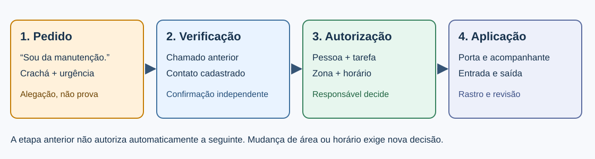
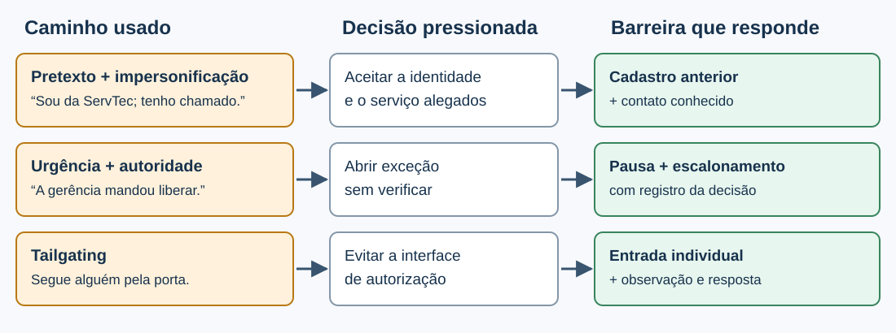
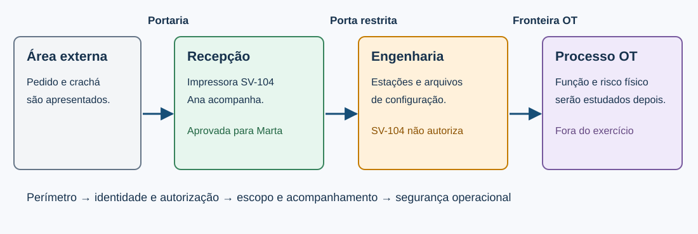
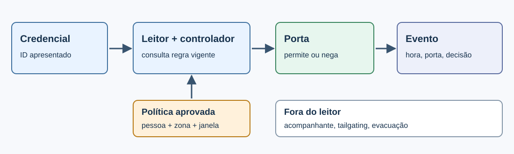

# A10 — Uma visita confirmada pode entrar em qualquer área?

Às 09:15, alguém apresenta uma imagem de crachá da ServTec e diz que precisa entrar **agora** na sala de engenharia de uma indústria de envase. Cita o chamado SV-999 e afirma que a produção será prejudicada se a portaria atrasar a entrada. **Qual controle decide esse pedido e que rastro permitiria revisar a decisão?**

Esta é uma situação didática nova depois da [A09](A09-decisao-de-riscos.md): os registros, nomes e horários são fictícios. A página fornece a matriz inicial e contém o laboratório. O navegador calcula decisões sobre dados simulados; não abre portas, consulta fornecedores ou comprova o funcionamento de uma instalação.

## Objetivos e percurso

Ao fim dos 100 minutos, você deverá conseguir:

1. **Explicar** como pretexto, impersonificação, pressão de urgência e entrada junto a outra pessoa tentam atravessar uma fronteira física.
2. **Distinguir** identificação, autenticação, autorização por pessoa/área/tempo e registro de acesso, escolhendo controles complementares.
3. **Testar duas regras** de visita com casos permitido, negado e limitado; explicar o resultado e uma falha que o modelo não observa.

**Recursos:** esta página no navegador e papel ou editor para três comparações. O professor conduz a execução e pausa para previsão e comparação. A página funciona sem rede depois de carregada. Use apenas dados do exercício; não teste portarias, pessoas ou credenciais reais.

**Produto presencial:** duas linhas da matriz R10-01/R10-02 e três comparações curtas: `caso → previsão → regra ativada → resultado → limite`. A atividade de governança/riscos encerrou-se na A09; esta aula não cria outra entrega no Classroom.

## 1. Primeiro teste: o que acontece sem uma política?

- Um crachá visível é uma **alegação**; a autorização precisa existir antes da chegada.
- A função legítima é receber manutenção aprovada, com área e horário limitados.
- Uma decisão de acesso tem de ser testada com pedido legítimo e pedidos divergentes.
- O resultado do navegador prova a regra do modelo, não a operação de uma porta real.

Leia novamente o pedido de Leo na abertura. Ele mostra uma imagem de crachá e cita SV-999. **Antes de conhecer a resposta**, anote: qual dado você conferiria e o que faria se não encontrasse o chamado? Na [prática desta mesma página](#laboratorio), você testará o que acontece quando essa verificação falta. O modelo inicial aceita o pedido apresentado; essa é a linha de base a corrigir, não uma política recomendada.

*Figura 1 — Esquema original desta aula. Uma etapa não autoriza automaticamente a seguinte.*

A sequência normal é: um solicitante abre o chamado; o responsável interno aprova pessoa, serviço, área e janela; a portaria confere a pessoa pelo procedimento local e confirma o pedido em cadastro próprio; um contato **já cadastrado** confirma o escopo; a equipe emite credencial temporária, acompanha a visita e registra entrada e saída. Se o serviço mudar, uma nova autorização é necessária. O número de telefone apresentado pelo visitante não é o canal independente.

**Checkpoint:** o teste B revelou uma falha de identidade, de autorização, de registro ou uma combinação? Indique qual evidência falta para cada parte.

## 2. Engenharia social: técnicas e decisões que elas pressionam

- **Pretexto** fornece uma história plausível; **impersonificação** empresta identidade ou marca.
- Urgência e autoridade aparente são **gatilhos** que tentam reduzir o tempo de verificação.
- *Tailgating* contorna a decisão de acesso ao seguir uma pessoa autorizada.
- A defesa verifica o pedido por fonte independente, limita o escopo e permite reporte sem culpabilização.

Engenharia social usa contexto e confiança para levar alguém a revelar informação, executar uma ação ou permitir acesso. Um pretexto pode conter dados verdadeiros, como o nome de uma fornecedora, e ainda pedir algo falso. A aparência, o tom e a precisão de um detalhe isolado não provam a intenção da pessoa. O que a equipe pode avaliar é a **compatibilidade entre pedido e autorização**.

| Técnica ou gatilho | Mecanismo no contexto da portaria | Sinal observável e resposta proporcional |
|---|---|---|
| **Pretexting** | “Preciso corrigir a rede antes que a linha pare”: uma história justifica acesso à engenharia. | Pedir chamado, área e responsável; consultar o cadastro sem completar as lacunas que a pessoa deixou. |
| **Impersonificação** | Pessoa exibe marca da ServTec, foto de crachá ou afirma ser técnica conhecida. | Identificação apresentada não equivale a visita aprovada; verificar pessoa e serviço no registro anterior à chegada. |
| **Autoridade e urgência** | “A gerência mandou liberar” ou “vocês serão responsáveis pelo atraso”. | Acelerar o contato com o responsável, sem pular autorização; registrar a exceção solicitada. |
| **Vishing/phishing** | Ligação ou mensagem chega antes da visita, aparentando vir do fornecedor e trazendo um número para retorno. | Não responder pelo número/link recebido; usar canal previamente cadastrado. |
| **Tailgating/piggybacking** | Alguém atravessa a porta logo atrás da visitante autorizada, possivelmente com a justificativa de estar com as mãos ocupadas. | Observar a passagem e orientar entrada individual; a regra de crachá não vê quem entrou junto. |

*Figura 2 — Esquema original desta aula. As duas primeiras linhas pressionam uma decisão; a terceira contorna a interface de decisão.*

Essas categorias não são mutuamente exclusivas: B combina pretexto, marca de fornecedor e urgência. O problema não é supor que a portaria “deveria perceber o golpe” pela aparência. O processo precisa oferecer fonte confiável, tempo e autoridade para interromper o pedido. [Veja os mecanismos de pretexting](../engenharia_social/pretexting.md), [impersonificação](../engenharia_social/impersonificacao.md) e [gatilhos](../engenharia_social/gatilhos.md) para exemplos fora da instalação; aqui o critério é a decisão de acesso.

**Aplicação curta:** redija uma pergunta aberta ao contato cadastrado que confirme pessoa, tarefa e área sem revelar o que Leo alegou. Depois identifique qual dado você não deve fornecer a quem ligou.

## 3. Segurança física: zonas, barreiras e rastros

- **Perímetro** delimita a instalação; **controle de acesso** decide pessoa, zona e tempo.
- **Vigilância** torna desvios observáveis; **proteção ambiental** preserva equipamentos e operação.
- Credencial temporária, porta, acompanhante e registro exercem funções diferentes.
- Uma regra escrita só vira controle aplicado quando a barreira e a rotina produzem evidência.

Segurança física protege pessoas, instalações, equipamentos e mídias. Ela inclui perímetro e recepção, portas/fechaduras/catracas, câmeras e sensores, além de energia, incêndio e climatização. Uma câmera pode registrar passagem, mas não conceder autorização. Uma fechadura pode impedir entrada sem indicar quem tentou. Um crachá pode identificar visualmente, mas sua posse não prova que a tarefa e a área foram aprovadas. Compare o [panorama de controles físicos](../seguranca_fisica/controles_fisicos.md) com a função de cada barreira abaixo.

*Figura 3 — Planta conceitual original desta aula. A fronteira OT será estudada depois; nenhuma visita desta aula tem acesso ao processo.*

| Zona ou barreira | O que deve permitir | O que deve negar ou detectar | Evidência necessária |
|---|---|---|---|
| Portaria → recepção | Marta, SV-104, impressora, 10:00–10:30, com Ana. | Pessoa sem chamado confirmado; visita fora da janela. | Chamado anterior, confirmação, identificação e entrada. |
| Recepção → engenharia | Serviço com aprovação **específica** para sala e finalidade. | SV-104 usado para “verificar a rede”; uso de crachá de recepção na sala. | Regra da zona, tentativa negada ou conferência manual e responsável. |
| Durante a visita → saída | Deslocamento acompanhado e devolução da credencial. | Desvio percebido, credencial ativa após saída, entrada junto de outra pessoa. | Responsável, horário de saída, baixa da credencial e ocorrência quando houver. |

*Figura 4 — Esquema original de um controle eletrônico possível, não da instalação real. O controlador aplica a regra; o leitor sozinho não decide.*

A implementação pode ser manual ou eletrônica. Em leitor eletrônico, a política compara identificador da credencial, zona e horário; o evento de **permissão ou negação** deve poder ser revisado. Em controle manual, uma pessoa confere os mesmos atributos e registra a decisão. Nenhum modelo dispensa saída de emergência nem autoriza bloquear evacuação. Se cadastro, relógio, leitor ou acompanhante falhar, suspenda a visita restrita e escale conforme o procedimento; mantenha a operação segura.

**Falhas físicas que mudam o desenho do controle:** uma credencial perdida ou copiada pode apresentar o identificador esperado, então emissão, devolução, revogação e revisão de uso são necessárias; uma pessoa que passa junto de outra pode não gerar leitura própria, então câmera, acompanhante ou passagem individual tratam um caminho diferente; uma porta mantida aberta por conveniência neutraliza a regra do controlador, então o estado da porta e a resposta ao alarme precisam ser definidos. Uma câmera é sobretudo **detectiva**; fechadura e regra de zona são **preventivas**; o procedimento de suspender e reautorizar é **corretivo**. A escolha depende do dano possível, da circulação legítima, da acessibilidade e da saída segura.

A [NIST SP 800-53 Rev. 5](https://csrc.nist.gov/pubs/sp/800/53/r5/upd1/final) organiza, entre outros, **PE-2** (autorizações de acesso físico), **PE-3** (controle de acesso físico) e **PE-8** (registros de visitantes). Aqui usamos suas funções para analisar o exercício, sem alegar conformidade. Na trilha OT, a [NIST SP 800-82 Rev. 3](https://csrc.nist.gov/pubs/sp/800/82/r3/final) exige considerar disponibilidade, confiabilidade e segurança de pessoas antes de aplicar uma barreira a um processo real.

## 4. Autenticar, autorizar, registrar: três perguntas diferentes

- **Autenticar:** quem está diante da portaria? Documento, crachá e cadastro têm forças e limites diferentes.
- **Autorizar:** essa pessoa pode executar esta tarefa, nesta zona e janela, com este acompanhante?
- **Registrar/accounting:** qual pedido, decisão, responsável, hora e resultado ficaram observáveis?
- **Menor privilégio:** permitir a parte aprovada não expande o pedido nem presume confiança pela localização.

Uma identidade conferida não concede acesso amplo. A política de visita pode ser expressa como atributos: `pessoa + chamado + finalidade + zona + janela + responsável`. O crachá temporário representa uma autorização limitada; a portaria ou o leitor **aplica** a decisão; o registro permite revisá-la. O nome de uma fornecedora responde apenas a parte da pergunta de identidade. Consulte [autenticação](../fundamentos_de_seguranca_digital/G-autenticacao.md), [autorização](../fundamentos_de_seguranca_digital/H-autorizacao.md) e [accounting](../fundamentos_de_seguranca_digital/I-accounting.md) para mecanismos digitais equivalentes e suas diferenças.

**Exemplo trabalhado — A.** Às 10:05, Marta apresenta SV-104 para a impressora. O cadastro anterior à chegada traz Marta, ServTec, recepção, 10:00–10:30 e Ana. O contato conhecido confirma exatamente esse escopo. A regra pode **permitir a recepção**, com acompanhante e entrada/saída registrados pela portaria. Isso não prova que o serviço foi concluído nem concede a sala de engenharia. No laboratório abaixo, com as duas regras ativadas, A continua **PERMITIR: recepção**; a trilha prova somente a decisão do modelo.

A política também precisa funcionar no caso **C**: a identidade e a visita original são válidas, mas a sala de engenharia foi acrescentada. Negar toda a manutenção seria um custo desnecessário; permitir tudo violaria o escopo. O resultado correto é **LIMITAR: recepção** e pedir nova autorização para engenharia. Esse é um exemplo de autorização por atributos, não apenas por papel genérico “fornecedor”.

## 5. Matriz de riscos: que falhas os testes devem revelar?

- Risco registra evento, condição e consequência; “crachá” é um mecanismo, não um risco completo.
- R10-01 testa identidade/pedido; R10-02 testa ampliação de escopo.
- A classe é provisória e usa premissas fornecidas; teste de navegador não mede frequência real.
- Cada controle precisa de caso legítimo, caso negado, rastro e limite declarado.

**Premissas fornecidas:** horizonte didático de 30 dias; iniciação moderada; dano condicionado alto se a sala de engenharia for alcançada; impacto alto para arquivos/estações. Não há ocorrência real medida. Usando as combinações qualitativas **G-5/I-2** explicadas na [A09](A09-decisao-de-riscos.md#tema-3), a verossimilhança geral e o risco são **moderados provisórios**. Não reclassifique com base apenas em três pedidos artificiais.

| ID | Evento e consequência | Condição a controlar | Experimento do encontro | Limite |
|---|---|---|---|---|
| **R10-01 — pretexto de manutenção** | Pessoa obtém entrada na engenharia sem visita válida; estações/arquivos podem ser expostos. | A alegação parece plausível, mas chamado e confirmação não existem. | B antes/depois da verificação independente; A garante que a visita legítima continue. | Simulação não confirma tentativa ou dano real. |
| **R10-02 — ampliação de escopo** | Visitante válida usa autorização da recepção para alcançar engenharia. | Pessoa aprovada, zona adicional não aprovada. | C antes/depois da regra de zona; A protege a função legítima. | Regra não detecta *tailgating* ou tarefa executada. |

Janela vencida e acompanhante indisponível continuam importantes, mas são tratados como **condições operacionais na discussão**, fora do pequeno motor de teste. Se a organização observar outras consequências ou caminhos, a matriz deve ser revista. O [controle de segurança](../fundamentos_de_seguranca_digital/J-Controles_seguranca.md) pode prevenir, detectar ou apoiar correção; o rastro de um leitor sem revisão humana não resolve todos os caminhos.

## 6. Laboratório: construa e teste a política

- Teste B sem regras: o resultado permissivo torna a falha visível.
- Ative a confirmação e teste B de novo: a diferença mostra o papel do cadastro.
- Ative o limite de área e teste C; depois use A como contraprova da função legítima.
- A trilha mostra cálculos do navegador; entrada, acompanhamento e saída exigem registros próprios.

<section id="laboratorio" class="a10-lab" aria-labelledby="a10-lab-titulo">

<h3 id="a10-lab-titulo">Teste de política de visitas</h3>

Leia um pedido, mude uma regra e compare o resultado. Tudo acontece aqui; os dados são fictícios.

<label for="a10-caso">Caso</label>
<select id="a10-caso"><option value="A">A — visita regular</option><option value="B">B — chamado não confirmado</option><option value="C">C — área ampliada</option></select>

<strong>Cadastro anterior e contato conhecido</strong>

<label><input id="a10-confirmar" type="checkbox"> Exigir chamado confirmado</label>
<label><input id="a10-limitar" type="checkbox"> Liberar somente a área aprovada</label>

Antes de clicar, preveja: permitir, suspender ou limitar?

<button id="a10-testar" type="button">Testar pedido</button><button id="a10-reiniciar" type="button">Recomeçar</button>

Aguardando teste.

<strong>Trilha desta sessão</strong><ol id="a10-trilha" aria-live="polite"><li>Ainda não há teste.</li></ol>
</section>

<noscript>
<strong>Alternativa sem JavaScript:</strong> A: Marta, SV-104, impressora da recepção; cadastro e contato confirmam recepção, 10:00–10:30, com Ana. B: Leo, SV-999, pede engenharia; cadastro e contato não confirmam. C: Marta, SV-104, pede recepção e engenharia; cadastro confirma somente recepção. Compare cada pedido com o cadastro antes de decidir.
</noscript>

O pedido, o cadastro, as duas regras e a resposta aparecem no **mesmo bloco**. **Testar pedido** mostra decisão e motivo; a trilha guarda apenas os cálculos desta sessão. **Recomeçar** limpa escolhas e trilha. **SUSPENDER** significa não conceder entrada até confirmar o pedido; não significa acusar a pessoa de ataque.

1. **B, sem regra:** deixe as duas caixas vazias, selecione B, preveja e teste. Registre que a engenharia foi permitida pelo modelo permissivo.
2. **B, com confirmação:** marque somente **Exigir chamado confirmado** e teste B outra vez. Compare as duas linhas da trilha: qual dado mudou a decisão?
3. **C, com limite de área:** mantenha a confirmação, marque **Liberar somente a área aprovada** e teste C. Que parte da visita prossegue?
4. **A, contraprova:** sem mudar as regras, teste A. A manutenção legítima continua possível? Registre um limite que o navegador não observa.

| Comparação | Resultado esperado | Ideia demonstrada |
|---|---|---|
| B antes/depois da confirmação | **PERMITIR → SUSPENDER** | Um nome e um crachá não substituem visita confirmada. |
| C com as duas regras | **LIMITAR** à recepção | Pessoa aprovada não ganha a engenharia por extensão. |
| A com as duas regras | **PERMITIR** recepção | Controle deve preservar a tarefa legítima. |

**Alternativa sem JavaScript:** os dados dos três casos aparecem no bloco alternativo acima. Primeiro aceite o pedido como apresentado; depois aplique `chamado confirmado? → área solicitada está aprovada?`. Anote a decisão em cada etapa. A mesma comparação pode ser feita em papel.

**Diagnóstico:** se B continuar permitido, confira a primeira regra; se C for permitido integralmente, confira a segunda. Se A for suspenso, releia cadastro e pedido. O laboratório não testa horário, acompanhante, passagem física ou frequência de tentativas; esses pontos são discutidos fora da interface.

## 7. O que a política ainda não vê? Implementação técnica e humana

A política cobre pedidos apresentados. Considere outra cena: Marta entra com credencial válida e alguém passa colado atrás dela sem apresentar nada. Não existe solicitação para o motor avaliar. **Tailgating** exige desenho da passagem, vigilância, regra de entrada individual, acompanhante atento e uma forma de reportar sem confronto arriscado. Câmera fornece observação e possível evidência posterior; não deve ser confundida com autorização. [Explore o papel de câmeras e controle de acesso](../seguranca_fisica/camaras_acesso.md) e [limites de credenciais](../seguranca_fisica/clonagem_cracha.md).

A implantação da política pede decisões técnicas e humanas diferentes:

| Camada | Quem prepara ou opera | Critério de aceitação e rastro | Falha a revisar |
|---|---|---|---|
| Cadastro e aprovação | Responsável interno e fornecedor mantêm pessoa, tarefa, zona, horário e contato de retorno. | Pedido existe antes da chegada; A confirma, B não. | Cadastro desatualizado gera falso bloqueio; há escalonamento. |
| Credencial e zona | Portaria e administração de acesso limitam cartão/identificação ao prazo e área aprovados. | A passa na recepção; C não recebe engenharia; acesso expira na saída. | Leitor, relógio ou porta em falha exigem procedimento seguro. |
| Acompanhamento e vigilância | Ana recebe, acompanha, observa desvios e confirma saída. | Responsável e horários de entrada/saída registrados pela portaria. | Trilha do navegador não prova pessoa sozinha ou tarefa concluída. |
| Aprendizagem e resposta | Gestão treina frases de verificação e valoriza reporte de divergência. | Equipe sabe verificar, escalar e registrar sem culpar quem perguntou. | Treinamento concluído não prova comportamento futuro. |

**Defesa em profundidade** combina barreiras com funções distintas. Se a confirmação falhar, a zona e o acompanhamento ainda podem limitar o dano; se a porta permitir algo indevido, registro e vigilância podem tornar o evento observável. **Zero trust** aqui ajuda a rejeitar confiança implícita por estar no prédio ou usar a marca de um fornecedor; não é uma instrução de reautenticar indiscriminadamente em um processo industrial. A [NIST SP 800-207](https://csrc.nist.gov/pubs/sp/800/207/final) aprofunda esse princípio; sua aplicação a OT exige os requisitos da A19–A22.

## Atividade {#atividade}

**Checkpoint presencial, sem nova entrega no Classroom.** Complete R10-01 e R10-02 com `caminho de dano → controle → caso de teste → antes/depois → rastro → limite → responsável`. Acrescente uma linha para o caso de *tailgating*: indique por que o painel não o testa e qual evidência humana/física seria necessária. Em dupla, uma pessoa defende a preservação da visita A/C; a outra questiona o efeito de cadastro desatualizado, falha do leitor ou ausência de Ana. Registrem uma melhoria de procedimento e uma condição para revisão do risco.

**Critério de conclusão:** A é permitida apenas na recepção; B muda de permitido para suspenso após a verificação, sem atribuição de intenção; C mantém somente o escopo original; a trilha do navegador é distinguida de entrada física; janela, acompanhante e *tailgating* têm procedimento e responsável plausíveis fora do motor. A [atividade A08–A09](A09-decisao-de-riscos.md#atividade) permanece encerrada.

### Revisão rápida

1. Qual diferença entre pretexto, impersonificação e gatilho de urgência no pedido B?
2. Por que uma credencial autêntica ainda pode ser negada na engenharia?
3. Que evento o log do painel comprova e que evento ele não pode comprovar?

### Continuidade e aprofundamento

A matriz industrial começa com acesso humano/físico. A A11 perguntará **quais dados estão na recepção e na engenharia, quem pode usá-los e como impedir uma saída indevida**, abrindo nova linha de risco com evidência própria.

Para ampliar a leitura: [engenharia social](../engenharia_social/introducao.md), [pretexting](../engenharia_social/pretexting.md), [impersonificação](../engenharia_social/impersonificacao.md), [gatilhos](../engenharia_social/gatilhos.md), [segurança física](../seguranca_fisica/introducao.md), [controles físicos](../seguranca_fisica/controles_fisicos.md) e [AAA](../fundamentos_de_seguranca_digital/H-autorizacao.md). As Figuras 1–4 são **originais deste material**, elaboradas para este caso; os conceitos usados têm as fontes abaixo.

**Fontes oficiais:** [NIST SP 800-30 Rev. 1](https://csrc.nist.gov/pubs/sp/800/30/r1/final) (premissas e avaliação de risco); [NIST SP 800-53 Rev. 5](https://csrc.nist.gov/pubs/sp/800/53/r5/upd1/final) (PE-2, PE-3, PE-8); [NIST SP 800-82 Rev. 3](https://csrc.nist.gov/pubs/sp/800/82/r3/final) (restrições OT); [NIST SP 800-207](https://csrc.nist.gov/pubs/sp/800/207/final) (confiança implícita); [CERT.br, Cartilha de Segurança para Internet](https://cartilha.cert.br/) (golpes e verificação).
