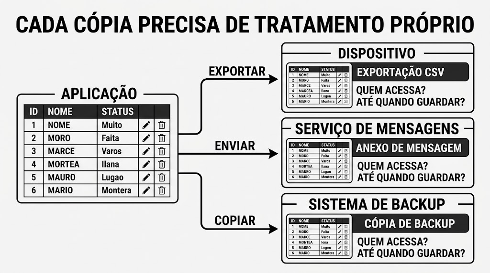
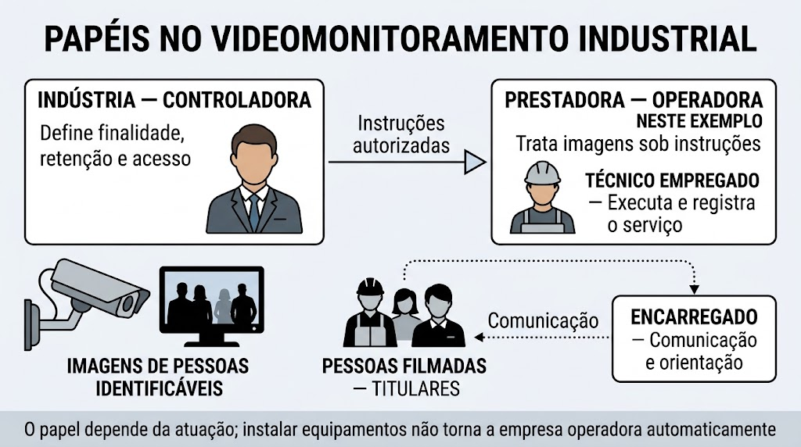
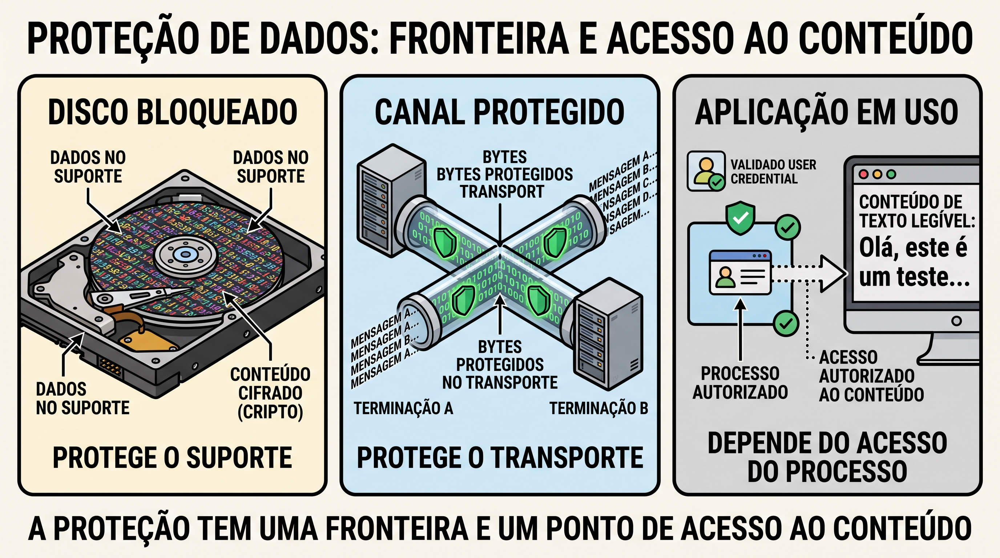
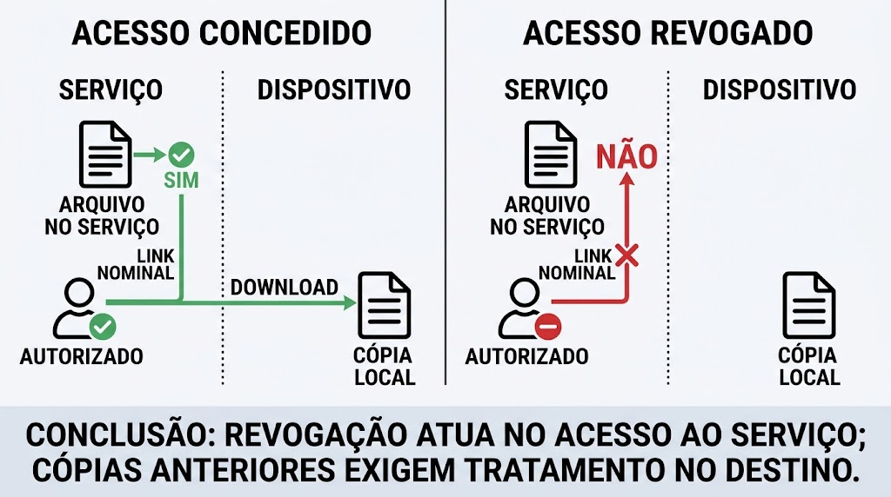
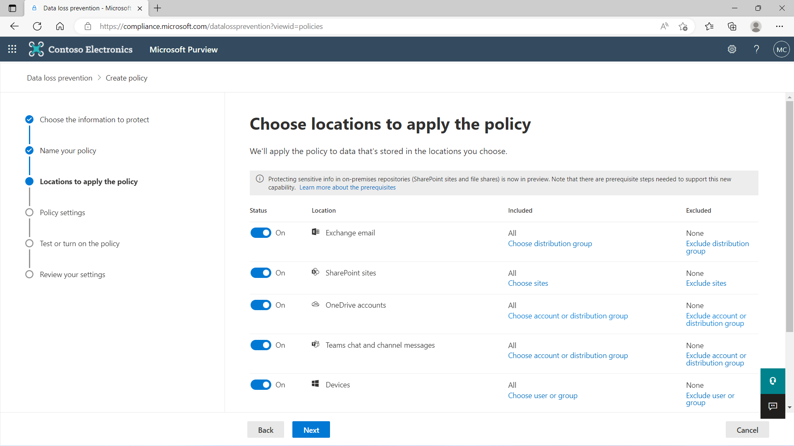
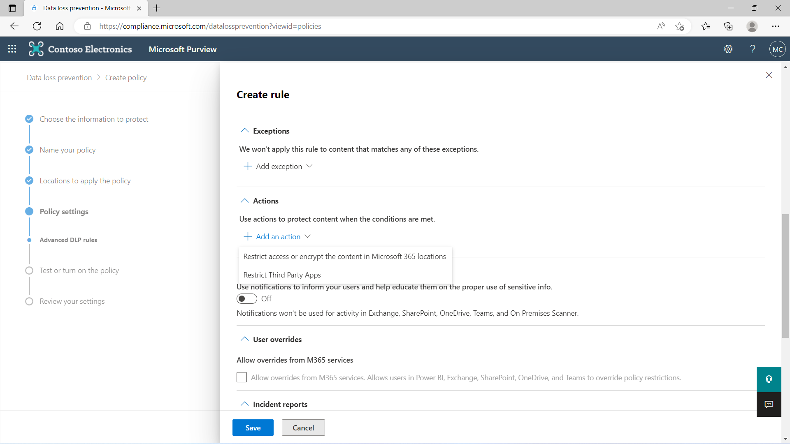
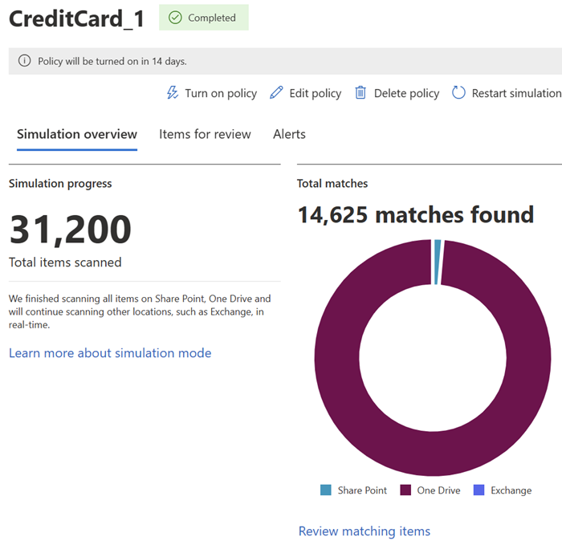
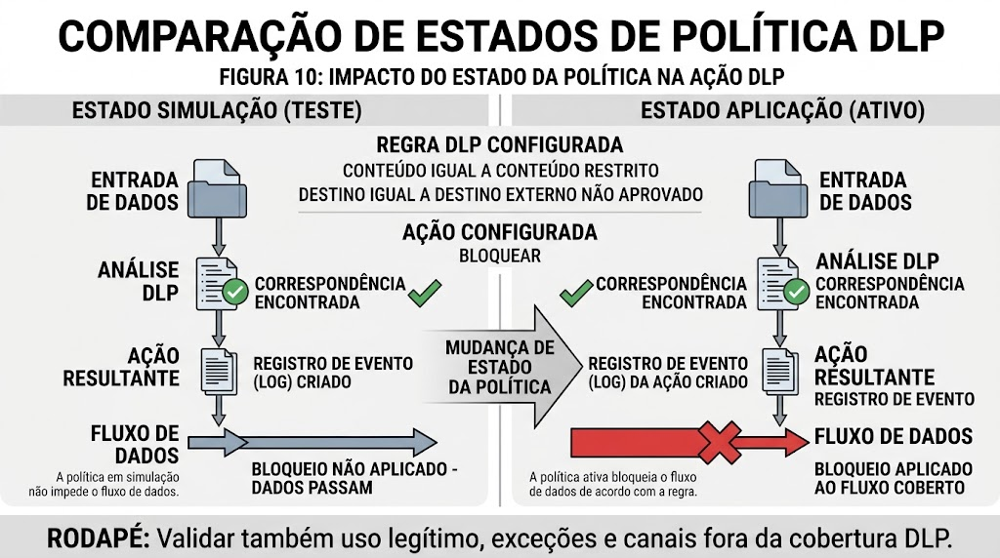
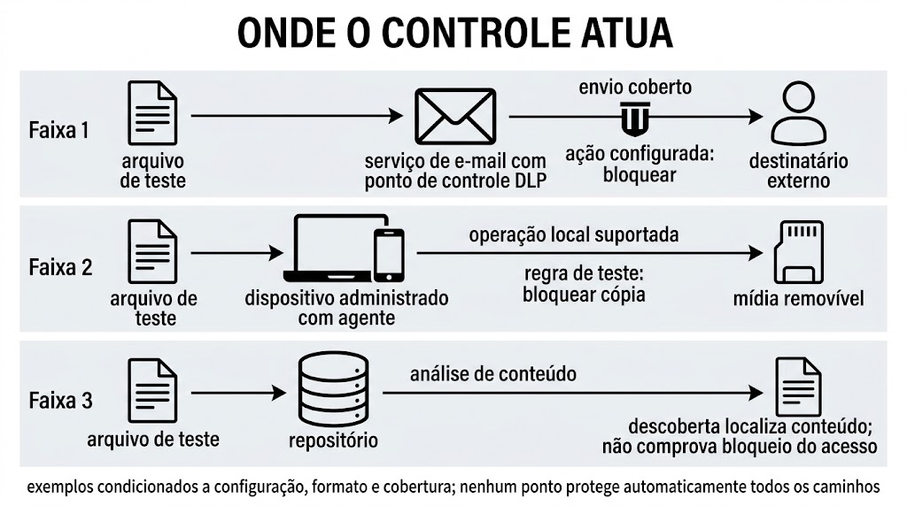
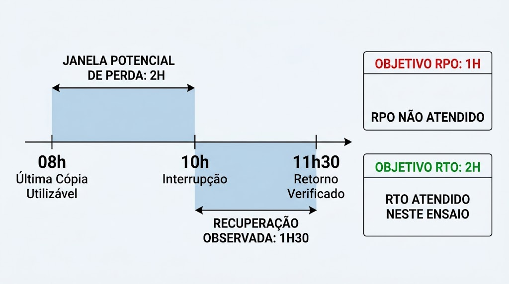

# A11 — Proteger dados: acesso, circulação e recuperação

Uma tabela protegida por login pode ser exportada para um arquivo sem as mesmas restrições. Um disco cifrado pode entregar dados legíveis a um programa executado pelo usuário. Uma cópia sincronizada pode reproduzir a exclusão que deveria ajudar a reparar. **A proteção precisa acompanhar o dado e suas cópias, com um objetivo verificável para cada controle.**

**Recursos:** esta página e seus arquivos de teste; navegador; editor de texto apenas no ensaio opcional de restauração. A demonstração de compartilhamento usa contas de teste autorizadas no Google Drive; DLP exige ambiente próprio com licença e permissões. As alternativas documentais estão em cada exemplo. Todos os dados dos exemplos são artificiais; não use arquivos pessoais, institucionais ou de produção. As comparações podem ser feitas diretamente nas tabelas, sem instalação.

**Objetivos de aprendizagem**

1. Mapear dados e cópias, relacionando finalidade, classificação, responsabilidade e retenção aos fundamentos da LGPD quando houver dados pessoais.
2. Justificar a redução de conteúdo e especificar permissões e compartilhamento, explicando como verificar os controles e seus limites.
3. Traduzir uma regra de prevenção de perda em configuração e contraprovas e elaborar um procedimento verificável de retenção e recuperação.

A11 e [A12](A12-protecao-de-endpoints.md) compõem um bloco. Há [uma única atividade integrada](#atividade), concluída após A12. As perguntas desta página são oportunidades de conferir a compreensão; não constituem entregas separadas.

## Responsabilidades: quem decide e quem executa a proteção? {#responsabilidades}

<div class="theme-summary" markdown="1">

- O usuário utiliza os recursos aprovados, confere sua tarefa e comunica problemas.
- O gestor responsável pela informação decide a necessidade de uso e os destinatários, dentro de sua autoridade.
- TI implementa e opera os recursos; segurança define requisitos técnicos e acompanha riscos e falhas.
- Privacidade e encarregado apoiam as obrigações sobre dados pessoais e o atendimento aos titulares.
- Ter permissão técnica para clicar não significa ter autorização para decidir qualquer uso.

</div>

**A proteção é uma responsabilidade distribuída.** Um usuário comum não precisa implantar DLP, administrar backups corporativos ou escolher sozinho a base legal de uma coleta. Ele precisa saber como executar sua tarefa dentro das regras: qual pasta usar, quais dados fornecer, quem pode receber e a quem recorrer quando não há orientação.

A organização precisa fornecer essas regras, recursos e canais. Segurança não consegue decidir sozinha quais dados cada atividade necessita; o gestor do processo conhece essa finalidade. Da mesma forma, uma decisão de negócio não dispensa avaliação de proteção e privacidade.

### Uma divisão de trabalho aplicável aos exemplos

A tabela apresenta **funções**, não cargos obrigatórios nem uma estrutura única de empresa. Uma pessoa ou equipe pode acumular funções, e a organização deve definir delegações e aprovações.

| Função | O que decide ou executa | Quando o usuário a procura |
|---|---|---|
| Usuário que trabalha com os dados | Segue o procedimento, confere conteúdo e destinatário, usa canais aprovados e relata desvios | Inicia a solicitação quando precisa de acesso, exportação ou compartilhamento fora do padrão |
| Gestor da informação ou do processo | Define a necessidade, aprova público e uso dentro de sua autoridade; valida se o resultado serve ao trabalho | Dúvida sobre finalidade, campos necessários, destinatário ou continuidade da necessidade |
| TI ou custodiante técnico | Configura pastas, grupos, contas, recuperação e automações conforme decisões aprovadas | Falta de acesso, erro de configuração, restauração ou operação que requer administração |
| Segurança da informação | Define e avalia requisitos técnicos, ajusta controles como DLP, monitora e coordena a resposta técnica | Alerta, suspeita de exposição, bloqueio inexplicado ou solicitação de exceção técnica |
| Privacidade, com participação do encarregado e apoio jurídico quando necessário | Orienta fundamento, transparência, direitos e encaminhamento das obrigações legais | Nova finalidade com dados pessoais, pedido de titular ou dúvida sobre conservação e compartilhamento |

O gestor da informação é o **proprietário organizacional** citado adiante. O custodiante cuida da operação técnica. Já controlador e operador são categorias legais da LGPD: não correspondem automaticamente a essas funções internas.

### O que cabe ao usuário no trabalho diário?

- **Confirmar a necessidade:** finalidade, informação solicitada e destinatário autorizado.
- **Usar os recursos aprovados:** pasta corporativa, canal de entrega e permissões delegadas.
- **Conferir e comunicar:** revisar o conteúdo; encaminhar dúvidas, bloqueios e suspeitas pelo canal interno.
- **Encerrar conforme a regra:** retirar cópias temporárias quando autorizado, sem apagar registros de conservação obrigatória.

**Permissão técnica não substitui autoridade.** Compartilhar pode estar delegado ao usuário; ampliar o público de uma base restrita pode exigir decisão do gestor. TI configura o que depende de administração, com participação de segurança e privacidade conforme o caso. Rotinas aprovadas podem ser automatizadas, sem nova aprovação para cada arquivo.

## Localização e classificação: reconhecer o que será protegido {#classificacao}

<div class="theme-summary" markdown="1">

- **Tipo** descreve a natureza ou estrutura do dado; **classificação** orienta seu tratamento.
- A mesma informação pode existir no banco, no CSV, no anexo, no log e no backup.
- O impacto de exposição, alteração e indisponibilidade pode ser diferente para cada objeto.
- O inventário precisa registrar uso, acesso, responsabilidade e retenção de cada cópia relevante.

</div>

### Exemplo trabalhado: a exportação cria outra fronteira

**Exemplo artificial:** uma base contém registro, setor, contato e situação. Para contar atendimentos por setor e situação, **não é necessário distribuir contatos**. O exemplo abaixo compara o que cada forma de entrega revela.

O login da aplicação restringe acesso à origem. Depois do download, o CSV depende das permissões da pasta, do dispositivo e de cada compartilhamento. O inventário deve incluir essa cópia e seu encerramento, não apenas o banco de origem.

<figure class="didactic-figure didactic-figure-wide" id="figura-1" markdown="1">

[](../assets/a11-a12/A11-figura-1-copias-dos-dados.jpeg){ aria-label="Abrir a Figura 1 em tamanho original" }

<figcaption><strong>Figura 1 — Cada cópia precisa de tratamento próprio.</strong> Exportar, enviar e copiar criam objetos sujeitos aos controles de seus destinos. As miniaturas de tabelas são ilustrativas; os campos usados na análise são os descritos no texto. Imagem fornecida pelo docente. Selecione a figura para ampliar.</figcaption>
</figure>

### Conteúdo, formato e impacto

Dados **estruturados** seguem campos definidos, como linhas e colunas de uma tabela. Dados **semiestruturados**, como um documento JSON, possuem organização identificável, mas não exigem a mesma estrutura tabular. Dados **não estruturados**, como texto livre, imagem e áudio, também podem conter informações de alto valor. O formato não determina sozinho a sensibilidade: um pequeno arquivo de configuração pode expor um segredo ou uma definição essencial ao funcionamento.

Conteúdo é a informação principal; **metadados** descrevem aspectos como autoria, horário, localização, formato ou histórico. Remover uma informação visível não garante remover comentários, versões ou metadados. Em uma revisão profissional, é preciso saber o que o destinatário efetivamente recebe.

Classificar significa relacionar o dado ao tratamento necessário. Níveis como público, interno e restrito são escolhas de uma política, não uma escala universal. Um manual público pode exigir pouca restrição de leitura e forte proteção contra alteração. Uma configuração operacional pode exigir recuperação rápida mesmo quando seu conteúdo não é secreto. Por isso, examine separadamente **confidencialidade, integridade e disponibilidade**.

| Objeto de exemplo | Uso necessário | Dano a considerar | Decisão de proteção |
|---|---|---|---|
| Manual aprovado para publicação | Qualquer pessoa pode ler | Uma alteração indevida pode orientar uso incorreto | Publicar versão aprovada e limitar edição |
| Tabela de contatos de teste | Consultar somente os campos necessários | Reprodução indevida de dados caso a tabela fosse real | Reduzir campos, delimitar leitores e controlar cópias |
| Configuração de um programa | Permitir operação e manutenção autorizada | Alteração pode impedir funcionamento | Controlar escrita, registrar versão e verificar restauração |

Proprietário organizacional e custodiante são as funções de decisão e operação apresentadas em [responsabilidades](#responsabilidades); não devem ser confundidas com o titular dos dados pessoais. Registre finalidade, necessidade e regra de conservação aplicável, com responsável pela revisão.

### Exemplo: compartilhar apenas o necessário {#tratamento-copias}

<span id="exportacao-minima"></span>
<span id="ocultacao-exportacao"></span>

**Pedido:** informar quantos atendimentos existem por setor e situação. Compare três entregas possíveis:

| Entrega | O que permanece disponível | Atende ao pedido com menos exposição? |
|---|---|---|
| Base completa | Registros individuais e contatos | Não: distribui informação desnecessária |
| Mesma planilha com contato oculto | Os contatos continuam no arquivo | Não: mudou a aparência, não o conteúdo |
| Contagem agregada | Setor, situação e quantidade | Sim, neste exemplo: preserva a contagem sem distribuir contatos |

**Decisão:** entregar a contagem e conferir se os totais correspondem à base. **Ocultar não é remover; minimizar não é anonimizar.** Mesmo um agregado exige revisão de acesso e de possíveis associações, especialmente em grupos pequenos.

A Figura 1 mostra o outro cuidado: a cópia depende dos controles do destino. Um registro suficiente pode indicar **“contagem → pasta aprovada → leitores definidos → responsável pela análise → revisão ao encerrar a necessidade”**. Registram-se padrões e exceções, sem exigir um cadastro manual de cada arquivo.

**Consulta opcional:** [base de teste](../assets/a11-a12/A11-base-teste.csv), [contagem pronta](../assets/a11-a12/A11-contagem.csv) e [modelo de registro](../assets/a11-a12/A11-registro-controles.txt). Os arquivos já estão preparados; não é necessário editar CSV para acompanhar a comparação. Preencha configuração, testes e recuperação no modelo após estudar os respectivos controles; resultado observado só existe após teste.

## Redução de exposição: transformar sem criar falsa garantia {#transformacoes}

A contagem não precisa de contato; acompanhar a evolução de um registro pode exigir um identificador. A escolha começa pela informação necessária à tarefa.

<div class="theme-summary" markdown="1">

- **Minimização** reduz o que é coletado, usado ou distribuído para uma finalidade.
- **Mascaramento** pode ocultar valores na consulta ou substituí-los em uma cópia; verifique onde o original permanece.
- **Pseudonimização** substitui identificadores, mas pode preservar meios de associação.
- Anonimização exige avaliar possibilidade de associação no contexto; cifragem depende de chave e acesso.

</div>

**A técnica depende da tarefa.** Uma visualização parcial pode bastar para conferir parte de um contato. Acompanhar registros ao longo do tempo pode exigir um identificador estável. Compare o que cada transformação preserva e qual exposição permanece.

| Técnica | Exemplo de transformação | O que revisar |
|---|---|---|
| Minimização | Excluir contato da exportação quando ele não participa da tarefa | A cópia mínima atende à finalidade? O original segue controlado? |
| Mascaramento na visualização | Exibir `***@example.invalid` no lugar do contato completo | O valor integral ainda chega ao navegador ou está no arquivo? |
| Pseudonimização | Substituir identificação direta por `P07` | Quem acessa a correspondência? Outros atributos permitem associar? |
| Cifragem | Representar conteúdo de modo recuperável mediante chave adequada | Quem usa a chave e em que ponto o texto se torna legível? |

No **mascaramento dinâmico**, uma consulta pode mostrar valores parciais sem alterar a base; no **mascaramento estático**, os valores são substituídos em uma cópia. Portanto, o texto que aparece na tela e o conteúdo salvo na exportação precisam ser conferidos separadamente. A [documentação de mascaramento dinâmico da Microsoft](https://learn.microsoft.com/en-us/sql/relational-databases/security/dynamic-data-masking?view=sql-server-ver17) exemplifica essa distinção entre base e resultado. Em ambos os casos, mascarar não comprova anonimização.

**Pseudônimo com separação de acesso:** se `P07` substitui uma identificação e existe uma tabela de correspondência, conserve essa tabela separada e com acesso mais restrito que o conjunto de análise. Entregá-la junto dos dados elimina essa separação. Outros atributos ainda podem permitir associação. [NIST — pseudonimização](https://csrc.nist.gov/glossary/term/pseudonymization).

Uma tabela sem nomes ainda pode combinar atributos que distingam uma pessoa. Por isso, **remover identificadores diretos não demonstra anonimização**. A pseudonimização pode reduzir exposição e ainda permitir ligação entre registros. A avaliação depende do conjunto liberado e das informações adicionais disponíveis, conforme discute a [NIST IR 8053](https://csrc.nist.gov/pubs/ir/8053/final). Aqui o foco é técnico; a classificação jurídica de um conjunto exige análise própria.

**Extensão do exemplo:** agora é necessário acompanhar a evolução de cada atendimento. A contagem agregada ainda basta? Indique qual informação adicional seria necessária e qual cuidado de proteção ela exige.

**Confira:** trocar nomes por números elimina toda possibilidade de associação? Identifique que informação adicional mudaria sua resposta. A [comparação de métodos](../protecao_dados/metodos_protecao.md) amplia o repertório; os mecanismos criptográficos serão desenvolvidos no próximo bloco.

## LGPD: ligar finalidade, direitos e controles {#lgpd}

<div class="theme-summary" markdown="1">

- A **Lei Geral de Proteção de Dados Pessoais — LGPD** trata de operações com dados pessoais, inclusive fora de sistemas digitais.
- Dado pessoal, dado pessoal sensível e classificação “restrito” são conceitos diferentes.
- Finalidade e base legal orientam o tratamento; consentimento é uma das hipóteses.
- Permissões, minimização e recuperação apoiam a proteção, mas não tornam qualquer uso legítimo.
- Direitos dos titulares dependem de localizar dados, responsáveis e compartilhamentos.

</div>

### Identificar o dado e a operação

Um dado é pessoal quando se relaciona a uma pessoa natural identificada ou identificável. Nome e contato individual são exemplos; um identificador indireto também pode permitir associação. Exportar, consultar, armazenar e eliminar integram o tratamento. A LGPD tem critérios de aplicação e exceções; não se resume a “dados na internet”. [LGPD, arts. 1º, 3º–5º](https://www.planalto.gov.br/ccivil_03/_ato2015-2018/2018/lei/l13709compilado.htm).

**Dados pessoais sensíveis** incluem informações sobre saúde, vida sexual, origem racial ou étnica, convicção religiosa, opinião política, filiação sindical ou a organização religiosa, filosófica ou política, além de dados genéticos ou biométricos vinculados a uma pessoa. “Restrito” é um rótulo organizacional: pode proteger um segredo técnico sem dados pessoais. CPF é dado pessoal, mas não integra por si só a lista legal de dados sensíveis. [LGPD, art. 5º](https://www.planalto.gov.br/ccivil_03/_ato2015-2018/2018/lei/l13709compilado.htm).

Os contatos desta aula são artificiais. Em uma base real, retirar o nome não bastaria se outros campos permitissem identificar alguém. Consulte a [orientação da ANPD sobre dados pessoais](https://www.gov.br/anpd/pt-br/assuntos/titular-de-dados).

### Responsáveis legais: controlador, operador e encarregado {#responsaveis-lgpd}

A divisão operacional da seção anterior explica quem trabalha com os controles. A LGPD identifica **quem ocupa cada posição no tratamento dos dados pessoais**. As duas classificações se relacionam, mas não são equivalentes.

#### Exemplo: quem é quem no videomonitoramento industrial? {#videomonitoramento-lgpd}

**Situação de exemplo:** a indústria define o objetivo das câmeras de acesso à fábrica, a retenção e quem pode consultar as gravações. Uma prestadora de automação realiza manutenção e acessa imagens nos limites das instruções recebidas. Empregados, visitantes e terceirizados identificáveis aparecem nas gravações: **essas imagens são dados pessoais**. [LGPD, art. 5º][lgpd].

<div class="didactic-scroll a11-reference-table" role="region" aria-label="Papéis LGPD no videomonitoramento industrial" tabindex="0" markdown="1">

| Papel | Como se caracteriza | Quem ocupa esse papel no exemplo |
|---|---|---|
| **Titular** | Pessoa natural identificada ou identificável a quem os dados se referem | Empregados, visitantes e terceirizados filmados; podem exercer os direitos aplicáveis |
| **Controlador** | Pessoa natural ou jurídica que decide sobre o tratamento | A indústria, que define finalidade, retenção e acesso; não o técnico apenas por configurar o gravador |
| **Operador** | Pessoa natural ou jurídica que trata dados em nome do controlador | A prestadora, que acessa gravações para o suporte sob instruções da indústria |
| <strong style="white-space: nowrap">Encarregado</strong> | Pessoa indicada para comunicação, orientação e assessoramento | O encarregado indicado pela indústria, que recebe demandas e orienta encaminhamentos |
| **ANPD** | Agência Nacional de Proteção de Dados, que regula e fiscaliza a aplicação da LGPD | Autoridade externa; não administra as câmeras nem substitui o atendimento da indústria |

</div>

**E o técnico terceirizado?** O empregado executa o serviço pela prestadora; não se torna operador individual apenas por usar o sistema. Deve usar a conta autorizada, limitar a consulta ao necessário e registrar intervenções. **Autorização para manutenção não autoriza levar vídeos ao celular pessoal.** O técnico também pode ser titular quando aparece nas imagens. A função real, e não apenas o nome do contrato ou cargo, define o enquadramento. [ANPD — agentes de tratamento][guia-agentes].

**Duas mudanças no serviço alteram a análise:**

- **Instalação puramente física:** montar equipamentos e cabos, sem tratar imagens nem outros dados pessoais nesse serviço, não torna a instaladora operadora automaticamente. Não assistir ao vídeo é diferente de não tratar dados: armazenamento, transmissão e logs identificáveis também precisam ser considerados.
- **Uso para finalidade própria:** se a prestadora decide usar imagens para divulgar seu trabalho, é necessário avaliar sua posição de controladora nesse outro uso e sua licitude. A autorização para suporte não autoriza publicidade.

São aplicações didáticas das definições legais, não um enquadramento automático de toda prestadora de automação. O exemplo não estabelece base legal nem prazo de retenção para qualquer sistema de vigilância. [LGPD, arts. 5º, 6º e 39][lgpd].

<figure class="didactic-figure didactic-figure-wide" id="figura-13" markdown="1">

[](../assets/a11-a12/A11-figura-13-papeis-videomonitoramento.jpeg){ aria-label="Abrir a Figura 13 em tamanho original" }

<figcaption><strong>Figura 13 — Quem decide e quem executa no videomonitoramento.</strong> Neste exemplo, a indústria determina o tratamento e a prestadora atua sob suas instruções. As linhas pontilhadas representam comunicação, não ordens ou transferência de responsabilidade. O encarregado também mantém a interlocução com a indústria e a ANPD, não desenhadas nessas linhas. Imagem fornecida pelo docente. Selecione a figura para ampliar.</figcaption>
</figure>

**O encarregado não é o responsável universal pelos erros da organização.** A regulamentação mantém a responsabilidade pela conformidade com o agente de tratamento; exercer a função de encarregado não o torna, por si só, responsável perante a ANPD pelo tratamento realizado pelo controlador. Cabe ao agente fornecer os meios para sua atuação. [ANPD — Resolução 18/2024, arts. 10, 11 e 17](https://www.gov.br/anpd/pt-br/acesso-a-informacao/institucional/atos-normativos/regulamentacoes_anpd/processo_integra_-resolucao_cd_anpd_no_18_2024.pdf).

Essa distinção também não dispensa o empregado de seguir procedimentos e comunicar falhas. A responsabilidade por uma conduta deve ser apurada conforme suas atribuições e os fatos, sem transferir automaticamente todo incidente ao usuário ou à equipe de segurança.

### Princípios e bases legais: decidir antes de liberar

**Finalidade, adequação e necessidade** perguntam por que usar, se o uso é compatível e quanto dado é suficiente. Transparência, segurança, prevenção e prestação de contas exigem clareza e medidas demonstráveis. São alguns dos princípios legais. [LGPD, art. 6º](https://www.planalto.gov.br/ccivil_03/_ato2015-2018/2018/lei/l13709compilado.htm).

**A base legal fundamenta o uso dos dados.** As hipóteses incluem consentimento, obrigação legal ou regulatória, execução contratual e legítimo interesse, entre outras hipóteses sujeitas a requisitos. **Não se escolhe uma base apenas por conveniência.** O legítimo interesse exige análise; dados sensíveis têm hipóteses próprias. Um formulário de consentimento não regulariza automaticamente toda coleta, e a ausência de consentimento não significa, por si só, tratamento proibido. [ANPD — perguntas frequentes sobre hipóteses legais](https://www.gov.br/anpd/pt-br/acesso-a-informacao/perguntas-frequentes).

Aplicação à exportação: se o objetivo é contar atendimentos, explique a necessidade de cada coluna. Se alguém pedir contatos para uma finalidade diferente, suspenda a ampliação até que o responsável avalie compatibilidade, fundamento e informação ao titular. Configurar “somente leitura” não resolve essa decisão.

### Direitos e retenção: o que a operação precisa permitir

Os direitos incluem confirmação e acesso, correção e, nas condições legais, anonimização, bloqueio ou eliminação, além de informações sobre compartilhamento e revogação do consentimento. Eliminação não é uma ordem universal de apagar todo registro: há hipóteses legais de conservação. [ANPD — direitos dos titulares](https://www.gov.br/anpd/pt-br/assuntos/titular-de-dados/direito-dos-titulares).

**Atendimento de um pedido do titular:**

1. **Receber e verificar:** o canal de privacidade registra a solicitação; a equipe designada verifica a identidade de forma proporcional.
2. **Localizar e decidir:** os responsáveis pelos sistemas localizam origem e cópias; o controlador decide o atendimento com apoio especializado.
3. **Executar e responder:** os executores autorizados aplicam as medidas e registram a resposta, sem expor a base inteira para responder sobre uma pessoa.

**Se o pedido chegar ao usuário comum, ele o encaminha ao canal definido.** Não decide sozinho pela exclusão da base. O registro de cópias ajuda a localizar onde propagar uma correção ou restrição.

Permissões e cópias verificáveis apoiam essas rotinas. O [guia de segurança da informação da ANPD](https://www.gov.br/anpd/pt-br/centrais-de-conteudo/materiais-educativos-e-publicacoes/guia-orientativo-sobre-seguranca-da-informacao-para-agentes-de-tratamento-de-pequeno-porte) oferece orientações e instrumentos de apoio. **Confira:** um arquivo cifrado, enviado à pessoa errada para uma finalidade injustificada, pode ser considerado adequadamente tratado apenas pela cifragem?

### Infrações e consequências: o que pode acontecer? {#infracoes-consequencias}

<div class="theme-summary" markdown="1">

- Pode haver infração à LGPD mesmo sem vazamento.
- Multa administrativa, reparação de danos e pena criminal pertencem a esferas diferentes.
- A ANPD aplica sanções após processo; o teto de multa não é um valor automático.
- A LGPD não cria um crime genérico de “vazamento de dados”.

</div>

Usar dados sem hipótese legal aplicável, desrespeitar direitos ou descumprir obrigações de proteção pode levar à apuração de uma infração. Já um **incidente** é um acontecimento que precisa ser investigado: sua ocorrência, sozinha, não determina qual obrigação foi violada, quem responde ou qual consequência cabe. O art. 52 prevê sanções pelo descumprimento das normas da lei, não apenas por vazamentos. [LGPD, art. 52](https://www.planalto.gov.br/ccivil_03/_ato2015-2018/2018/lei/l13709compilado.htm).

| Esfera | O que se apura | Consequência possível |
|---|---|---|
| <span style="white-space: nowrap">Administrativa</span> | Descumprimento de obrigações da LGPD pelo agente de tratamento | Sanções aplicadas pela ANPD |
| Civil | Dano decorrente de tratamento em violação à legislação e responsabilidade dos envolvidos | Reparação de danos materiais ou morais, individuais ou coletivos |
| Penal | Conduta que preenche os requisitos de crime previsto em lei penal | Pena aplicada pela Justiça; não é a multa administrativa da LGPD |

Na esfera civil, controlador e operador podem responder nos termos da lei. O operador responde solidariamente em hipóteses como descumprir obrigações legais ou instruções lícitas do controlador, ressalvadas as exclusões legais. **Solidariedade**, nesse contexto, permite cobrar a reparação dos responsáveis abrangidos por essa regra; não significa atribuir responsabilidade a todo empregado envolvido na operação. [LGPD, arts. 42–45](https://www.planalto.gov.br/ccivil_03/_ato2015-2018/2018/lei/l13709compilado.htm).

#### Sanções administrativas em resumo

A lei prevê advertência com prazo de correção; multas simples ou diárias; divulgação da infração confirmada; bloqueio ou eliminação dos dados envolvidos; e, nas condições legais, suspensão ou proibição de atividades de tratamento. A aplicação considera critérios como gravidade, danos, cooperação e medidas corretivas. [LGPD, art. 52 e § 1º](https://www.planalto.gov.br/ccivil_03/_ato2015-2018/2018/lei/l13709compilado.htm).

A **multa simples** pode chegar a **2% do faturamento no Brasil no último exercício**, descontados os tributos, da pessoa jurídica privada, grupo ou conglomerado, com limite de **R$ 50 milhões por infração**. Esse é o teto legal, não uma multa fixa. Órgãos e entidades públicos não recebem as multas da LGPD, mas estão sujeitos às demais sanções cabíveis e a outros regimes de responsabilização. [LGPD, art. 52, II, III e § 3º](https://www.planalto.gov.br/ccivil_03/_ato2015-2018/2018/lei/l13709compilado.htm).

#### Possíveis crimes previstos em outras leis

Duas condutas relacionadas à proteção de informações ajudam a distinguir a esfera penal:

| Crime e requisito resumido | Pena básica |
|---|---|
| **Invasão de dispositivo informático — art. 154-A:** invadir dispositivo de uso alheio para obter, alterar ou destruir dados sem autorização, ou instalar vulnerabilidade para vantagem ilícita | Reclusão de 1 a 4 anos e multa |
| **Violação de segredo profissional — art. 154:** revelar, sem justa causa, segredo conhecido em razão de função ou profissão, cuja revelação possa causar dano | Detenção de 3 meses a 1 ano ou multa |

São resumos; a aplicação exige demonstrar os elementos do crime. Há qualificadoras e aumentos de pena no art. 154-A. Um envio acidental ao destinatário errado não permite concluir, automaticamente, que houve um desses crimes. [Código Penal, arts. 154 e 154-A](https://www.planalto.gov.br/ccivil_03/decreto-lei/del2848compilado.htm).

**Consequência prática para o usuário:** ao perceber uma exposição, comunique o fato pelo canal interno e preserve as informações necessárias ao atendimento. A equipe responsável contém e investiga; os responsáveis legais avaliam as obrigações cabíveis. O usuário não precisa classificar o ocorrido como crime antes de pedir ajuda.

### Suspeita de incidente: quem avisa e quem comunica formalmente? {#comunicacao-incidente}

Uma exposição indevida, uma alteração não autorizada ou a indisponibilidade de dados pessoais pode exigir resposta a incidente. Um alerta ou uma vulnerabilidade, isoladamente, ainda não comprovam que houve incidente. **O usuário comunica a suspeita internamente sem esperar concluir a investigação.**

| Responsável | Ação |
|---|---|
| Usuário | Aciona o canal interno e informa o necessário para localizar o fato |
| Operador | Informa o controlador sem demora injustificada e fornece apoio e informações |
| Controlador | Avalia o incidente; se puder acarretar risco ou dano relevante, cumpre a comunicação à ANPD e aos titulares nos termos legais |
| Encarregado ou representante autorizado | Realiza o encaminhamento formal em nome do controlador, sem assumir sozinho sua responsabilidade |

O aviso interno e a comunicação formal são ações distintas. O primeiro inicia a resposta; a segunda atende às condições e aos prazos regulamentares. Consulte a [ANPD — comunicação de incidente](https://www.gov.br/anpd/pt-br/canais_atendimento/agente-de-tratamento/comunicado-de-incidente-de-seguranca-cis) e a [LGPD, art. 48](https://www.planalto.gov.br/ccivil_03/_ato2015-2018/2018/lei/l13709compilado.htm). A análise de comunicação não deve atrasar medidas de contenção autorizadas.

### Procedimentos LGPD: transformar a obrigação em rotina verificável {#procedimentos-lgpd}

Ao proteger uma cópia, você participa de uma rotina da organização. Algumas etapas são necessárias em todo tratamento sujeito à LGPD; outras entram somente quando existe um pedido, incidente ou operação específica. Os exemplos de evidência mostram como verificar a execução. Em telas estreitas, deslize a tabela horizontalmente; pelo teclado, use Tab para focalizá-la e as setas para percorrê-la. A organização pode usar outro formato que cumpra a mesma função.

- **Obrigação geral:** aplica-se ao tratamento abrangido pela lei, respeitado o papel de cada agente.
- **Obrigação condicional:** depende da situação indicada ou de determinação competente.
- **Boa prática:** modo recomendado de organizar o cumprimento; não é um documento universalmente imposto.

**Exemplo de conexão:** se você prepara um CSV para trabalho, confirme a finalidade autorizada, use o destino definido e confira os destinatários. Se o pedido exigir uma nova finalidade, encaminhe a decisão ao responsável. Se perceber exposição, comunique pelo canal interno: não precisa elaborar sozinho relatórios de impacto, escolher uma base legal ou protocolar comunicação na ANPD.

#### Preparar e manter o tratamento

As linhas têm condições próprias; esta organização não transforma todas elas em obrigações universais.

<div class="didactic-scroll a11-reference-table" role="region" aria-label="Preparar e manter o tratamento: procedimentos LGPD" tabindex="0" markdown="1">

| Procedimento e natureza | Quando entra | Quem responde e quem atua | Exemplo de execução ou evidência |
|---|---|---|---|
| **Definir finalidade, necessidade e hipótese legal — geral** | Antes da coleta ou de um novo uso | Controlador decide, apoiado pelas áreas competentes; usuário segue o uso autorizado | Justificar quais campos entram na exportação. [LGPD, arts. 6º, 7º e 11][lgpd] |
| **Registrar as operações — geral** | Ao organizar e manter as atividades de tratamento | Controlador e operador mantêm seus registros; áreas descrevem seus processos | Registro do processo, dados utilizados, finalidade e destinos; pequeno porte elegível pode usar forma simplificada. [LGPD, art. 37][lgpd]; [Resolução 2, art. 9º][r2] |
| **Informar os titulares — geral** | Na transparência sobre o tratamento | Controlador providencia informação acessível; atendimento explica e encaminha dúvidas | Informação clara sobre finalidade, duração, contato e compartilhamento. [ANPD — direitos][direitos] |
| **Adotar e verificar medidas de proteção — geral** | Desde a concepção e durante o tratamento | Agentes de tratamento respondem; TI/segurança e usuários executam suas partes | Restringir acesso e registrar teste permitido/negado. [LGPD, arts. 46–49][lgpd] |
| **Instruir o operador — condicional à contratação nessa função** | Quando outro agente trata dados em nome do controlador | Controlador fornece instruções e verifica observância; operador as cumpre | Instrução documentada sobre finalidade, acesso e destino das cópias. [LGPD, art. 39][lgpd] |
| **Indicar encarregado e manter canal — regra com dispensas** | Conforme papel e enquadramento do agente | Controlador formaliza a indicação quando exigida; encarregado orienta e atende | Ato de indicação e contato público. Operadores têm indicação facultativa; dispensas não eliminam atendimento. [Resolução 18, arts. 3º–6º e 9º][r18] |

</div>

#### Responder a pedidos, ocorrências e situações específicas

Localize a situação que ocorreu; nem todas essas rotinas serão acionadas em cada tratamento.

<div class="didactic-scroll a11-reference-table" role="region" aria-label="Responder a situações específicas: procedimentos LGPD" tabindex="0" markdown="1">

| Procedimento e natureza | Quando entra | Quem responde e quem atua | Exemplo de execução ou evidência |
|---|---|---|---|
| **Receber e atender pedidos — condicional ao requerimento** | Titular pede acesso, correção ou outro direito aplicável | Controlador responde; atendimento e responsáveis pelos sistemas executam | Protocolo, verificação proporcional de identidade, resposta e registro da providência. Não cobrar pelo exercício dos direitos. [ANPD — direitos][direitos] |
| **Encerrar o tratamento ou justificar conservação — condicional ao término** | Finalidade encerrada ou outra hipótese legal de término | Controlador define destino; executores autorizados aplicam | Registro de exclusão ou da hipótese que permite conservar. Não há prazo único para toda cópia. [LGPD, arts. 15–16][lgpd] |
| **Avaliar e registrar incidente — condicional à ocorrência** | Incidente de segurança envolvendo dados pessoais | Controlador mantém registro; equipe de resposta reúne fatos e medidas | Data, dados afetados, riscos, medidas e decisão fundamentada sobre comunicação, inclusive se não comunicar. [Resolução 15, art. 10][r15] |
| **Comunicar incidente — condicional ao risco ou dano relevante** | Ocorrência confirmada, dados abrangidos pela LGPD e risco ou dano relevante | Controlador comunica ANPD e titulares; operador informa o controlador sem demora injustificada | Protocolo oficial e comprovação da comunicação aos afetados. O usuário aciona o canal interno. [ANPD — comunicação de incidentes][cis] |
| **Elaborar Relatório de Impacto à Proteção de Dados Pessoais (RIPD) — condicional; recomendado em alto risco** | Determinação da ANPD; recomendado quando o tratamento puder gerar alto risco | Controlador elabora com apoio técnico e de privacidade | Relatório de impacto: tratamento, riscos aos titulares, salvaguardas e decisão. Não é envio obrigatório para toda operação. [ANPD — RIPD][ripd] |
| **Verificar mecanismo de transferência internacional — condicional** | Transferência abrangida pelas regras internacionais | Controlador verifica enquadramento e mecanismo; áreas jurídica/privacidade apoiam | Registrar mecanismo aplicável e compromissos do destinatário; não basta escolher uma nuvem. [Resolução 19/2024][r19] |

</div>

Consulte a página da [ANPD para agentes de tratamento](https://www.gov.br/anpd/pt-br/canais_atendimento/agente-de-tratamento) e as normas específicas vinculadas nos quadros.


**Registro de operações não é log de acesso:** o primeiro descreve atividades de tratamento, suas finalidades e dados; o segundo registra eventos técnicos e pode apoiar a verificação. Da mesma forma, o registro de um incidente é diferente do inventário dos tratamentos.

Os detalhes de prazo abaixo apoiam a consulta pelo responsável pelo procedimento; o usuário comum deve encaminhar pedidos e suspeitas prontamente ao canal interno.

**Prazos dependem do procedimento.** Para confirmação e acesso, o art. 19 prevê resposta simplificada imediata ou declaração completa em até 15 dias. Esse prazo não deve ser aplicado automaticamente a qualquer pedido. Há regras diferenciadas para pequeno porte elegível. [LGPD, art. 19][lgpd]; [Resolução 2, arts. 14–15][r2].

Na comunicação obrigatória de incidente, a regra é de **3 dias úteis**, contados do conhecimento pelo controlador de que o incidente afetou dados pessoais, ressalvada legislação específica. Há contagem em dobro para pequeno porte que faça jus ao regime. Não são 72 horas corridas. Os registros de incidentes têm regra própria de conservação: mínimo de cinco anos a partir da data do registro, ressalvadas obrigações adicionais e a disciplina aplicável às entidades públicas. [Resolução 15, arts. 6º, 9º e 10][r15].

**Encarregado e RIPD não são exigências idênticas para toda organização.** Pequeno porte precisa satisfazer as condições da Resolução 2 para usar suas flexibilizações; não basta a empresa se considerar pequena. Quem está dispensado de encarregado mantém canal para titulares. A ANPD pode determinar o cumprimento de obrigações flexibilizadas conforme o caso. [Resolução 2, arts. 3º, 11 e 16][r2]. O RIPD recomendado em alto risco ajuda a decidir antes de iniciar o tratamento; sua remessa à ANPD é exigida quando requisitada. [ANPD — RIPD][ripd].


## Estados e permissões: localizar a fronteira do controle {#estados}

<div class="theme-summary" markdown="1">

- **Repouso, trânsito e uso** indicam situações de processamento, não etapas exclusivas da vida do dado.
- Cifrar o suporte e proteger o canal não define quem pode usar o conteúdo após recebê-lo.
- O acesso efetivo depende das permissões aplicadas, inclusive grupos e herança.
- Uma restrição visual não equivale à remoção ou à proteção do valor subjacente.

</div>

### O que cada camada realmente faz

Um arquivo salvo está em repouso; seus bytes transmitidos estão em trânsito; seu conteúdo sendo manipulado por um processo está em uso. Essas situações podem coexistir. Abrir o arquivo não elimina a cópia em disco, e enviar uma cópia não remove a origem. Já o ciclo de vida descreve criação, uso, compartilhamento, retenção e descarte. Confundir estado e ciclo prejudica a escolha do controle.

| Camada | O que pode proteger | Limite que permanece |
|---|---|---|
| Cifragem de disco | Conteúdo do suporte sem a condição de desbloqueio | Após desbloqueio, processos autorizados podem obter dados legíveis |
| Canal cifrado, como TLS | Comunicação entre seus pontos de terminação | Não impede o destinatário autorizado de guardar o conteúdo |
| Permissão de leitura/escrita | Ações que uma identidade pode realizar no objeto | Leitura pode permitir cópia; o arquivo copiado passa a outro contexto |
| Restrição de interface | Ações oferecidas por aquela interface | Não prova que o conteúdo foi removido nem que não existe outra rota |

**Permissão configurada e acesso efetivo precisam ser distinguidos.** Permissões herdadas vêm de um contêiner, como a pasta; permissões atribuídas diretamente vêm do próprio objeto. O acesso efetivo combina as regras aplicáveis e os grupos da identidade segundo o sistema utilizado. Não deduza a decisão a partir de uma única linha da tela. Para verificar uma configuração, compare o resultado para a identidade autorizada e para uma identidade sem o acesso pretendido, em ambiente de teste.

**Menor privilégio** significa fornecer o alcance necessário à tarefa. **Somente leitura pode permitir cópia.** Essa permissão evita certas alterações, mas não impede toda reprodução do conteúdo. Também é preciso distinguir as permissões do usuário das capacidades do processo que executa em seu contexto. Essa relação será aprofundada na A12.

<figure class="didactic-figure didactic-figure-wide" id="figura-2" markdown="1">

[](../assets/a11-a12/A11-figura-2-fronteiras-da-protecao.jpeg){ aria-label="Abrir a Figura 2 em tamanho original" }

<figcaption><strong>Figura 2 — Proteção e ponto de acesso ao conteúdo.</strong> A cifragem do disco protege o suporte; o canal protege o transporte entre suas terminações; na aplicação, o texto legível depende do acesso do processo. Proteção do canal não equivale a autorização para usar o dado. Imagem fornecida pelo docente. Selecione a figura para ampliar.</figcaption>
</figure>

### Configurar acesso no Google Drive e testar outra identidade {#permissoes-drive}

<div class="theme-summary" markdown="1">

- Configure o destino **antes** de colocar nele o arquivo.
- Separe permissão de leitura, edição e administração de acesso.
- Teste usando identidades diferentes; o proprietário não serve como contraprova.
- Revogar o acesso ao serviço não apaga downloads feitos anteriormente.

</div>

**Quem atua:** o responsável pelo arquivo/pasta com autoridade delegada configura o acesso; o gestor aprova quem precisa receber. Na empresa, a propriedade exibida no Drive não substitui essa aprovação. Os testes com outras identidades são organizados pelo administrador em contas de laboratório.

**Preparação:** este roteiro documentado usa o Meu Drive, uma pasta nova de exercício, o CSV agregado artificial e três identidades de teste autorizadas: proprietário, leitor e usuário sem permissão. Não exige que cada estudante tenha essas contas. Se elas não estiverem disponíveis, use a matriz de testes abaixo; ela contém todas as premissas para análise. Os passos não autorizam alterar pastas institucionais existentes.

No navegador, abra o Google Drive com a conta proprietária e crie uma pasta chamada `A11-compartilhamento-teste` em um local sem compartilhamento prévio. Abra **Compartilhar** da pasta; confira as pessoas com acesso e escolha **Restrito** em acesso geral. Carregue o CSV agregado. No arquivo, use **Compartilhar**, informe a identidade de teste que será leitora, selecione **Leitor** e confirme. Copie o link. Esses são os controles documentados para acesso nominal no Meu Drive. [Google — compartilhar arquivos](https://support.google.com/drive/answer/2494822?hl=pt-BR).

“Acesso geral restrito” não substitui a inspeção de pessoas e grupos. No modelo de pastas do Drive, acessos herdados importam: não conte com reduzir no arquivo uma permissão mais ampla vinda da pasta. Neste exemplo, a pasta nova evita essa ambiguidade. Em uma estrutura existente, revise a pasta de origem ou use uma localização com acesso adequado, antes de transferir o arquivo. [Google — compartilhar pastas](https://support.google.com/drive/answer/7166529?hl=pt-BR).

Abra o link em perfis separados do navegador, conferindo a identidade ativa em cada um. Uma janela anônima sem login testa ausência de autenticação; não substitui o teste de uma identidade autenticada sem permissão.

| Teste e estado inicial | Ação | Resultado esperado | O que registrar |
|---|---|---|---|
| Leitor explicitamente autorizado | Abrir o link do CSV | Consegue consultar; não recebe edição por essa permissão | Identidade de teste, objeto e resultado |
| Usuário autenticado sem acesso direto, por grupo ou pasta | Abrir o mesmo link | Não obtém o conteúdo; recebe negação ou pedido de acesso | Identidade e ausência de conteúdo |
| Leitor após retirada da permissão, sem outro acesso | Fechar a visualização e abrir novamente o link | Não obtém novo acesso ao conteúdo no serviço | Horário da retirada e do reteste |
| Leitor com download feito enquanto autorizado | Abrir o arquivo local depois da retirada | O download continua existindo fora do serviço | Qual cópia foi aberta e onde |

Para retirar a permissão, o proprietário abre **Compartilhar**, localiza o leitor, escolhe **Remover acesso** e salva. Faça o reteste. Em **Configurações** do compartilhamento, examine as opções disponíveis para limitar download, cópia, impressão e alteração de permissões. Verifique as funções às quais se aplicam: esses mecanismos não impedem toda reprodução do conteúdo por outros meios. [Google — limitar ou alterar compartilhamento](https://support.google.com/drive/answer/2494893?hl=pt-BR).

Os resultados da tabela são **previsões do teste**, não capturas de execução. Registre “observado” apenas após realizar a ação. Se um usuário indevido conseguir abrir, pare a distribuição e confira identidade, grupo, pasta e acesso geral. Se o leitor legítimo não conseguir, confira endereço e conta ativa antes de ampliar permissões. Uma mudança pode exigir aguardar aplicação e reabrir a sessão; não declare sucesso enquanto o resultado for inconclusivo.

**Encerramento:** retire o acesso de teste, confirme a retirada e remova os arquivos artificiais que não precisar conservar. Registre separadamente os downloads locais. Não use a limpeza da pasta de teste como prova de eliminação de todas as cópias.

### Anexo, link ou ambiente de consulta: escolher pelo controle necessário

| Forma de entrega | Uso apropriado | Esforço e dependência | Evidência | Limite |
|---|---|---|---|---|
| Anexo com conteúdo mínimo aprovado | Destinatário precisa trabalhar com uma cópia independente | Simples; depende do tratamento no destino | Arquivo enviado e destinatário conferidos | Retirada de acesso na origem não recolhe o anexo |
| Link com acesso nominal | Consulta a uma versão administrada no serviço | Exige identidade e gestão de permissões | Teste com leitor e usuário sem acesso | Downloads ou reproduções anteriores permanecem |
| Ambiente de consulta sem exportação comum | Conteúdo exige maior controle operacional | Maior administração e eventual licença | Testes de funções permitidas e canais cobertos | Não elimina fotografia ou todo meio de reprodução |

Para a consulta temporária do agregado, o link nominal facilita administrar acesso. Se o trabalho exigir arquivo local, forneça uma cópia mínima e defina seu tratamento. A decisão deve considerar a função necessária, não apenas o botão mais conveniente.

<figure class="didactic-figure didactic-figure-wide" id="figura-9" markdown="1">

[](../assets/a11-a12/A11-figura-9-revogacao-e-copia-local.jpeg){ aria-label="Abrir a Figura 9 em tamanho original" }

<figcaption><strong>Figura 9 — Revogar acesso não recolhe cópias anteriores.</strong> A restrição atua no serviço; o download já realizado exige tratamento no destino. No painel direito, o rótulo “autorizado” identifica o leitor anteriormente autorizado, cujo acesso foi revogado. Imagem fornecida pelo docente. Selecione a figura para ampliar.</figcaption>
</figure>

## DLP: reconhecer o dado e controlar uma tentativa de envio {#dlp}

A permissão da pasta responde quem pode abrir o arquivo. Depois que alguém autorizado o abre ou baixa, surge outra pergunta: **esse conteúdo pode ser enviado para aquele destinatário?** O controle de acesso à origem, sozinho, não responde por esse novo envio.

**DLP — Data Loss Prevention**, ou prevenção de perda de dados, reúne mecanismos que reconhecem informações sujeitas a proteção e aplicam regras ao seu uso ou circulação. No envio de um arquivo, o controle relaciona conteúdo, destinatário e ação permitida.

<div class="theme-summary" markdown="1">

- Primeiro, reconhecer **qual informação está sendo enviada**.
- Depois, verificar **se o destinatário pode recebê-la**.
- Aplicar a ação definida: registrar, avisar ou bloquear.
- Conferir o resultado e os caminhos que esse controle não acompanha.

</div>

### Um arquivo de contatos enviado como anexo {#da-identificacao-a-decisao}

Retome a diferença entre a base completa e a contagem: a primeira contém contatos; a segunda precisa apenas de setor, situação e quantidade. Para este exemplo de DLP, considere um **arquivo de teste com contatos**, classificado como restrito e em formato que a ferramenta consiga examinar. Essa classificação é uma premissa didática, não uma leitura real de uma ferramenta nesta página.

A decisão que queremos implementar é: **impedir o envio desse arquivo a um destinatário externo sem aprovação**. Não basta proibir todo anexo, pois há arquivos públicos e destinatários autorizados. O controle precisa distinguir esses casos.

**Primeiro: reconhecer a informação.** Uma forma é usar um rótulo de sensibilidade aplicado ao arquivo, como “restrito”. O rótulo funciona como uma marca que o sistema consegue ler. Escrever “restrito” no nome não equivale a aplicar esse rótulo. Outra forma é examinar o conteúdo; veremos os mecanismos depois de completar a decisão.

**Depois: verificar o destino.** O fato de o arquivo ser restrito não significa que todo uso deva ser bloqueado. A equipe autorizada pode precisar recebê-lo. Por isso, o sistema consulta também quem está enviando, quem receberá e qual operação foi solicitada. Para o envio externo sem aprovação deste exemplo, a condição de bloqueio está satisfeita.

**Por fim: agir.** A política determina o que fazer quando a condição é satisfeita. Uma política é o conjunto de regras configuradas para essas decisões. Reconhecer o arquivo e satisfazer a condição ainda não informam se o sistema efetivamente impediu o envio: precisamos observar a ação.

### Registrar, avisar ou bloquear: qual efeito esperamos?

| Ação | O que muda na tentativa de envio | O que verificar |
|---|---|---|
| Registrar | Fica um registro para consulta; registrar sozinho não impede a operação | Evento com objeto, destino e motivo |
| Avisar | O usuário recebe uma orientação; a continuidade depende da regra configurada | Mensagem exibida e se o envio ainda pode prosseguir |
| Bloquear | A operação coberta é impedida pela ação do controle | Resultado da tentativa e registro correspondente |

**Exemplo de leitura:** se existe um alerta, mas o anexo chegou ao destinatário, esse alerta não comprova prevenção do envio. Ele pode demonstrar identificação ou servir para investigação. A distinção entre identificar e agir aparece nas [ações de DLP documentadas pela Microsoft](https://learn.microsoft.com/en-us/purview/dlp-learn-about-dlp).

### Onde o controle consegue acompanhar o dado?

Um controle que atua no serviço de e-mail pode examinar envios que passam por esse serviço. Isso não demonstra que ele também observa uma cópia para pendrive. Chamamos de **canal** o caminho usado pela operação e de **cobertura** o conjunto de caminhos e objetos que o mecanismo realmente acompanha.

| Local do controle | Exemplo do que ele pode acompanhar, quando configurado | O que precisa ser confirmado |
|---|---|---|
| Serviço, como e-mail ou armazenamento | Envio ou compartilhamento processado por aquele serviço | Contas, arquivos e operações incluídos |
| Endpoint, isto é, o dispositivo | Cópia ou uso de arquivo no dispositivo administrado | Dispositivo integrado e operação suportada |
| Rede | Transferência que atravessa o ponto de inspeção | Tráfego e conteúdo efetivamente visíveis |

A presença de DLP em um local não garante cobertura nos demais. Um arquivo cifrado que não possa ser aberto pelo mecanismo também pode limitar a inspeção do conteúdo. É necessário conferir o que a ferramenta faz nessa situação, em vez de tratar a falta de leitura como ausência de informação sensível.

**E quando há uma liberação excepcional?** Uma aprovação para um envio específico deve indicar arquivo, destinatário e período. Essa é uma **exceção** à regra geral, não uma liberação permanente da conta. A comparação a seguir inclui esse caso e também um envio fora da cobertura.

### Regra trabalhada e contraprovas

A regra abaixo é **um modelo didático**, não uma política implantada:

> No canal coberto, bloquear envio de conteúdo rotulado como **restrito** para destinatário **externo não aprovado**, salvo exceção válida para o conteúdo, destino e período. Registrar a ação e o motivo. Os demais envios deste exercício seguem as permissões já existentes.

“Permitido por esta regra” não significa “autorizado por toda a organização”. Outras regras, obrigações e permissões podem limitar a ação. Para o exercício, são fornecidos todos os atributos necessários:

| Teste | Conteúdo | Destino | Canal coberto? | Exceção | Resultado esperado por esta regra |
|---|---|---|---|---|---|
| D1 | Restrito | Externo não aprovado | Sim | Nenhuma | Bloquear e registrar |
| D2 | Restrito | Interno autorizado | Sim | Nenhuma | Não bloquear por esta regra |
| D3 | Público | Externo não aprovado | Sim | Nenhuma | Não bloquear por esta regra |
| D4 | Restrito | Externo não aprovado | Sim | Válida para este envio | Aplicar exceção e registrar |
| D5 | Restrito | Externo não aprovado | Não | Nenhuma | Este mecanismo não avalia o envio |

D1 mostra a decisão pretendida. D2 e D3 são **contraprovas**: verificam se a restrição não foi generalizada indevidamente. D4 testa o caminho de exceção. D5 delimita cobertura; não deve ser registrado como “envio seguro”.

Para reproduzir a análise, leia cada linha na ordem: cobertura → classificação → destino → exceção. Anote condição satisfeita e decisão. Pare se faltar um atributo; peça a informação em vez de inventá-la. Sem ferramenta, a tabela já contém tudo para aplicar a lógica. Para validar uma implantação real, seria necessário executar esses casos no ambiente autorizado, observar efeito e registro e comparar com a previsão.

<figure class="didactic-figure didactic-figure-wide" id="figura-3" markdown="1">

[](../assets/a11-a12/A11-figura-3-decisao-dlp.jpeg){ aria-label="Abrir a Figura 3 em tamanho original" }

<figcaption><strong>Figura 3 — Anatomia de uma decisão DLP.</strong> A política avalia os atributos observados; uma exceção aprovada é uma condição adicional quando aplicável, não uma etapa obrigatória. Registrar, avisar e bloquear são ações possíveis, não uma sequência fixa. Canal fora da cobertura não é avaliado por esse mecanismo. Imagem fornecida pelo docente. Selecione a figura para ampliar.</figcaption>
</figure>

### Como reconhecer o conteúdo quando não basta um rótulo? {#reconhecimento-dlp}

Até aqui, o exemplo recebeu o rótulo “restrito” como informação conhecida. Em uma implantação, alguém precisa atribuir e revisar essa classificação, ou a ferramenta precisa procurar sinais no conteúdo.

Considere um número encontrado em um documento: **só o formato numérico permite saber o que ele representa?** Uma sequência pode ser um identificador de pessoa ou um código de peça. É por isso que os mecanismos usam sinais adicionais.

| Mecanismo | Exemplo do que procura | Por que ajuda e o que não resolve |
|---|---|---|
| Rótulo | Marca de sensibilidade aplicada ao objeto | Reutiliza uma classificação; depende de atribuição correta e suporte ao formato |
| Padrão com contexto | Formato de um identificador junto de palavras que esclareçam seu uso | Reduz ambiguidades; ainda precisa ser testado com exemplos positivos e negativos |
| Correspondência exata | Valores que correspondem a dados de referência previamente preparados | Ajuda a reconhecer registros conhecidos; exige proteger e atualizar a referência |
| Impressão de documento | Características de um formulário ou documento de referência | Ajuda a reconhecer conteúdo daquele tipo conforme a implementação; não identifica toda informação restrita |

“Correspondência” significa que o conteúdo satisfez um critério de reconhecimento. Ela não é sinônimo de vazamento ou bloqueio. A escolha deve considerar o tipo de arquivo e as informações disponíveis, conforme os [mecanismos de classificação documentados pela Microsoft](https://learn.microsoft.com/en-us/purview/deploymentmodels/depmod-reduce-false-positives).

**Comparação para ajuste:** um detector que trata qualquer sequência numérica como identificador pessoal pode sinalizar códigos de peças; isso seria um **falso positivo** se esses códigos não devessem ser identificados pelo critério. Se deixar passar o identificador que deveria reconhecer, há um **falso negativo**. Para distinguir os erros, precisamos de amostras com classificação de referência conhecida, não apenas da quantidade de alertas.

### Converter a regra em uma configuração administrável {#implementacao-dlp}

<div class="theme-summary" markdown="1">

- Cada termo da regra precisa corresponder a um atributo que a ferramenta reconhece.
- Defina local, identidades, condição, ação e registro; não aceite escopo amplo por distração.
- Uma exceção aprovada é diferente de permitir que qualquer usuário ignore o bloqueio.
- Teste identificação e aplicação separadamente, preservando o uso legítimo.

</div>

**Quem atua:** segurança e administração do serviço traduzem a decisão em configuração; o gestor valida os usos legítimos, e privacidade participa quando houver dados pessoais. O usuário fornece contexto e utiliza o canal de exceção; não administra a política DLP.

A regra D1–D5 é uma especificação. Para implementá-la, é preciso saber de onde vêm “restrito”, “externo não aprovado” e “exceção válida”. Digitar essas palavras na descrição de uma política não cria os mecanismos.

O quadro abaixo é um **projeto de configuração** para um serviço de envio coberto por DLP. Os campos são funcionais; não representam um arquivo importável nem nomes universais de menus:

| Campo a implementar | Valor ou decisão deste exemplo | Dependência a resolver |
|---|---|---|
| Nome e versão | `A11-restrito-externo-v1` | Identificar qual versão gerou cada resultado |
| Local e escopo | Serviço de mensagens de teste e remetentes do piloto | Confirmar que o canal e as contas estão incluídos |
| Identificação do conteúdo | Rótulo de sensibilidade reconhecido como restrito | Criar/publicar o rótulo e aplicá-lo a formato suportado; nome de arquivo não basta |
| Condição de destino | Destinatário externo que não integra a aprovação registrada | Definir a fronteira da organização e a lista de destinos aprovados |
| Exceção | Conteúdo, destino e período aprovados pelo responsável | Implementar os atributos suportados e o processo de expiração; não criar liberação geral |
| Ação pretendida | Bloquear a operação indevida e registrar o motivo | Confirmar se a ação atua no envio ou no acesso posterior |
| Registro | Regra/versão, horário, objeto, identidade, canal e ação | Restringir acesso aos registros; evitar copiar conteúdo sensível desnecessariamente |

Um CSV não recebe automaticamente um rótulo persistente por ser chamado `restrito.csv`. A plataforma precisa conseguir classificar aquele tipo de objeto, por conteúdo ou metadado suportado. Se o formato não carregar o rótulo necessário, escolha um mecanismo compatível e repita os testes; não declare D1 implementado apenas porque o nome da regra parece correto.

**Exceção sem brecha permanente:** mantenha uma aprovação identificada, com justificativa, objeto, destinatário, início, fim e responsável. Se a ferramenta não verificar todos esses atributos, registre a lacuna e use um fluxo separado de entrega aprovada com controles próprios. Uma exclusão ampla da conta ou a opção “ignorar bloqueio” não equivale à exceção específica descrita em D4.

### Exemplo de interface real: Microsoft Purview {#purview}

**Você pode conhecer a interface e analisar uma política sem conta ou licença Purview.** Abra o [guia interativo público de criação de política para Microsoft 365](https://mslearn.cloudguides.com/guides/Create%20a%20DLP%20policy%20for%20Microsoft%20365%20online%20services), indicado nos [recursos oficiais da Microsoft](https://adoption.microsoft.com/en-gb/microsoft-security/purview/). Ele apresenta telas e cliques predefinidos de uma demonstração; não cria uma política na sua conta e não analisa seus arquivos.

O Purview **não administra o Google Drive do exemplo anterior**. Aqui observamos outro produto e outro ambiente. As capturas abaixo são originais do guia oficial, cuja interface usa o portal de conformidade anterior; nomes e organização dos menus podem diferir do portal atual.

#### Percurso público: localizar, reconhecer e agir

Abra o guia, aguarde o carregamento e selecione o botão triangular **Play** no centro. Use **Next Step** (seta à direita na barra inferior) para avançar pelas telas de introdução e siga as indicações de clique exibidas no guia. O percurso passa por **Data classification → Sensitive info types → Data loss prevention → Policies → Create policy**. O exemplo usa tipos de informação sensível, inclusive um tipo personalizado para aquisições confidenciais; não é a regra por rótulo do piloto opcional abaixo.

1. **Local:** na etapa **Choose locations to apply the policy**, compare os serviços e os campos **Included/Excluded**. Registre qual local seria necessário para analisar um anexo enviado por email. Uma seleção em Exchange não demonstra proteção de cópias feitas em um dispositivo.
2. **Condição:** em **Create rule**, localize **Content contains** e a condição de compartilhamento externo. Registre o conteúdo reconhecido e o destino que fazem a regra corresponder.
3. **Ação:** localize **Actions** e a opção de restringir acesso. Compare-a com notificações e **User overrides**. Registre se a decisão apenas informa, restringe ou admite uma justificativa para continuar.

<figure class="didactic-figure didactic-figure-wide" id="purview-tela-escopo" markdown="1">

[](../assets/a11-a12/A11-purview-locais.png)

<figcaption>Local e escopo: a política só cobre os serviços e sujeitos incluídos. Fonte: guia Microsoft, etapa de seleção de locais. Selecione a captura para ampliar.</figcaption>

</figure>

<figure class="didactic-figure didactic-figure-wide" id="purview-tela-acao" markdown="1">

[](../assets/a11-a12/A11-purview-acoes.png)

<figcaption>Ação: reconhecer conteúdo e restringir seu uso são decisões distintas. O menu mostra possibilidades; a captura não comprova uma política salva ou aplicada. Fonte: mesmo guia, editor de regra. Selecione a captura para ampliar.</figcaption>

</figure>

Para observar o efeito do lado do usuário, abra o [guia público de política ativa em serviços Microsoft 365](https://mslearn.cloudguides.com/guides/Experience%20an%20active%20DLP%20policy%20for%20Microsoft%20365%20online%20services). No trecho inicial do Outlook, acompanhe o anexo, o aviso de política e a possibilidade de **Override** com justificativa. Esse exemplo admite sobreposição; compare com a decisão de bloqueio sem exceção individual da nossa regra. Não conclua que toda política DLP permite continuar.

**Checkpoint:** explique o que precisaria mudar no escopo, na condição e na ação para proteger um anexo restrito enviado a destinatário externo. Encerre a análise quando conseguir distinguir esses três campos e a possibilidade de sobreposição; registre “observação de demonstração oficial”, não “teste executado no meu ambiente”. Se o guia não carregar, faça a mesma leitura pelas capturas acima e pelo painel abaixo, sem criar conta ou ativar avaliação.

#### Painel de simulação: correspondência não é bloqueio

<figure class="didactic-figure didactic-figure-wide" id="purview-tela-simulacao" markdown="1">

[](../assets/a11-a12/A11-purview-simulacao.png)

<figcaption>Fonte: <a href="https://learn.microsoft.com/en-us/purview/dlp-simulation-mode-learn">Microsoft Learn — modo de simulação DLP</a>. Captura documental independente do guia interativo; seus números não são resultados da turma. Selecione a captura para ampliar.</figcaption>

</figure>

O painel separa itens examinados de itens que correspondem à política. **Completed** informa conclusão da varredura pertinente, não que uma tentativa de envio foi bloqueada. O aviso de ativação em 14 dias pertence à configuração mostrada no exemplo da Microsoft; nenhuma política desta aula é ativada por abrir a captura ou o guia. Observe o estado da análise e a distribuição por local antes de interpretar os totais. **Uma correspondência em simulação não comprova bloqueio:** esse modo avalia a política no ambiente Microsoft 365 sem aplicar suas ações restritivas. Zero correspondências também não demonstra ausência de risco sem conferir cobertura e conclusão da análise.

O **guia público** é uma demonstração predefinida. O **modo de simulação** é uma função do produto, usada com acesso, permissões e licenciamento apropriados. O **trial** é uma avaliação temporária para organizações elegíveis, não um requisito desta aula. [Microsoft — requisitos de simulação](https://learn.microsoft.com/en-us/purview/dlp-simulation-mode-get-started); [Microsoft — elegibilidade do trial](https://learn.microsoft.com/en-us/purview/purview-trial).

??? info "Consulta opcional: piloto em ambiente Microsoft 365 licenciado"

    Este procedimento exige ambiente de teste autorizado, licença compatível, papel administrativo apropriado e rótulo previamente criado e publicado. Não é necessário executá-lo para participar da aula. Ele propõe uma regra por rótulo, diferente dos dados predefinidos do guia público.

    **Objeto e preparação**

    **Objeto de teste:** use o [anexo de contatos artificiais em DOCX](../assets/a11-a12/A11-contatos-dlp.docx). Ele contém os mesmos quatro registros da base de estudo e **é fornecido sem rótulo Purview aplicado**. O administrador prepara e publica um rótulo de laboratório; um usuário de teste autorizado aplica esse rótulo no aplicativo compatível e salva o documento. Antes do piloto, confirme que o serviço reconhece o rótulo do anexo. O CSV continua sendo o exemplo de exportação mínima; mudar sua extensão não o transforma em DOCX rotulado.

    Sem ambiente licenciado, use como premissas da análise: anexo `A11-contatos-dlp.docx`, rótulo restrito reconhecido e remetente de teste incluído. Isso não é uma implantação realizada.

    **Campos da política**

    O piloto abaixo implementa bloqueio de conteúdo restrito para destinatário externo, **sem exceção individual**. Ele permite testar D1–D3 sob essas premissas. D4 continua sendo requisito a implementar e validar separadamente; D5 verifica o limite de cobertura. Não declare a política completa com base apenas nesse piloto.

    No portal Microsoft Purview, abra **Data loss prevention → Policies → Create policy**, selecione **Enterprise applications & devices** e um modelo **Custom**. Para ilustrar uma regra baseada em rótulo, selecione **Exchange** como local; no editor de regras, identifique condição de conteúdo/rótulo, destinatário, ação e notificações. A documentação mostra como combinar condições e retirar a possibilidade de sobreposição pelo usuário. Não copie suas exceções fictícias como se fossem aprovadas para outro ambiente. [Microsoft — exemplo de criação de política para e-mail](https://learn.microsoft.com/en-us/purview/dlp-create-policy-cc-email).

    | Campo no projeto da regra | Preenchimento comentado |
    |---|---|
    | Nome e local | `A11-restrito-externo-v1`; somente Exchange, com caixas de teste incluídas |
    | Conteúdo contém / Content contains | Rótulo de sensibilidade restrito de laboratório |
    | Compartilhamento | Fora da organização |
    | Relação entre as condições | **E**: exigir conteúdo rotulado **e** destinatário externo |
    | Ação | Impedir o recebimento pelos destinatários externos |
    | Sobreposição pelo usuário | Desabilitada; não confundir com uma exceção previamente aprovada |
    | Estado inicial | Desligada para revisão; depois simulação no piloto |

    O suporte depende do item e do local. A Microsoft documenta DOCX entre os formatos suportados em anexos do Exchange e descreve o rótulo como condição de conteúdo. [Microsoft — rótulos em políticas DLP](https://learn.microsoft.com/en-us/purview/dlp-sensitivity-label-as-condition).

    **Limite do piloto: a exceção individual de D4 não está implementada.** A configuração inicial corresponde ao caso sem exceção e não controla, sozinha, sua validade temporal. Destinos aprovados e exceções precisam ser acrescentados de forma controlada, com teste do escopo e do encerramento. Se a edição disponível não oferecer o atributo ou a ação necessária, registre “não implementado” e use a análise documental; não substitua silenciosamente a decisão por outra.

    **Estado e teste**

    Restrinja a inclusão às contas de teste antes de ativar. Revise separadamente estado da política, escopo e ação. Na implantação documentada, uma política pode ficar desligada para revisão, passar por simulação e depois aplicar ações. **Simulação não impõe o bloqueio configurado:** os eventos podem ser auditados, mas as ações restritivas não são aplicadas. [Microsoft — implantação de DLP](https://learn.microsoft.com/en-us/purview/dlp-create-deploy-policy).

    O painel de simulação informa progresso de varredura e correspondências. Isso ajuda a conferir se objetos foram avaliados; zero correspondências não demonstra ausência de risco sem verificar cobertura e conclusão da análise. [Microsoft — modo de simulação](https://learn.microsoft.com/en-us/purview/dlp-simulation-mode-learn).

### Do piloto ao bloqueio: observar o efeito certo

**Responsável pelo piloto:** administrador autorizado do serviço, com revisão de segurança e participação de usuários de teste. O roteiro a seguir é uma proposta de validação, não um teste executado nesta página:

1. **Preparar:** usar somente conteúdo artificial em formato suportado e contas/destinos de teste autorizados. Conferir rótulo, escopo, estado e versão da política.
2. **Prever:** registrar a previsão para os casos implementados no piloto; identificar como não implementados os requisitos ainda ausentes. Quando houver mecanismo de exceção, testar aprovação válida e expirada. Na análise documental, D1–D5 continuam sendo avaliados pela regra fornecida.
3. **Avaliar a identificação:** no modo sem imposição de bloqueio, procurar correspondências e comparar os atributos. Uma correspondência correta é evidência do reconhecimento, não da contenção.
4. **Aplicar no piloto autorizado:** habilitar a ação restritiva somente para o escopo de teste, após revisão. Repetir os casos e conferir tanto o efeito para o usuário quanto o registro administrativo.
5. **Comparar:** para uma regra de bloqueio de envio, conferir tentativa do remetente e entrega ao destinatário de teste; para restrição de acesso, tentar abrir como destinatário. O teste deve corresponder à ação escolhida.
6. **Encerrar:** retirar a política de teste de aplicação ou desativá-la, confirmar o estado e registrar o que foi removido. Uma ampliação de escopo exige nova revisão.

**Duas contraprovas adicionais do administrador:** antes de ampliar a política, teste um arquivo que deveria ser restrito, mas cujo rótulo não pôde ser reconhecido; ausência de correspondência não o torna público. Depois, teste uma mensagem com destinatário interno autorizado e externo não aprovado. Registre quem efetivamente recebe conforme a ação escolhida. Os dois casos verificam reconhecimento e alcance da ação; não têm resultado universal independente da configuração.

**Critério de parada:** interrompa a demonstração se contas reais aparecerem no escopo, se o canal não estiver confirmado ou se o caso legítimo for bloqueado sem explicação. Preserve os registros para diagnóstico; não corrija liberando todos os usuários.

**Rastro ilustrativo, não exportação de produto:**

```text
teste=D1 | regra=A11-restrito-externo-v1 | modo=simulacao
rotulo=restrito | destino=externo-nao-aprovado
correspondencia=sim | bloqueio_aplicado=nao
```

A leitura correta é “a regra encontrou uma correspondência em simulação”. Para afirmar bloqueio, faltam o estado de aplicação e a evidência do efeito. Esse exemplo funciona como alternativa documental quando não há painel disponível.

<figure class="didactic-figure didactic-figure-wide" id="figura-10" markdown="1">

[](../assets/a11-a12/A11-figura-10-simulacao-e-aplicacao-dlp.jpeg){ aria-label="Abrir a Figura 10 em tamanho original" }

<figcaption><strong>Figura 10 — Configurar bloqueio não significa aplicá-lo.</strong> A mesma regra reconhece o conteúdo nos dois estados; na simulação, o bloqueio configurado não é imposto. No estado de aplicação deste exemplo, a ação impede o fluxo coberto. Validar também uso legítimo, exceções e operações fora da cobertura. Imagem fornecida pelo docente. Selecione a figura para ampliar.</figcaption>
</figure>

### Diagnosticar uma decisão diferente da esperada

Se D1 não for bloqueado, a causa pode estar em etapas diferentes. O arquivo pode ter recebido o rótulo errado; a regra pode estar em simulação; a conta pode ter ficado fora do escopo. Confira cada informação antes de concluir que o produto falhou.

| Resultado inesperado | Primeira verificação | Correção a considerar |
|---|---|---|
| Arquivo restrito reconhecido como público | Classificação e mecanismo de reconhecimento | Corrigir rótulo ou detector e repetir positivo/negativo |
| Correspondência registrada, mas envio continuou | Estado da política e ação efetivamente aplicada | Diferenciar simulação de imposição; revisar ação no piloto |
| Uso legítimo foi bloqueado | Condição, destinatário e outras regras atuantes | Ajustar a condição específica e retestar, sem liberar todo o escopo |
| Exceção vencida ainda libera | Validade e forma de implementação da exceção | Retirar a liberação expirada e rever o processo de encerramento |
| Canal não gera evento | Cobertura e conclusão da análise | Confirmar se é observado; encaminhar a lacuna para controle apropriado |

**Extensão:** altere apenas D4: a exceção expirou antes do envio. Determine o novo resultado e a evidência necessária. Não altere os demais atributos. Consulte [prevenção de perda](../protecao_dados/prevencao_perda.md) para aprofundamento.

### DLP empresarial: da regra isolada à operação contínua {#dlp-empresarial}

<div class="theme-summary" markdown="1">

- DLP combina decisões organizacionais e mecanismos técnicos; instalar um produto é apenas parte do trabalho.
- O conteúdo protegido pode incluir dados pessoais e propriedade intelectual.
- Endpoint, serviço de colaboração e rede oferecem pontos de controle diferentes.
- Descobrir um arquivo exposto não significa ter impedido seu acesso.

</div>

Até aqui, uma regra decidiu sobre um anexo. Em uma organização, existem muitas regras, aplicações e pessoas: alguém precisa revisar classificações, analisar ocorrências, atender exceções e verificar se mudanças nos sistemas abriram canais sem proteção. **Enterprise**, neste contexto, indica essa implantação organizacional, com administração, integração e operação continuada; não é uma garantia de cobertura universal.

O termo DLP pode designar uma estratégia ampla ou mecanismos específicos. Nesta aula, **programa de proteção** é o conjunto de decisões e medidas; **produto DLP** é a implementação de mecanismos em canais determinados. Backup pode integrar o programa, mas não se deve atribuir recuperação de arquivos a um detector de conteúdo. Da mesma forma, aplicar regras pode apoiar obrigações legais, sem demonstrar por si só a conformidade de todo o tratamento.

#### Onde implantar: seguir o caminho do arquivo

Os limites de cobertura já vistos passam a orientar quais componentes a organização precisa implantar. As categorias abaixo descrevem pontos de atuação e podem coexistir na mesma organização. São uma síntese dos manuais de produtos vinculados a seguir.

<div class="didactic-scroll a11-reference-table" role="region" aria-label="Pontos de atuação dos controles DLP" tabindex="0" markdown="1">

| Ponto de atuação | Operação que permite observar | Limite a verificar |
|---|---|---|
| Serviço de colaboração, como e-mail ou armazenamento compartilhado | Envio de anexo ou compartilhamento dentro do serviço | A regra não acompanha automaticamente uma cópia entregue a outro aplicativo |
| Endpoint, como notebook gerenciado | Operações locais cobertas, como cópia para mídia removível | Depende de agente ou integração, sistema, formato e ação suportados |
| Saída de rede inspecionada | Transferência que atravessa o ponto de controle | O tráfego precisa passar por esse ponto e estar disponível para inspeção |
| Repositório em nuvem | Localização e classificação de dados armazenados | Uma descoberta posterior não comprova bloqueio antes do acesso |

</div>

<figure class="didactic-figure didactic-figure-wide" id="figura-12" markdown="1">

[](../assets/a11-a12/A11-figura-12-pontos-de-controle-dlp.jpeg){ aria-label="Abrir a Figura 12 em tamanho original" }

<figcaption><strong>Figura 12 — O ponto de controle define o alcance da proteção.</strong> As faixas são exemplos independentes; as setas representam caminhos das operações, não confirmação de entrega. E-mail e dispositivo têm regras de bloqueio a configurar e verificar. A descoberta no repositório produz um achado para análise, sem comprovar impedimento de acesso. Imagem fornecida pelo docente. Selecione a figura para ampliar.</figcaption>
</figure>

**Operação contínua:** segurança acompanha ocorrências e ajusta detectores; o gestor valida se o compartilhamento é necessário; TI mantém componentes e integrações. Cada exceção precisa de responsável, escopo e encerramento. O registro deve permitir reconstruir regra, ação e decisão, com acesso restrito aos revisores que necessitam dessas informações. Copiar todo documento sensível para um relatório de alerta pode criar mais uma exposição.

**Confira:** se o sistema gerou um achado sobre um arquivo já armazenado, qual informação falta para afirmar que ninguém conseguiu baixá-lo?

**Três leituras complementares, com suas contribuições principais:**

<div class="didactic-scroll a11-reference-table" role="region" aria-label="Contribuições das referências DLP" tabindex="0" markdown="1">

| Referência | Síntese para esta aula | Aplicação ao exemplo |
|---|---|---|
| [Microsoft — o que é DLP](https://www.microsoft.com/pt-br/security/business/security-101/what-is-data-loss-prevention-dlp) | Identificar informações, acompanhar usos e aplicar políticas exige também tratar falsos positivos e manter as regras | Depois de bloquear o anexo, revisar se a correspondência foi correta e se o uso legítimo continua possível |
| [AWS — prevenção de perda de dados](https://aws.amazon.com/pt/what-is/data-loss-prevention/) | A proteção envolve políticas, responsabilidades e controles ao longo do tratamento | O gestor define a finalidade; a equipe técnica implementa; o usuário utiliza o canal aprovado |
| [Fortinet — DLP](https://www.fortinet.com/br/resources/cyberglossary/dlp) | Reconhecimento do conteúdo e contexto ajudam a proteger também informações empresariais confidenciais | Um desenho técnico pode exigir proteção mesmo sem nomes, CPFs ou outros dados pessoais |

</div>

### Soluções comerciais: escolher pela operação que precisa de proteção {#solucoes-dlp}

<div class="theme-summary" markdown="1">

- Compare o **canal, o arquivo e a ação**, antes da marca.
- DLP no e-mail não significa DLP no dispositivo.
- A licença é parte do custo; implantação e revisão de regras também exigem trabalho.
- A escolha precisa de um piloto que teste bloqueio e preservação do uso legítimo.

</div>

“Impedir o envio de um documento restrito por e-mail externo” e “impedir sua cópia para USB” são necessidades diferentes. Uma solução pode atender à primeira e exigir outro componente para a segunda. A comparação apresenta exemplos disponíveis, não uma classificação de qualidade.

**Quem avalia:** TI e segurança especificam canais e testes com o gestor do processo; privacidade participa das decisões sobre dados pessoais. A contratação deve considerar licença, implantação, dispositivos, integrações e trabalho contínuo de analisar alertas e exceções.

Para ler a comparação, escolha primeiro uma operação — por exemplo, envio externo de anexo — e verifique uso e dependência correspondentes. Não é necessário memorizar a lista de marcas.

<div class="didactic-scroll a11-reference-table" role="region" aria-label="Comparação de soluções DLP empresariais" tabindex="0" markdown="1">

| Solução | Uso empresarial a avaliar | Dependência ou limite decisivo |
|---|---|---|
| **Microsoft Purview DLP** | Políticas para Exchange e SharePoint/OneDrive; recursos próprios para outros locais | Licença varia por recurso/local. E-mail e arquivos não comprovam disponibilidade de Endpoint DLP ou Teams. [Matriz oficial](https://learn.microsoft.com/en-gb/office365/servicedescriptions/microsoft-365-service-descriptions/microsoft-365-tenantlevel-services-licensing-guidance/microsoft-purview-service-description) |
| **Google Workspace DLP** | Compartilhamento no Drive e mensagens no Gmail corporativo | Conferir edição e configuração de cada serviço. Aviso pode permitir continuar; auditoria não bloqueia. Não presumir USB. [Drive](https://knowledge.workspace.google.com/admin/security/about-dlp?hl=en) e [Gmail](https://support.google.com/a/answer/14767988?hl=pt-BR) |
| **Forcepoint DLP** | Projeto com componentes de rede, endpoint e descoberta de dados | Cada canal exige componentes e integrações adequados; a instalação de um deles não cobre os demais. [Implantação](https://help.forcepoint.com/dlp/10/dlp_deploy/815E9A2A-38A3-4F92-BAEF-29B3E43619F4.html) |
| **Symantec DLP — Broadcom** | Descoberta e proteção em endpoint, armazenamento, rede/e-mail e integrações de nuvem | Verificar módulos e pontos de aplicação; não presumir suporte a qualquer protocolo ou formato. [DLP Core](https://www.broadcom.com/products/cybersecurity/information-protection/data-loss-prevention-core) |
| **Netskope Endpoint DLP** | Uso e transferência de dados no dispositivo, incluindo USB e impressão | Capacidade adicional do Netskope Client; conferir contratação, sistema e configuração. Proteção de aplicações na nuvem não comprova inclusão do endpoint. [Documentação](https://docs.netskope.com/en/endpoint-data-loss-prevention) |
| **FortiDLP** | Acompanhamento da origem de arquivos de aplicações web definidas e controle de transferências cobertas | O exemplo depende do FortiDLP Agent e de políticas. Administração em nuvem não elimina o componente local. [Aplicações SaaS](https://docs.fortinet.com/document/fortidlp/latest/fortidlp-administration-guide/103995/saas-apps) |

</div>

As edições e condições comerciais devem ser conferidas nas fontes oficiais na avaliação de contratação. A comparação foi consultada em **24 set. 2026**; não há preço único comparável que inclua todos esses cenários. SaaS significa software oferecido como serviço; proteger um aplicativo SaaS e proteger o dispositivo que o acessa são escopos relacionados, mas distintos.

**Exemplo de escolha condicionada:** quando a necessidade se limita ao e-mail corporativo já utilizado, avalie o recurso compatível com esse serviço. Se a exigência inclui USB e aplicativos locais, acrescente a verificação no dispositivo. Em ambos os casos, teste um arquivo artificial que deve ser bloqueado, um uso legítimo que deve continuar e uma operação declarada fora do escopo. A compra só responde ao requisito se o piloto demonstrar a operação pretendida nas condições relevantes.

### Nuvem: descobrir e transformar não é o mesmo que bloquear {#dlp-nuvem}

Um arquivo pode estar em um serviço de colaboração, em um repositório de objetos ou ser processado por uma aplicação própria. Por isso, “DLP na nuvem” não designa uma única forma de implantação. Além de políticas de circulação, há serviços que descobrem ou transformam conteúdo e precisam ser integrados aos demais controles.

Amazon S3 armazena arquivos e seus metadados como objetos em repositórios chamados **buckets**; aqui basta acompanhar um desses arquivos.

<div class="didactic-scroll a11-reference-table" role="region" aria-label="Serviços de descoberta e transformação em nuvem" tabindex="0" markdown="1">

| Serviço | Contribuição concreta | O que o resultado não comprova |
|---|---|---|
| **Amazon Macie** | Descoberta de dados sensíveis em objetos do Amazon S3, com achados para análise | Descoberta automatizada utiliza amostragem e depende de elegibilidade e acesso; não significa inspeção integral nem bloqueio imediato de download. [Funcionamento](https://docs.aws.amazon.com/macie/latest/user/discovery-asdd-how-it-works.html) |
| **Google Cloud Sensitive Data Protection** | Inspeção, classificação e desidentificação integradas a dados e aplicações | Exige configuração/integração; não é o mesmo recurso do Workspace DLP. Transformar campos não comprova anonimização jurídica. [Documentação](https://docs.cloud.google.com/sensitive-data-protection/docs) e [desidentificação](https://docs.cloud.google.com/sensitive-data-protection/docs/deidentify-sensitive-data) |

</div>

**Exemplo artificial:** um relatório de descoberta aponta contatos em um objeto S3. Isso permite localizar o conteúdo e iniciar a análise. Para avaliar a exposição, ainda é preciso verificar quem pode acessar o objeto e por quais caminhos. A equipe autorizada pode corrigir permissões e registrar a decisão; a descoberta, isoladamente, não executa nem comprova essa correção. Compare com a regra do anexo: nela, o resultado esperado era impedir uma ação de envio naquele momento.

**Contraprova:** se o achado surgiu hoje, ele informa se o arquivo foi baixado ontem? Não; essa conclusão exige registros e análise de acesso do período.

### Uso na indústria e evidência de adoção {#dlp-industria}

Uma indústria pode precisar proteger dados de empregados e clientes, além de desenhos, listas técnicas e receitas de fabricação. Os primeiros podem estar sujeitos à LGPD; os demais também podem ter valor e restrições de divulgação mesmo sem dados pessoais.

**Exemplo artificial — desenho CAD e versão para fornecedor:** um projeto de desenho assistido por computador (CAD) é restrito. O responsável autoriza enviar apenas uma versão PDF aprovada ao fornecedor. O usuário prepara a versão autorizada; o responsável pelo repositório concede acesso nominal; segurança verifica a regra aplicável. O teste precisa examinar o formato original, o PDF e o rótulo após a conversão. Bloquear um DOCX não demonstra que o produto reconhece CAD, e autorização para receber o PDF não autoriza receber todo o projeto.

O dado autorizado para o fornecedor é a versão aprovada; o teste deve distinguir sua entrega legítima da tentativa de entregar o projeto completo.

A análise pode começar pelos repositórios documentais, estações de trabalho e transferências aprovadas. Estendê-la a controladores e sistemas supervisórios exige avaliação própria de compatibilidade, desempenho e disponibilidade. Essa aplicação ao DLP deriva das precauções gerais do [NIST SP 800-82 Rev. 3 para segurança em OT](https://csrc.nist.gov/pubs/sp/800/82/r3/final); não é homologação de produtos para operar no processo industrial. OT é a tecnologia que monitora ou controla processos físicos e será aprofundada no bloco específico do curso.

**Critério de escolha:** qual informação precisa de proteção, em qual formato, por qual canal e para qual destinatário? Compare as soluções pela capacidade de restringir essa operação e preservar a entrega legítima. Nome do fabricante ou reconhecimento comercial não substitui a verificação no ambiente de uso.

### Como reduzir a exposição sem uma suíte DLP {#alternativas-dlp}

Não dispor de uma suíte dedicada não impede a adoção de controles úteis. A questão é **qual parte da necessidade cada medida atende e o que continuará descoberto**. Esses controles também podem complementar uma implantação DLP.

| Objetivo | Medida concreta | Limite |
|---|---|---|
| Distribuir menos informação | Gerar a contagem agregada ou a exportação mínima, como no exemplo da aula | O resultado restante ainda precisa de proteção e revisão de classificação |
| Restringir destinatários | Usar compartilhamento nominal, revisar grupos/herança e encerrar acessos | Downloads anteriores continuam fora do controle do link |
| Restringir uso de arquivos compatíveis | Aplicar proteção de direitos com cifragem e permissões, quando suportada | Rótulo apenas visual não restringe abertura; suporte e configuração importam |
| Reduzir canais disponíveis | TI administra dispositivos e restringe mídias ou serviços não aprovados conforme a tarefa | Bloquear um canal não distingue sozinho conteúdo público e restrito; pode interromper uso legítimo |
| Reduzir erros na entrega | Definir procedimento, orientar o usuário e oferecer canal de dúvida/exceção | Depende de execução e acompanhamento; não equivale a bloqueio automático |
| Detectar e responder | Rever compartilhamentos e registros, com responsável pelo tratamento dos alertas | A evidência pode aparecer depois da exposição |

**Proteção de direitos** associa permissões ao uso de um arquivo por identidades e aplicativos compatíveis. Em implementações como a da Microsoft, um rótulo pode ser configurado com cifragem e permissões; a marca de classificação sozinha não tem esse efeito. Esse controle também não impede toda reprodução da informação por quem consegue vê-la. [Microsoft — rótulos e proteção nos aplicativos Office](https://learn.microsoft.com/en-us/purview/sensitivity-labels-office-apps).

**Exemplo de combinação sem DLP:** o usuário prepara a contagem mínima, o gestor aprova o público e o responsável pela pasta concede acesso nominal; no encerramento, o acesso é revisto. Essa combinação reduz conteúdo e destinatários, mas não reconhece automaticamente uma tentativa posterior de enviar um download por outro canal. Se esse risco for relevante, a organização precisa avaliar controles adicionais e a função legítima que eles podem afetar.

Backup atende à recuperação após perda ou alteração. Ele não impede um envio indevido nem recolhe dados já expostos. **Minimização, permissões, DLP e recuperação respondem a problemas diferentes e podem ser combinados.**

## Retenção e recuperação: verificar mais que a existência da cópia {#recuperacao}

<div class="theme-summary" markdown="1">

- Retenção define por que e por quanto tempo conservar; descarte precisa considerar as cópias.
- Sincronização, versão, snapshot e backup possuem domínios de falha diferentes.
- **RPO** expressa a perda temporal tolerável de dados; **RTO**, o tempo objetivo para restabelecer o serviço.
- Recuperação exige uma cópia utilizável, acessos disponíveis e verificação da função restaurada.

</div>

### Retenção executável: prazo, evento, responsável e verificação {#retencao-operacional}

<div class="theme-summary" markdown="1">

- O prazo precisa ter motivo, marco inicial e responsável.
- Expiração de acesso, exclusão da cópia ativa e expiração do backup são ações diferentes.
- Uma regra automática precisa ter escopo e registro de execução.
- Encerrar uma cópia não autoriza eliminar registros que precisam ser conservados.

</div>

**Quem atua:** o gestor define a necessidade de conservação com a área responsável por privacidade e obrigações legais; TI configura a retenção; o usuário aplica a regra às cópias sob sua responsabilidade. Dúvidas de descarte devem ser encaminhadas antes de excluir.

“Guardar enquanto necessário” precisa ser traduzido em uma decisão verificável. Para a cópia temporária de uma contagem, o evento pode ser “resultado conferido e recebido”. Para um registro sujeito a obrigação de conservação, é necessário identificar a regra aplicável e seu marco inicial. A aula não estabelece prazo legal genérico.

**Configuração comentada de exemplo:** para `contagem.csv`, registrar “revisar acesso ao encerrar a análise”; atribuir a revisão ao responsável pela análise; atribuir a retirada de acesso ao custodiante da pasta; verificar o link com a identidade anteriormente autorizada. Se a plataforma oferecer expiração compatível com a conta, configurar e testar. Caso contrário, criar uma tarefa de revisão com data, responsável e comprovante. Uma tarefa manual é um controle operacional, mas depende de execução e acompanhamento.

| Destino | Ação de encerramento | Evidência e limite |
|---|---|---|
| Pasta de trabalho | Revisar necessidade e retirar cópia temporária autorizada para descarte | Registro do arquivo e ação; lixeira ou versões podem conservar conteúdo |
| Arquivo compartilhado | Revogar acessos que não são mais necessários | Reteste do link; não recolhe downloads |
| Anexo já entregue | Acionar o procedimento de tratamento no destinatário | Confirmação e limites registrados; não presumir apagamento remoto |
| Backup com retenção própria | Aplicar expiração conforme regra aprovada e restrições de conservação | Registro do conjunto e término da retenção; exclusão ativa não implica expiração imediata |

Em produção, o responsável pelo tratamento precisa conciliar descarte, preservação obrigatória e capacidade de recuperação. Quando um backup antigo for restaurado, o procedimento deve prever reaplicar correções e restrições posteriores pertinentes antes de recolocar os dados em uso. Uma limitação do produto não substitui essa decisão.

**Encerrar não significa sempre apagar:**

| Condição verificada pelo responsável | Decisão |
|---|---|
| Cópia temporária sem necessidade remanescente nem exigência de conservação | Executar o descarte autorizado e registrar |
| Registro cuja conservação continua exigida | Retirar acessos de uso desnecessários, conservar conforme a regra e registrar o motivo |

Para a aula, registre uma proposta no modelo fornecido. Não programe exclusões automáticas nem esvazie lixeiras institucionais. A limpeza do exercício abrange exclusivamente arquivos artificiais criados para ele.

### Cópia, independência e confiança

- **Sincronização:** mantém os estados dos arquivos alinhados entre locais. Isso pode incluir propagar uma exclusão ou alteração.
- **Versionamento:** preserva estados anteriores dos arquivos, conforme a retenção e as permissões configuradas.
- **Snapshot:** registra um estado de um volume ou serviço, mas pode permanecer dependente da mesma infraestrutura.
- **Backup:** fornece uma cópia destinada à recuperação. Sua utilidade depende de integridade, disponibilidade, isolamento e procedimento de restauração.

| Recurso | Pergunta que decide sua utilidade |
|---|---|
| Sincronização | Uma exclusão na origem será propagada? |
| Versionamento | Existe versão anterior e quem pode eliminá-la? |
| Snapshot | O estado sobrevive à perda ou comprometimento da infraestrutura que o mantém? |
| Backup | A cópia pode ser recuperada se origem, conta ou dispositivo estiverem indisponíveis? |

Uma cópia offline reduz exposição a acessos contínuos. Uma política de imutabilidade pode restringir alteração ou exclusão durante um período. Nenhuma delas garante, sozinha, que o conteúdo salvo é correto ou suficiente. É preciso verificar configurações e restauração. A [CISA recomenda cópias offline e testes de disponibilidade e integridade](https://www.cisa.gov/stopransomware/ransomware-guide).

Retenção não significa guardar tudo indefinidamente. Conservar cópias desnecessárias amplia superfície de exposição e custo de gestão. O descarte precisa ser adequado ao suporte e à finalidade: apagar um nome de arquivo pode não equivaler a sanitizar a mídia. O procedimento deve considerar o tipo de armazenamento e a política aplicável; não execute limpeza de disco neste exercício.

### RPO e RTO: quanto podemos perder e quanto podemos esperar? {#exemplo-de-rpo-e-rto}

**Ter um backup não responde, sozinho, se a recuperação atende à necessidade do trabalho.** Um sistema pode voltar rapidamente com dados antigos, obrigando a refazer registros. Também pode recuperar todos os dados e permanecer indisponível por tempo demais. Por isso, o responsável pelo processo precisa definir duas tolerâncias antes de TI escolher a frequência das cópias e planejar a restauração:

- **Quanto trabalho recente podemos perder?** Se só conseguimos recuperar o estado de uma hora atrás, os registros posteriores podem precisar ser refeitos ou podem não ser recuperáveis.
- **Quanto tempo podemos ficar sem a função?** Restaurar arquivos é apenas parte do retorno: o sistema precisa abrir, permitir o trabalho necessário e ter seu conteúdo conferido.

Essas perguntas dão origem a dois objetivos diferentes:

| Conceito | O que estabelece | Exemplo de requisito |
|---|---|---|
| **RPO — Recovery Point Objective** (objetivo de ponto de recuperação) | A defasagem temporal máxima aceitável dos dados recuperados em relação à interrupção | “Precisamos recuperar um estado de, no máximo, uma hora antes da interrupção.” |
| **RTO — Recovery Time Objective** (objetivo de tempo de recuperação) | O prazo desejado para restabelecer a função após a interrupção | “A função precisa estar disponível novamente em até duas horas.” |

**RPO e RTO são metas, não garantias do backup.** O gestor do processo define as tolerâncias com apoio técnico; TI verifica se a solução consegue atendê-las. Agendar uma cópia a cada hora não garante RPO de uma hora: uma execução pode falhar ou a cópia pode estar inutilizável.

**Exemplo trabalhado — dados artificiais.** Considere um sistema de registros com **RPO de 1 hora** e **RTO de 2 horas**. A interrupção ocorre às **10h**; a última cópia utilizável representa o estado das **8h**. O retorno funcional, com conferência do conteúdo, termina às **11h30**.

1. **Confira a atualidade dos dados:** de 8h a 10h há uma janela potencial de perda de **2 horas**. O ponto recuperado é mais antigo do que o limite de 1 hora: **não atende ao RPO**. O intervalo indica quais registros podem faltar, não quantos registros foram efetivamente perdidos.
2. **Confira o prazo de retorno:** de 10h a 11h30 decorre **1 hora e 30 minutos**. A função voltou antes do limite de 2 horas: **atende ao RTO nesse ensaio**.
3. **Decida o que melhorar:** neste resultado, é necessário obter pontos utilizáveis mais recentes — investigando frequência, falhas e possibilidade de recuperar alterações posteriores. Reduzir apenas o tempo da restauração não corrige a defasagem dos dados.

A figura compara os dois intervalos na mesma linha do tempo. **Cumprir um objetivo não compensa descumprir o outro.**

<figure class="didactic-figure didactic-figure-wide" id="figura-4" markdown="1">

[](../assets/a11-a12/A11-figura-4-rpo-rto.jpg){ aria-label="Abrir a Figura 4 em tamanho original" }

<figcaption><strong>Figura 4 — Duas medidas diferentes de recuperação.</strong> RPO e RTO avaliam intervalos distintos: recuperar o serviço dentro do prazo não garante recuperar dados tão recentes quanto o necessário. Linha do tempo esquemática do exemplo com dados artificiais. Imagem fornecida pelo docente. Selecione a figura para ampliar.</figcaption>
</figure>

### Implementar uma cópia recuperável {#backup-operacional}

**Quem atua:** o gestor informa a tolerância à perda e à interrupção; TI projeta, opera e testa a recuperação; segurança verifica isolamento e acesso; o usuário salva nos locais cobertos e comunica falhas. Uma cópia pessoal improvisada não substitui o backup corporativo.

**A decisão começa pelo que deve voltar a funcionar.** Recuperar um CSV exige conteúdo íntegro e leitor disponível. Recuperar um serviço pode exigir banco, configuração, versões compatíveis, credenciais e chaves. Copiar apenas “a pasta de dados” pode deixar de fora uma dependência essencial.

Este é um projeto de proteção para arquivos, com valores de retenção a definir pelo responsável:

| Parâmetro | O que especificar | Como verificar |
|---|---|---|
| Escopo | Pastas e arquivos incluídos; exclusões justificadas | Comparar inventário com conteúdo restaurado |
| Frequência | Intervalo compatível com a perda temporal tolerável | Conferir o último ponto realmente utilizável, inclusive após falha de uma execução |
| Destino | Repositório separado da origem e adequado à falha considerada | Restaurar sem depender da pasta original |
| Credenciais | Quem grava, restaura e elimina cópias | Conferir se a conta de trabalho comprometida conseguiria eliminar o histórico |
| Retenção | Versões, duração e regras de expiração | Confirmar existência de pontos anteriores necessários |
| Cifragem e chaves | Proteção do repositório e recuperação das chaves por acesso autorizado | Testar recuperação também quando a conta ou dispositivo de origem não estiver disponível |
| Monitoramento | Quem recebe falhas e toma providências | Registrar execução malsucedida e tratamento |
| Restauração | Destino de teste, conteúdo esperado e função a conferir | Abrir, comparar e usar a cópia recuperada |

**Outra pasta no mesmo disco não protege contra a perda do disco.** Ela serve apenas para aprender o procedimento deste ensaio. Um disco externo permanentemente acessível pela mesma conta também pode ficar exposto à alteração. Uma cópia desconectada e uma política de imutabilidade reduzem riscos diferentes; ambas exigem verificar se o conteúdo pode ser recuperado. A [CISA recomenda proteção de cópias e testes de recuperação](https://www.cisa.gov/stopransomware/ransomware-guide).

**Cifragem precisa de recuperação da chave:** mantenha o meio de recuperação em local protegido e acessível ao responsável, separado da dependência que se pretende recuperar. Guardar a única chave no dispositivo perdido torna a cópia cifrada indisponível. A configuração concreta depende da solução de backup; verifique essa dependência antes de considerar o desenho concluído.

<figure class="didactic-figure didactic-figure-wide" id="figura-11" markdown="1">

[](../assets/a11-a12/A11-figura-11-backup-e-restauracao.jpeg){ aria-label="Abrir a Figura 11 em tamanho original" }

<figcaption><strong>Figura 11 — Separar cópia, recuperação e verificação.</strong> O ensaio restaura em destino próprio, sem sobrescrever a origem. Os marcadores verdes indicam o que conferir, não resultados já observados. A chave deve estar acessível ao responsável autorizado quando necessária à recuperação. Imagem fornecida pelo docente. Selecione a figura para ampliar.</figcaption>
</figure>

### Ensaio de restauração: recuperar, comparar e usar {#ensaio-restauracao}

**Quem atua no exercício:** o estudante, com arquivos artificiais próprios. Em produção, o usuário solicita a recuperação pelo procedimento da organização, e o responsável técnico executa ou disponibiliza a restauração autorizada.

Este ensaio local torna observável a diferença entre a versão de trabalho e a versão recuperada. Ele não configura um serviço de backup e não demonstra resistência à perda do disco.

**Estado inicial:** crie uma pasta de exercício vazia com três subpastas: `trabalho`, `copia` e `restaurado`. Use apenas um editor de texto e o gerenciador de arquivos. O arquivo [configuração de teste](../assets/a11-a12/A11-configuracao-v1.txt) contém:

```text
versao=1
registros=4
formato=csv
separador=ponto-e-virgula
```

1. Salve esse conteúdo como `trabalho/configuracao.txt`. Copie o arquivo para `copia/configuracao-v1.txt`. Abra a cópia e confirme os quatro campos.
2. Na pasta de trabalho, altere apenas `versao=1` para `versao=2` e salve. Feche o editor. Não altere o arquivo da pasta `copia`.
3. Anote o horário de início da recuperação. Copie `copia/configuracao-v1.txt` para `restaurado/configuracao.txt`, sem sobrescrever a pasta de trabalho.
4. Abra o arquivo restaurado. Confira os quatro campos e a versão. Abra a versão de trabalho em seguida: ela deve continuar com `versao=2`.
5. Anote o horário de término somente após conferir o conteúdo. Registre origem, destino, versão esperada, versão encontrada e duração.

**Critério de sucesso:** o restaurado contém `versao=1` e os demais campos previstos; a versão de trabalho permanece em 2. Se a versão restaurada for 2, investigue seleção incorreta da origem. Se o arquivo estiver vazio ou faltar um campo, a cópia não atende ao resultado esperado. Pare se houver proposta de sobrescrever qualquer arquivo fora da pasta de exercício.

Para comparar integridade, neste exemplo basta conferir todo o texto. Em arquivos maiores, uma comparação byte a byte ou um hash obtido de uma referência confiável pode ajudar; igualdade não prova que a referência já estava correta ou livre de conteúdo indesejado. Recuperação de um serviço exigiria adicionalmente verificar sua função, e não só a abertura de um arquivo.

**Alternativa sem editor — estados previstos:**

| Objeto | Antes da mudança | Depois da mudança | Depois da restauração |
|---|---|---|---|
| Trabalho | Versão 1 | Versão 2 | Versão 2 |
| Cópia guardada | Versão 1 | Versão 1 | Versão 1 |
| Restaurado | Ausente | Ausente | Versão 1 |

A tabela permite interpretar qual estado retornaria, mas não fornece medição real de tempo. Use os horários do exemplo da Figura 4 para calcular RPO/RTO; não atribua ao ensaio local os tempos ilustrativos daquela figura.

**Transferência:** para testar independência em um laboratório de backup próprio, recupere em outro destino autorizado sem consultar a origem e confirme as dependências descritas na tabela de parâmetros. Registre exatamente qual indisponibilidade foi representada. Não provoque falha de disco ou exclusão para “comprovar” isolamento.

**Encerramento:** feche os arquivos, guarde o registro de verificação e remova somente a pasta artificial do exercício se não precisar conservá-la.

## Síntese: justificar um conjunto de controles {#sintese}

<div class="theme-summary" markdown="1">

- Comece por **dado, cópia, finalidade e dano possível**.
- Indique **quem aprova, quem configura e quem verifica**; o usuário precisa conhecer seu procedimento e seu canal de apoio.
- Identifique o **ponto em que o controle atua** e o que ele consegue observar.
- Valide a restrição e a **função legítima preservada**.
- Registre a **falha remanescente** e o critério de recuperação.

</div>

Uma recomendação técnica precisa ir além de “usar DLP” ou “ter backup”. Para uma exportação, explique quais campos são necessários, quem pode lê-los, como restringir circulação e quando remover a cópia. Para recuperação, informe o estado que deve ser recuperado e como demonstrar que ele voltou a funcionar.

Se uma regra não bloquear o esperado, confira cobertura, atributos e exceções antes de concluir que o produto falhou. Se um arquivo continuar expondo conteúdo, confira se houve transformação dos dados ou apenas da aparência. Se a restauração funcionar, limite a conclusão ao objeto e às condições verificadas.

A próxima pergunta é concreta: **o que um programa executado com o acesso do usuário pode fazer com esses dados?** Continue na [A12 — proteção de endpoints](A12-protecao-de-endpoints.md).

## Atividade {#atividade}

A atividade é compartilhada com A12: [Parecer técnico sobre proteção de dados e endpoint](../atividades/A11-A12-parecer.html#atividade). Leia nesta etapa os insumos de dados, proponha uma configuração e seus testes, relacione a finalidade à minimização, aplique a regra e registre o critério de recuperação. Complete a parte de endpoint após A12. Há uma única entrega; prazo e convocação serão informados no Classroom.

## Revisão rápida

1. Em uma exportação corporativa, o que cabe ao usuário, quem aprova o uso e quem configura e verifica o acesso?
2. Como distinguir finalidade e base legal, classificação do conteúdo e bloqueio DLP efetivamente aplicado?
3. Como uma recuperação pode atender ao RTO e falhar no RPO?

## Referências e aprofundamento

- [Código Penal — texto compilado](https://www.planalto.gov.br/ccivil_03/decreto-lei/del2848compilado.htm): exemplos dos arts. 154 e 154-A.
- [LGPD — texto compilado no Planalto](https://www.planalto.gov.br/ccivil_03/_ato2015-2018/2018/lei/l13709compilado.htm): aplicação, definições, princípios e hipóteses legais.
- [ANPD — perguntas frequentes](https://www.gov.br/anpd/pt-br/acesso-a-informacao/perguntas-frequentes) e [direitos dos titulares](https://www.gov.br/anpd/pt-br/assuntos/titular-de-dados/direito-dos-titulares): orientação para tratamento e atendimento.
- [ANPD — guia de segurança da informação](https://www.gov.br/anpd/pt-br/centrais-de-conteudo/materiais-educativos-e-publicacoes/guia-orientativo-sobre-seguranca-da-informacao-para-agentes-de-tratamento-de-pequeno-porte): medidas e instrumentos de apoio.
- [Google — compartilhar arquivos](https://support.google.com/drive/answer/2494822?hl=pt-BR), [pastas](https://support.google.com/drive/answer/7166529?hl=pt-BR) e [retirar ou limitar acesso](https://support.google.com/drive/answer/2494893?hl=pt-BR): procedimentos documentados usados no exemplo.
- [Microsoft — criação de política de e-mail](https://learn.microsoft.com/en-us/purview/dlp-create-policy-cc-email), [implantação](https://learn.microsoft.com/en-us/purview/dlp-create-deploy-policy) e [simulação](https://learn.microsoft.com/en-us/purview/dlp-simulation-mode-learn): configuração e distinção entre correspondência e efeito.
- [Microsoft Learn — funcionamento de DLP](https://learn.microsoft.com/en-us/purview/dlp-learn-about-dlp): ações e cobertura de uma implementação.
- [Microsoft Learn — classificadores e falsos positivos](https://learn.microsoft.com/en-us/purview/deploymentmodels/depmod-reduce-false-positives): mecanismos de reconhecimento.
- [NIST IR 8053 — De-Identification of Personal Information](https://csrc.nist.gov/pubs/ir/8053/final): desidentificação e risco de associação.
- [NIST — pseudonymization](https://csrc.nist.gov/glossary/term/pseudonymization): terminologia.
- [CISA — StopRansomware Guide](https://www.cisa.gov/stopransomware/ransomware-guide): proteção de cópias e recuperação.
- [NIST SP 800-34 Rev. 1](https://csrc.nist.gov/pubs/sp/800/34/r1/upd1/final): planejamento de contingência e objetivos de recuperação.

Referências consultadas em 24 set. 2026. Exemplos, regras e valores de tempo desta página são didáticos; não representam dados ou incidentes de uma organização.

[lgpd]: https://www.planalto.gov.br/ccivil_03/_ato2015-2018/2018/lei/l13709compilado.htm
[direitos]: https://www.gov.br/anpd/pt-br/assuntos/titular-de-dados/direito-dos-titulares
[r2]: https://www.gov.br/anpd/pt-br/acesso-a-informacao/institucional/atos-normativos/regulamentacoes_anpd/resolucao-cd-anpd-no-2-de-27-de-janeiro-de-2022
[r18]: https://www.gov.br/anpd/pt-br/acesso-a-informacao/institucional/atos-normativos/regulamentacoes_anpd/processo_integra_-resolucao_cd_anpd_no_18_2024.pdf
[r15]: https://bibliotecadigital.mj.gov.br/bitstream/1/12879/2/RES_ANPD_2024_15.html
[cis]: https://www.gov.br/anpd/pt-br/canais_atendimento/agente-de-tratamento/comunicado-de-incidente-de-seguranca-cis
[ripd]: https://www.gov.br/anpd/pt-br/canais_atendimento/agente-de-tratamento/relatorio-de-impacto-a-protecao-de-dados-pessoais-ripd
[r19]: https://www.gov.br/anpd/pt-br/acesso-a-informacao/institucional/atos-normativos/regulamentacoes_anpd/resolucao-cd-anpd-no-19-de-23-de-agosto-de-2024
[guia-agentes]: https://www.gov.br/anpd/pt-br/centrais-de-conteudo/materiais-educativos-e-publicacoes/guia_agentes_de_tratamento_e_encarregado___defeso_eleitoral.pdf/@@display-file/file
