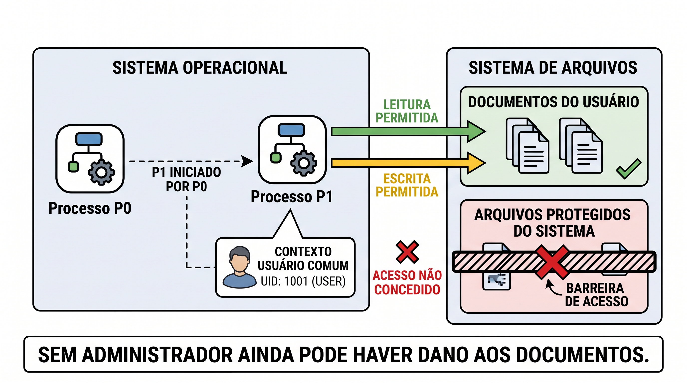

# A12 — Proteger endpoints: execução, evidência e resposta

Um arquivo pode existir sem ter sido executado. Um programa pode alterar documentos sem ser administrador. Um alerta pode indicar detecção sem comprovar bloqueio. **Para avaliar o comprometimento de um dispositivo, precisamos relacionar ação, identidade, recurso, tempo e resultado.**

**Tempo:** 100 minutos. **Recursos:** esta página, navegador e editor de texto opcional. O material fornece registros legíveis; não é necessário instalar agente, executar malware ou acessar máquina de terceiros. **Pré-requisitos:** propriedades de segurança, autorização e controles da [A11](A11-protecao-de-dados.md).

**Objetivos de aprendizagem**

1. Explicar como execução, privilégios, persistência e propagação condicionam efeitos de malware.
2. Correlacionar processo, arquivo e rede, distinguindo observação, hipótese, alerta e ação de proteção.
3. Justificar contenção e retorno com alcance, impacto e critério de verificação explícitos.

O produto do bloco é uma [única atividade de proteção de dados e endpoint](#atividade). As análises curtas durante a leitura não são novas entregas.

## Execução e privilégios: entender o alcance de um processo {#execucao}

- **Arquivo** é um objeto armazenado; **processo** é uma instância em execução com estado e recursos.
- Processo pai, caminho, usuário e permissões ajudam a explicar uma execução.
- Acesso administrativo amplia alcance, mas acesso comum pode bastar para afetar documentos do usuário.
- Nome conhecido, assinatura ou presença no disco não resolvem sozinhos a análise de comportamento.

### Do programa armazenado à ação sobre os dados

Um endpoint é um dispositivo final, como estação, notebook ou servidor, no qual dados são usados e processos executados. O sistema operacional administra memória, arquivos, comunicação e permissões. Um programa armazenado passa a atuar quando alguma forma de execução o coloca em funcionamento. Scripts, por exemplo, podem ser interpretados por outro programa.

O **processo pai** fornece contexto sobre quem iniciou o processo observado. O identificador numérico, ou PID, permite localizá-lo naquele sistema e período; pode ser reutilizado posteriormente. O caminho indica qual objeto executável foi utilizado. A linha de comando pode informar parâmetros, mas também conter dados sensíveis: sanitize antes de compartilhar.

A execução ocorre em um **contexto de segurança**, com identidade e privilégios. Se esse contexto permite alterar os documentos de uma pasta, um programa pode conseguir alterá-los sem controlar o sistema inteiro. A necessidade de privilégio depende da ação e das regras do ambiente. “Não era administrador” não comprova ausência de dano; também não autoriza afirmar que todas as áreas do sistema foram atingidas.

Assinatura digital pode ajudar a verificar origem e integridade de um componente, conforme a cadeia de confiança. Não garante que todo uso dele é legítimo. Uma ferramenta administrativa conhecida pode ser usada fora da finalidade aprovada. Em sentido inverso, um nome desconhecido não é prova de malware.

<figure class="didactic-figure didactic-figure-wide" id="figura-5" markdown="1">

{ aria-label="Abrir a Figura 5 em tamanho original" }

<figcaption><strong>Figura 5 — Alcance do processo.</strong> O dano possível depende das operações permitidas ao processo. A barreira representa os arquivos e acessos negados neste exemplo; não significa que todo arquivo do sistema seja ilegível por um usuário comum. O UID 1001 é ilustrativo: o número isolado não determina os privilégios. Imagem fornecida pelo docente. Selecione a figura para ampliar.</figcaption>
</figure>

### Observação real de laboratório: processo e arquivo benignos

O [CSV de observação benigna](../assets/a11-a12/observacao-benigna.csv) foi coletado em um ambiente Linux para esta aula. Um programa Python abriu um processo filho que escreveu somente `observacao benigna` em um arquivo temporário e aguardou alguns segundos. Uma consulta `ps` verificou a presença do processo; a leitura do arquivo verificou seu conteúdo. Os identificadores foram substituídos por **P0**, coletor, e **P1**, filho. A [nota de procedência](../assets/a11-a12/procedencia.md) explica a transformação e os limites.

Abra o CSV no navegador ou em editor de texto. Em planilha, o separador é vírgula e a codificação é UTF-8. As colunas são: registro, instante UTC, fonte, processo, pai, objeto e observação. **UTC** é uma referência de horário; não misture seus valores com horário local sem conversão.

1. Localize L1 e identifique a fonte `consulta ps`. Ela sustenta que P1 estava presente e tinha P0 como pai no instante consultado.
2. Localize L2 e identifique a fonte `leitura de arquivo`. Ela sustenta que o conteúdo indicado estava legível. A associação com P1 vem do procedimento controlado do ensaio, não de um evento de auditoria de escrita.
3. Registre uma afirmação sustentada por cada linha e uma informação ausente. Pare ao encontrar uma conclusão que exigiria outra fonte.

**Alternativa sem download:** as duas observações essenciais são “P1 estava presente, com pai P0” e “o arquivo continha a linha de teste”. Nenhuma delas registra conexões de rede, persistência ou intenção maliciosa. A consulta pontual não reconstrói tudo o que o processo fez.

**Checkpoint:** qual fonte seria necessária para atribuir uma escrita a um processo em uma máquina desconhecida, sem conhecer previamente o ensaio? A resposta deve mencionar um registro que associe ação, processo e arquivo, e não apenas proximidade de horários.

## Malware: separar mecanismo, propagação e efeito {#malware}

- Entrega, execução, persistência, propagação e efeito são funções diferentes.
- Categorias de malware descrevem características que podem se combinar.
- Persistência é capacidade de voltar a executar; não significa necessariamente privilégio elevado.
- Uma ferramenta legítima ou um serviço normal pode participar de uma ação indevida.

### Uma cadeia possível não é um roteiro universal

A **entrega** coloca um artefato ou oportunidade ao alcance do alvo: download, anexo ou outro meio. A **execução** faz instruções atuarem. A **persistência** oferece um caminho de nova execução ou manutenção de acesso. A **propagação** amplia presença para outros objetos ou dispositivos. O **efeito** pode ser coleta de informação, alteração, interrupção ou uso do equipamento para outra finalidade. Nem todo malware possui todas essas funções; elas não formam uma sequência única obrigatória.

Serviços e tarefas agendadas são mecanismos legítimos que podem ser configurados para execução recorrente. Encontrar um deles exige verificar origem, finalidade, conta e configuração. A presença não comprova persistência maliciosa, assim como encerrar um processo não demonstra que sua forma de inicialização foi removida.

| Categoria | Característica central | Pergunta de análise |
|---|---|---|
| Vírus | Replicação associada à infecção de um hospedeiro, como um arquivo | Qual objeto foi modificado e como sua execução leva adiante a infecção? |
| Worm | Capacidade de autopropagação | Que ação e resultado sustentam passagem a outro alvo? |
| Trojan | Apresentação enganosa como algo desejável ou legítimo | Que função foi prometida e que comportamento foi observado? |
| Ransomware | Restrição de acesso ou cifragem associada a extorsão | Que dados ficaram indisponíveis e há evidência adicional de exposição? |
| Spyware/keylogger | Coleta de informação ou de entradas do usuário | Qual coleta foi observada e para onde os dados seguiram? |
| Backdoor/rootkit | Acesso alternativo ou ocultação, respectivamente | Qual mecanismo de acesso ou ocultação foi identificado? |

Não confunda família, técnica e efeito. Um artefato apresentado como trojan pode instalar outro componente. Uma operação de extorsão pode envolver roubo de dados e indisponibilidade. Restaurar um backup não desfaz uma exposição já ocorrida. O [CERT.br explica a evolução dos ataques de ransomware](https://www.cert.br/docs/ransomware/entender/).

### Ferramentas legítimas e limites dos sinais isolados

Interpretadores, utilitários de administração e clientes de rede possuem usos normais. Avaliar uma execução exige contexto: quem iniciou, com quais parâmetros, sobre que recurso, em qual horário e com qual resultado. O uso malicioso de ferramentas legítimas não depende de criar um executável de nome suspeito.

A expressão *fileless* costuma destacar execução que reduz dependência de novos executáveis gravados em disco, por exemplo ao usar interpretadores e memória. Não significa necessariamente ausência total de arquivos, configuração ou rastros. Também não transforma qualquer script em malware.

**Muitas conexões não comprovam worm.** Navegadores, sincronizadores e gerenciadores de atualização podem contatar vários destinos. Para sustentar autopropagação, precisamos de evidências compatíveis com o mecanismo e seus efeitos em outros alvos. Movimento lateral conduzido por alguém também não é automaticamente autopropagação.

!!! note "Figura 6 — Funções distintas do comprometimento"
    PROMPT ILUSTRATIVO FIGURA 6 = "Crie um mapa conceitual didático em português, 16:9, com cinco cartões legíveis: Entrega — chegar ao alvo; Execução — instruções em funcionamento; Persistência — voltar a executar; Propagação — alcançar outros alvos; Efeito — coletar, alterar ou interromper. Use linhas tracejadas rotuladas caminhos possíveis, evitando uma única linha obrigatória de cinco passos. Abaixo, destaque nem todo malware possui todas as funções. Use ícones técnicos simples de arquivo, processo, relógio, dispositivos e dados. Não use comandos, personagens, capuz ou explosões. Diferencie visualmente propagação de efeito sem depender apenas de cor."

**Aplicação:** classifique “tarefa executa novamente após login”, “arquivo de teste é sobrescrito” e “outro dispositivo passa a executar o componente”. Explique que registro precisaria acompanhar cada frase antes de tratá-la como fato confirmado. Consulte [vírus](../malwares/virus.md), [worms](../malwares/worms.md) e [trojans](../malwares/trojans.md) para outras comparações.

## Defesa em camadas: relacionar controle e ação {#defesas}

- Atualização, menor privilégio e controle de execução atuam em partes diferentes do problema.
- Antivírus pode combinar assinatura, reputação, heurística e comportamento.
- EDR agrega recursos de detecção, investigação e resposta no endpoint, conforme implementação.
- Coleta, alerta e resposta são funções distintas; instalar um componente não comprova cobertura.

### Escolha pelo mecanismo

Uma atualização pode corrigir uma vulnerabilidade específica; não impede todo abuso de função legítima. Menor privilégio reduz o alcance de certas ações, mas deixa disponíveis os acessos necessários ao trabalho. Controle de aplicações restringe o que pode executar conforme regras; sua utilidade depende de manutenção e exceções. Restrição de macros ou scripts precisa considerar fluxos legítimos e ser validada no contexto correto.

| Camada | Ação que procura limitar ou apoiar | Verificação e limite |
|---|---|---|
| Atualização | Exploração de falhas corrigidas | Conferir versão e funcionamento; não elimina todas as formas de comprometimento |
| Menor privilégio | Acesso além da tarefa | Testar permitido/negado; os dados autorizados continuam ao alcance do processo |
| Controle de aplicações | Execução fora da política | Verificar regra e exceção; não basta conhecer o nome do arquivo |
| Proteção antimalware | Identificação e intervenção sobre ameaças | Conferir detecção e ação; ausência de alerta não comprova ausência de problema |
| Telemetria e EDR | Investigação e resposta sobre comportamento | Conferir dispositivo coberto, fontes, retenção e ações disponíveis |
| Backup e recuperação | Retorno de dados e função | Ensaiar restauração; não desfaz necessariamente exposição |

**Assinatura de detecção** é uma característica usada para reconhecer conteúdo ou comportamento conhecido; não é o mesmo que assinatura digital de software. **Heurística** aplica critérios que indicam características suspeitas. **Reputação** considera informações prévias sobre um artefato ou origem. **Detecção comportamental** observa ações e relações. Essas técnicas podem coexistir; não reduza antivírus a uma lista de hashes.

**EDR — Endpoint Detection and Response** reúne capacidades para investigar e responder a atividades no dispositivo. O nome da categoria não garante uma combinação universal de funcionalidades. A [documentação do Defender for Endpoint](https://learn.microsoft.com/en-us/defender-endpoint/overview-endpoint-detection-response) mostra um exemplo de implementação; recursos precisam ser conferidos no ambiente adotado.

### Observar não equivale a detectar

Um painel de processos mostra informações de execução. Um coletor registra eventos. Um mecanismo de detecção avalia sinais e pode produzir alerta. Uma ferramenta de resposta pode executar contenção. Uma plataforma pode integrar várias dessas funções, mas devemos saber qual delas produziu a evidência observada.

O **Sysmon**, utilizado aqui como referência de campos, fornece registros de atividades de sistema. Não é um EDR completo nem produz uma conclusão automática sobre a intenção de cada evento. A coleta depende de configuração; algumas categorias podem estar desabilitadas. A [documentação oficial](https://learn.microsoft.com/en-us/sysinternals/downloads/sysmon) é a referência para interpretar os eventos e suas condições de coleta.

Se um registro esperado não aparece, confira fonte, filtro, período, dispositivo e retenção antes de concluir que a ação não ocorreu. Evite aumentar coleta indiscriminadamente: volume sem finalidade dificulta leitura e pode incluir informações sensíveis.

## Telemetria: transformar registros em análise revisável {#telemetria}

- Correlacione **dispositivo, processo, tempo e recurso**, sem depender apenas do PID.
- Evento, hipótese, alerta e ação de proteção representam níveis diferentes de informação.
- “Detectado”, “bloqueado”, “em quarentena” e “resolvido” não são equivalentes.
- Registre também a evidência ausente e a próxima verificação necessária.

### Ler os campos antes de procurar uma explicação

| Campo | Para que serve | Cuidado de interpretação |
|---|---|---|
| Tempo e referência de fuso | Ordenar e comparar registros | Relógios e fusos diferentes podem distorcer a sequência |
| Dispositivo e usuário | Delimitar origem e contexto | Mesma conta pode existir em sessões e dispositivos diferentes |
| Processo, pai e identificador | Relacionar execução e origem | PID pode ser reutilizado; use contexto temporal e identificadores adicionais |
| Caminho e parâmetros | Identificar objeto e ação solicitada | Nome conhecido não garante uso legítimo; parâmetros podem conter dados sensíveis |
| Arquivo e operação | Distinguir leitura, criação, alteração ou remoção | Existência de arquivo não prova quem o produziu |
| Destino e resultado de rede | Delimitar comunicação observada | Conexão não demonstra o conteúdo transferido |
| Regra, alerta e ação | Saber por que houve sinalização e o que foi feito | Detecção não comprova prevenção ou erradicação |

A origem importa. Uma consulta `ps` informa estado no instante da consulta; um registro de criação de processo informa um evento. Um log de rede e uma leitura de conteúdo de arquivo respondem a perguntas distintas. Preserve essa diferença ao combinar fontes.

### Exemplo trabalhado: separar fato, hipótese e conclusão

O quadro seguinte é um **conjunto didático criado para análise**, não captura de incidente. Os identificadores permanecem estáveis apenas dentro deste exemplo. Todos os registros vêm de `LAB-01`; horários estão em UTC. A atividade foi declarada pelo operador como “exportação de relatório”, mas não foi fornecida uma autorização de envio externo. O endereço IP pertence a uma faixa reservada para documentação.

| Registro | Horário | Observação fornecida |
|---|---|---|
| E1 | 09:00:00 | Processo P20, pai P10, usuário comum, caminho `/lab/exportador`, iniciado |
| E2 | 09:00:02 | P20 criou `/lab/saida.csv` |
| E3 | 09:00:03 | P20 abriu conexão TCP para `192.0.2.40:443` |
| E4 | 09:00:04 | Regra “processo cria arquivo e conecta externamente” gerou alerta; ação configurada: somente registrar |

**Leitura trabalhada:** E1 e E2 relacionam execução e criação do arquivo. E3 informa conexão, não conteúdo enviado. E4 informa que a condição de uma regra foi satisfeita e que não havia bloqueio configurado. A explicação “exportação legítima com envio aprovado” é possível, mas a aprovação não foi fornecida. A hipótese “envio indevido” também precisa de evidência de conteúdo, autorização e destino. Nenhuma linha comprova worm ou ransomware.

Uma conclusão revisável seria: “P20 criou o arquivo e abriu conexão. O alerta foi apenas registrado. Falta verificar autorização e se houve transferência do conteúdo de `saida.csv`”. Ela delimita o que sabemos e a pergunta seguinte, sem tratar hipótese como fato.

!!! note "Figura 7 — Do evento à conclusão"
    PROMPT ILUSTRATIVO FIGURA 7 = "Crie uma figura didática em português, 16:9, legível em projeção. À esquerda, três cartões de evento: processo iniciado, arquivo criado, conexão aberta. No centro, uma lente de análise com a frase correlação de tempo, processo e recurso. À direita, duas caixas separadas: Observado — arquivo criado e conexão aberta; Ainda não demonstrado — conteúdo transferido e autorização. Na parte inferior, um cartão de alerta com o texto ação: somente registrar. Não desenhe seta afirmando exfiltração nem bloqueio. Use cores acompanhadas de títulos e contornos, sem logomarcas ou aparência de captura real."

### Sua comparação

Mantenha E1–E3 e altere E4 para “tentativa de conexão bloqueada pela ferramenta, resultado confirmado no registro”. Agora é possível afirmar bloqueio **daquela tentativa**, mas não de toda comunicação anterior nem remoção do processo. Registre uma conclusão nova e uma incerteza que permanece.

Para organizar a resposta, use quatro linhas: **observado → hipótese → informação ausente → próxima verificação**. Se baixar registros, mantenha a origem e a indicação de que são didáticos. A tabela já é a alternativa sem ferramenta. Pare quando uma pergunta exigir novo dado; não invente uma saída para completar a narrativa.

## Resposta: escolher alcance, impacto e condição de retorno {#resposta}

- **Conter** limita dano; **erradicar** trata causa e mecanismos remanescentes; **recuperar** restabelece função confiável.
- A menor ação adequada depende do efeito observado e do alcance conhecido.
- Isolar rede não interrompe necessariamente ações locais; encerrar processo não remove toda persistência.
- Retorno exige causa tratada, função verificada e acompanhamento compatível com o problema.

### Intervenções diferentes, efeitos diferentes

Uma ação de resposta deve declarar alvo, motivo, impacto esperado, autorização e verificação. Se existe dano ativo, contenção pode ter prioridade; isso não elimina a necessidade de preservar os registros disponíveis. A decisão entre interromper, coletar mais ou escalar depende do contexto e do procedimento aprovado. Não use a leitura desta página como autorização para agir em dispositivo de produção.

| Intervenção | Efeito pretendido | Limite e impacto a considerar |
|---|---|---|
| Quarentena de arquivo | Restringir acesso ou uso de um artefato | Não comprova encerramento de execução já iniciada; pode afetar arquivo legítimo |
| Encerrar processo | Interromper aquela instância | Pode perder estado e não impedir reinicialização |
| Isolar rede | Reduzir comunicação do dispositivo conforme mecanismo | Pode interromper suporte ou serviço; alteração local pode continuar |
| Revogar sessão ou credencial | Reduzir acesso baseado naquela autoridade | Efeito depende dos serviços e sessões; não remove artefatos locais |
| Reconstruir e restaurar | Restabelecer ambiente a partir de base confiável | Exige tratar causa, validar cópia e evitar reintrodução do problema |

Ações reversíveis também podem interromper trabalho. “Isolar tudo” não é uma conclusão automaticamente segura. Em dispositivos ligados a processo físico, a interrupção pode ter consequência operacional; essa avaliação será aprofundada no bloco OT.

O [CERT.br, em suas orientações de resposta a ransomware](https://www.cert.br/docs/ransomware/responder/), distingue contenção, eliminação da presença e da causa, restauração e retorno. O resultado de uma ferramenta não substitui a verificação de cada objetivo pertinente.

### Critérios de retorno

Antes de considerar o retorno, verifique a causa tratada, os caminhos de acesso remanescentes, a situação das credenciais afetadas e a confiança na origem usada para restauração. Teste a função necessária, revise permissões e confirme que a observação continuará disponível. Uma varredura sem detecções é um dado da análise, não prova absoluta de ausência de comprometimento.

Para dados restaurados, retome RPO e RTO da A11 e registre o estado recuperado. Para o dispositivo, confira o que mudou e qual comportamento esperado voltou a ocorrer. Se não houver como avaliar a causa com o material disponível, declare essa lacuna e escale para quem tem competência e autorização para investigá-la.

!!! note "Figura 8 — Contenção e recuperação têm objetivos próprios"
    PROMPT ILUSTRATIVO FIGURA 8 = "Crie um esquema técnico em português, horizontal 16:9, três colunas com títulos Conter, Erradicar e Recuperar. Em Conter escreva limitar o dano e represente uma comunicação interrompida, mantendo visível que o processo local pode continuar. Em Erradicar escreva tratar causa e mecanismos remanescentes e represente revisão de acesso e inicialização. Em Recuperar escreva restabelecer função verificada e represente restauração seguida de teste. Use setas de revisão entre colunas para mostrar que pode haver retorno à análise. Inclua embaixo uma faixa comum preservar evidências e registrar decisões. Não mostre ações automáticas universais, comandos ou ataque em rede real."

**Aplicação:** há registro de escrita local contínua e conexão externa. Compare o que isolamento de rede e encerramento do processo resolveriam separadamente. Indique o impacto possível de cada medida e o que ainda precisaria ser examinado. A decisão é analítica; não execute essas ações no seu equipamento.

## Integração: dado protegido e dispositivo confiável {#sintese}

- DLP, proteção de execução, telemetria e recuperação atuam em objetivos complementares.
- Acesso legítimo pode ser usado por uma execução indevida.
- Recuperar disponibilidade não elimina necessariamente exposição.
- A justificativa precisa indicar **evidência, alcance e limite**.

| Problema | Pergunta de proteção | Limite que permanece |
|---|---|---|
| Envio indevido de conteúdo | O fluxo é coberto e a regra identifica a ação relevante? | Outros canais ou classificações incorretas podem escapar |
| Processo altera documentos | Que contexto permitiu a escrita e qual controle limita a execução ou o alcance? | A conta ainda precisa realizar seu trabalho legítimo |
| Dispositivo indisponível | Existe restauração confiável de dados e função? | Voltar a operar não prova que não houve exposição |

Uma explicação profissional pode ser curta e ainda conter mecanismo: “Restringir a exportação aos campos necessários reduz os dados distribuídos; monitorar o canal permite avaliar a circulação; a proteção do endpoint trata execuções indevidas; a recuperação exige cópia utilizável e teste”. Cada trecho descreve uma função e permite perguntar como verificá-la.

**Diagnóstico de erros comuns:** se você concluiu infecção pelo nome do processo, procure ação e contexto; se concluiu vazamento pela conexão, procure conteúdo e autorização; se concluiu erradicação pelo bloqueio, procure causa e mecanismos remanescentes. Se o registro não contém essas respostas, preserve a incerteza.

No próximo bloco, a criptografia aprofundará mecanismos de confidencialidade e integridade. Reabra esta pergunta: **o que acontece com uma chave e com o texto legível quando o dispositivo que os utiliza está comprometido?**

## Atividade {#atividade}

Conclua o [parecer técnico de A11–A12](../atividades/A11-A12-parecer.html#atividade). Os insumos e o modelo estão na página da atividade. A entrega combina proteção de dados, regra com contraprova, leitura de rastros e decisão de resposta. Não é necessário instalar ferramentas ou reproduzir ataque.

## Revisão rápida

1. Por que “o processo não era administrador” não elimina a possibilidade de dano aos documentos?
2. Que diferença existe entre conexão registrada, alerta gerado e bloqueio confirmado?
3. Qual evidência distinguiria recuperação da função de eliminação da causa?

## Referências e aprofundamento

- [Microsoft Sysinternals — Sysmon](https://learn.microsoft.com/en-us/sysinternals/downloads/sysmon): campos e condições de coleta.
- [Microsoft Learn — EDR](https://learn.microsoft.com/en-us/defender-endpoint/overview-endpoint-detection-response): exemplo de capacidades de investigação e resposta.
- [CERT.br — códigos maliciosos](https://cartilha.cert.br/fasciculos/codigos-maliciosos/fasciculo-codigos-maliciosos.pdf): conceitos e mecanismos.
- [CERT.br — entender ransomware](https://www.cert.br/docs/ransomware/entender/): efeitos e contexto de extorsão.
- [CERT.br — responder a ransomware](https://www.cert.br/docs/ransomware/responder/): contenção, remoção e recuperação.

Consulta em 24 set. 2026. L1/L2 são observações de um ensaio benigno com procedência registrada. E1–E4 são exemplos artificiais e não evidências de incidente real. Ao terminar, feche os arquivos e mantenha apenas os registros de estudo; nenhum agente ou malware foi instalado como requisito desta página.
