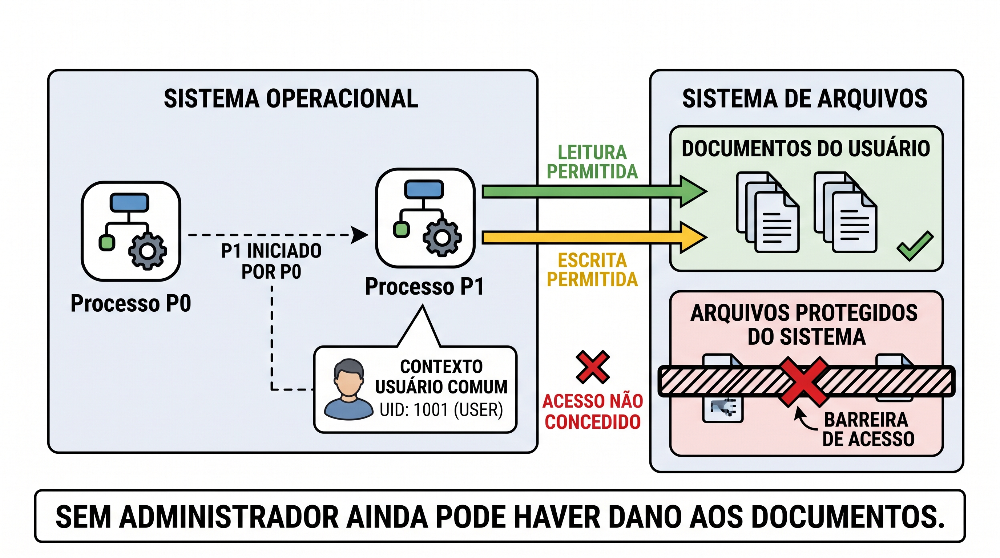

# A13 — Proteger endpoints: execução, malware e resposta

Um arquivo armazenado não está necessariamente em execução. Um processo com acesso comum pode alterar documentos. Um alerta pode apenas registrar uma ação. Nesta aula, você vai usar essas distinções para explicar **o que aconteceu, o que ainda não sabemos e qual resposta cabe**.

**Tempo:** 100 minutos. **Recursos:** esta página e um computador Windows 10/11 **ou** Ubuntu para a observação guiada. Escolha o roteiro do seu sistema; se estiver apenas acompanhando a projeção, use os resultados ilustrativos escritos na página. Não instale agentes nem execute malware. **Base:** propriedades de segurança e [proteção de dados](A11-protecao-de-dados.md) dos encontros A11–A12.

**Objetivos de aprendizagem**

1. Explicar como a identidade e as permissões de um processo limitam suas ações.
2. Distinguir vírus, worm e outros mecanismos de malware usando exemplos industriais documentados.
3. Interpretar processo, arquivo, rede e alerta para propor contenção e retorno verificáveis.

As respostas curtas nesta página preparam a [única atividade integrada de A11–A13](#atividade); não geram entregas separadas.

## Execução: o que o processo consegue fazer? {#execucao}

**Arquivo** é um objeto armazenado; **processo** é um programa em execução. O processo atua com uma identidade e permissões. Se essa identidade pode editar um documento, o processo também pode alterá-lo, mesmo sem ser administrador. Privilégio administrativo amplia certas ações, mas sua ausência não protege automaticamente os arquivos do usuário.

Para delimitar o alcance de uma execução, procure: **processo**, **usuário**, **recurso acessado**, **ação** e **resultado**; registre o processo pai quando a fonte o mostrar. O nome do programa é uma pista; não demonstra sozinho uso legítimo ou malicioso. O identificador do processo, chamado PID, pode ser reutilizado depois que ele termina; associe-o também ao dispositivo e ao horário.

<figure class="didactic-figure didactic-figure-wide" id="figura-5" markdown="1">

[](../assets/a11-a12/A12-figura-5-alcance-processo.jpeg){ aria-label="Abrir a figura de alcance do processo em tamanho original" }

<figcaption><strong>Alcance do processo.</strong> P1 pode afetar os documentos aos quais sua identidade tem acesso. O UID 1001 é ilustrativo; o número isolado não define os privilégios. Imagem fornecida pelo docente. Selecione para ampliar.</figcaption>
</figure>

### Observação benigna: escolha seu sistema

Selecione **Windows 10/11** ou **Ubuntu** nas abas e faça somente o roteiro do seu sistema. Os dois produzem uma observação de processo e uma leitura de arquivo; use os registros W1/W2 **ou** U1/U2 na conclusão. Se estiver apenas acompanhando, use os resultados ilustrativos no fim de cada roteiro. O [CSV L1/L2](../assets/a11-a12/observacao-benigna.csv) é um ensaio anterior e independente, disponível como fonte complementar.

=== "Windows 10/11"

    <span id="observacao-windows"></span>

    **Estado inicial:** computador Windows 10/11, com sua própria conta, sem precisar de privilégios de administrador. Use somente o texto fictício indicado. Não abra arquivos pessoais nem altere configurações de segurança.

    | Passo | Faça no Windows | Resultado esperado e registro |
    |---|---|---|
    | 1. Preparar o arquivo | Pressione `Win + E` para abrir o **Explorador de Arquivos**. Entre em **Documentos** e crie uma pasta chamada `Observacao-A13` pelo botão **Novo > Pasta**. Abra o **Bloco de Notas** pelo menu Iniciar, digite `observacao benigna` e use **Arquivo > Salvar como**. Escolha essa pasta e o nome `observacao-benigna.txt`. Mantenha o Bloco de Notas aberto. | O título do Bloco de Notas mostra o arquivo salvo. Se a pasta Documentos não puder ser usada, escolha outra pasta em que você possa salvar e anote o caminho. |
    | 2. Observar o processo | Pressione `Ctrl + Shift + Esc` para abrir o **Gerenciador de Tarefas**. Se aparecer a visão compacta, selecione **Mais detalhes**. Abra **Detalhes** e localize `Notepad.exe` (Bloco de Notas). | **W1:** registre nome do processo, PID mostrado na coluna **PID** e horário da consulta. Se houver mais de um `Notepad.exe`, registre que a lista não identifica qual janela é a sua. |
    | 3. Observar o arquivo | Volte ao **Explorador de Arquivos**, entre na pasta escolhida e abra `observacao-benigna.txt`. | **W2:** confirme e registre o caminho do arquivo e o texto `observacao benigna`. Se o arquivo aparecer com outro nome ou extensão, registre o nome real antes de prosseguir. |

    **Encerramento:** depois de registrar W1 e W2, feche o arquivo de teste e o Gerenciador de Tarefas. O arquivo fictício pode ser excluído pelo Explorador; confira o nome antes de excluí-lo. Pare aqui e vá para a [interpretação comum](#interpretacao-observacao).

    **Sem computador:** use W1 = “Gerenciador de Tarefas mostra `Notepad.exe`, PID 4321, às 10:05” e W2 = “Explorador abre `Documentos/Observacao-A13/observacao-benigna.txt` com `observacao benigna`”. PID, horário e caminho são **ilustrativos**.

=== "Ubuntu"

    <span id="observacao-ubuntu"></span>

    **Estado inicial:** Ubuntu com Terminal e Python 3 disponíveis; use sua própria conta. O ensaio cria uma pasta temporária exclusiva e um arquivo com texto fictício. Não use `sudo`. Mantenha o mesmo Terminal aberto até o encerramento, pois as variáveis `DIR_A13` e `PID_A13` valem somente nele. Se `python3 --version` mostrar “comando não encontrado”, use U1/U2 ilustrativos abaixo; não instale nada.

    1. Abra o **Terminal** pelo menu de aplicativos ou com `Ctrl + Alt + T`. Digite `python3 --version` e pressione **Enter**. O resultado esperado começa com `Python 3`. Se não aparecer, pare e use o exemplo sem computador.
    2. Crie uma pasta temporária e mostre seu caminho. Digite as duas linhas, pressionando **Enter** após cada uma:

        ```bash
        DIR_A13="$(mktemp -d)"
        printf '%s\n' "$DIR_A13"
        ```

        O segundo comando mostra um caminho semelhante a `/tmp/tmp.ABC123`. **Anote o caminho mostrado**; o sufixo varia. `mktemp -d` cria uma pasta nova, sem usar arquivos pessoais.

    3. Inicie um processo benigno que escreve uma linha e permanece aberto por até dez minutos. Digite as três linhas abaixo **no mesmo Terminal**:

        ```bash
        python3 -c 'from pathlib import Path; import sys, time; Path(sys.argv[1]).write_text("observacao benigna\n"); time.sleep(600)' "$DIR_A13/observacao-benigna.txt" &
        PID_A13=$!
        sleep 1
        ```

        O `&` deixa o programa em segundo plano, `$!` guarda seu PID e `sleep 1` dá tempo para o arquivo ser criado. O processo usa apenas a pasta temporária. Se ele terminar antes da consulta, repita **somente este passo** para criar um novo PID.

    4. Consulte o processo e o horário UTC:

        ```bash
        ps -o pid,ppid,comm -p "$PID_A13"
        date -u +'%Y-%m-%dT%H:%M:%SZ'
        ```

        A primeira saída deve ter uma linha `python3`: **PID** identifica o processo e **PPID** identifica seu pai naquela consulta. **U1:** anote PID, PPID e horário UTC. Se aparecer apenas o cabeçalho de `ps`, o processo já terminou; repita o passo 3 antes de continuar.

    5. Leia o arquivo criado:

        ```bash
        printf '%s\n' "$DIR_A13/observacao-benigna.txt"
        cat "$DIR_A13/observacao-benigna.txt"
        ```

        O primeiro comando mostra o caminho; o segundo deve mostrar `observacao benigna`. **U2:** anote caminho e conteúdo. Se `cat` informar que o arquivo não existe, pare e refaça o passo 3; não procure outros arquivos.

    6. Encerre **somente o processo deste ensaio** com `kill "$PID_A13"`. O arquivo permanece na pasta temporária para conferência. Pare após registrar U1 e U2; não é preciso executar o antigo coletor CSV.

    **Sem Terminal:** use U1 = “`ps` mostra `python3`, PID 4321, PPID 4000, às 13:05 UTC” e U2 = “`/tmp/tmp.ABC123/observacao-benigna.txt` contém `observacao benigna`”. Os números, horário e caminho são **ilustrativos**.

#### Interpretação comum: o que os registros sustentam? {#interpretacao-observacao}

Em Windows, W1 sustenta que `Notepad.exe` estava presente **naquele instante**; W2 sustenta o conteúdo do arquivo. Em Ubuntu, U1 sustenta que `python3` estava presente com o PPID exibido; U2 sustenta o caminho e o conteúdo do arquivo. Em ambos, você sabe quem salvou ou escreveu porque acompanhou o procedimento, mas os **dois registros, sozinhos, não são um log de auditoria que liga PID, arquivo e escrita**. Também não mostram rede, persistência ou intenção maliciosa.

**Registre duas frases:** (1) uma afirmação sustentada por W1/W2 **ou** U1/U2, citando o registro; (2) uma ação que esses registros não permitem atribuir a um processo em outra máquina. Para atribuir uma escrita desconhecida seria necessária uma fonte que registrasse processo, arquivo e operação. Pare após as duas frases.

O [CSV L1/L2 de um ensaio anterior em Linux](../assets/a11-a12/observacao-benigna.csv) tem [procedência própria](../assets/a11-a12/procedencia.md): L1 é uma consulta `ps`; L2 é a leitura do arquivo. Ele não é a saída dos procedimentos Windows ou Ubuntu acima, nem um log de auditoria de escrita.

## Malware: distinguir propagação de efeito {#malware}

Malware é software usado para realizar uma ação não autorizada. **Entrega** leva um artefato ao alvo; **execução** põe instruções em funcionamento; **persistência** permite voltar a executar; **propagação** alcança outros objetos ou dispositivos; **efeito** é o que o código faz, como coletar, alterar ou tornar dados indisponíveis. Um malware não precisa apresentar todas essas funções nem seguir essa ordem.

### Famílias e funções: o que cada nome descreve?

| Nome | Definição | Exemplo do mecanismo ou efeito |
|---|---|---|
| **Vírus** | Código que se replica ao infectar um arquivo ou programa hospedeiro. | Um programa infectado leva uma cópia do código quando é compartilhado e executado. |
| **Worm** | Código que se replica e alcança outros alvos sem infectar um arquivo hospedeiro. | Depois da entrada inicial, procura outros dispositivos por uma via de propagação. |
| **Trojan (cavalo de Troia)** | Programa que se apresenta como útil ou legítimo para induzir sua execução, mas realiza ação não autorizada. | Um falso instalador abre acesso indevido. Não se define por replicação. |
| **Ransomware** | Código que impede ou dificulta acesso a dados ou sistemas e exige resgate. | Criptografa arquivos e apresenta pedido de pagamento. |
| **Spyware** | Código que coleta informações sem autorização. | Captura dados de navegação ou documentos. |
| **Adware malicioso** | Software que exibe anúncios e, quando abusivo, altera o navegador ou coleta dados sem consentimento. | Redireciona buscas para páginas de anúncios sem autorização. Exibir anúncios, isoladamente, não prova malware. |
| **Keylogger** | Ferramenta que registra teclas digitadas; é maliciosa quando usada sem autorização para capturar dados. | Registra senhas digitadas. É uma forma possível de coleta. |
| **Backdoor** | Meio de acesso que contorna o fluxo normal de autenticação ou controle. | Permite retorno ao dispositivo após o acesso inicial. Pode ser instalado por outro malware. |
| **RAT malicioso** | Programa de administração remota usado sem autorização para controlar o dispositivo. | Recebe comandos para abrir arquivos ou executar ações. Administração remota autorizada não é malware. |
| **Rootkit** | Conjunto de técnicas ou componentes que oculta presença e mantém acesso privilegiado. | Esconde processos ou arquivos para dificultar a detecção. |
| **Bomba lógica** | Código que dispara uma ação quando uma condição definida é atendida. | Apaga um arquivo ao chegar uma data ou ocorrer um evento específico. |
| **Bot e botnet** | Bot é dispositivo ou programa controlado remotamente; botnet é o conjunto de bots coordenados. | Dispositivos recebem comandos de um controlador. |

Os nomes descrevem **mecanismos ou efeitos diferentes** e podem coexistir no mesmo incidente. **Bloatware** é software pré-instalado ou desnecessário para o usuário; o incômodo ou consumo de recursos, sozinho, não o torna malware. Para classificar um caso, identifique primeiro a ação observada e a fonte que a mostra.

### Vírus e worm: qual é a diferença?

| | Vírus | Worm |
|---|---|---|
| **Replicação** | Infecta um arquivo ou programa hospedeiro; a cópia segue com esse hospedeiro. | Consegue criar cópias e procurar novos alvos sem infectar um arquivo hospedeiro. |
| **Evidência necessária** | Objeto hospedeiro modificado e mecanismo de replicação. | Mecanismo de propagação e efeito observado em outro alvo. |
| **Cuidado** | Abrir um arquivo suspeito não comprova infecção por vírus. | Várias conexões de rede não comprovam autopropagação. |

Um worm pode precisar de uma ação inicial para entrar no ambiente. “Autopropagação” descreve o que ele consegue fazer **depois**. No vírus, observe a infecção do hospedeiro; no worm, a capacidade de alcançar outros alvos sem esse hospedeiro. Em ambos, peça evidência do mecanismo antes de usar o nome.

### Demonstração segura: executar modelos no navegador {#simulacao-malware}

Esta tela representa um **computador de exemplo**. Nomes como `B.exe`, `PC-2` e `relatorio.txt` são etiquetas na página; não são arquivos ou computadores acessados de verdade. Cada clique mostra **quem age, o que faz, o que é afetado e o que muda**. Funciona no navegador de Windows ou Ubuntu.

**Procedimento:** escolha **Vírus**, preveja qual objeto vai mudar e clique em **Executar simulação**. Leia **Quem age → O que faz → O que é afetado** e compare os cartões **Antes/Depois**. Repita com **Worm** e depois com outra família. Registre três linhas no formato **família → objeto que mudou → por que essa mudança ilustra a família**. Pare após as três linhas. Cada clique recomeça do mesmo estado de exemplo. Se o botão não funcionar, faça a comparação com M1–M12 abaixo.

<div id="simulador-a13" class="a13-simulator">
  <label for="familia-a13">Família ou função para simular</label>
  <select id="familia-a13">
    <option value="virus">Vírus — M1</option>
    <option value="worm">Worm — M2</option>
    <option value="trojan">Trojan — M3</option>
    <option value="ransomware">Ransomware — M4</option>
    <option value="spyware">Spyware — M5</option>
    <option value="keylogger">Keylogger — M6</option>
    <option value="backdoor">Backdoor — M7</option>
    <option value="rootkit">Rootkit — M8</option>
    <option value="botnet">Bot/botnet — M9</option>
    <option value="adware">Adware malicioso — M10</option>
    <option value="rat">RAT malicioso — M11</option>
    <option value="logicbomb">Bomba lógica — M12</option>
  </select>
  <button type="button">Executar simulação</button>
  <div class="a13-result" role="status" aria-live="polite"><p>Escolha uma família, preveja a mudança e execute a simulação.</p></div>
</div>

**Leitura trabalhada:** em **Vírus**, `A.exe` age sobre `B.exe`, que muda de “sem cópia do vírus” para “contém uma cópia do vírus”. A cópia depende do **arquivo hospedeiro**. Em **Worm**, `PC-1` alcança `PC-2`, que muda de “sem cópia” para “tem uma cópia do programa”. A cópia alcança **outro dispositivo**, sem infectar um hospedeiro. Nas outras opções, faça a mesma leitura: **quem age → o que faz → o que muda → o que isso mostra**.

**Mais um exemplo, Backdoor:** o programa chamado “Assistente de suporte” acrescenta uma **entrada escondida que não pede senha**. Antes, a lista mostrava apenas “login com senha”; depois, mostra as duas formas de entrar. É isso que a palavra *backdoor* descreve neste exemplo: um caminho de acesso que contorna o login normal. O simulador só altera a lista exibida nesta página.

O [código-fonte JavaScript completo](../javascripts/a13-simulador.js) contém os 12 exemplos programados e pode ser lido antes de clicar. Ele altera apenas objetos temporários **na memória desta página**: não lê arquivos ou teclas reais, não usa rede e não executa malware. O trecho abaixo mostra as duas operações usadas nos primeiros exemplos:

```javascript
// Vírus: muda o estado de um arquivo hospedeiro fictício.
const arquivos = { "A.exe": "contém uma cópia do vírus", "B.exe": "sem cópia do vírus" };
arquivos["B.exe"] = "contém uma cópia do vírus";

// Worm: muda o estado de outro dispositivo fictício.
const dispositivos = { "PC-1": "tem uma cópia do programa", "PC-2": "sem cópia" };
dispositivos["PC-2"] = "tem uma cópia do programa";
```

**A tabela abaixo** preserva a atividade quando JavaScript estiver desativado e mostra os rastros que cada modelo representa.

| Cartão | Rastro fictício para observar | Família ou função ilustrada |
|---|---|---|
| M1 | Ao executar `A.exe`, o código anexa uma cópia de si a `B.exe`; ao executar `B.exe`, o mesmo ocorre com `C.exe`. | **Vírus:** a cópia depende do arquivo hospedeiro infectado. |
| M2 | Uma cópia em PC-1 busca outros computadores alcançáveis; PC-2 passa a executar uma cópia sem que um arquivo hospedeiro tenha sido modificado. | **Worm:** propagação para outro dispositivo sem hospedeiro. |
| M3 | Um aplicativo anunciado como “visualizador de relatórios” abre uma sessão oculta após o usuário instalá-lo. | **Trojan:** apresentação enganosa e ação indevida; a sessão também pode funcionar como backdoor. |
| M4 | Arquivos antes legíveis ficam inacessíveis e aparece uma cobrança para restaurar o acesso. | **Ransomware:** bloqueio do acesso associado à exigência de resgate. |
| M5 | Um processo lê histórico de navegação e envia os dados sem autorização. | **Spyware:** coleta indevida de informações. |
| M6 | Um componente registra as teclas digitadas, incluindo uma senha. | **Keylogger:** captura de digitação, que pode integrar um spyware. |
| M7 | Após a instalação, uma conta ou canal oculto permite voltar ao computador sem o fluxo normal de acesso. | **Backdoor:** caminho de acesso indevido. |
| M8 | Um componente altera a visão do sistema para esconder seu processo e seus arquivos. | **Rootkit:** ocultação para dificultar detecção. |
| M9 | Vários computadores recebem a mesma ordem remota e a executam em conjunto. | **Bots/botnet:** controle coordenado de vários dispositivos. |
| M10 | Depois de instalar um programa, buscas são redirecionadas sem consentimento para páginas de anúncios. | **Adware malicioso:** alteração abusiva para publicidade. |
| M11 | Um programa recebe comandos externos e abre um documento sem autorização do dono do computador. | **RAT malicioso:** controle remoto indevido; também pode usar um backdoor. |
| M12 | Ao chegar uma data configurada, um componente apaga um arquivo de teste sem nova interação. | **Bomba lógica:** ação disparada por condição. |

**Exemplo trabalhado:** em M1, o dado decisivo é a modificação de `B.exe` e `C.exe` como hospedeiros; por isso o cartão ilustra vírus. Em M2, o dado decisivo é a cópia executada em PC-2 sem infectar um hospedeiro; por isso ilustra worm. **Faça agora:** escolha M3 ou M6, copie a expressão do rastro que sustenta a classificação e diga qual outra função pode coexistir. Pare após essas duas frases. Esses cartões mostram como **reconhecer a descrição**; em uma investigação real, seria preciso confirmar que os eventos ocorreram e que os registros são confiáveis.

### Dois episódios industriais documentados {#incidentes-industriais}

| Episódio | Mecanismo que interessa aqui | Decisão que ele ajuda a explicar |
|---|---|---|
| [Stuxnet — ICS-CERT/CISA](https://www.cisa.gov/uscert/ics/advisories/ICSA-10-272-01) | O alerta relata propagação por USB, compartilhamentos e arquivos de projeto, além de interação com WinCC/STEP 7. | Restringir USB cobre uma via de entrada, mas não todas. Para afirmar infecção em uma estação específica, é preciso verificar indicadores nela. |
| [Rede elétrica ucraniana, 2015 — CISA](https://www.cisa.gov/news-events/alerts/2022/01/11/understanding-and-mitigating-russian-state-sponsored-cyber-threats-us-critical-infrastructure) | A síntese relaciona BlackEnergy à obtenção de credenciais, KillDisk à inutilização de computadores e interrupções nas distribuidoras atacadas. | Restaurar arquivos pode recuperar função; ainda é preciso examinar credenciais e caminhos de acesso. A interrupção envolveu mais que um único arquivo. |

**Exemplo trabalhado:** a fonte de Stuxnet documenta **caminhos de propagação**. Ela não informa que uma estação específica da sua organização esteja infectada. A conclusão local dependeria de uma observação nessa estação. **Agora compare:** leia a linha da Ucrânia, escreva (1) qual função uma restauração de computadores poderia recuperar e (2) qual pergunta sobre credenciais e acesso permaneceria aberta. Pare após as duas frases; não atribua toda a interrupção a um único arquivo.

Os episódios acima são reais e documentados. W1/W2, L1/L2, M1–M12 e E1–E4 são exercícios separados deles. Não execute amostras, indicadores ou comandos retirados dos relatos. A análise detalhada das consequências para o processo físico fica para o bloco de OT.

## Controles: associar mecanismo, resultado e limite {#defesas}

Escolha o controle pela ação que deseja limitar ou observar:

| Ação em foco | Controle | Como verificar |
|---|---|---|
| Explorar falha conhecida | Atualização compatível | Conferir versão corrigida e funcionamento da aplicação. |
| Executar código fora da política | Controle de aplicações ou restrição de scripts | Testar execução permitida e negada; conferir exceções. |
| Alterar dados além da tarefa | Menor privilégio e permissão de acesso | Testar leitura/edição necessárias e acesso negado; o processo ainda alcança dados autorizados. |
| Reconhecer e responder a comportamento | Antimalware, telemetria e EDR | Confirmar dispositivo coberto, registro, alerta e ação efetivamente executada. |
| Perder dados ou função | Cópia recuperável | Restaurar em destino de teste e conferir conteúdo e uso; isso não desfaz exposição anterior. |

**Antimalware** pode usar assinatura de detecção, reputação, heurística e comportamento. Uma assinatura de detecção reconhece características de ameaça; é diferente da assinatura digital que ajuda a verificar a origem de software. **EDR** reúne capacidades de investigação e resposta no endpoint, conforme produto e configuração. Um coletor de eventos, como o [Sysmon](https://learn.microsoft.com/en-us/sysinternals/downloads/sysmon), registra atividades configuradas; não é, por si, um EDR ou uma decisão automática sobre intenção.

**Aplicação curta:** use a linha “alterar dados além da tarefa” da tabela para escolher um controle que **reduz o alcance**. Use a linha “reconhecer e responder” para escolher um controle que **ajuda a observar a ação**. Para cada um, copie o teste da coluna “Como verificar” e escreva um limite. Registre duas linhas no formato **controle → verificação → limite**. Pare quando as duas linhas estiverem completas; não mude permissões reais do computador.

## Telemetria: ler o rastro antes de nomear o incidente {#telemetria}

Leia cada registro nesta ordem: **quando e onde → quem/processo → ação/recurso → resultado/fonte**. Compare horários na mesma referência de fuso. Processo pai e caminho ajudam a relacionar ações, mas um nome conhecido não garante legitimidade. Um evento de rede informa conexão ou tentativa; não revela automaticamente o conteúdo enviado. Um alerta informa que uma regra foi acionada; a ação configurada diz se houve registro, aviso ou bloqueio.

O exemplo a seguir é **artificial**, criado para análise. Todos os registros pertencem ao dispositivo `LAB-01`, em UTC. O operador declarou “exportação de relatório”, mas não forneceu autorização de envio externo. O endereço IP usa uma faixa reservada para documentação.

| Registro | Horário | Observação |
|---|---|---|
| E1 | 09:00:00 | P20 iniciou, pai P10, usuário comum, caminho `/lab/exportador`. |
| E2 | 09:00:02 | P20 criou `/lab/saida.csv`. |
| E3 | 09:00:03 | P20 abriu conexão TCP para `192.0.2.40:443`. |
| E4 | 09:00:04 | Regra “cria arquivo e conecta externamente” gerou alerta; ação: **somente registrar**. |

**Leitura trabalhada:** E1–E3 sustentam que P20 iniciou, criou o arquivo e abriu uma conexão. E4 sustenta que a regra gerou um alerta sem bloquear a ação. **Não há evidência do conteúdo transferido nem autorização de envio.** Portanto, a conclusão útil é: “P20 criou um arquivo e abriu conexão; verificar se houve transferência do conteúdo e se o destino era autorizado”. Os quatro registros não demonstram worm, ransomware ou vazamento.

**Sua vez, com a tabela acima:** (1) copie E1–E3 como estão; (2) substitua apenas E4 por “a tentativa de conexão foi bloqueada, com resultado confirmado no registro”; (3) escreva quatro linhas: **observado → hipótese → informação ausente → próxima verificação**. Em “observado”, inclua a criação do arquivo e o bloqueio **daquela tentativa**. Em “informação ausente”, considere o conteúdo do arquivo e eventuais ações anteriores. Pare após as quatro linhas. Não altere E1–E3, não invente registros e não trate o bloqueio como remoção de P20. A própria tabela fornece todos os insumos; nenhuma ferramenta é necessária.

## Resposta: conter, tratar a causa e verificar retorno {#resposta}

**Conter** limita o dano em andamento. **Erradicar** trata a causa e os mecanismos que poderiam manter o problema. **Recuperar** restabelece uma função confiável. São objetivos distintos: um alerta não comprova contenção, e uma contenção não comprova erradicação.

| Medida | O que pode interromper | O que permanece possível |
|---|---|---|
| Encerrar P20 | Ação daquela instância do processo. | Outra instância pode iniciar; o mecanismo de retorno não foi examinado. |
| Isolar a rede do dispositivo | Comunicação coberta pelo isolamento. | P20 pode continuar alterando arquivos locais; serviços de suporte podem parar. |
| Revogar sessão ou credencial | Acesso que depende daquela autoridade, conforme o serviço. | Arquivos locais e processos em execução não desaparecem. |

**Decisão guiada com E1–E4:** releia os quatro registros e preencha, no papel, **observado → falta verificar → ação condicional → impacto da ação**. Em “observado”, registre criação de arquivo, conexão e alerta **sem bloqueio**. Em “falta verificar”, inclua conteúdo e finalidade do arquivo, autorização do destino e ações posteriores de P20. Escolha uma medida da tabela acima **apenas sob uma condição explícita**, por exemplo, confirmação de alteração indevida em curso. Registre a função que a medida poderia afetar. Pare ao completar as quatro partes; não encerre processos nem isole dispositivos reais. Em ambiente industrial, uma intervenção em estação operacional depende dos responsáveis pelo processo.

**Critério de retorno:** confirmar causa tratada, acessos relevantes revistos, dados e função testados e observação disponível para acompanhar recorrência. Se houve restauração, compare também o estado recuperado com as metas RPO/RTO estudadas em proteção de dados. Uma varredura sem alerta não é prova absoluta de ausência de comprometimento.

## Síntese: dado e dispositivo precisam de controles diferentes {#sintese}

Permissões e DLP tratam **quem usa e para onde o dado circula**. Controle de execução e menor privilégio limitam **o que um processo pode fazer**. Telemetria ajuda a **reconstruir ações**; backup e restauração ajudam a **recuperar função e dados**. Para justificar um controle, declare **mecanismo, evidência de verificação e limite**.

No próximo bloco, a criptografia aprofundará confidencialidade e integridade. Leve uma pergunta: **se o endpoint usa uma chave e vê o texto legível, o que acontece quando esse dispositivo está comprometido?**

## Atividade {#atividade}

Conclua o [parecer técnico de A11–A13](../atividades/A11-A12-parecer.html#atividade). A entrega reúne proteção de dados, regra com contraprova, leitura de rastros e resposta. Use somente os insumos fornecidos; os incidentes industriais acima não pertencem aos registros artificiais do parecer. Não é preciso instalar ferramentas ou reproduzir ataque.

## Revisão rápida

1. Qual evidência diferencia a replicação de um vírus da autopropagação de um worm?
2. O que E3 e E4 permitem afirmar sobre conexão, alerta e bloqueio?
3. Por que isolar a rede não garante que P20 parou de alterar arquivos locais?

## Referências e aprofundamento

- [CERT.br — códigos maliciosos](https://cartilha.cert.br/fasciculos/codigos-maliciosos/fasciculo-codigos-maliciosos.pdf): famílias e mecanismos.
- [Microsoft — ferramentas do Windows](https://support.microsoft.com/en-us/windows/experience/system-configuration-tools-in-windows) e [Explorador de Arquivos](https://support.microsoft.com/en-us/windows/experience/fileexplorer/file-explorer-in-windows): interfaces usadas na observação benigna.
- [ICS-CERT/CISA — Stuxnet](https://www.cisa.gov/uscert/ics/advisories/ICSA-10-272-01): propagação e interação com sistemas de engenharia.
- [CISA — Ucrânia 2015](https://www.cisa.gov/news-events/alerts/2022/01/11/understanding-and-mitigating-russian-state-sponsored-cyber-threats-us-critical-infrastructure): BlackEnergy, KillDisk e interrupção.
- [Microsoft Sysinternals — Sysmon](https://learn.microsoft.com/en-us/sysinternals/downloads/sysmon) e [Microsoft Learn — EDR](https://learn.microsoft.com/en-us/defender-endpoint/overview-endpoint-detection-response): funções de coleta, investigação e resposta.
- [CERT.br — responder a ransomware](https://www.cert.br/docs/ransomware/responder/): contenção, remoção e recuperação.
- [ICS-CERT — HatMan/TRITON](https://www.cisa.gov/sites/default/files/documents/MAR-17-352-01%20HatMan%E2%80%94Safety%20System%20Targeted%20Malware_S508C.pdf): leitura opcional para o bloco OT.

Fontes dos incidentes industriais conferidas em 1º out. 2026. L1/L2 vêm de um ensaio benigno com [procedência registrada](../assets/a11-a12/procedencia.md). W1/W2 e M1–M12 são resultados ilustrativos ou rastros fictícios; E1–E4 são exemplos artificiais. Nenhum deles é evidência de incidente real.
