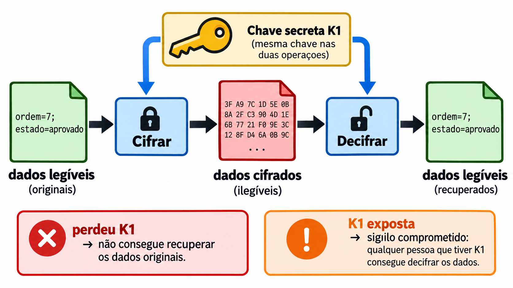
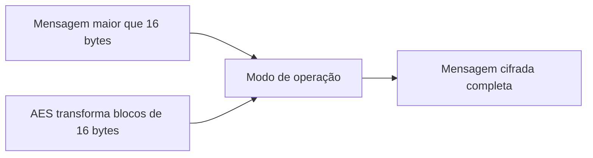
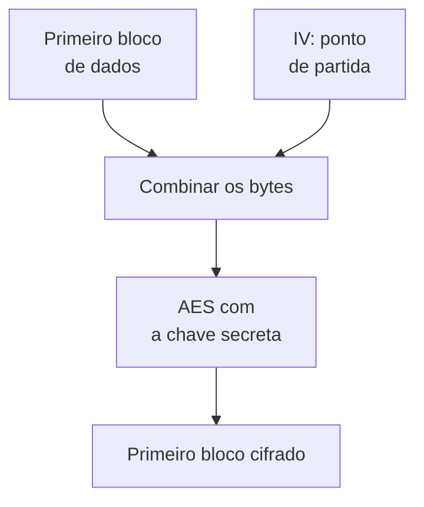
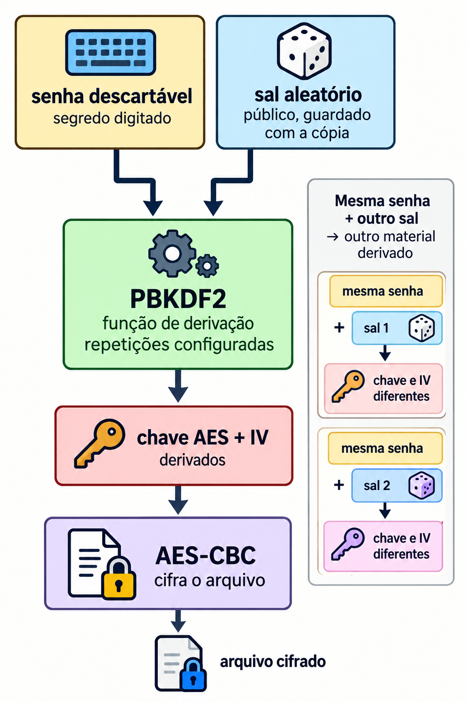
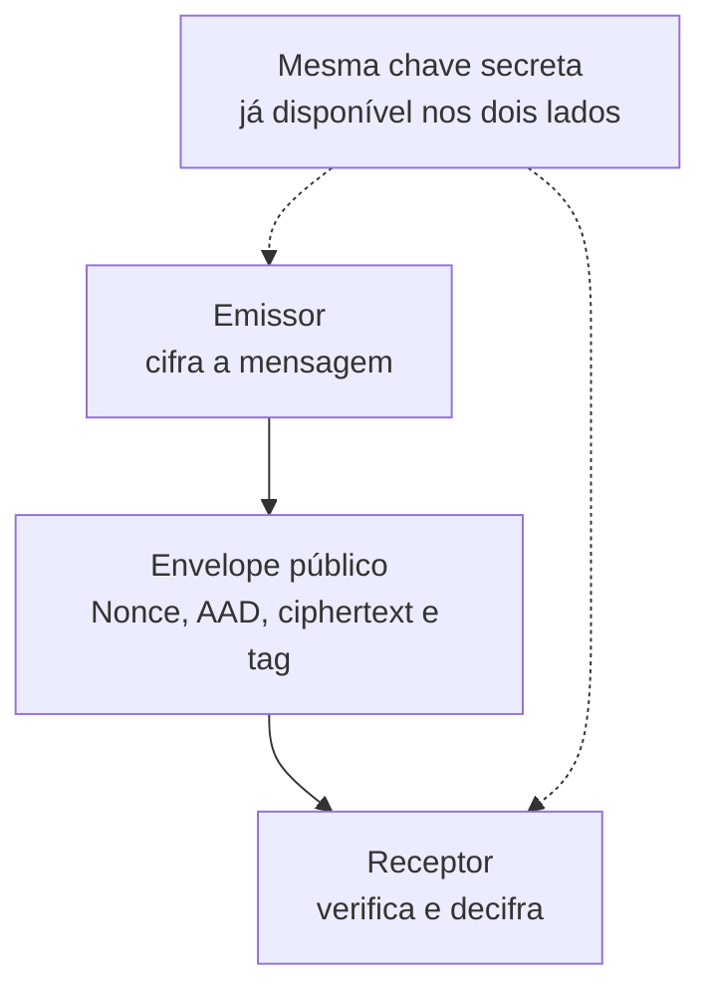
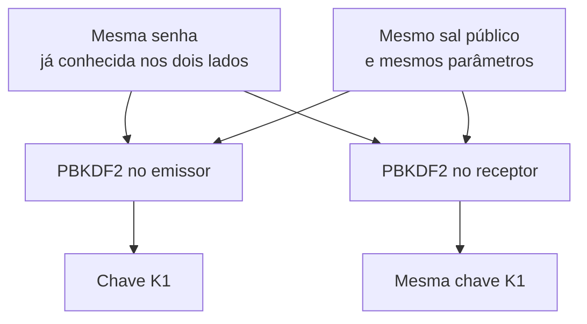

# A14 — Cifra simétrica e compartilhamento de chaves

**Como proteger uma cópia e verificar se ela pode ser aceita?** Primeiro veremos a cifra com a mesma chave secreta nos dois sentidos. Depois, vamos verificar alterações e explicar como o receptor obtém a chave necessária para abrir a mensagem.

**Tempo:** 100 minutos, com exposição e prática guiada intercaladas.

**Recursos:** terminal Ubuntu no WSL, VS Code, OpenSSL e Python 3 com a biblioteca `cryptography`. Os resultados esperados na página servem de alternativa se o ambiente falhar. Use somente dados de teste e senha descartável.

**Objetivos de aprendizagem**

1. Descrever o percurso do texto legível ao cifrado e de volta com a mesma chave, distinguindo o algoritmo AES do modo de operação.
2. Comparar CBC e AES-GCM usando abertura original e rejeição de alteração na tag ou no AAD.
3. Distinguir chave, IV, sal, nonce e AAD e explicar o segredo que o receptor precisa possuir previamente.

Esta aula inicia o [registro único de criptografia e confiança](#atividade), preenchido após cada observação e continuado na A15–A16. O preenchimento de hoje não exige entrega separada.

## Cifra simétrica: a mesma chave nas duas operações {#fundamentos}

**Uso real — proteger o disco de um notebook:** o [BitLocker do Windows](https://learn.microsoft.com/en-us/windows/security/operating-system-security/data-protection/bitlocker/) cifra volumes para reduzir a exposição dos arquivos quando o dispositivo é perdido ou roubado. O Windows usa material secreto para gravar os dados cifrados e recuperar os dados na leitura. A proteção depende de controlar esse material.

**Cifrar** transforma dados legíveis em bytes que não revelam diretamente o conteúdo. **Decifrar** recupera os dados legíveis. Os nomes **texto claro** e **texto cifrado** também se aplicam a arquivos que não contêm frases.

Uma **chave criptográfica** é um valor usado pelo algoritmo para controlar o resultado. Ela não é o próprio algoritmo: podemos conhecer todas as regras da operação sem conhecer a chave. Na **cifra simétrica**, quem cifra e quem decifra precisam da **mesma chave secreta**. Chamaremos a chave de teste de **K1**. O nome *simétrica* descreve esse uso da mesma chave nos dois sentidos.

{#figura-16 loading=lazy}

*Imagem 16 — A mesma chave nas duas operações.* [Abrir a imagem ampliada](../assets/a14-a17/imagem16.png).

**Leia a figura:** as setas azuis levam K1 à cifragem e à decifragem; as setas pretas mostram o percurso dos dados. Quem obtiver K1 e a cópia cifrada poderá abri-la. Os bytes mostrados na figura são ilustrativos, não uma saída dos comandos da prática.

**Exemplo:** um programa cifra `ordem=7;estado=aprovado` com K1. Para recuperar esses bytes, a abertura precisa da **mesma K1**.

- **Perda de K1:** a cópia pode ficar irrecuperável.
- **Exposição de K1:** quem obtiver a cópia poderá tentar abri-la.

Registre os dois efeitos antes de avançar.

A propriedade obtida aqui é **confidencialidade**: restringir a leitura da cópia. O programa autorizado ainda precisa acessar K1 e o texto depois de aberto; por isso a cifra não substitui a proteção do dispositivo discutida na [A13](A13-protecao-de-endpoints.md). Ver bytes ilegíveis também não prova que a cópia recebida não foi modificada.


### Prática curta no WSL: observar o percurso da cifra

Aqui vamos observar a proteção de **um arquivo**, em vez de um disco inteiro. `claro.txt` representa o conteúdo que um programa precisa ler; na prática seguinte, produziremos uma cópia cifrada e recuperaremos seus bytes.

**Estado inicial:** abra o terminal Ubuntu do WSL. `openssl version` deve informar a versão; `printf` cria um arquivo com bytes fictícios. Os comandos escrevem somente em `~/cripto-a14`. Preveja o conteúdo de cada arquivo antes de executá-los.

```bash
mkdir -p ~/cripto-a14
cd ~/cripto-a14
printf 'ordem=7;estado=aprovado' > claro.txt
cat claro.txt
openssl version
```

**Leia cada linha antes de executar:**

| Comando | O que faz |
|---|---|
| `mkdir -p ~/cripto-a14` | Cria a pasta de teste na área pessoal; `-p` evita erro se ela já existir. |
| `cd ~/cripto-a14` | Entra nessa pasta; os próximos arquivos serão criados nela. |
| `printf ... > claro.txt` | Escreve o texto entre aspas em `claro.txt`; `>` cria ou substitui esse arquivo, sem acrescentar quebra de linha. |
| `cat claro.txt` | Mostra o conteúdo legível do arquivo. |
| `openssl version` | Mostra a versão do OpenSSL disponível no WSL; ainda não cifra nada. |

**Resultado esperado:** `cat` mostra a frase exata; `openssl version` identifica a ferramenta. Registre `T1 → entrada legível → chave ainda não usada`. Se OpenSSL não existir, acompanhe a projeção e registre o resultado como **fornecido**. **Pare** para explicar onde a mesma chave entrará nos dois sentidos.

## AES: algoritmo de blocos e modo de operação {#aes}

**AES** (*Advanced Encryption Standard*) é um algoritmo de cifra simétrica padronizado pelo NIST. Ele transforma um **bloco de 128 bits**, isto é, 16 bytes, usando uma chave de 128, 192 ou 256 bits. Em **AES-256**, o número 256 descreve o tamanho da chave; o bloco continua tendo 128 bits. O algoritmo é público: o segredo necessário para abrir o conteúdo é a chave. Esses tamanhos e funções são definidos na [FIPS 197](https://csrc.nist.gov/pubs/fips/197/final).

Um arquivo pode ter centenas ou milhões de bytes, enquanto AES transforma um bloco de 16 bytes por operação. Uma mensagem de 40 bytes, por exemplo, ultrapassa dois blocos completos e ainda tem uma parte final.

**Modo de operação** é o conjunto de regras que aplica a cifra à mensagem inteira. Ele define como as partes são processadas, como iniciar a operação e quais valores precisam acompanhar o resultado. Por isso, “cifrado com AES” ainda não descreve o procedimento completo.



**Leia o esquema:** AES transforma blocos; o modo organiza o tratamento da mensagem completa. O modo também determina se a operação entrega apenas sigilo ou inclui verificação de alteração. Não será necessário calcular blocos à mão.

| Camada | O que define | O que ainda falta decidir |
|---|---|---|
| AES | Como transformar um bloco com uma chave. | Como tratar a mensagem completa. |
| Modo de operação | Como usar AES ao longo da mensagem. | Quais propriedades o modo oferece e como gerenciar seus parâmetros. |

**Onde essa escolha aparece:** a cifragem de dispositivos Windows usa, por padrão, **XTS-AES**, um modo destinado à proteção de discos. Já uma conexão HTTPS pode negociar **AES-GCM**, apresentado adiante. Ambos usam AES, mas organizam a proteção de dados de maneiras diferentes. Por isso, identificar somente “AES” não informa todas as propriedades do sistema. ([Microsoft](https://learn.microsoft.com/en-us/windows/security/operating-system-security/data-protection/bitlocker/), [TLS 1.3](https://www.rfc-editor.org/rfc/rfc8446.html#section-9.1).)


### CBC e IV: iniciar o encadeamento {#iv}

**CBC** é um modo que encadeia blocos: antes de cifrar cada bloco, combina seus bytes com o bloco cifrado anterior. O primeiro bloco ainda não tem um anterior; por isso, usa um **IV** como ponto de partida.

**IV** significa *Initialization Vector*, ou **vetor de inicialização**. Em português, pronuncie as letras: **“i-vê”**. É um valor adicional à chave, usado para iniciar a operação.



**Leia o esquema:** o IV participa da combinação inicial; a chave controla a transformação feita pelo AES. O bloco cifrado produzido será usado na combinação do próximo bloco.

- **Tamanho:** no AES-CBC, o IV tem 16 bytes, o mesmo tamanho de um bloco AES.
- **Geração:** cada nova cifragem precisa de um IV imprevisível, normalmente obtido com um gerador criptográfico de valores aleatórios.
- **Segredo:** o IV pode acompanhar a mensagem; a chave deve permanecer secreta.
- **Abertura:** para decifrar corretamente, é necessário usar a mesma chave e o mesmo IV da cifragem.

**Exemplo:** com a mesma chave e o mesmo primeiro bloco de dados, IVs diferentes produzem primeiros blocos cifrados diferentes. Isso evita que a repetição daquele início gere sempre o mesmo resultado.

O IV também precisa ser protegido contra alteração; CBC sozinho não oferece essa verificação ([NIST SP 800-38A, seção 6.2 e apêndice C](https://nvlpubs.nist.gov/nistpubs/Legacy/SP/nistspecialpublication800-38a.pdf)).

**Uso real — um cofre de senhas:** o KeePass guarda credenciais em um arquivo `.kdbx`. Seu formato admite AES-256-CBC e guarda um IV de 16 bytes no cabeçalho, renovado ao salvar.

O formato KDBX 4 também verifica autenticidade com um mecanismo separado; essa verificação não vem do CBC. A prática abaixo isola a cifragem e a abertura, sem reproduzir todas as proteções do cofre. ([Especificação KDBX](https://keepass.info/help/kb/kdbx.html).)

### Senha e sal: obter material para AES-CBC

Nesta prática, digitaremos uma senha de teste para cifrar e abrir uma cópia. A senha digitada **não é** a chave AES pronta.

**Como a senha vira material para a cifra?** Uma função de derivação de chave, ou **KDF**, recebe senha, sal e parâmetros. Aqui a KDF é **PBKDF2**. Ela repete o cálculo conforme um custo definido e produz material para a chave AES e o IV.

**Sal e IV têm funções diferentes:** o sal entra na **derivação**; o IV entra no **início da cifragem CBC**. Neste comando do OpenSSL, ambos se conectam porque PBKDF2 deriva a chave e o IV usando a senha e o sal. Na abertura, a mesma senha, sal e parâmetros permitem reconstruir os dois valores.

{#figura-17 loading=lazy style="max-width: 560px; width: 100%;"}

*Imagem 17 — Derivação usada nos comandos OpenSSL desta prática.* [Abrir a imagem ampliada](../assets/a14-a17/imagem17.png).

**Leia a figura:** o **sal** muda a derivação. Mesmo com a mesma senha, outro sal produz outro material. O sal não precisa ser secreto; o OpenSSL o grava no início de `copia.cbc`. Para abrir a cópia, o programa lê esse sal e repete PBKDF2 com a mesma senha e os mesmos parâmetros.

O parâmetro `-pbkdf2` escolhe a KDF; `-salt` pede um sal novo; `-iter 10000` fixa o custo deste ensaio. **10.000 não é recomendação de produção.** Repetições tornam cada palpite mais caro, mas não consertam uma senha fraca. Veja a [RFC 8018](https://www.rfc-editor.org/rfc/rfc8018.html#section-4) e o [manual do OpenSSL](https://docs.openssl.org/3.5/man1/openssl-enc/).

**Aplicação prática — proteger um arquivo com senha:** ao usar `openssl enc -pbkdf2`, quem abre o arquivo precisa da senha, do sal e dos parâmetros usados na proteção. O sal acompanha a cópia; a senha precisa ser conhecida por outro meio.

Esse recurso permite estudar o papel de uma senha na cifragem, mas o comando CBC desta aula não autentica o arquivo. Não é uma solução completa para enviar documentos sensíveis.

### Prática curta no WSL: cifrar e abrir com AES-CBC

A primeira linha abaixo solicita uma senha descartável duas vezes; a linha de abertura pede a mesma senha. Os caracteres digitados não aparecem na tela. Use apenas a pasta e o arquivo fictício preparados em T1.

```bash
openssl enc -aes-256-cbc -salt -pbkdf2 -iter 10000 -in claro.txt -out copia.cbc
od -An -tx1 -N32 copia.cbc
od -An -tc -N8 copia.cbc
openssl enc -d -aes-256-cbc -pbkdf2 -iter 10000 -in copia.cbc -out aberto.txt
cat aberto.txt
```

**Leia cada linha:**

| Linha | O que faz |
|---|---|
| `openssl enc ... -in claro.txt -out copia.cbc` | Cifra `claro.txt` com AES-256 no modo CBC e grava `copia.cbc`. `-salt` gera o sal; `-pbkdf2` deriva chave e IV da senha digitada; `-iter 10000` define a contagem de repetições. |
| `od -An -tx1 -N32 copia.cbc` | Mostra os primeiros 32 bytes da cópia em hexadecimal: `-N32` limita a leitura e `-An` omite os endereços. **Não decifra.** |
| `od -An -tc -N8 copia.cbc` | Mostra os primeiros 8 bytes como caracteres (`-tc`), para localizar o marcador `Salted__`. **Não revela a senha.** |
| `openssl enc -d ... -in copia.cbc -out aberto.txt` | `-d` pede a decifragem. O programa lê o sal da cópia, solicita a senha, usa as mesmas 10.000 repetições e grava `aberto.txt`. |
| `cat aberto.txt` | Mostra o texto recuperado para comparação com `claro.txt`. |

**Resultado esperado:** o primeiro `od` mostra bytes em hexadecimal, sem a frase legível. O segundo mostra o marcador `Salted__`: no formato produzido por estes comandos, os 8 bytes seguintes guardam o sal; os demais contêm dados cifrados. `cat aberto.txt` recupera `ordem=7;estado=aprovado`. Os bytes do sal variam a cada execução.

**Registre T2:** `senha + sal → PBKDF2 → chave/IV`, a posição do sal na cópia e o texto recuperado. Não anote a senha. Se faltar OpenSSL, use os resultados acima como **dados fornecidos**, sem inventar bytes.

**Pare:** o aspecto ilegível não demonstra integridade. Não altere CBC para tratar um erro eventual como verificação de tag; o [manual do OpenSSL](https://docs.openssl.org/3.5/man1/openssl-enc/) esclarece que `enc` não implementa GCM.

## Integridade e autenticação: verificar antes de aceitar {#propriedades}

**Uso real — receber dados por HTTPS:** além de impedir a leitura do tráfego por terceiros, o canal precisa rejeitar registros modificados. Quando uma conexão negocia AES-GCM, a verificação de autenticidade faz parte da proteção desses registros. A [A16](A16-tls-ciclo-de-chaves.md#tls) explicará como o canal estabelece suas chaves. ([RFC 8446, proteção dos registros](https://www.rfc-editor.org/rfc/rfc8446.html#section-5.2).)

**Confidencialidade** restringe a leitura. **Integridade**, aqui, significa detectar mudança nos dados protegidos antes de usá-los. Uma cópia ilegível pode estar cifrada e, ainda assim, ter sido alterada. A aparência dos bytes não responde à pergunta sobre alteração.

**Autenticar uma mensagem** é conferir, com a chave compartilhada, se o conjunto recebido corresponde ao que foi protegido. A cifragem autenticada produz uma **tag**: valor de verificação calculado sobre os dados protegidos. Na abertura, uma tag incompatível causa rejeição, sem entregar texto legível para uso.

Essa autenticação tem um limite: **não é login nem identifica uma pessoa**. Se várias pessoas conhecem a chave, qualquer uma pode produzir um conjunto válido.

**Exemplo:** texto cifrado e tag originais abrem com K1. Troque um bit do texto cifrado e mantenha a tag: a abertura falha. O resultado sustenta a rejeição da cópia alterada neste teste, sem revelar quem a mudou.

Uma **cifra autenticada** reúne duas funções:

- **Sigilo:** restringe a leitura do texto.
- **Verificação:** rejeita alterações detectadas antes do uso.

**GCM** (*Galois/Counter Mode*) é um modo de operação que oferece essas funções. **AES-GCM** significa usar AES no modo GCM. Não se trata de outra cifra independente ([NIST SP 800-38D](https://csrc.nist.gov/pubs/sp/800/38/d/final)).

### Exemplo: proteger uma mensagem de transferência {#mensagem-gcm}

O conteúdo deste teste é uma mensagem com **contas e valor fictícios**:

Em um aplicativo bancário, contas e valor podem integrar uma requisição enviada ao servidor por HTTPS. O servidor ainda precisa conferir login, autorização e regras da transação.

Nosso programa usa esses campos para observar **a proteção dos bytes**; não reproduz um aplicativo bancário nem sua decisão de executar uma transferência.

```json
{
  "origem": "conta123",
  "destino": "conta456",
  "valor": 5000
}
```

O **emissor** prepara e cifra a mensagem. O **receptor** verifica o que recebeu e só então recupera o conteúdo. Os dois precisam ter a mesma chave. O objetivo é observar quais dados ficam visíveis e quais alterações impedem a abertura.



**Leia o esquema:** a chave permanece nos dois extremos. O envelope contém os campos que podem acompanhar a mensagem. Neste ensaio, ele será um arquivo local, `mensagem_gcm.json`; sua gravação e leitura representam as etapas de envio e recepção. São operações reais sobre o arquivo, sem conexão de rede nem transação financeira.

### Nonce: distinguir uma cifragem da seguinte

Mesmo quando a mensagem é idêntica, cada **nova cifragem** com K1 precisa de um **nonce diferente**. *Nonce* significa “número usado uma vez”. No AES-GCM, a regra é **não repetir o par chave–nonce**.

| Cifragem | Entradas mantidas | O que muda |
|---|---|---|
| Primeira | Mensagem e chave K1. | Nonce N1 → texto cifrado A. |
| Segunda | Mesma mensagem e K1. | Nonce N2 → texto cifrado B. |

O nonce pode acompanhar o texto cifrado: ele não é secreto. Usaremos **12 bytes, ou 96 bits**, gerados por `urandom(12)`. Repetir o par chave–nonce em outra cifragem compromete sigilo e autenticação. Em produção, a geração precisa considerar volume de mensagens e reinícios ([NIST SP 800-38D, seções 8–9](https://nvlpubs.nist.gov/nistpubs/legacy/sp/nistspecialpublication800-38d.pdf)).

**Nova cifragem e nova leitura são operações diferentes:** o receptor usa o nonce original para abrir aquela mensagem. O nonce não impede que alguém copie e reapresente o envelope inteiro; testaremos esse limite na extensão G5.

**No tráfego real:** o TLS 1.3 calcula o nonce de cada registro usando um valor da conexão e uma sequência de registros. A biblioteca do protocolo controla essa sequência; o usuário não digita um nonce para cada página. `urandom(12)` torna esse parâmetro visível no nosso ensaio. ([RFC 8446, seção 5.3](https://www.rfc-editor.org/rfc/rfc8446.html#section-5.3).)

### AAD: proteger um cabeçalho que continua legível

A mensagem também traz um **cabeçalho da aplicação**, com o tipo de conteúdo e a versão de seu formato:

```text
tipo=transferencia;versao=1
```

Esse cabeçalho será o **AAD** (*Additional Authenticated Data*, dados adicionais autenticados). Ele continua legível, mas participa da verificação da tag junto com o texto cifrado. Assim, podemos proteger metadados sem ocultá-los ([glossário NIST](https://csrc.nist.gov/glossary/term/AAD)).

- **AAD:** informa tipo e versão; permanece visível no envelope.
- **Texto cifrado:** oculta as contas e o valor do conteúdo.
- **Tag:** permite verificar a correspondência do cabeçalho e do conteúdo protegido sob a chave.

Trocar `versao=1` por `versao=2`, mantendo a tag original, faz a abertura falhar. **O cabeçalho só pode ser considerado autenticado depois que a verificação passar.** Ler um campo antes disso não autoriza executar a operação indicada nele.

Se um dado precisa ficar secreto, inclua-o no texto a cifrar. O AAD deste exemplo é um cabeçalho definido pela aplicação; não representa os cabeçalhos de roteamento IP da rede.

**Uso real de AAD:** no TLS 1.3, o cabeçalho externo do registro fica visível e entra na verificação como AAD. Ele informa, entre outros campos, o tamanho do registro protegido. Isso vincula o cabeçalho aos bytes cifrados. O nosso `tipo=transferencia;versao=1` ilustra a mesma separação, com campos próprios do exercício. ([RFC 8446, seção 5.2](https://www.rfc-editor.org/rfc/rfc8446.html#section-5.2).)

### Chave, sal, nonce e AAD: funções diferentes {#chave-nonce}

| Valor | Onde atua | Precisa ficar secreto? |
|---|---|---|
| **Chave** | Cifra e abre os dados. | **Sim.** Será exibida apenas para estudo com dados fictícios. |
| **Sal** | Diversifica a derivação de chave ou verificador **a partir de senha**. | Não; é guardado para repetir a derivação. |
| **Nonce** | Distingue cada cifragem feita com a mesma chave. | Não; precisa ser único para essa chave. |
| **AAD** | Vincula o cabeçalho visível ao conteúdo pela tag. | Não neste exemplo. Dados secretos devem entrar no texto a cifrar. |

**AES-GCM precisa de sal?** A operação GCM recebe chave, nonce, texto e AAD; sal não é um de seus parâmetros. Se a chave vier de uma senha, o sal entra **antes**, na KDF. Se a chave já tiver sido gerada aleatoriamente, como por `AESGCM.generate_key`, essa derivação por senha não é necessária.

Nesta prática, vamos conectar as duas etapas: **PBKDF2 deriva a chave; AES-GCM cifra a mensagem**. O sal irá no envelope para que o receptor refaça a derivação. Não substitui o nonce nem torna uma senha fraca segura.

**Ao ler um arquivo protegido:** encontrar sal, IV ou nonce no cabeçalho não significa encontrar o segredo. Esses campos permitem refazer a operação com a chave correta. Uma investigação precisa perguntar **qual valor abre os dados e onde ele está protegido**, em vez de tratar todos os números visíveis como chaves.

### Como o receptor obtém a mesma chave? {#mesma-chave}

**Ele precisa conhecer previamente o segredo usado pelo emissor.** Receber sal, nonce, AAD e texto cifrado não entrega a chave. Neste teste, os dois lados já conhecem a mesma senha descartável e usam os mesmos parâmetros de PBKDF2.



**Leia o esquema:** PBKDF2 é determinística: as mesmas entradas produzem o mesmo resultado. O emissor gera o sal e o inclui no envelope. O receptor usa esse sal com a senha **que já possui**, obtendo a mesma chave. Uma senha diferente produz outra chave e a abertura falha.

A senha estará escrita no programa somente por ser descartável e fictícia. Ela funciona como um segredo pré-combinado para derivar a chave. A [verificação de senha de login na A16](A16-tls-ciclo-de-chaves.md#senhas) tem outra finalidade: conferir uma tentativa contra um registro guardado.

Este ensaio não implementa distribuição segura do segredo. Se uma senha fraca fosse usada em comunicação real, quem capturasse o envelope poderia testar palpites localmente e usar a tag para conferir cada tentativa.

**Aplicação direta:** ao abrir em outro computador uma cópia protegida por senha, o destinatário pode receber o sal no próprio arquivo, mas precisa conhecer a senha separadamente. No programa, `senha_emissor` e `senha_receptor` tornam esse requisito explícito.

Um navegador usa um protocolo de estabelecimento de chaves, apresentado ao final da aula, em vez dessa senha fixa.

### Prática no VS Code e WSL: preparar, receber e verificar {#gcm-terminal}

Use o mesmo arquivo `aes_gcm_a14.py`. Os blocos abaixo são **partes consecutivas desse arquivo**: copie-os na ordem, salve e execute após cada etapa. O [arquivo completo para download](../assets/a14-a17/aes_gcm_a14.py) reúne as etapas 1–3 e a extensão opcional.

1. No WSL, entre em `~/cripto-a14` com `cd ~/cripto-a14`. Se faltar a pasta, crie-a com `mkdir -p ~/cripto-a14` e repita o `cd`.
2. Abra a pasta no VS Code com `code .`. O ponto significa **pasta atual**. Se `code` faltar, use **Conectar ao WSL** no VS Code e abra essa pasta.
3. Crie ou abra `aes_gcm_a14.py`. Use somente a senha e as contas fictícias do código.

Em cada etapa, salve o arquivo e execute este comando no terminal WSL da mesma pasta:

```bash
python3 aes_gcm_a14.py
```

`python3` executa o arquivo salvo. Cada execução refaz o ensaio com sal e nonce novos; compare os valores **dentro da mesma execução**. A partir da etapa 2, `mensagem_gcm.json` será criado ou substituído nessa pasta.

#### 1. Emissor: derivar a chave e cifrar

PBKDF2 usa a senha, um sal de 16 bytes e 100.000 repetições para gerar **32 bytes de chave: 256 bits**. São parâmetros didáticos, não uma configuração recomendada para produção. A biblioteca [`cryptography`](https://cryptography.io/en/stable/hazmat/primitives/aead/#cryptography.hazmat.primitives.ciphers.aead.AESGCM) faz a operação AES-GCM.

```python
from hashlib import pbkdf2_hmac
from os import urandom
from pathlib import Path
import json
from cryptography.hazmat.primitives.ciphers.aead import AESGCM
from cryptography.exceptions import InvalidTag

# 1. Emissor: derivar a chave, cifrar e mostrar os valores
senha_emissor = b'senha-descartavel-a14'  # segredo fictício já conhecido nos dois lados
iterations = 100_000               # custo didático; não é recomendação de produção
salt = urandom(16)
key = pbkdf2_hmac('sha256', senha_emissor, salt, iterations, dklen=32)
nonce = urandom(12)
aad = b'tipo=transferencia;versao=1'
text = b'{"origem":"conta123","destino":"conta456","valor":5000}'
sealed = AESGCM(key).encrypt(nonce, text, aad)

print("Salt:  ", salt.hex())
print("Key:   ", key.hex())
print("Nonce: ", nonce.hex())
print("AAD:   ", aad.hex())
print("Text:  ", text.hex())
print("Sealed:", sealed.hex())

print("\nRepresentação textual:")
print("AAD:   ", aad.decode("utf-8"))
print("Text:  ", text.decode("utf-8"))

print("\nComponentes AES-GCM:")
print("Ciphertext:", sealed[:-16].hex())
print("Tag:       ", sealed[-16:].hex())
```

**Leia o código e a saída:**

- `from` e `import` carregam derivação, bytes aleatórios, arquivos, JSON, AES-GCM e o erro de autenticação.
- `b'...'` representa bytes. `pbkdf2_hmac` deriva a chave; `dklen=32` define seu tamanho em bytes. PBKDF2-HMAC-SHA256 é o nome completo desta função de derivação; seus componentes serão detalhados no bloco de hash.
- `encrypt(nonce, text, aad)` entrega **texto cifrado seguido de uma tag de 16 bytes**.
- `.hex()` mostra os bytes em hexadecimal; cada par de caracteres representa um byte. `.decode('utf-8')` exibe os mesmos bytes como texto.
- `sealed[:-16]` seleciona o texto cifrado; `sealed[-16:]`, a tag. As duas partes juntas formam `Sealed`.

**Confira antes de avançar:** sal e nonce estão visíveis; AAD ainda mostra tipo e versão; `Text` mostra o conteúdo usado como entrada. A chave aparece apenas para estudo e **não deve entrar na entrega**. Nenhum envelope foi escrito nesta primeira etapa.

#### 2. Envelope e receptor: guardar campos públicos e reconstruir a chave

Acrescente o bloco abaixo ao final do mesmo arquivo. **Preveja:** o envelope precisa conter a senha? O receptor conseguirá derivar uma chave igual usando seu próprio segredo e o sal recebido?

```python
# 2. Envelope: gravar apenas os campos públicos, depois ler como receptor
packet = {
    'salt': salt.hex(),
    'nonce': nonce.hex(),
    'aad': aad.decode('utf-8'),
    'ciphertext': sealed[:-16].hex(),
    'tag': sealed[-16:].hex(),
}
file = Path('mensagem_gcm.json')
file.write_text(json.dumps(packet, indent=2), encoding='utf-8')
print('\nEnvelope gravado em:', file)

received = json.loads(file.read_text(encoding='utf-8'))
senha_receptor = b'senha-descartavel-a14'  # já conhecida; não vem do envelope
receiver_key = pbkdf2_hmac(
    'sha256', senha_receptor, bytes.fromhex(received['salt']), iterations, dklen=32
)
receiver_nonce = bytes.fromhex(received['nonce'])
receiver_aad = received['aad'].encode('utf-8')
receiver_sealed = bytes.fromhex(received['ciphertext']) + bytes.fromhex(received['tag'])

print('G1 chaves iguais:', key == receiver_key)
print('G1 tag:', received['tag'])
print('G1 texto:', AESGCM(receiver_key).decrypt(
    receiver_nonce, receiver_sealed, receiver_aad
).decode('utf-8'))
```

Salve, execute novamente e veja o arquivo criado:

```bash
cat mensagem_gcm.json
```

`cat` mostra o arquivo, sem decifrá-lo. **O envelope contém sal, nonce, AAD, texto cifrado e tag; não contém senha, chave ou conteúdo legível.** Sal e parâmetros seriam necessários para conservar uma cópia cifrada a partir de senha; aqui o custo e o esquema são fixos e conhecidos nos dois lados.

- `packet` é um dicionário: associa cada nome de campo ao valor que será guardado.
- `json.dumps(..., indent=2)` transforma esse dicionário em texto JSON organizado; `write_text` o grava.
- `read_text` lê o arquivo e `json.loads` recupera seus campos para o receptor. O arquivo é lido como dado, não executado.
- `bytes.fromhex` reconstrói os bytes; `.encode('utf-8')` faz o mesmo para o AAD textual. Hexadecimal e JSON são representações, não cifragem.
- `receiver_key` é derivada novamente com a senha do receptor. O programa não copia `key` para fazer a abertura.

**G1:** `G1 chaves iguais: True` confirma a reconstrução. `G1 texto` recupera a mensagem com as contas fictícias e `valor:5000`. A tag foi verificada antes de o programa receber esse texto.

#### 3. Contraprovas: alterar a tag e depois o cabeçalho

Acrescente o bloco abaixo. **Preveja:** o que muda quando só um bit da tag é alterado? E quando só a versão do AAD muda?

```python
# 3. Contraprovas: alterar tag ou AAD do conjunto recebido
tampered = receiver_sealed[:-1] + bytes([receiver_sealed[-1] ^ 1])
print('G2 tag:', tampered[-16:].hex())
try:
    AESGCM(receiver_key).decrypt(receiver_nonce, tampered, receiver_aad)
    print('G2: aceito (inesperado)')
except InvalidTag:
    print('G2: rejeitado; texto não entregue')

altered_aad = b'tipo=transferencia;versao=2'
try:
    AESGCM(receiver_key).decrypt(receiver_nonce, receiver_sealed, altered_aad)
    print('G3: aceito (inesperado)')
except InvalidTag:
    print('G3: rejeitado; AAD alterado')
```

`receiver_sealed[:-1]` conserva todos os bytes menos o último; `^ 1` inverte um bit desse último byte da tag. `try/except InvalidTag` captura a rejeição. Em G3, ciphertext e tag são originais; apenas o cabeçalho muda para `versao=2`.

| Caso | Saída esperada | O que demonstra |
|---|---|---|
| G1 — segredo e envelope originais | `G1 chaves iguais: True` e texto recuperado. | O receptor reconstruiu a chave e abriu o conjunto original. |
| G2 — um bit da tag alterado | `G2: rejeitado; texto não entregue` | A tag não corresponde ao conjunto recebido. |
| G3 — somente AAD alterado | `G3: rejeitado; AAD alterado` | O cabeçalho visível também participa da verificação. |

**Registre G1–G3:** identifique o que ficou no envelope e o que precisou existir previamente no receptor. Compare as tags G1/G2 e a separação `Ciphertext | Tag`. Não copie senha nem chave para a entrega. A rejeição prova o resultado deste teste controlado; não identifica quem alterou os dados.

**Pare após G3** se não for realizar a extensão. Não reutilize os segredos de teste em outro sistema.

### Extensão: segunda mensagem, retransmissão e segredo diferente {#gcm-extensao}

Acrescente este último bloco ao mesmo arquivo. Antes de executá-lo, preveja três resultados: mesma mensagem com outro nonce; nova abertura do envelope original; abertura com chave derivada de outra senha.

```python
# 4. Extensões: novo nonce, repetição do envelope e senha diferente
nonce2 = urandom(12)
while nonce2 == nonce:
    nonce2 = urandom(12)
sealed2 = AESGCM(key).encrypt(nonce2, text, aad)
print('G4 nonce 1:', nonce.hex())
print('G4 nonce 2:', nonce2.hex())
print('G4 mesmo texto, ciphertext diferente?', sealed[:-16] != sealed2[:-16])

print('G5 envelope repetido:', AESGCM(receiver_key).decrypt(
    receiver_nonce, receiver_sealed, receiver_aad
).decode('utf-8'))

wrong_key = pbkdf2_hmac('sha256', b'outra-senha', salt, iterations, dklen=32)
try:
    AESGCM(wrong_key).decrypt(receiver_nonce, receiver_sealed, receiver_aad)
    print('G6: aceito (inesperado)')
except InvalidTag:
    print('G6: rejeitado; senha diferente gera outra chave')
```

Em **G4**, `while` repete a geração caso o novo nonce seja igual ao primeiro. `encrypt` cifra de novo o mesmo conteúdo com a mesma chave e um nonce diferente. Em **G5**, só ocorre outra leitura do conjunto já cifrado. Em **G6**, sal e parâmetros permanecem iguais, mas a senha muda.

| Caso | Resultado esperado | Interpretação |
|---|---|---|
| G4 — nova cifragem, outro nonce | Dois nonces diferentes; comparação do ciphertext: `True`. | A mesma chave pode proteger mais de uma mensagem quando os nonces são gerenciados corretamente. |
| G5 — envelope original repetido | O texto é entregue de novo. | AES-GCM sozinho não rejeita uma mensagem válida por ela já ter sido recebida. |
| G6 — outra senha, mesmo envelope | `G6: rejeitado; senha diferente gera outra chave` | Os campos públicos não substituem o segredo correto do receptor. |

**Retransmissão ou replay** é reapresentar uma mensagem antiga. Para evitar processá-la duas vezes, a aplicação precisa de regras adicionais, como identificador ou sequência protegidos e registro de mensagens já processadas. Um identificador no AAD só ajuda se o receptor verificar a tag **e conferir seu histórico** ([RFC 5116, seção 1.2](https://www.rfc-editor.org/rfc/rfc5116.html#section-1.2)).

**Por que isso importa:** uma integração que recebe ordens precisa distinguir “mensagem íntegra” de “ordem ainda não processada”. G5 entrega o conteúdo válido novamente; uma aplicação que executasse a ordem a cada abertura poderia repetir a operação. O controle de duplicidade pertence ao processamento da mensagem.

**Registre a extensão**, se executada, em uma frase por limite observado; ela não cria outra entrega. Pare após G6. A leitura repetida usa o nonce original para decifrar; não é uma nova cifragem com nonce reutilizado.

### Diagnóstico e alternativa

Se aparecer `ModuleNotFoundError: No module named 'cryptography'`, confira que o terminal é o do WSL e informe ao professor. Se aparecer “can't open file”, confira a pasta com `pwd` e o nome com `ls`. Erro de instalação ou caminho não é falha de autenticação.

Se o ambiente falhar, use os quadros G1–G6 como **resultados fornecidos**, sem inventar bytes. Não avance às contraprovas se G1 não abrir o conjunto original: compare as duas senhas, o sal e os parâmetros de derivação. Um erro inesperado em G1 não deve ser registrado como adulteração comprovada.

### CBC e GCM: comparar as propriedades

| Modo | Valor por operação | O que oferece sozinho |
|---|---|---|
| CBC | IV para iniciar o encadeamento. | Sigilo, sem tag de autenticação própria. |
| GCM | Nonce e tag do conjunto protegido. | Sigilo e verificação de alteração antes de entregar o texto. |

T2 mostrou cifragem e abertura em CBC; G1–G3 mostraram também a verificação do cabeçalho e da tag. AES-GCM pressupõe uma chave correta nos dois lados. Não estabelece essa chave nem identifica, sozinho, quem conhece o segredo.

O cofre KeePass exemplifica **CBC combinado com verificação separada**; o canal TLS exemplifica **GCM como cifra autenticada**. A segurança depende da composição completa, da gestão das chaves e do uso correto dos parâmetros. Escolher um nome de algoritmo não substitui essas verificações.

## Distribuição da chave: estabelecer o segredo antes da mensagem {#distribuicao-chave}

Na prática, a senha já estava nos dois extremos. Em sistemas separados, é necessário **resolver esse compartilhamento antes de proteger a comunicação**. Há três situações diferentes:

| Forma | O que cada lado precisa ter | O que continua necessário |
|---|---|---|
| **Chave pré-compartilhada (PSK)** | Mesma chave secreta, entregue previamente. | Guardar e trocar a chave com controle. |
| **Derivação de senha compartilhada** | Mesma senha, sal recebido e parâmetros iguais. | Proteger a senha e resistir a palpites. |
| **Acordo de chaves autenticado** | Par de chaves e informação pública do outro lado. | Autenticar o participante e derivar as chaves. |

**Uma chave criada só no emissor não aparece automaticamente no receptor.** Enviá-la em texto legível junto do conteúdo cifrado permitiria a quem copiasse o envelope abrir a mensagem. Sal, nonce e AAD podem acompanhar o envelope; o segredo precisa de outro caminho ou de um protocolo que o estabeleça.

**Uso real — chaves para arquivos na nuvem:** o AWS Key Management Service (KMS) é um serviço de gestão de chaves. A **cifragem de envelope** protege uma chave com outra chave: ([Documentação do AWS KMS](https://docs.aws.amazon.com/kms/latest/developerguide/kms-cryptography.html#enveloping).)

1. Uma **chave de dados** cifra o arquivo.
2. Outra chave protege a chave de dados, que pode ser guardada **cifrada** junto da cópia.
3. Uma operação autorizada no KMS permite recuperar a chave de dados para abrir o arquivo.

Assim, o arquivo não carrega sua chave em texto legível. Esse envelope contém uma chave cifrada; o nosso JSON carrega sal para derivar uma chave de senha já conhecida. São formas diferentes de resolver o acesso ao segredo.

### Acordo de chaves: uma ponte para A15 e A16

Um **par de chaves** tem duas partes matematicamente relacionadas: uma **privada**, guardada pelo titular, e uma **pública**, que pode ser compartilhada. A [A15](A15-chaves-assinaturas-certificados.md) desenvolve esse fundamento e a verificação da origem de uma chave pública.

No acordo **ECDHE** — Diffie–Hellman em curvas elípticas com chaves efêmeras, isto é, temporárias para o acordo — as partes trocam informações públicas e calculam um segredo comum usando suas próprias chaves privadas.

Cada chave privada fica no seu extremo. As informações públicas que atravessam a rede permitem o cálculo local; o segredo resultante não é enviado.

Uma KDF, como **HKDF**, deriva as chaves que serão usadas na cifra a partir desse material. HKDF trata material criptográfico e não substitui uma KDF com custo para senhas ([RFC 5869](https://www.rfc-editor.org/rfc/rfc5869.html)).

**O acordo sozinho não confirma a identidade:** alguém poderia substituir as informações públicas trocadas e intermediar a comunicação. No TLS 1.3 com certificados, a validação do certificado e a prova da chave privada autenticam o servidor. A [A16](A16-tls-ciclo-de-chaves.md) reúne esse estabelecimento de confiança e a proteção do tráfego; o protocolo deriva chaves distintas para cada direção ([RFC 8446, seções 2 e 7](https://www.rfc-editor.org/rfc/rfc8446.html#section-2)).

**Ao abrir um site HTTPS:** navegador e servidor podem fazer esse acordo durante o início da conexão. O visitante não precisa receber uma senha AES do administrador. O certificado ajuda a autenticar o servidor; o acordo fornece material para as chaves que protegem aquela conexão.

{#figura-20 loading=lazy}

*Imagem 20 — Derivar uma chave de senha compartilhada e estabelecer chaves por acordo.* [Abrir a imagem ampliada](../assets/a14-a17/imagem20.png).

**Compare os painéis:** no primeiro, a senha já existia nos dois lados. No segundo, cada participante conserva sua privada e recebe apenas informação pública do outro. A KDF transforma o segredo comum em chaves para o canal.

“Iguais nos dois lados” indica **chaves correspondentes**: a chave usada por um lado para cifrar uma direção é a usada pelo outro para decifrá-la. No TLS 1.3, cada direção tem sua própria chave; não se usa uma única chave para todo o tráfego.

## Síntese: o que conservar e o que proteger {#aplicacao}

- **Para abrir esta cópia:** conservar sal, esquema/custo de derivação, nonce, AAD e texto cifrado com tag; proteger a senha separadamente.
- **Para uma chave aleatória já pronta:** conservar os campos da cifra e proteger a chave; a etapa de senha/sal não é necessária.
- **Para aceitar uma operação:** verificar a tag antes de usar o conteúdo e aplicar as regras da aplicação, inclusive contra repetição.
- **Para comunicar entre sistemas:** estabelecer as chaves com autenticação e proteção adequadas; o ensaio local não é um protocolo pronto para comunicação segura.

## Atividade {#atividade}

Preencha **C1** na [atividade única de A14–A16](../atividades/A14-A18-criptografia-confianca.md#atividade): use T1–T2 e G1–G3 para explicar a cifra, a rejeição da tag alterada e o segredo necessário no receptor. G4–G6 são extensões opcionais. Identifique resultados executados ou fornecidos. Continue C2 na A15 e C3 na A16; a entrega é única.

## Revisão rápida

1. Por que AES precisa de um modo e por que CBC não equivale a GCM?
2. Quais campos podem acompanhar o envelope e qual segredo o receptor precisa ter antes?
3. Por que uma mensagem válida pode passar de novo pela abertura AES-GCM?

<span id="digest"></span>
<span id="hmac"></span>
<span id="senhas"></span>

Hash, HMAC e verificação de senhas continuam no [bloco final da A16](A16-tls-ciclo-de-chaves.md#digest).


## Referências

- [NIST FIPS 197](https://csrc.nist.gov/pubs/fips/197/final), [SP 800-38A](https://csrc.nist.gov/pubs/sp/800/38/a/final), [SP 800-38D](https://csrc.nist.gov/pubs/sp/800/38/d/final).
- [OpenSSL `enc`](https://docs.openssl.org/3.5/man1/openssl-enc/) e [`dgst`](https://docs.openssl.org/3.5/man1/openssl-dgst/).
- [RFC 8018 — PBKDF2, sal e contagem de repetições](https://www.rfc-editor.org/info/rfc8018/).
- [Documentação da biblioteca `cryptography` — AESGCM](https://cryptography.io/en/stable/hazmat/primitives/aead/#cryptography.hazmat.primitives.ciphers.aead.AESGCM).
- [Documentação do Python — `hashlib.pbkdf2_hmac`](https://docs.python.org/3/library/hashlib.html#hashlib.pbkdf2_hmac).
- [RFC 5116 — interface AEAD e limites](https://www.rfc-editor.org/info/rfc5116/), [RFC 5869 — HKDF](https://www.rfc-editor.org/info/rfc5869/), [RFC 8446 — TLS 1.3](https://www.rfc-editor.org/info/rfc8446/).
