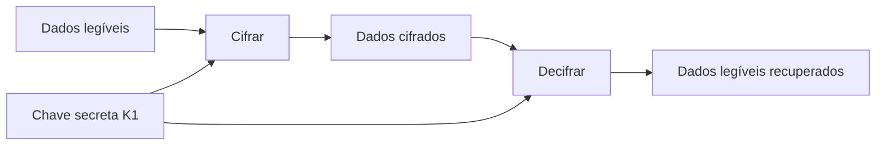
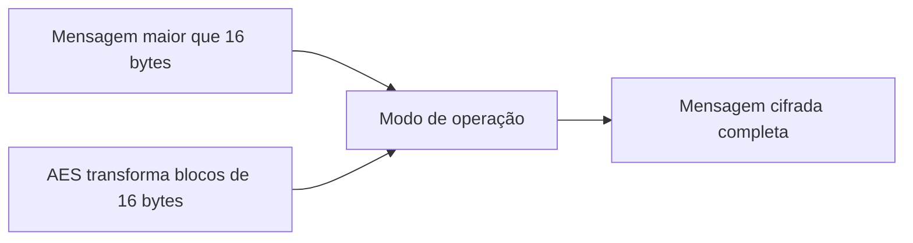
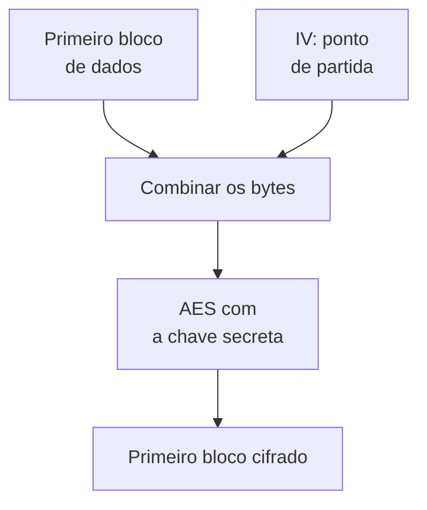
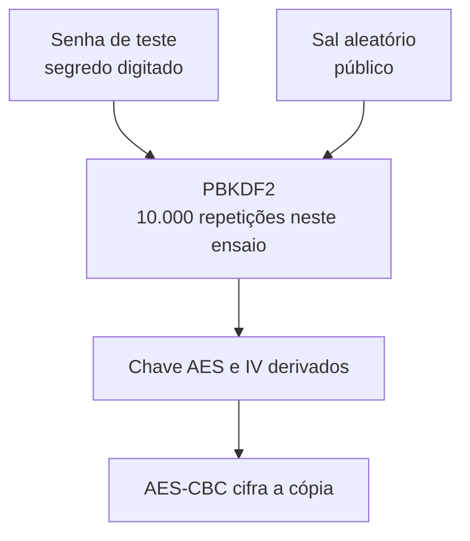
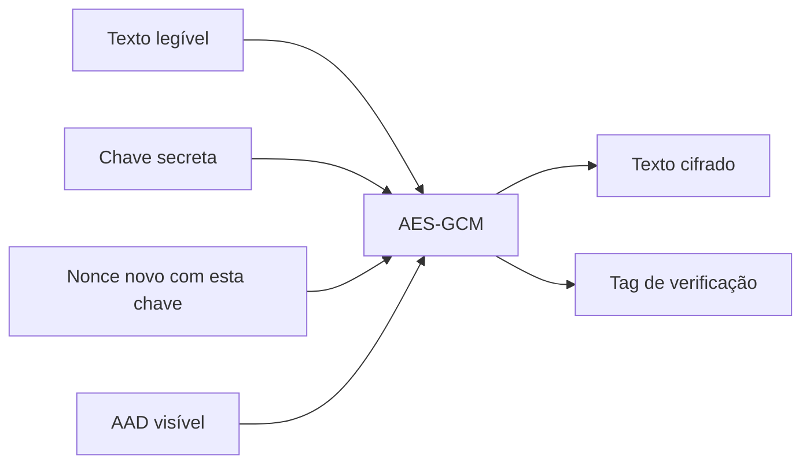
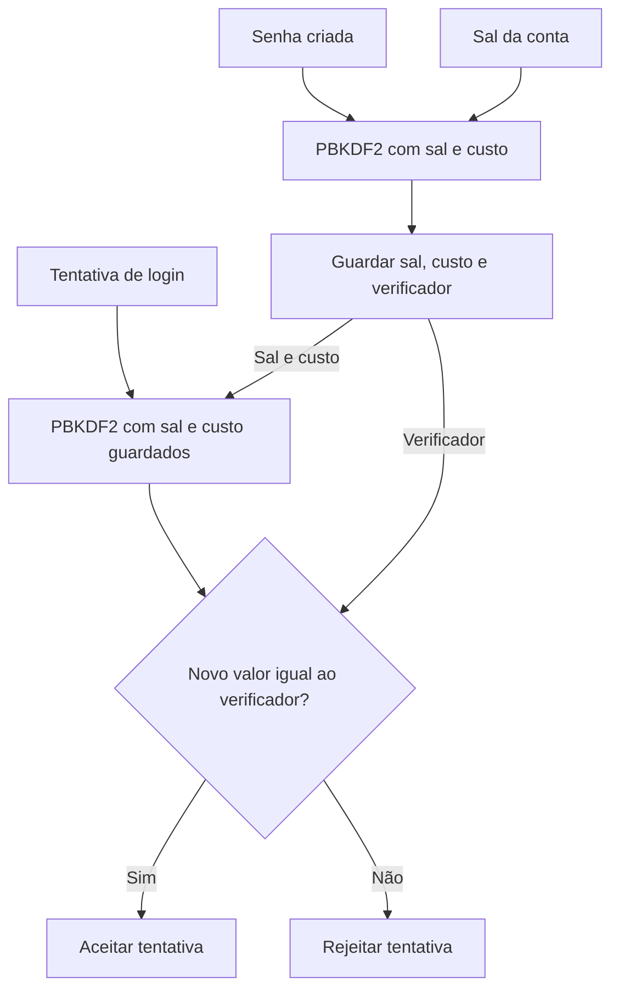

# A14 (provisória) — Cifra simétrica, hash e senhas

**Como proteger uma cópia e verificar se ela pode ser aceita?** Primeiro veremos a cifra com a mesma chave secreta nos dois sentidos. Depois, cada mecanismo responderá a uma pergunta diferente: manter o conteúdo secreto, detectar alteração ou conferir uma senha.

**Tempo:** 100 minutos, com exposição e prática guiada intercaladas.

**Recursos:** terminal Ubuntu no WSL, VS Code, OpenSSL e Python 3 com a biblioteca `cryptography`. Os resultados esperados na página servem de alternativa se o ambiente falhar. Use somente dados de teste e senha descartável.

**Objetivos de aprendizagem**

1. Descrever o percurso do texto legível ao cifrado e de volta com a mesma chave, distinguindo o algoritmo AES do modo de operação.
2. Distinguir sigilo de detecção de alteração em AES-GCM, hash e HMAC.
3. Justificar a necessidade de sal individual e custo no armazenamento de senhas.

Esta aula inicia o [registro único de criptografia e confiança](#atividade), preenchido após cada observação e continuado na A15–A16. O preenchimento de hoje não exige entrega separada.

## Cifra simétrica: a mesma chave nas duas operações {#fundamentos}

**Cifrar** transforma dados legíveis em bytes que não revelam diretamente o conteúdo. **Decifrar** recupera os dados legíveis. Os nomes **texto claro** e **texto cifrado** também se aplicam a arquivos que não contêm frases.

Uma **chave criptográfica** é um valor usado pelo algoritmo para controlar o resultado. Ela não é o próprio algoritmo: podemos conhecer todas as regras da operação sem conhecer a chave. Na **cifra simétrica**, quem cifra e quem decifra precisam da **mesma chave secreta**. Chamaremos a chave de teste de **K1**. O nome *simétrica* descreve esse uso da mesma chave nos dois sentidos.



**Leia o esquema:** K1 entra nas duas operações. Os dados cifrados podem ser copiados ou transportados; K1 deve ficar sob acesso controlado.

**Exemplo:** um programa cifra `ordem=7;estado=aprovado` com K1. Para recuperar esses bytes, a abertura precisa da **mesma K1**.

- **Perda de K1:** a cópia pode ficar irrecuperável.
- **Exposição de K1:** quem obtiver a cópia poderá tentar abri-la.

Registre os dois efeitos antes de avançar.

A propriedade obtida aqui é **confidencialidade**: restringir a leitura da cópia. O programa autorizado ainda precisa acessar K1 e o texto depois de aberto; por isso a cifra não substitui a proteção do dispositivo discutida na [A13](A13-protecao-de-endpoints.md). Ver bytes ilegíveis também não prova que a cópia recebida não foi modificada.


### Prática curta no WSL: observar o percurso da cifra

**Estado inicial:** abra o terminal Ubuntu do WSL. `openssl version` deve informar a versão; `printf` cria um arquivo com bytes fictícios. Os comandos escrevem somente em `~/cripto-a14`. Preveja o conteúdo de cada arquivo antes de executá-los.

```bash
mkdir -p ~/cripto-a14
cd ~/cripto-a14
printf 'ordem=7;estado=aprovado' > claro.txt
cat claro.txt
openssl version
```

**Leia cada linha antes de executar:**

| Comando | O que faz |
|---|---|
| `mkdir -p ~/cripto-a14` | Cria a pasta de teste na área pessoal; `-p` evita erro se ela já existir. |
| `cd ~/cripto-a14` | Entra nessa pasta; os próximos arquivos serão criados nela. |
| `printf ... > claro.txt` | Escreve o texto entre aspas em `claro.txt`; `>` cria ou substitui esse arquivo, sem acrescentar quebra de linha. |
| `cat claro.txt` | Mostra o conteúdo legível do arquivo. |
| `openssl version` | Mostra a versão do OpenSSL disponível no WSL; ainda não cifra nada. |

**Resultado esperado:** `cat` mostra a frase exata; `openssl version` identifica a ferramenta. Registre `T1 → entrada legível → chave ainda não usada`. Se OpenSSL não existir, acompanhe a projeção e registre o resultado como **fornecido**. **Pare** para explicar onde a mesma chave entrará nos dois sentidos.

## AES: algoritmo de blocos e modo de operação {#aes}

**AES** (*Advanced Encryption Standard*) é um algoritmo de cifra simétrica padronizado pelo NIST. Ele transforma um **bloco de 128 bits**, isto é, 16 bytes, usando uma chave de 128, 192 ou 256 bits. Em **AES-256**, o número 256 descreve o tamanho da chave; o bloco continua tendo 128 bits. O algoritmo é público: o segredo necessário para abrir o conteúdo é a chave. Esses tamanhos e funções são definidos na [FIPS 197](https://csrc.nist.gov/pubs/fips/197/final).

Um arquivo pode ter centenas ou milhões de bytes, enquanto AES transforma um bloco de 16 bytes por operação. Uma mensagem de 40 bytes, por exemplo, ultrapassa dois blocos completos e ainda tem uma parte final.

**Modo de operação** é o conjunto de regras que aplica a cifra à mensagem inteira. Ele define como as partes são processadas, como iniciar a operação e quais valores precisam acompanhar o resultado. Por isso, “cifrado com AES” ainda não descreve o procedimento completo.



**Leia o esquema:** AES transforma blocos; o modo organiza o tratamento da mensagem completa. O modo também determina se a operação entrega apenas sigilo ou inclui verificação de alteração. Não será necessário calcular blocos à mão.

| Camada | O que define | O que ainda falta decidir |
|---|---|---|
| AES | Como transformar um bloco com uma chave. | Como tratar a mensagem completa. |
| Modo de operação | Como usar AES ao longo da mensagem. | Quais propriedades o modo oferece e como gerenciar seus parâmetros. |


### CBC e IV: iniciar o encadeamento {#iv}

**CBC** é um modo que encadeia blocos: antes de cifrar cada bloco, combina seus bytes com o bloco cifrado anterior. O primeiro bloco ainda não tem um anterior; por isso, usa um **IV** como ponto de partida.

**IV** significa *Initialization Vector*, ou **vetor de inicialização**. Em português, pronuncie as letras: **“i-vê”**. É um valor adicional à chave, usado para iniciar a operação.



**Leia o esquema:** o IV participa da combinação inicial; a chave controla a transformação feita pelo AES. O bloco cifrado produzido será usado na combinação do próximo bloco.

- **Tamanho:** no AES-CBC, o IV tem 16 bytes, o mesmo tamanho de um bloco AES.
- **Geração:** cada nova cifragem precisa de um IV imprevisível, normalmente obtido com um gerador criptográfico de valores aleatórios.
- **Segredo:** o IV pode acompanhar a mensagem; a chave deve permanecer secreta.
- **Abertura:** para decifrar corretamente, é necessário usar a mesma chave e o mesmo IV da cifragem.

**Exemplo:** com a mesma chave e o mesmo primeiro bloco de dados, IVs diferentes produzem primeiros blocos cifrados diferentes. Isso evita que a repetição daquele início gere sempre o mesmo resultado.

O IV também precisa ser protegido contra alteração; CBC sozinho não oferece essa verificação ([NIST SP 800-38A, seção 6.2 e apêndice C](https://nvlpubs.nist.gov/nistpubs/Legacy/SP/nistspecialpublication800-38a.pdf)).

### Senha e sal: obter material para AES-CBC

Nesta prática, digitaremos uma senha de teste para cifrar e abrir uma cópia. A senha digitada **não é** a chave AES pronta.

**Como a senha vira material para a cifra?** Uma função de derivação de chave, ou **KDF**, recebe senha, sal e parâmetros. Aqui a KDF é **PBKDF2**. Ela repete o cálculo conforme um custo definido e produz material para a chave AES e o IV.

**Sal e IV têm funções diferentes:** o sal entra na **derivação**; o IV entra no **início da cifragem CBC**. Neste comando do OpenSSL, ambos se conectam porque PBKDF2 deriva a chave e o IV usando a senha e o sal. Na abertura, a mesma senha, sal e parâmetros permitem reconstruir os dois valores.



**Leia o esquema:** o **sal** muda a derivação. Mesmo com a mesma senha, outro sal produz outro material. O sal não precisa ser secreto; o OpenSSL o grava no início de `copia.cbc`. Para abrir a cópia, o programa lê esse sal e repete PBKDF2 com a mesma senha e os mesmos parâmetros.

O parâmetro `-pbkdf2` escolhe a KDF; `-salt` pede um sal novo; `-iter 10000` fixa o custo deste ensaio. **10.000 não é recomendação de produção.** Repetições tornam cada palpite mais caro, mas não consertam uma senha fraca. Veja a [RFC 8018](https://www.rfc-editor.org/rfc/rfc8018.html#section-4) e o [manual do OpenSSL](https://docs.openssl.org/3.5/man1/openssl-enc/).

### Prática curta no WSL: cifrar e abrir com AES-CBC

A primeira linha abaixo solicita uma senha descartável duas vezes; a linha de abertura pede a mesma senha. Os caracteres digitados não aparecem na tela. Use apenas a pasta e o arquivo fictício preparados em T1.

```bash
openssl enc -aes-256-cbc -salt -pbkdf2 -iter 10000 -in claro.txt -out copia.cbc
od -An -tx1 -N32 copia.cbc
od -An -tc -N8 copia.cbc
openssl enc -d -aes-256-cbc -pbkdf2 -iter 10000 -in copia.cbc -out aberto.txt
cat aberto.txt
```

**Leia cada linha:**

| Linha | O que faz |
|---|---|
| `openssl enc ... -in claro.txt -out copia.cbc` | Cifra `claro.txt` com AES-256 no modo CBC e grava `copia.cbc`. `-salt` gera o sal; `-pbkdf2` deriva chave e IV da senha digitada; `-iter 10000` define a contagem de repetições. |
| `od -An -tx1 -N32 copia.cbc` | Mostra os primeiros 32 bytes da cópia em hexadecimal: `-N32` limita a leitura e `-An` omite os endereços. **Não decifra.** |
| `od -An -tc -N8 copia.cbc` | Mostra os primeiros 8 bytes como caracteres (`-tc`), para localizar o marcador `Salted__`. **Não revela a senha.** |
| `openssl enc -d ... -in copia.cbc -out aberto.txt` | `-d` pede a decifragem. O programa lê o sal da cópia, solicita a senha, usa as mesmas 10.000 repetições e grava `aberto.txt`. |
| `cat aberto.txt` | Mostra o texto recuperado para comparação com `claro.txt`. |

**Resultado esperado:** o primeiro `od` mostra bytes em hexadecimal, sem a frase legível. O segundo mostra o marcador `Salted__`: no formato produzido por estes comandos, os 8 bytes seguintes guardam o sal; os demais contêm dados cifrados. `cat aberto.txt` recupera `ordem=7;estado=aprovado`. Os bytes do sal variam a cada execução.

**Registre T2:** `senha + sal → PBKDF2 → chave/IV`, a posição do sal na cópia e o texto recuperado. Não anote a senha. Se faltar OpenSSL, use os resultados acima como **dados fornecidos**, sem inventar bytes.

**Pare:** o aspecto ilegível não demonstra integridade. Não altere CBC para tratar um erro eventual como verificação de tag; o [manual do OpenSSL](https://docs.openssl.org/3.5/man1/openssl-enc/) esclarece que `enc` não implementa GCM.

## Integridade e autenticação: verificar antes de aceitar {#propriedades}

**Confidencialidade** restringe a leitura. **Integridade**, aqui, significa detectar mudança nos dados protegidos antes de usá-los. Uma cópia ilegível pode estar cifrada e, ainda assim, ter sido alterada. A aparência dos bytes não responde à pergunta sobre alteração.

**Autenticar uma mensagem** é conferir, com a chave compartilhada, se o conjunto recebido corresponde ao que foi protegido. A cifragem autenticada produz uma **tag**: valor de verificação calculado sobre os dados protegidos. Na abertura, uma tag incompatível causa rejeição, sem entregar texto legível para uso.

Essa autenticação tem um limite: **não é login nem identifica uma pessoa**. Se várias pessoas conhecem a chave, qualquer uma pode produzir um conjunto válido.

**Exemplo:** texto cifrado e tag originais abrem com K1. Troque um bit do texto cifrado e mantenha a tag: a abertura falha. O resultado sustenta a rejeição da cópia alterada neste teste, sem revelar quem a mudou.

Uma **cifra autenticada** reúne duas funções:

- **Sigilo:** restringe a leitura do texto.
- **Verificação:** rejeita alterações detectadas antes do uso.

**GCM** (*Galois/Counter Mode*) é um modo de operação que oferece essas funções. **AES-GCM** significa usar AES no modo GCM. Não se trata de outra cifra independente ([NIST SP 800-38D](https://csrc.nist.gov/pubs/sp/800/38/d/final)).

### Nonce: distinguir uma cifragem da seguinte

Imagine duas cópias protegidas com a **mesma chave K1**. Cada cifragem precisa receber um **nonce novo**: N1 para a primeira, N2 para a segunda. *Nonce* significa “número usado uma vez”. No GCM, a regra essencial é **não repetir o par chave–nonce**. Reutilizar K1 com N1 em outra cifragem compromete as garantias de sigilo e integridade ([NIST SP 800-38D](https://csrc.nist.gov/pubs/sp/800/38/d/final)).

O nonce não é uma senha nem substitui a chave. Ele pode ser guardado junto do texto cifrado para que a abertura use o mesmo valor. O **sal** da prática CBC tinha outra função: participar da derivação da chave e do IV a partir de uma senha. Aqui, o programa já gera diretamente uma chave AES; `urandom(12)` cria um nonce de 12 bytes para aquela operação.

### AAD: vincular um dado que continua visível

Uma cópia pode trazer um rótulo público, como `tipo=ordem;versao=1`. O sistema pode precisar ler `tipo` e `versao` **antes** de abrir o conteúdo. Esse rótulo é **AAD** (*additional authenticated data*, ou dados adicionais autenticados): permanece legível, mas entra na verificação da tag junto com o texto cifrado ([glossário NIST](https://csrc.nist.gov/glossary/term/AAD)).

Se alguém trocar `versao=1` por `versao=2` sem a chave, a abertura com a tag original falha. Assim, o rótulo não pode ser mudado silenciosamente. AAD oferece **verificação de alteração**, não sigilo: se o rótulo contiver informação confidencial, coloque-o dentro do texto a cifrar.

### Chave, sal, nonce e AAD: funções diferentes {#chave-nonce}

| Valor | Onde atua | Precisa ficar secreto? |
|---|---|---|
| **Chave** | Cifra e abre os dados. | **Sim.** O programa a mostra só para estudo com dados fictícios. |
| **Sal** | Diversifica a derivação de uma chave ou verificador **a partir de senha**. | Não; deve ser guardado para repetir a derivação. |
| **Nonce** | Distingue cada cifragem AES-GCM feita com a mesma chave. | Não; precisa ser único para essa chave. |
| **AAD** | Vincula um rótulo visível ao texto cifrado pela tag. | Não neste exemplo; se o dado for secreto, cifre-o como texto. |

**AES-GCM precisa de sal?** Não nesta prática: `generate_key` cria diretamente uma chave aleatória. Se uma aplicação partir de uma **senha humana**, deverá derivar a chave antes de usar AES-GCM; nessa etapa de derivação entram o sal e os parâmetros da KDF. O **nonce** continua necessário na operação GCM. Sal e nonce não se substituem.

Com a chave já pronta, a operação recebe **texto legível, nonce e AAD**. Ela entrega **texto cifrado e tag**:



**Leia o esquema:** o texto passa à forma cifrada; o AAD permanece legível, mas participa da tag. Para abrir, o programa recebe chave, nonce, AAD, texto cifrado e tag. Só entrega o texto legível se a verificação passar. G1 usa as entradas originais; G3 muda apenas o AAD.

### Prática curta no WSL: conferir a tag de AES-GCM {#gcm-terminal}

Este exercício usa a biblioteca Python [`cryptography`](https://cryptography.io/en/stable/hazmat/primitives/aead/#cryptography.hazmat.primitives.ciphers.aead.AESGCM), que implementa AES-GCM. **Crie um arquivo Python no VS Code** e execute-o no terminal WSL. O código fica separado dos comandos, para que você possa ler e alterar cada parte.

1. No terminal WSL, entre na pasta da A14 com `cd ~/cripto-a14`. Se ela ainda não existir, crie-a com `mkdir -p ~/cripto-a14` e repita o `cd`.
2. Digite `code .` no WSL para abrir essa pasta no VS Code. O ponto significa **pasta atual**. Se `code` não estiver disponível, no VS Code use **Conectar ao WSL** e abra `~/cripto-a14`.
3. Crie `aes_gcm_a14.py` nessa pasta, copie **somente o código Python abaixo** e salve. O [arquivo `.py` pronto para baixar](../assets/a14-a17/aes_gcm_a14.py) contém o mesmo código, se preferir abri-lo no editor.
4. Leia as seções numeradas do arquivo. Antes de executar, preveja o que acontecerá com a tag original, a tag alterada e o AAD alterado.

**Estado inicial:** o programa usa dados fictícios e cria uma chave e um nonce novos em memória. `encrypt` devolve **texto cifrado com a tag nos últimos 16 bytes**. Os valores aleatórios mudam a cada execução; compare os valores **dentro da mesma execução**. A chave será impressa apenas para estudo neste laboratório: ela é secreta em uso real e não deve entrar na entrega.

```python
from os import urandom
from cryptography.hazmat.primitives.ciphers.aead import AESGCM
from cryptography.exceptions import InvalidTag

# 1. Preparar entradas e cifrar
key = AESGCM.generate_key(bit_length=256)       # chave descartável de 256 bits
nonce = urandom(12)                               # nonce novo de 12 bytes
aad = b'tipo=ordem;versao=1'                     # rótulo visível, mas autenticado
text = b'ordem=7;estado=aprovado'                 # conteúdo a cifrar
sealed = AESGCM(key).encrypt(nonce, text, aad)   # texto cifrado + tag

# 2. Mostrar entradas e separar as partes da saída
print("Key:   ", key.hex())
print("Nonce: ", nonce.hex())
print("AAD:   ", aad.hex())
print("Text:  ", text.hex())
print("Sealed:", sealed.hex())

print("\nRepresentação textual:")
print("AAD:   ", aad.decode("utf-8"))
print("Text:  ", text.decode("utf-8"))

print("\nComponentes AES-GCM:")
print("Ciphertext:", sealed[:-16].hex())
print("Tag:       ", sealed[-16:].hex())

# 3. Abrir o conjunto original
print('G1 tag:', sealed[-16:].hex())              # mostra a tag original
print('G1 texto:', AESGCM(key).decrypt(nonce, sealed, aad).decode())

# 4. Alterar um bit da tag e tentar abrir
tampered = sealed[:-1] + bytes([sealed[-1] ^ 1]) # muda um bit da tag
print('G2 tag:', tampered[-16:].hex())            # mostra a tag alterada
try:
    AESGCM(key).decrypt(nonce, tampered, aad)    # tenta abrir o conjunto alterado
    print('G2: aceito (inesperado)')
except InvalidTag:
    print('G2: rejeitado; texto não entregue')

# 5. Manter a tag original e alterar somente o AAD
altered_aad = b'tipo=ordem;versao=2'           # muda só AAD
try:
    AESGCM(key).decrypt(nonce, sealed, altered_aad)
    print('G3: aceito (inesperado)')
except InvalidTag:
    print('G3: rejeitado; AAD alterado')
```

**Execute no terminal WSL**, dentro da pasta onde salvou o arquivo:

```bash
python3 aes_gcm_a14.py
```

`python3` executa o arquivo indicado; o nome `aes_gcm_a14.py` deve corresponder ao arquivo salvo no VS Code. **Leia as operações do programa:**

- As linhas `from` carregam AES-GCM, a fonte de bytes aleatórios e o nome do erro de tag.
- `b'...'` representa bytes; `generate_key` cria a chave e `urandom(12)` cria um nonce de 12 bytes. `encrypt` devolve texto cifrado **seguido da tag**.
- `.hex()` mostra bytes em hexadecimal: cada par de caracteres representa um byte. `.decode("utf-8")` mostra como texto legível o AAD e a mensagem de teste. São duas representações dos **mesmos bytes**, não duas mensagens diferentes.
- `Sealed` é o conjunto completo devolvido por `encrypt`. `sealed[:-16]` mostra apenas o **ciphertext**; `sealed[-16:]` mostra a **tag**. Junte essas duas sequências, na mesma ordem, e você obtém os bytes exibidos em `Sealed`.
- Em **G1**, `decrypt` recebe as mesmas entradas usadas na cifragem e `.decode()` mostra o texto recuperado.
- `sealed[:-1]` conserva tudo menos o último byte; `^ 1` inverte um bit desse byte da tag. Em **G2**, `try/except InvalidTag` mostra a rejeição sem usar texto não autenticado. Em **G3**, os bytes cifrados e a tag voltam a ser os originais, mas o AAD muda de `versao=1` para `versao=2`.

| Caso | Saída esperada | O que concluir |
|---|---|---|
| G1 — tag original | `G1 texto: ordem=7;estado=aprovado` | O conjunto original foi aceito e o texto recuperado. |
| G2 — um bit da tag alterado | `G2: rejeitado; texto não entregue` | A tag recebida não corresponde ao conjunto protegido. |
| G3 — somente AAD alterado | `G3: rejeitado; AAD alterado` | O AAD permanece visível, mas sua mudança também é detectada. |

**Registre G1–G3:** localize `Key`, `Nonce`, `AAD`, `Text`, `Ciphertext` e `Tag` na saída. Compare `Sealed` com suas duas partes e as tags de G1/G2 para indicar o byte que mudou. A biblioteca confere a tag internamente: entrega o texto em G1 e lança `InvalidTag`, capturado pelo código, em G2 e G3. A falha demonstra a rejeição **neste teste controlado**, sem identificar quem mudou o arquivo. Não copie `Key` para o registro entregue.

**Pare** após G3, sem reutilizar a chave ou o nonce de teste. Se a saída diferir, registre a mensagem de erro e use o quadro acima como resultado **fornecido**, não observado.

Se aparecer `ModuleNotFoundError: No module named 'cryptography'`, o Python usado no terminal não possui a biblioteca. Confira que o terminal é o do WSL e informe ao professor; acompanhe a execução projetada ou use o quadro G1–G3 como dado fornecido. Se aparecer “can't open file”, confirme a pasta com `pwd` e o nome do arquivo com `ls`. Não trate erro de instalação ou de caminho como falha de autenticação.

**CBC e GCM são modos diferentes para usar AES:**

| Modo | Como participa da cifragem | O que este modo entrega sozinho |
|---|---|---|
| CBC | Encadeia blocos; o primeiro usa um valor inicial chamado **IV**. | Sigilo, sem tag de autenticação própria. |
| GCM | Usa nonce e calcula a tag sobre o conjunto protegido. | Sigilo e rejeição de alteração antes de aceitar o texto. |

Por isso, o exercício com `openssl enc -aes-256-cbc` mostra cifragem e abertura, enquanto G1–G3 testam a verificação da tag e do AAD. A [NIST SP 800-38A](https://csrc.nist.gov/pubs/sp/800/38/a/final) descreve CBC como modo de confidencialidade.

**Decida:** o rótulo de tipo e versão do exercício precisa ficar secreto ou apenas vinculado ao conteúdo? Justifique com a propriedade correspondente. A tag não diz quem, entre várias pessoas que conhecem K1, produziu a mensagem.

Nesta prática, a chave e o nonce são criados de novo a cada execução. Em um sistema real, geração, reinício e volume de mensagens exigem planejamento para preservar a unicidade do par chave–nonce ([NIST SP 800-38D, seções 8–9](https://nvlpubs.nist.gov/nistpubs/legacy/sp/nistspecialpublication800-38d.pdf)).

## Síntese: guardar a cópia {#aplicacao}

Para `ordem=7;estado=aprovado`, guarde nonce, AAD público e texto cifrado com tag junto da cópia; proteja K1 separadamente. Se o rótulo contiver informação sigilosa, inclua-o no texto cifrado. Uma abertura válida permite usar o conteúdo **somente após a verificação**. A cifra não substitui proteção do endpoint nem recuperação da chave.

## Hash e digest: comparar o conteúdo exato {#digest}

Uma **função hash criptográfica** recebe bytes e produz um resumo de tamanho fixo, chamado **digest**. SHA-256 produz 256 bits (32 bytes). Os mesmos bytes produzem o mesmo digest; alterar os bytes quase certamente muda o resultado. Hash não cifra: o conteúdo pode continuar legível.

A função é projetada para dificultar encontrar duas entradas diferentes com o mesmo digest. Ainda assim, um digest igual não identifica quem criou ou publicou o arquivo.

Para conferir uma cópia, calcule seu digest e compare com um valor publicado pelo fornecedor **por um canal confiável**. Se alguém puder substituir tanto a cópia quanto a referência, a igualdade não demonstra legitimidade. Essa distinção entre comparação de bytes e confiança na origem será usada novamente em assinaturas e certificados.

O exemplo `abc` tem um digest SHA-256 conhecido: `ba7816bf8f01cfea414140de5dae2223b00361a396177a9cb410ff61f20015ad` ([exemplo NIST](https://csrc.nist.gov/csrc/media/projects/cryptographic-standards-and-guidelines/documents/examples/sha256.pdf)).

A entrada são exatamente três bytes ASCII, sem aspas, espaço ou quebra de linha. Uma comparação exige os mesmos bytes e a mesma codificação; aparência semelhante não basta.

**Prática curta no WSL:** no mesmo diretório, preveja os dois resumos e execute:

```bash
printf 'abc' > hash-a.txt
printf 'abd' > hash-b.txt
sha256sum hash-a.txt hash-b.txt
```

As duas linhas com `printf` criam arquivos de três bytes, sem quebra de linha; `>` cria ou substitui cada arquivo. `sha256sum` calcula e mostra o digest SHA-256 **de cada arquivo**, seguido do nome. O primeiro deve corresponder ao valor NIST acima; o segundo deve diferir.

**Registre D1:** `abc` coincide com a referência NIST; `abd` difere. Anote os bytes comparados e a origem da referência. Se `sha256sum` faltar, use o valor NIST como **dado fornecido**. A igualdade não atribui autoria.

## HMAC: verificar mensagem com segredo compartilhado {#hmac}

Um **código de autenticação de mensagem** (*MAC*) depende de uma chave secreta compartilhada. **HMAC** é um MAC construído a partir de hash ([RFC 2104](https://www.rfc-editor.org/info/rfc2104/)). Quem recebe a mensagem confere o código com a **mesma chave** usada para produzi-lo.

| Operação | Entrada necessária | Resultado | O conteúdo fica secreto? |
|---|---|---|---|
| SHA-256 de D1 | Bytes do arquivo. | Digest para comparar com uma referência confiável. | Não. |
| HMAC de M1–M3 | Bytes da mensagem **e chave compartilhada**. | Código que deve mudar se a mensagem ou a chave mudar. | Não. |

Um código válido demonstra correspondência sob a chave. Se duas partes a conhecem, não distingue qual delas criou a mensagem.

**Prática curta no WSL:** no mesmo diretório, execute:

```bash
printf 'pedido=7;valor=10' > msg-a.txt
printf 'pedido=7;valor=11' > msg-b.txt
openssl dgst -sha256 -hmac 'chave-aula-descartavel' msg-a.txt msg-b.txt
openssl dgst -sha256 -hmac 'chave-aula-descartavel' msg-a.txt
openssl dgst -sha256 -hmac 'outra-chave-aula' msg-a.txt
```

**Leia cada linha:**

| Linha | O que faz |
|---|---|
| `printf ... > msg-a.txt` | Cria a mensagem original com `valor=10`, sem quebra de linha. |
| `printf ... > msg-b.txt` | Cria a mensagem alterada com `valor=11`. |
| Primeiro `openssl dgst` | Calcula um HMAC por arquivo. `-sha256` escolhe SHA-256; `-hmac` usa a chave literal de teste. Os nomes finais indicam os arquivos de entrada. |
| Segundo `openssl dgst` | Recalcula o HMAC de `msg-a.txt` com **a mesma chave**: o código deve coincidir com o primeiro. |
| Terceiro `openssl dgst` | Usa **outra chave** sobre `msg-a.txt`: o código deve diferir. |

A saída traz códigos HMAC, **não mensagens cifradas**. Os dois textos continuam legíveis nos arquivos.

**Registre M1–M3:** compare os códigos gerados para mesma mensagem/chave, mensagem alterada e chave alterada. A chave literal é pública nesta página e serve apenas ao ensaio. Se OpenSSL faltar, use M1–M3 abaixo como **dados fornecidos**. O código não identifica qual detentor da chave produziu a mensagem.

### Quadro de resultados para acompanhar ou substituir o terminal

Estas linhas são **referência de comportamento esperado**. O valor calculado no terminal depende exatamente dos bytes da mensagem e da chave literal de teste.

| ID | Entradas | Resultado esperado | O que ainda não foi provado |
|---|---|---|---|
| D1 | SHA-256 de `abc` contra a referência NIST; depois `abd` | Coincide; depois difere | Autoria e procedência de qualquer arquivo externo. |
| M1 | Mensagem original e mesma chave de teste | Código coincide ao recalcular | Qual detentor da chave produziu a primeira versão. |
| M2 | Mensagem com `valor=11`, mesma chave | Código difere do M1 | Qual campo mudou fora deste teste controlado. |
| M3 | Mensagem original, outra chave | Código difere do M1 | Se a chave real está protegida no sistema. |

Se `sha256sum` ou OpenSSL não funcionar, leia o quadro na ordem D1–M3 e identifique-o como resultado fornecido. Se houver outro erro, anote comando e mensagem sem dados sensíveis. Espaços, acentos, quebras de linha e codificação mudam os bytes; confira a entrada exata antes de atribuir divergência a adulteração. A aceitação e rejeição do HMAC dependem da chave correta, mas não entregam diagnóstico causal de um evento real por si só.

## Senhas: conferir uma tentativa sem guardar a senha {#senhas}

Na prática D1, SHA-256 permitiu comparar os bytes de **arquivos**. Agora a pergunta é outra: quando alguém cria uma conta e depois digita uma senha, como um programa confere essa tentativa sem manter uma cópia da senha na base de contas? Aqui, **serviço** significa o programa que recebe e confere a senha, como o responsável pelo login de um site. Nesta aula, vamos executar somente as operações locais, sem criar um site ou contas reais.

Guardar a senha em texto legível expõe todas as contas se a base for copiada. Guardar apenas `SHA-256(senha)` também é inadequado: SHA-256 é rápido, e uma base vazada permite testar muitos palpites fora do serviço. O hash de D1 continua útil para comparar arquivos; a finalidade de **verificar senhas** pede um esquema próprio, com sal e custo ([OWASP](https://cheatsheetseries.owasp.org/cheatsheets/Password_Storage_Cheat_Sheet.html)).

### Cadastro e conferência: duas operações sobre o mesmo registro



No **cadastro**, o programa gera um sal para aquela conta, deriva um **verificador** da senha e guarda `esquema + custo + sal + verificador`. A senha legível não entra nesse registro. O sal pode ser público; sua função é separar contas, inclusive quando duas pessoas escolhem a mesma senha.

Na **conferência**, o programa recebe uma tentativa, usa o **sal e o custo guardados para aquela conta** e calcula outro valor. Se ele corresponder ao verificador, a tentativa é aceita. Não existe operação de “decifrar o verificador” para recuperar a senha.

O **custo** define trabalho repetido para cada derivação. Isso também torna mais caras as tentativas de um atacante que obteve a base. Não torna uma senha fraca segura nem substitui a limitação de tentativas no serviço. O [NIST SP 800-63B-4](https://pages.nist.gov/800-63-4/sp800-63b/authenticators/) descreve sal, custo e registro do esquema para verificadores de senha.

A prática usa **PBKDF2-HMAC-SHA256**, já introduzido em T2. Lá ele derivou chave e IV para cifrar uma cópia; aqui gera um verificador para conferir uma senha. As **100.000 iterações são apenas um parâmetro didático**. Para um sistema real, escolha um esquema e custo conforme recomendações atuais, como [Argon2id na OWASP](https://cheatsheetseries.owasp.org/cheatsheets/Password_Storage_Cheat_Sheet.html), e meça o desempenho no ambiente.

### Prática curta no VS Code e WSL: observar cadastro e conferência {#senha-terminal}

**Objetivo:** com a **mesma senha fictícia** em duas contas, observar o efeito de sais diferentes e conferir uma tentativa correta e outra incorreta. Os valores são gerados e verificados pelo próprio programa.

1. Na pasta `~/cripto-a14` aberta no VS Code, crie `verificador_senhas_a14.py`. Copie somente o código Python abaixo e salve. O [arquivo `.py` para download](../assets/a14-a17/verificador_senhas_a14.py) contém o mesmo código.
2. Antes de executar, preveja S1–S3: os dois verificadores serão iguais? Qual tentativa será aceita?

```python
from hashlib import pbkdf2_hmac
from hmac import compare_digest
from os import urandom

# Dados fictícios: o programa não recebe nem guarda uma senha real.
senha_de_teste = b'senha-ficticia-123'
iteracoes = 100_000  # valor didático; não é configuração de produção


def derivar(senha_digitada, sal):
    return pbkdf2_hmac('sha256', senha_digitada, sal, iteracoes)


# Cadastro: duas contas usam a mesma senha, mas recebem sais próprios.
sal_7 = urandom(16)
sal_8 = urandom(16)
verificador_7 = derivar(senha_de_teste, sal_7)
verificador_8 = derivar(senha_de_teste, sal_8)

print('Conta 7 — sal:', sal_7.hex())
print('Conta 7 — verificador:', verificador_7.hex())
print('Conta 8 — sal:', sal_8.hex())
print('Conta 8 — verificador:', verificador_8.hex())
print('Custo: ', iteracoes, 'iterações')
print('S1 — verificadores iguais?', compare_digest(verificador_7, verificador_8))

# Conferência: usar o sal e o custo guardados com o verificador da conta 7.
tentativa_correta = b'senha-ficticia-123'
tentativa_incorreta = b'outra-senha'
print('S2 — senha correta aceita?', compare_digest(
    derivar(tentativa_correta, sal_7), verificador_7
))
print('S3 — senha incorreta aceita?', compare_digest(
    derivar(tentativa_incorreta, sal_7), verificador_7
))
```

No terminal WSL, entre na pasta e execute:

```bash
cd ~/cripto-a14
python3 verificador_senhas_a14.py
```

`cd` seleciona a pasta onde o arquivo foi salvo. `python3` executa o arquivo. **Leia o código e a saída:**

- `urandom(16)` gera **16 bytes de sal** para cada conta; `.hex()` permite ver esses bytes. Os valores mudam a cada execução.
- `pbkdf2_hmac('sha256', senha, sal, iteracoes)` deriva o verificador. O `sha256` aqui **faz parte do PBKDF2**, com sal e repetições; não é o SHA-256 direto de D1.
- `compare_digest` compara os valores derivados. Na conferência de S2/S3, o programa usa o sal da conta 7; a senha de teste só existe em memória neste exercício.

| Saída | Resultado esperado | O que demonstra |
|---|---|---|
| S1 — verificadores iguais? | `False` | A mesma senha com sais diferentes produz verificadores diferentes. |
| S2 — senha correta aceita? | `True` | A tentativa refeita com o sal e o custo da conta 7 corresponde ao registro. |
| S3 — senha incorreta aceita? | `False` | A tentativa diferente não corresponde ao verificador da conta 7. |

**Experimente uma mudança:** no VS Code, troque somente `sal_8 = urandom(16)` por `sal_8 = sal_7`, salve e execute outra vez. Preveja S1 antes de olhar. **S4:** S1 passa a `True`, porque senha, sal e custo agora coincidem nas duas contas. Restaure `sal_8 = urandom(16)` e salve: cada conta deve voltar a ter sal próprio. Não use essa configuração alterada para guardar senhas.

**Registre S1–S4:** anote os valores lógicos (`True`/`False`) e explique a mudança em S4 em uma frase. Não copie a senha nem os verificadores completos para a entrega. Se Python não abrir o arquivo, confira `pwd` e `ls`; se `pbkdf2_hmac` não estiver disponível, use a tabela S1–S3 e a previsão de S4 como **dados fornecidos**, sem marcar o teste como executado.

### O que este teste permite decidir

O programa executou a derivação e a comparação de bytes em memória. Ele **não criou uma base de dados nem um login de produção**. Para armazenar um registro real, seriam necessários ao menos o esquema, seus parâmetros, o sal e o verificador por conta; acesso à base, proteção contra tentativas online e atualização futura do custo também precisam ser planejados.

Na [atividade única](../atividades/A14-A18-criptografia-confianca.md#atividade), acrescente a C1 uma conclusão curta: **quais campos o programa precisaria guardar para repetir a conferência e qual dado não deveria guardar?** Use S1/S4 para justificar o sal individual e S2/S3 para justificar a comparação. Essa conclusão se apoia no que foi executado, sem exigir desenho de um serviço imaginário.

## Atividade {#atividade}

Continue **C1** na [atividade única de A14–A16](../atividades/A14-A18-criptografia-confianca.md#atividade), usando os resultados obtidos ao longo da página: T1–T2 para cifra, G1–G3 para autenticação, D1/M1–M3 para hash e HMAC e S1–S4 para senhas. Identifique se cada resultado foi executado ou fornecido. A entrega única será concluída após A16.

## Revisão rápida

1. Por que AES precisa de um modo e por que CBC não equivale a GCM?
2. Que diferença há entre digest, HMAC e cifra autenticada?
3. Por que um sal individual sem custo adequado não resolve o armazenamento de senhas?

## Ilustrações opcionais — Imagens 16–18

Os prompts numerados da [Imagem 16](../assets/a14-a17/prompts-ilustrativos.md#imagem-16), da [Imagem 17](../assets/a14-a17/prompts-ilustrativos.md#imagem-17) e da [Imagem 18](../assets/a14-a17/prompts-ilustrativos.md#imagem-18) estão prontos para geração posterior. Os esquemas nativos acima já mostram as relações necessárias para estudar e executar as práticas.

## Referências

- [NIST FIPS 197](https://csrc.nist.gov/pubs/fips/197/final), [SP 800-38A](https://csrc.nist.gov/pubs/sp/800/38/a/final), [SP 800-38D](https://csrc.nist.gov/pubs/sp/800/38/d/final).
- [OpenSSL `enc`](https://docs.openssl.org/3.5/man1/openssl-enc/) e [`dgst`](https://docs.openssl.org/3.5/man1/openssl-dgst/).
- [RFC 8018 — PBKDF2, sal e contagem de repetições](https://www.rfc-editor.org/info/rfc8018/).
- [Documentação da biblioteca `cryptography` — AESGCM](https://cryptography.io/en/stable/hazmat/primitives/aead/#cryptography.hazmat.primitives.ciphers.aead.AESGCM).
- [Documentação do Python — `hashlib.pbkdf2_hmac`](https://docs.python.org/3/library/hashlib.html#hashlib.pbkdf2_hmac).
- [NIST FIPS 180-4](https://csrc.nist.gov/pubs/fips/180-4/upd1/final), [RFC 2104](https://www.rfc-editor.org/info/rfc2104/), [OWASP Password Storage Cheat Sheet](https://cheatsheetseries.owasp.org/cheatsheets/Password_Storage_Cheat_Sheet.html).
