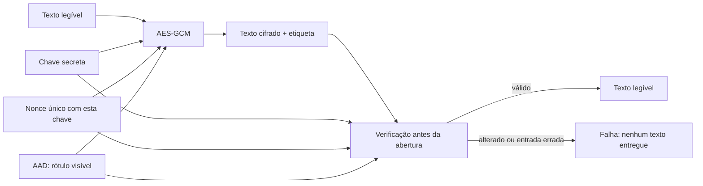

# A14 (provisória) — Cifra simétrica e AES-GCM

**Cifrar** restringe a leitura de um dado a quem possui a chave. **Verificar a integridade** permite rejeitar dados modificados. Esta aula ensina as duas propriedades e mostra como AES-GCM as combina. O texto curto `ordem=7;estado=aprovado` serve apenas como entrada da demonstração.

**Tempo:** 100 minutos (55 de conceitos e 45 de prática guiada). **Recursos:** navegador com JavaScript e Web Crypto em HTTPS ou `localhost`; há um quadro equivalente para leitura sem o painel. Os termos criptográficos são definidos nesta página. Use apenas o texto fictício; não digite dados reais ou senhas.

**Objetivos de aprendizagem**

1. Descrever o percurso do texto legível ao texto cifrado e de volta, explicando a função da chave secreta.
2. Distinguir sigilo do conteúdo de detecção de alteração e identificar as entradas usadas na verificação.
3. Comparar uma abertura válida com alterações controladas e justificar uma decisão de armazenamento e verificação.

Esta aula inicia o [registro único de criptografia e confiança](#atividade), que continuará nos encontros seguintes. O preenchimento de hoje não exige entrega separada.

## Cifra simétrica: transformar e recuperar dados {#fundamentos}

**Criptografia** reúne técnicas matemáticas para proteger informações. Na **cifragem**, o **texto legível** (ou *texto claro*) é transformado em **texto cifrado**, que não expõe diretamente o conteúdo. **Decifrar** é recuperar o conteúdo com a chave adequada. A palavra *texto* inclui qualquer sequência de bytes, como os de um arquivo; não se limita a frases.

Uma **chave** é o valor usado pela operação para controlar essa transformação. A regra do algoritmo pode ser conhecida; a proteção depende de manter a chave adequada em segredo e de usá-la corretamente. Em **criptografia simétrica**, a mesma chave secreta serve para cifrar e decifrar. Chamaremos a chave temporária do exemplo de **K1**. [O padrão AES do NIST](https://csrc.nist.gov/pubs/fips/197/final) define uma cifra simétrica; ainda precisaremos escolher como usá-la para proteger o arquivo.

```text
Texto legível + chave K1 → cifrar → texto cifrado
Texto cifrado + chave K1 → decifrar → texto legível
```

**Exemplo:** um serviço cifra `ordem=7;estado=aprovado` com K1 antes de guardar uma cópia. Quem possui K1 pode recuperar o conteúdo; quem possui somente a cópia não deve conseguir fazê-lo, sob as premissas do mecanismo. Se K1 se perder, a recuperação fica comprometida. Se K1 vazar, o sigilo fica comprometido. Registre os dois efeitos separadamente.

Essa proteção diz respeito à **confidencialidade** da cópia. Ela não torna a chave inacessível ao processo que precisa usá-la, nem protege o texto depois de aberto no endpoint. O processo autorizado ainda pode ler o texto e, conforme suas permissões, alterá-lo — limite relacionado à [A13](A13-protecao-de-endpoints.md). Também não basta ver bytes ilegíveis para concluir que a cópia não foi modificada.

## Cifra autenticada: sigilo e detecção de alteração {#propriedades}

**Confidencialidade** restringe a leitura. **Integridade**, neste contexto, é detectar alteração nos dados protegidos antes de aceitá-los. Bytes ilegíveis não demonstram integridade. Uma **cifra autenticada** combina sigilo do texto e verificação do conjunto recebido. A abertura entrega o texto legível somente quando essa verificação passa; se falhar, o texto não deve ser usado. A verificação não identifica a pessoa que criou ou modificou a cópia.

**AES-GCM** concretiza essa combinação: AES é a cifra simétrica; GCM é o modo de operação que acrescenta a verificação. Além do texto e da chave, usa um **nonce**, valor que precisa ser novo em cada cifragem sob a mesma chave. O resultado contém texto cifrado e uma **tag**, usada na verificação. Também pode receber **AAD** (*dado associado*): informação que continua visível, mas cuja alteração é detectada. [NIST SP 800-38D](https://csrc.nist.gov/pubs/sp/800/38/d/final) especifica GCM; a [Web Cryptography API](https://www.w3.org/TR/webcrypto/#aes-gcm) define a operação usada no painel.

**Síntese das propriedades:**

| Pergunta | Mecanismo ou limite |
|---|---|
| Quem pode ler a cópia? | A cifra mantém o texto legível fora da cópia; a chave K1 permite recuperá-lo. |
| A cópia recebida foi aceita sem alteração detectada? | A verificação da cifra autenticada considera texto cifrado, tag e, quando houver, AAD. |
| O dispositivo que abre a cópia é confiável? | A cifra do arquivo não responde; proteção e resposta do endpoint continuam necessárias. |



O **AAD** pode ser um rótulo necessário para interpretar o arquivo, como `tipo=ordem;versao=1`. Ele participa da verificação, mas **permanece legível**. Se o rótulo for confidencial, deverá ficar dentro do texto cifrado. A tag não diz quem, entre várias pessoas que conhecem K1, produziu a mensagem. **Decida antes do painel:** esse rótulo de tipo e versão precisa ficar secreto ou apenas vinculado ao conteúdo? Justifique com uma das duas propriedades.

## Chave e nonce: registrar funções diferentes {#chave-nonce}

| Campo | Função | Cuidados neste exercício |
|---|---|---|
| Chave K1 | Segredo usado para cifrar e abrir. | O painel a gera no navegador e não a exporta. Recarregar a página elimina K1; não há recuperação do exemplo anterior. |
| Nonce N1 | Valor por operação para a mesma chave; não é segredo e não substitui K1. | O painel sorteia 96 bits novos a cada cifragem. **Não reutilize o par chave–nonce.** |
| Texto cifrado | Bytes que substituem o conteúdo legível fora do limite de confiança. | Pode ser armazenado com o nonce; o conteúdo original não deve ser inferido pela aparência desses bytes. |
| Tag | Valor de verificação produzido pela operação. | Alterar um bit do conjunto protegido deve fazer a abertura falhar. Não trate falha como texto parcialmente válido. |

O requisito de unicidade do nonce é **por chave e operação**. Reuso do mesmo par em GCM compromete garantias de segurança; sortear 96 bits ajuda neste ensaio curto, mas um sistema real precisa especificar geração, volume de mensagens, reinício e coordenação entre dispositivos. A chave precisa de geração, armazenamento, autorização, rotação e recuperação próprios, temas retomados ao longo do bloco. Esses limites constam da [NIST SP 800-38D, seções 8–9](https://nvlpubs.nist.gov/nistpubs/legacy/sp/nistspecialpublication800-38d.pdf).

**Antes de operar:** o painel mostra bytes em **hexadecimal**, uma forma compacta de escrever cada byte com dois caracteres. Você não precisa decifrar essa representação visualmente. Procure os nomes dos campos, compare o que mudou e leia se a abertura entregou texto ou falhou.

## Demonstração: cifrar, abrir e rejeitar {#demonstracao}

**Estado inicial:** nenhum arquivo será enviado ou salvo. O painel abaixo usa a frase e o rótulo fictícios indicados. Todas as operações ocorrem na memória do navegador; o código está no [arquivo da demonstração](../javascripts/a14-aead.js). Cada dupla pode operar o painel em seu navegador. Se isso não for possível, acompanhe a projeção ou use o quadro alternativo; em todos os casos, faça sua própria previsão e interpretação. Uma pessoa anuncia a previsão, a outra registra o resultado; troquem as funções após F1. Espere a comparação coletiva antes de avançar para o próximo caso.

<div id="a14-aead" class="a14-panel" aria-label="Demonstração de cifra autenticada">
  <p id="a14-status" role="status">Preparando a demonstração. Se ela não abrir, use o quadro de resultados logo abaixo.</p>
  <p><button type="button" id="a14-encrypt">1. Cifrar com K1 e nonce novo</button> <button type="button" id="a14-open" disabled>2. Abrir sem alteração</button></p>
  <p><button type="button" id="a14-tamper" disabled>3. Alterar um bit do texto cifrado</button> <button type="button" id="a14-aad" disabled>4. Alterar o AAD</button> <button type="button" id="a14-wrong-key" disabled>5. Tentar outra chave</button></p>
  <pre id="a14-output" tabindex="0" aria-label="Resultado textual da demonstração">Aguardando a primeira operação.</pre>
</div>

1. **Prepare e preveja.** Verifique que o painel diz “pronto”. Preveja quais campos aparecerão após **Cifrar**. Clique no botão 1. **Resultado esperado:** K1 permanece secreta, N1 aparece em hexadecimal, e o texto cifrado e a tag aparecem separados. **Registre:** quais campos poderiam acompanhar a cópia e qual deve permanecer secreta. Anote o nonce antes do próximo clique, pois a saída do painel será substituída.
2. **Abra a versão íntegra.** Preveja o resultado, clique no botão 2 e leia a saída. **Resultado esperado:** a frase original reaparece. Isso verifica este conjunto de entradas no painel; não prova segurança do dispositivo ou identidade de uma pessoa. Registre o resultado como V1.
3. **Teste alteração.** Preveja o resultado, clique no botão 3. O painel muda um bit numa cópia do texto cifrado e tenta abri-la com K1, N1, AAD e tag originais. **Resultado esperado:** falha, sem texto entregue. Registre F1 e a entrada alterada. O estado íntegro continua disponível para os próximos botões.
4. **Compare outras entradas.** Clique nos botões 4 e 5, um de cada vez. Em 4, muda apenas o AAD; em 5, usa outra chave descartável. **Resultado esperado:** falha em ambos. Registre F2/F3 e explique por que AAD ser legível não significa que sua alteração passe despercebida.
5. **Novo registro.** Clique novamente em 1. Compare o nonce anterior com o novo; depois clique em 2 para abrir a nova versão. **Resultado esperado:** outro nonce, outros bytes de saída para a mesma frase e abertura válida (V2). Não infira segurança apenas porque duas saídas são diferentes; a regra necessária é impedir reuso do par chave–nonce. **Pare aqui:** não use o painel para dados reais nem tente forçar reuso de nonce.

**Desafio de diagnóstico em dupla:** sem clicar de novo, uma pessoa escolhe F1, F2 ou F3 e diz somente a entrada que mudou. A outra prevê o resultado e formula uma explicação que a falha **não** autoriza, por exemplo atribuir a alteração a uma pessoa específica. Confira o caso no painel ou quadro; troquem de função com outro F. Registrem `ID → previsão → resultado observado ou referência → interpretação → limite`. Se o resultado diferir do esperado, interrompam a conclusão e anotem ação, navegador e saída textual sem dados sensíveis. A comparação entre duplas deve corrigir uma inferência, não apenas conferir que apareceu “falha”.

**Quadro alternativo de leitura**, caso Web Crypto não esteja disponível ou você esteja apenas acompanhando a projeção. Os valores de nonce e texto cifrado do painel mudam a cada execução; esta tabela registra somente relações esperadas, sem fingir uma coleta local.

| ID | Entradas comparadas à operação íntegra | Resultado esperado | Conclusão limitada |
|---|---|---|---|
| V1 | K1, N1, AAD, texto cifrado e tag originais | Texto de teste recuperado | O conjunto verificado foi aceito. |
| F1 | Um bit do texto cifrado diferente | Falha; nenhum texto entregue | A alteração foi detectada neste ensaio. |
| F2 | AAD diferente | Falha; nenhum texto entregue | AAD também é autenticado, embora visível. |
| F3 | Chave diferente | Falha; nenhum texto entregue | A chave testada não abre este conjunto. |
| V2 | Mesma frase, K1, nonce novo | Novo texto cifrado e tag; abertura válida | Há outra operação; comparar bytes não substitui gestão de nonce. |

Se o botão 1 falhar, confira se a página está em HTTPS ou `localhost` e se o navegador permite Web Crypto. Use o quadro V1–V2/F1–F3 para a mesma análise; não instale extensões nem envie conteúdo a um serviço externo. Se a mensagem aparecer como erro genérico, registre **qual entrada foi mudada**: a falha de autenticação sozinha não identifica se o problema foi chave, nonce, AAD, texto ou tag.

## Aplicação: decidir como guardar a cópia {#aplicacao}

**Exemplo trabalhado.** Uma cópia contém `ordem=7;estado=aprovado`; o cabeçalho `tipo=ordem;versao=1` pode ser público, mas precisa estar vinculado ao conteúdo. Guarde cabeçalho como AAD, nonce e conjunto texto cifrado+tag com a cópia; mantenha K1 sob acesso separado. Na abertura, forneça os mesmos campos e **só use o texto após a verificação**. Se a abertura falhar, pare o uso da cópia e investigue o conjunto de entradas. A cifra não substitui uma cópia recuperável nem impede um processo autorizado de ler o texto depois da abertura.

**Sua extensão:** para uma cópia com conteúdo confidencial e rótulo que inclui o nome fictício `Pessoa A`, decida se esse rótulo deve ficar em AAD ou dentro do texto cifrado. Registre a propriedade que orientou a escolha, onde ficariam chave e nonce, um teste válido, um teste de alteração e uma limitação no endpoint. Compare com outra dupla: se discordarem, identifiquem qual requisito de visibilidade explica a divergência. Não é preciso cifrar dados pessoais de verdade.

### Checkpoint

Complete uma linha para o [registro da atividade](#atividade): `objeto → propriedade → campos visíveis/secretos → V1 → F1/F2 → limite → próxima decisão`. A próxima aula distinguirá **hash, HMAC e senha**: quando queremos identificar alteração sem esconder conteúdo, o que deve ser segredo e o que não deve?

## Atividade {#atividade}

Abra a [atividade única de criptografia e confiança](../atividades/A14-A18-criptografia-confianca.md#atividade). Hoje, preencha apenas a seção **C1 — fundamentos e cifra autenticada**. Ela começa pelo percurso do texto e da chave, depois usa os resultados V1–V2/F1–F3 da demonstração ou do quadro alternativo; a entrega final ocorrerá após o bloco, conforme prazo definido no Classroom.

## Revisão rápida

1. Se um cabeçalho está em AAD, ele fica oculto? O que ocorre quando seus bytes mudam?
2. Por que K1 e N1 não têm a mesma função, mesmo que ambos entrem na operação?
3. A abertura válida prova que o endpoint estava limpo ou que uma pessoa específica escreveu o arquivo? Justifique.

## Referências

- [NIST FIPS 197 — AES](https://csrc.nist.gov/pubs/fips/197/final): especificação da cifra simétrica AES.
- [NIST SP 800-38D — GCM e GMAC](https://csrc.nist.gov/pubs/sp/800/38/d/final): funções, propriedades, entradas e unicidade de nonce.
- [W3C Web Cryptography API — AES-GCM](https://www.w3.org/TR/webcrypto/#aes-gcm): comportamento da operação do navegador e formato da saída.
- [Referência de cifras simétricas do curso](../criptografia/simetricos.md): comparação de mecanismos para consulta após a aula.
