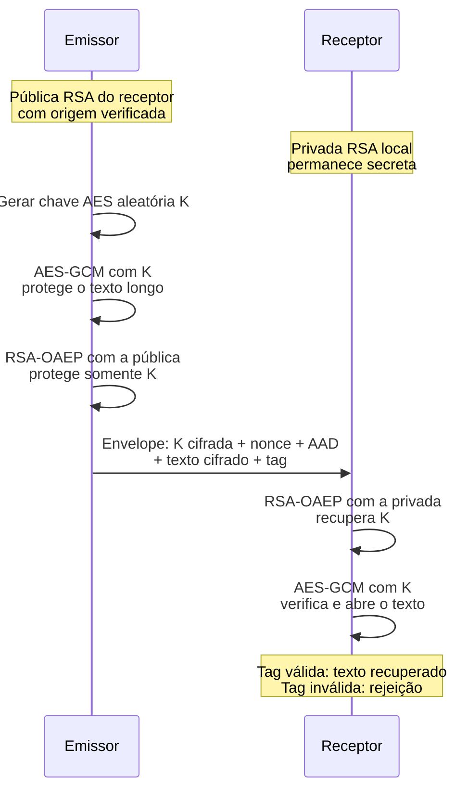

# A15 (provisória) — Chaves públicas, assinaturas e certificados

A A14 mostrou cifra simétrica e o requisito de uma chave nos dois extremos. Agora, o RSA permitirá compreender como uma chave pública protege um valor que a privada recupera. Combinaremos RSA e AES-GCM para um texto longo, depois distinguiremos cifragem, assinatura e confiança por certificado.

**Tempo:** 100 minutos, com exposição e prática guiada intercaladas.

**Recursos:** WSL/Ubuntu com OpenSSL, VS Code, Python 3 com a biblioteca `cryptography` já usada na A14 e acesso à página HTTPS do curso. Use chaves descartáveis e dados da página; os resultados fornecidos servem de alternativa. Não use arquivos ou certificados pessoais.

**Objetivos de aprendizagem**

1. Explicar o exemplo RSA, o limite RSA-OAEP e a combinação com AES-GCM, distinguindo cifragem, assinatura e acordo.
2. Verificar assinatura original e alterada sem atribuir identidade apenas ao resultado matemático.
3. Identificar nome, validade, finalidade e cadeia que sustentam o uso de um certificado.

## Par de chaves: segredo privado e informação pública {#funcoes}

**Uso real — acesso a servidores por SSH:** SSH é um protocolo de acesso remoto protegido. Na autenticação por chave pública, o administrador registra a pública autorizada no servidor; o cliente usa a privada correspondente para provar seu controle. A privada permanece no cliente.

O servidor verifica a prova e suas regras de acesso. ([Manual do OpenSSH](https://man.openbsd.org/ssh).)

As duas chaves de um par são geradas juntas, mas têm papéis distintos:

- A chave **privada** deve permanecer sob controle do titular.
- A chave **pública** pode ser distribuída; sua divulgação não é uma falha.

Para associar uma chave pública a uma pessoa ou serviço, é preciso verificar sua origem. Uma chave pública RSA pode proteger a chave AES que será recuperada pela privada; a chave AES continua responsável pela proteção do conteúdo.

Quatro operações precisam ser separadas:

| Necessidade | Mecanismo e chaves | O que se observa | Limite |
|---|---|---|---|
| Impedir leitura da cópia | Cifra autenticada, como AES-GCM da A14: a mesma chave secreta cifra e abre. | Sem chave, não se recupera o texto; alteração autenticada é rejeitada. | O processo que usa a chave vê o texto. |
| Proteger uma chave AES para o receptor | Cifragem RSA: a pública do receptor cifra a chave; a privada correspondente a recupera. | Um valor curto recuperado apenas com a privada correspondente, sob as premissas do esquema. | Exige origem confiável da pública e respeitar o tamanho da entrada. |
| Verificar mensagem e chave usada | Assinatura: a chave **privada** assina; a **pública** correspondente verifica. | Verificação válida ou inválida para mensagem, assinatura e chave recebidas. | Não oculta a mensagem nem prova, sozinha, a identidade do titular. |
| Chegar a material secreto comum | Acordo de chaves: participantes combinam material público e suas próprias chaves privadas. | Ambos derivam um segredo sob as premissas do protocolo. | Precisa autenticar os participantes para evitar troca de chaves por terceiro. |

No **acordo de chaves**, duas partes combinam informações públicas com suas próprias chaves privadas para derivar um segredo comum. **ECDH** é um exemplo. O acordo, sozinho, não autentica a identidade da outra parte; isso exige mecanismo adicional. O TLS da A16 combinará essas funções. A [NIST SP 800-56A Rev. 3](https://csrc.nist.gov/pubs/sp/800/56/a/r3/final) descreve esquemas de estabelecimento de chaves. Nesta aula, a operação prática concentra-se na assinatura.


### Prática curta no WSL: separar as chaves

Gerar e extrair o par permite observar essa separação sem abrir acesso remoto: `privada.pem` fica com quem assina; `publica.pem` pode chegar a quem verifica. Os arquivos deste exercício não configuram uma conta SSH.

**Para a assinatura posterior:** estes comandos geram um par de curvas elípticas (**EC**) com os parâmetros da curva **P-256**. A assinatura será ECDSA. Os programas de RSA usam outro par, criado por eles para a cifragem; não reutilizam estes arquivos.

**Estado inicial:** use somente `~/cripto-a15`. `umask 077` limita as permissões dos arquivos novos; `genpkey` cria uma chave privada descartável de curva P-256; `pkey -pubout` extrai a chave pública. Não publique nem reutilize a privada.

```bash
mkdir -p ~/cripto-a15
cd ~/cripto-a15
umask 077
openssl genpkey -algorithm EC -pkeyopt ec_paramgen_curve:P-256 -out privada.pem
openssl pkey -in privada.pem -pubout -out publica.pem
ls -l privada.pem publica.pem
```

**Resultado esperado:** dois arquivos diferentes; somente o titular deve ter acesso à privada. `ls -l` mostra permissões, não prova proteção fora desta pasta. Registre `T3 → arquivo privado → arquivo distribuível → limite`. Se OpenSSL faltar, use a relação como dado fornecido. **Pare** antes de assinar e diga qual arquivo deve entrar em cada operação.

## RSA: entender a relação entre as duas chaves {#rsa}

**Problema prático:** o emissor quer proteger uma chave AES para um receptor que ainda não compartilha esse segredo. Ele pode usar a **chave pública RSA do receptor**; o receptor usa a **privada correspondente** para recuperar o valor.

RSA é um algoritmo de criptografia assimétrica, nomeado a partir de Rivest, Shamir e Adleman. Para entender sua construção, usaremos números pequenos. Depois, aplicaremos uma biblioteca com chaves e proteção apropriadas ao ensaio.

### Primos, módulo e números coprimos

Um **número primo** é um inteiro maior que 1 divisível apenas por 1 e por ele mesmo. Começaremos com dois primos distintos: `p = 5` e `q = 11`.

**Módulo** indica o resto de uma divisão inteira. Por exemplo, `17 mod 5 = 2`, pois `17 = 3 × 5 + 2`. O símbolo de congruência `≡` indica que dois números deixam o mesmo resto: `17 ≡ 2 (mod 5)`.

Dois números são **coprimos** quando seu **máximo divisor comum (MDC)** é 1. Isso significa que não compartilham divisor maior que 1; eles não precisam ser ambos primos.

A função **totiente de Euler**, escrita \(\varphi(n)\), conta quantos inteiros positivos menores que `n` são coprimos com ele. Lê-se “fi de n”.

Por exemplo, entre 1 e 9, apenas **1, 3, 7 e 9** são coprimos com 10. Portanto, \(\varphi(10)=4\). Se `n` for o produto de dois primos distintos, podemos calcular diretamente:

\[
n=pq \qquad\text{e}\qquad \varphi(n)=(p-1)(q-1)
\]

### Gerar as chaves com um exemplo completo

| Passo | Cálculo | Função do valor |
|---|---|---|
| Escolher os primos | `p = 5`, `q = 11` | Fatores usados na construção; precisam ser secretos em uma chave real. |
| Calcular `n` | `5 × 11 = 55` | Módulo usado nas operações pública e privada. |
| Calcular o totiente | `(5 − 1) × (11 − 1) = 40` | Valor usado para relacionar os expoentes neste exemplo. |
| Escolher `e` | `e = 3`, com `MDC(3, 40) = 1` | Expoente público, coprimo com o totiente. |
| Encontrar `d` | `d = 27`, pois `3 × 27 = 81 = 2 × 40 + 1` | Expoente privado que satisfaz a relação de inverso modular. |

O par público contém **`n = 55` e `e = 3`**. A operação privada usa **`n = 55` e `d = 27`**; uma chave privada real também pode guardar os fatores e outros valores para acelerar o cálculo.

O módulo `n` pode ser público. Multiplicar dois primos grandes para obtê-lo é eficiente; recuperar seus fatores a partir do produto pode ser muito difícil quando os parâmetros são adequados. Conhecer os fatores permitiria reconstruir o material privado.

### Por que `d` é um inverso multiplicativo modular?

Na aritmética comum, um inverso multiplicativo produz exatamente 1: `5 × (1/5) = 1`. Na aritmética modular, procuramos um inteiro cujo produto **deixe resto 1**.

Neste exemplo, a condição é:

\[
e\times d\equiv1\pmod{\varphi(n)}
\]

Leia: **“e vezes d é congruente a um, módulo fi de n”**. Aqui, significa que a divisão de `e × d` por 40 precisa deixar resto 1. Como `3 × 27 = 81` e `81 mod 40 = 1`, **27 é o inverso de 3 módulo 40**.

Esse inverso existe porque `e` e o totiente são coprimos. Se escolhêssemos `e = 4`, todo produto `4 × d` deixaria, na divisão por 40, um resto múltiplo de 4; nunca 1.

| Operação | Módulo usado neste exemplo |
|---|---|
| Encontrar o expoente privado `d` | Totiente: **40**. |
| Cifrar e recuperar a mensagem | Produto dos primos `n`: **55**. |

### Cifrar o número 7 e recuperá-lo

Chamaremos a mensagem numérica de **`M`** e o resultado cifrado de **`C`**. A operação pública calcula:

\[
C=M^e\bmod n=7^3\bmod55=343\bmod55=13
\]

O receptor recebe **13** e aplica a operação privada:

\[
M'=C^d\bmod n=13^{27}\bmod55=7
\]

```text
7 → operação pública (e=3, n=55) → 13
13 → operação privada (d=27, n=55) → 7
```

As setas indicam aplicação da operação e seu resultado. A relação entre os expoentes permite que a composição recupere o valor original: \(M'=M^{ed}\bmod n\).

Para mensagens coprimas com `n`, o teorema de Euler estabelece \(M^{\varphi(n)}\equiv1\pmod n\). Como `ed = 1 + 2 × 40` neste exemplo, o cálculo volta a `M`. Para os demais valores permitidos, a propriedade é verificável separadamente módulo `p` e módulo `q`.

**Limite do exemplo:** são apenas operações matemáticas, sem a proteção necessária ao uso real. Os números pequenos permitem descobrir a privada facilmente; aplicar a fórmula diretamente também é determinístico: a mesma entrada produz sempre o mesmo resultado. ([RFC 8017: chaves e primitivas RSA](https://www.rfc-editor.org/rfc/rfc8017.html#section-3).)

### Prática curta: executar a matemática no VS Code e WSL {#rsa-numeros}

No WSL, prepare a pasta e abra o editor:

```bash
mkdir -p ~/cripto-a15
cd ~/cripto-a15
code .
```

`mkdir -p` cria a pasta se necessário; `cd` entra nela; `code .` abre essa pasta no VS Code. Se o comando do editor faltar, use **Conectar ao WSL** no VS Code e abra `~/cripto-a15`.

Crie **`rsa_numeros_a15.py`**. Copie o primeiro bloco e salve. `gcd` calcula o MDC; `pow(e, -1, phi)` encontra o inverso modular; `pow(M, e, n)` calcula a potência já reduzida módulo `n`.

```python
from math import gcd

# 1. RSA matemático com números pequenos: não usar para proteger dados.
p = 5
q = 11
n = p * q
phi = (p - 1) * (q - 1)
e = 3
d = pow(e, -1, phi)

M = 7
if not 0 <= M < n:
    raise ValueError('M precisa estar entre 0 e n - 1 neste exemplo')

C = pow(M, e, n)
recuperado = pow(C, d, n)

print('n:', n, '| phi:', phi)
print('MDC(e, phi):', gcd(e, phi))
print('e:', e, '| d:', d, '| resto de e*d:', (e * d) % phi)
print('M:', M, '| C:', C, '| recuperado:', recuperado)
print('R0 — número recuperado?', recuperado == M)
```

Execute no terminal WSL:

```bash
python3 rsa_numeros_a15.py
```

`python3` executa o arquivo salvo na pasta atual. **R0:** devem aparecer `n: 55`, `phi: 40`, `e: 3`, `d: 27`, `M: 7`, `C: 13`, `recuperado: 7` e comparação `True`.

**Experimente:** mude somente `M = 7` para `M = 4`, salve e preveja `C` antes de executar. Depois tente `M = 55`: o programa deve recusar a entrada, pois este exemplo exige `0 ≤ M < n`. Restaure `M = 7`. Isso verifica a matemática e o intervalo; não demonstra proteção de arquivos reais.

## Texto em bytes: por que a mensagem precisa caber {#rsa-tamanho}

O número `M = 7` representava o inteiro sete. Um texto precisa primeiro ser representado em bytes por uma **codificação**, como UTF-8. Codificar não é cifrar: qualquer pessoa que conheça a codificação pode ler esses bytes.

Para o texto `OLA`, os valores são:

| Caractere | Byte decimal | Hexadecimal |
|---|---:|---|
| O | 79 | `4F` |
| L | 76 | `4C` |
| A | 65 | `41` |

A sequência `4F 4C 41`, interpretada com o byte mais significativo primeiro (*big-endian*), corresponde ao inteiro **5.196.865**. Esse inteiro não cabe no exemplo `n = 55`; até o byte da letra `O`, que vale 79, ultrapassa o intervalo.

Acrescente este bloco **ao final do mesmo arquivo**, salve e execute novamente. O [arquivo completo para download](../assets/a14-a17/rsa_numeros_a15.py) reúne os dois blocos.

```python
# 2. Representar um texto em bytes e inteiro: ainda não é cifragem.
texto = 'OLA'
dados = texto.encode('utf-8')
numero = int.from_bytes(dados, 'big')
volta = numero.to_bytes(len(dados), 'big')

print('\nTexto:', texto)
print('Bytes:', list(dados), '| hexadecimal:', dados.hex())
print('Inteiro:', numero, '| cabe em n=55?', numero < n)
print('Texto recuperado da representação:', volta.decode('utf-8'))
```

| Trecho | O que faz |
|---|---|
| `encode('utf-8')` | Converte o texto em bytes. |
| `int.from_bytes(..., 'big')` | Interpreta a sequência como um inteiro, com o byte mais significativo primeiro. |
| `to_bytes(len(dados), 'big')` | Reconstrói os bytes usando o comprimento original, necessário inclusive para preservar zeros iniciais. |
| `decode('utf-8')` | Converte os bytes de volta ao texto. |

**Leia a saída:** bytes `[79, 76, 65]`, hexadecimal `4f4c41`, inteiro `5196865`, “cabe em n=55?” `False` e texto recuperado `OLA`. Essa última recuperação vem da conversão de representação; não da decifragem RSA.

O limite não desaparece ao usar números maiores. Uma mensagem RSA precisa ser preparada em um bloco compatível com o módulo e com seu esquema de proteção.

### RSA-OAEP: o limite real depende dos parâmetros {#rsa-oaep}

**OAEP**, de *Optimal Asymmetric Encryption Padding*, é uma preparação padronizada dos bytes antes da operação RSA. Ela inclui aleatoriedade e estrutura para proteger a operação; não é apenas acrescentar zeros ao texto.

**RSA-OAEP** designa RSA usado com essa preparação para cifragem. Cifrar a mesma mensagem duas vezes com OAEP normalmente produz resultados diferentes. Não use a fórmula numérica do primeiro programa para substituir esse esquema.

OAEP também usa uma **função hash**, que transforma bytes em um resumo de tamanho fixo, chamado **digest**. SHA-256 produz 32 bytes. Aqui, o hash é uma etapa interna da preparação; ele não cifra o texto. A [A16](A16-tls-ciclo-de-chaves.md#digest) desenvolverá suas propriedades e a comparação de arquivos.

A quantidade máxima de bytes da mensagem é:

\[
\text{máximo}=k-2hLen-2
\]

- **`k`:** comprimento do módulo RSA em bytes. Um módulo de 2.048 bits ocupa `2048 ÷ 8 = 256` bytes.
- **`hLen`:** comprimento do digest do hash escolhido para OAEP. Com SHA-256, vale 32 bytes.

Assim, para **RSA-2048 com OAEP e SHA-256**, o máximo é **`256 − 2 × 32 − 2 = 190 bytes`**. O restante do bloco é reservado à preparação. A saída cifrada RSA tem **256 bytes**, mesmo quando a entrada é menor.

| Módulo RSA | Módulo em bytes | Mensagem máxima com OAEP/SHA-256 |
|---|---:|---:|
| 2.048 bits | 256 | **190 bytes** |
| 3.072 bits | 384 | **318 bytes** |
| 4.096 bits | 512 | **446 bytes** |

Esses valores não são um limite universal de RSA: mudam com o módulo e o hash. Também são limites de **bytes**, não de caracteres; um caractere acentuado em UTF-8 pode ocupar mais de um byte. ([RFC 8017, RSAES-OAEP](https://www.rfc-editor.org/rfc/rfc8017.html#section-7.1.1).)

### Prática curta: aceitar 190 bytes e recusar 191 {#rsa-limite-terminal}

Crie **`rsa_hibrido_a15.py`** na mesma pasta do VS Code. A biblioteca `cryptography` é a usada no AES-GCM da A14; execute no mesmo ambiente Python preparado para aquela prática.

Antes do código, localize os parâmetros:

| Entrada ou função | Papel neste ensaio |
|---|---|
| `generate_private_key(..., key_size=2048)` | Cria uma privada RSA descartável, cujo módulo tem 2.048 bits. |
| `public_exponent=65537` | Usa o expoente público habitual de uma chave real; o `e = 3` era do exemplo numérico. |
| `privada.public_key()` | Obtém a pública correspondente para o emissor usar. |
| `padding.OAEP` | Configura a preparação da mensagem. |
| `MGF1(SHA256())` | Configura a função geradora de máscara interna do OAEP, usando SHA-256. |
| `algorithm=SHA256()` | Seleciona o hash principal do OAEP; seu digest de 32 bytes entra no cálculo do limite. |
| `label=None` | Usa o rótulo opcional vazio do OAEP. Não é o AAD do AES-GCM. |

Copie este primeiro bloco e salve:

```python
import json
from os import urandom
from pathlib import Path
from cryptography.exceptions import InvalidTag
from cryptography.hazmat.primitives import hashes
from cryptography.hazmat.primitives.asymmetric import padding, rsa
from cryptography.hazmat.primitives.ciphers.aead import AESGCM

# 1. Chaves descartáveis do receptor e teste do limite RSA-OAEP.
privada = rsa.generate_private_key(public_exponent=65537, key_size=2048)
publica = privada.public_key()  # pública do receptor, aceita neste ensaio local
oaep = padding.OAEP(
    mgf=padding.MGF1(hashes.SHA256()),
    algorithm=hashes.SHA256(),
    label=None,
)

curta = b'A' * 190
cifrada_curta = publica.encrypt(curta, oaep)
print('R1 — 190 bytes recuperados?', privada.decrypt(cifrada_curta, oaep) == curta)
print('R1 — tamanho cifrado RSA:', len(cifrada_curta), 'bytes')
try:
    publica.encrypt(b'A' * 191, oaep)
    print('R2 — 191 bytes aceitos (inesperado)')
except ValueError:
    print('R2 — 191 bytes rejeitados: ultrapassam o limite de 190')
```

Execute no terminal:

```bash
python3 rsa_hibrido_a15.py
```

`b'A' * 190` cria 190 bytes iguais ao byte da letra `A`. `encrypt` cifra com a pública e OAEP; `decrypt` abre com a privada e os mesmos parâmetros. O segundo teste acrescenta apenas um byte à entrada e captura a recusa `ValueError`.

| Resultado | Saída esperada | Interpretação |
|---|---|---|
| R1 — 190 bytes | Recuperação `True`; resultado cifrado com 256 bytes. | A mensagem no limite foi aceita e recuperada. |
| R2 — 191 bytes | Entrada rejeitada por ultrapassar 190 bytes. | A mensagem maior não cabe neste módulo e nestes parâmetros. |

**Registre a diferença:** o segundo teste falhou antes de produzir uma mensagem cifrada válida. Isso não é uma falha de tag GCM; é o limite de entrada do RSA-OAEP. ([Biblioteca `cryptography`: RSA e OAEP](https://cryptography.io/en/stable/hazmat/primitives/asymmetric/rsa/).)

## Textos longos: combinar RSA-OAEP com AES-GCM {#rsa-hibrido}

**Uso real — proteção de arquivos por envelope:** o AWS Encryption SDK oferece uma composição em que RSA protege a chave de dados; a chave de dados protege o conteúdo com cifra simétrica. Quem cifra pode ter apenas a pública RSA; a recuperação exige a privada correspondente. ([AWS: proteção da chave de dados com RSA](https://docs.aws.amazon.com/encryption-sdk/latest/developer-guide/use-raw-rsa-keyring.html).)

Essa combinação é chamada **cifragem híbrida**. Em nosso exemplo:

- **AES-GCM** protege o texto longo com uma chave aleatória de 32 bytes, ou 256 bits.
- **RSA-OAEP** protege somente esses 32 bytes usando a pública do receptor. A chave cabe no limite de 190 bytes do ensaio.
- O receptor usa sua privada RSA para recuperar a chave AES e, então, verificar e abrir o texto.

O crescimento do arquivo aumenta a quantidade de dados protegidos por AES, mas não o tamanho da chave AES nem da sua cópia cifrada por RSA. Cifras e formatos ainda têm seus próprios limites; o “máximo de 190 bytes” pertence à entrada RSA deste exemplo.

### Diagrama: a chave atravessa a rede protegida {#sequencia-rsa-aes}

Leia de cima para baixo. As operações que retornam ao mesmo participante são locais; a seta entre os participantes transporta o envelope. Em tela estreita, deslize horizontalmente; pelo teclado, use Tab e as setas.

<div id="figura-25" class="diagrama-protocolo" tabindex="0" role="region" aria-label="Figura 25: RSA-OAEP e AES-GCM" markdown="1">



**Figura 25 — RSA protege a chave; AES-GCM protege o conteúdo.** A chave AES legível permanece nos extremos; o envelope contém sua cópia cifrada por RSA. [Abrir a Figura 25 para ampliar](../assets/a14-a17/figura25-rsa-aes.svg).

### Prática curta: abrir um texto de 4.800 bytes {#rsa-hibrido-terminal}

Acrescente o próximo bloco **ao final de `rsa_hibrido_a15.py`**, salve e execute novamente com o mesmo comando. O [arquivo completo para download](../assets/a14-a17/rsa_hibrido_a15.py) reúne os dois blocos.

Esta parte reutiliza nonce, AAD, texto cifrado e tag da A14. A novidade é a origem da chave no receptor: ele a recupera por **RSA**, em vez de derivá-la de uma senha já compartilhada.

O programa reúne emissor e receptor na mesma execução e usa um arquivo local como transporte. A origem da pública é aceita neste ensaio; a seção de confiança desenvolverá sua verificação. O teste não configura uma rede nem um protocolo de produção.

```python
# 2. Emissor: AES-GCM protege o texto; RSA-OAEP protege somente a chave AES.
key = AESGCM.generate_key(bit_length=256)
nonce = urandom(12)
aad = b'tipo=relatorio;versao=1'
text = ('Relatorio de seguranca.\n' * 200).encode('utf-8')
sealed = AESGCM(key).encrypt(nonce, text, aad)
chave_cifrada = publica.encrypt(key, oaep)

print('\nKey AES descartável:', key.hex())
print('Nonce:', nonce.hex())
print('AAD:', aad.decode('utf-8'))
print('Tag:', sealed[-16:].hex())
print('Texto:', len(text), 'bytes | Ciphertext:', len(sealed[:-16]), 'bytes')
print('H1 — chave AES:', len(key), 'bytes | chave cifrada RSA:', len(chave_cifrada), 'bytes')

pacote = {
    'chave_cifrada': chave_cifrada.hex(),
    'nonce': nonce.hex(),
    'aad': aad.decode('utf-8'),
    'ciphertext': sealed[:-16].hex(),
    'tag': sealed[-16:].hex(),
}
arquivo = Path('envelope_rsa_aes.json')
arquivo.write_text(json.dumps(pacote, indent=2), encoding='utf-8')

# 3. Receptor: recuperar K pelo RSA e verificar/abrir o texto com AES-GCM.
recebido = json.loads(arquivo.read_text(encoding='utf-8'))
key_receptor = privada.decrypt(bytes.fromhex(recebido['chave_cifrada']), oaep)
nonce_receptor = bytes.fromhex(recebido['nonce'])
aad_receptor = recebido['aad'].encode('utf-8')
sealed_receptor = bytes.fromhex(recebido['ciphertext']) + bytes.fromhex(recebido['tag'])
texto_aberto = AESGCM(key_receptor).decrypt(nonce_receptor, sealed_receptor, aad_receptor)
print('H2 — texto longo recuperado?', texto_aberto == text)
print('H2 — início do texto:', texto_aberto[:46].decode('utf-8'))

# 4. Contraprova: alterar somente um bit da tag recebida.
alterado = sealed_receptor[:-1] + bytes([sealed_receptor[-1] ^ 1])
try:
    AESGCM(key_receptor).decrypt(nonce_receptor, alterado, aad_receptor)
    print('H3 — tag alterada aceita (inesperado)')
except InvalidTag:
    print('H3 — tag alterada rejeitada; texto não entregue')
```

**Leia o percurso do código:**

1. `generate_key(bit_length=256)` cria a chave AES; `urandom(12)` cria o nonce. O relatório fictício repetido 200 vezes ocupa 4.800 bytes UTF-8.
2. `AESGCM(key).encrypt` cifra o relatório e produz texto cifrado com tag. `publica.encrypt(key, oaep)` cifra **a chave**, não o relatório.
3. `pacote` reúne os campos públicos do envelope. `write_text` grava o JSON; `read_text` o lê no papel do receptor. `hex` e `fromhex` apenas representam bytes no arquivo.
4. `privada.decrypt` recupera a chave AES de `chave_cifrada`. `AESGCM(key_receptor).decrypt` usa essa chave para verificar a tag e recuperar os bytes do relatório.
5. A contraprova altera um bit da tag recebida; `InvalidTag` registra a rejeição sem entregar o texto dessa tentativa.

| Resultado | O que deve aparecer | O que permite concluir |
|---|---|---|
| H1 — tamanhos | Texto e ciphertext: 4.800 bytes; chave AES: 32; chave cifrada RSA: 256. | O RSA recebeu apenas a chave curta; AES recebeu o conteúdo longo. |
| H2 — recuperação | `texto longo recuperado? True` | A privada recuperou a chave correta e o conjunto GCM original abriu. |
| H3 — alteração | Tag alterada rejeitada; texto não entregue. | A abertura continua verificando o conjunto protegido, como em G2 da A14. |

Os valores de chave, nonce e tag mudam entre execuções. A chave impressa é descartável, para observar a operação; não a inclua na entrega nem a reutilize. O programa não imprime nem grava a privada RSA.

**Pare após H3.** Se aparecer “can't open file”, confira `pwd`, `ls` e o nome salvo. Se faltar `cryptography`, use o mesmo ambiente da A14 ou o quadro como **dado fornecido**; erro de dependência não é recusa criptográfica. Se R1 ou H2 falhar, registre o erro e não atribua o resultado a adulteração sem diagnóstico.

### Por que não dividir o texto em várias cifragens RSA?

Cifrar cada caractere com a fórmula numérica revelaria repetições: entradas iguais produzem resultados iguais. Aplicar OAEP a muitos pedaços exigiria ainda um formato que protegesse sua ordem, integridade e interpretação, além de muitas operações RSA.

A composição híbrida resolve o problema usando uma cifra simétrica adequada para os dados e RSA para a chave curta. **Aumentar a chave RSA para tentar acomodar um arquivo inteiro não é essa solução.**

**Limites de confiança:** qualquer pessoa com a pública pode produzir uma nova chave AES, protegê-la por RSA e criar um envelope válido. Portanto, a tag GCM válida não identifica o emissor; para isso, são necessários mecanismos como assinatura e uma origem de chave verificada.

Essa composição também é diferente do acordo de chaves: aqui, o emissor cria uma chave e envia sua cópia cifrada. No TLS 1.3 da A16, as partes podem estabelecer material por ECDHE; RSA pode participar da **assinatura**, mas não do transporte RSA de chaves. ([RFC 8446, mudanças em TLS 1.3](https://www.rfc-editor.org/rfc/rfc8446.html#section-1.2).)


## Origem da chave pública: o limite da verificação {#par}

**Na administração de servidores:** o cliente SSH mantém chaves de servidores conhecidos em `known_hosts` e pode avisar quando a chave apresentada muda. Isso ajuda a detectar uma troca inesperada, mas a primeira associação também precisa ser conferida. Reconhecer um nome na tela não demonstra que a chave veio do servidor correto. ([Manual do OpenSSH](https://man.openbsd.org/ssh).)

Nesta página, **K1** é o par que assina e **K2** é outro par, usado como contraprova. Os IDs valem apenas aqui. A parte pública de K1 não precisa de sigilo, mas precisa de **origem confiável e proteção contra substituição**. Se um terceiro substituir a chave pública anunciada pela sua, poderá apresentar uma assinatura válida sob essa outra chave e alegar uma identidade que não demonstrou possuir.

No exercício de terminal, `privada.pem` e `outra-privada.pem` são chaves descartáveis. `publica.pem` e `outra-publica.pem` podem ser lidas por verificadores, mas seu conteúdo, por si, não informa a identidade do titular. Não use essas chaves para documentos reais.

## Assinatura: verificar os mesmos bytes {#demonstracao}

Uma **assinatura digital** é calculada sobre os bytes da mensagem com a chave privada. A verificação usa **mensagem + assinatura + chave pública correspondente**. Alterar uma dessas entradas faz a conferência falhar.

Assinar não equivale a “cifrar com a chave privada”: o texto pode continuar legível. O exercício usa **ECDSA**, um algoritmo de assinatura com curvas elípticas, na curva P-256, e **SHA-256**, uma função hash ([NIST FIPS 186-5](https://csrc.nist.gov/pubs/fips/186-5/final)).

O RSA também pode assinar, usando um esquema próprio, como **RSA-PSS** (*Probabilistic Signature Scheme*). O limite de 190 bytes discutido antes vale para a entrada da **cifragem OAEP**; uma assinatura usa o hash da mensagem e pode tratar textos longos. PSS e OAEP têm funções distintas. ([RFC 8017: assinatura PSS](https://www.rfc-editor.org/rfc/rfc8017.html#section-8.1).)


**Uso real — atualização de programas Linux:** o APT, gerenciador de pacotes de Debian e Ubuntu, verifica a assinatura dos metadados do repositório. Esses metadados se ligam aos arquivos de pacotes por resumos criptográficos. A assinatura ajuda a rejeitar conteúdo substituído no caminho até o computador.

Não significa que cada pacote seja assinado individualmente nesse fluxo. ([Manual `apt-secure`](https://manpages.debian.org/bookworm/apt/apt-secure.8.en.html).)

O arquivo pequeno `relatorio.txt` permite observar a mesma propriedade: uma assinatura aceita para uma versão deixa de corresponder quando seus bytes mudam. Não vamos instalar pacotes nem alterar os repositórios do WSL.

`openssl dgst -sha256 -sign` cria a assinatura de um arquivo com a chave privada; `-verify` confere assinatura, conteúdo e chave pública. Preveja o resultado antes de cada verificação. O texto permanece legível.

```bash
printf 'relatorio=7;resultado=aprovado' > relatorio.txt
openssl dgst -sha256 -sign privada.pem -out assinatura.bin relatorio.txt
openssl dgst -sha256 -verify publica.pem -signature assinatura.bin relatorio.txt
printf 'relatorio=7;resultado=recusado' > alterado.txt
openssl dgst -sha256 -verify publica.pem -signature assinatura.bin alterado.txt
```

**Resultado esperado:** `Verified OK` no original e `Verification failure` no alterado. A segunda linha de verificação retorna erro ao shell; isso é a rejeição esperada. Registre `T4 → bytes → chave → resultado → limite`. Para a terceira contraprova, gere outro par de teste e verifique o original com a outra chave pública:

```bash
openssl genpkey -algorithm EC -pkeyopt ec_paramgen_curve:P-256 -out outra-privada.pem
openssl pkey -in outra-privada.pem -pubout -out outra-publica.pem
openssl dgst -sha256 -verify outra-publica.pem -signature assinatura.bin relatorio.txt
```

**Resultado esperado:** `Verification failure`. Se OpenSSL faltar, use o quadro como **dados fornecidos**:

| ID | Mensagem, assinatura e chave pública | Resultado | Conclusão limitada |
|---|---|---|---|
| V1 | Original, S1, K1 pública | Válida | Estes três elementos correspondem. |
| V2 | Alterada, S1, K1 pública | Inválida | Os bytes não correspondem aos assinados. |
| V3 | Original, S1, K2 pública | Inválida | A chave testada não corresponde à assinatura. |

**Exemplo trabalhado:** V2 falha porque `resultado=recusado` não são os bytes `resultado=aprovado` assinados. A falha não revela se houve fraude, erro de transporte ou seleção do arquivo errado. **Pare** antes de concluir que a assinatura válida identifica uma pessoa ou organização: isso depende da origem confiável de K1 pública.

## Confiança: decidir quando aceitar {#confianca}

**No uso de um repositório de software:** a verificação depende de uma chave pública aceita para aquela origem. Obter um arquivo e uma chave de uma fonte desconhecida não estabelece confiança.

Além disso, uma assinatura válida não prova que o programa está livre de vulnerabilidades ou de código malicioso. Ela sustenta uma relação de procedência sob a chave aceita. ([Manual `apt-secure`](https://manpages.debian.org/bookworm/apt/apt-secure.8.en.html).)

V1 confirma a correspondência matemática entre mensagem, assinatura e K1 pública. **Não confirma que K1 pertença à pessoa ou serviço alegado.**

Antes de aceitar uma origem específica, obtenha a chave pública por canal confiável ou valide um vínculo verificável. A seção seguinte apresenta o certificado como esse vínculo; a A16 mostra seu uso em TLS.

## Certificado: vincular nome, chave e emissor {#certificado}

**Uso real — acessar este material por HTTPS:** o navegador pede `rafaelrezo.github.io` e recebe um certificado do servidor. Antes de confiar no vínculo entre esse nome e a chave apresentada, verifica nome, prazo, finalidade e cadeia.

O site não se torna confiável apenas por enviar uma chave pública. O terminal permitirá examinar parte dessa mesma verificação. ([RFC 9525](https://www.rfc-editor.org/rfc/rfc9525).)

Um certificado **X.509** reúne chave pública, nomes e outros campos assinados por uma **autoridade certificadora** (*emissor*). Ele apresenta um vínculo entre nome e chave, sujeito a verificações.

O cliente confere uma **cadeia**: as assinaturas e restrições dos emissores precisam levar a uma **âncora de confiança** que o cliente já aceita. Receber uma raiz enviada pelo servidor não a torna confiável.

Também é preciso conferir nome solicitado, prazo e finalidade ([RFC 5280](https://www.rfc-editor.org/rfc/rfc5280); [RFC 9525](https://www.rfc-editor.org/rfc/rfc9525)).

**Síntese:** o certificado apresenta a chave; a cadeia e a âncora sustentam o vínculo; o nome precisa corresponder ao endereço solicitado; o período e a finalidade precisam permitir o uso. Uma verificação de assinatura isolada não substitui essas condições.

| Evidência | Pergunta de decisão | Interpretação cuidadosa |
|---|---|---|
| Nome DNS em **Subject Alternative Name** (SAN) | O endereço acessado corresponde a um nome coberto? | O nome do site, e não uma aparência parecida, é a referência. O campo `Subject/CN` isolado não substitui essa conferência. |
| `Not Before` / `Not After` | A data atual está dentro do intervalo? | Estar no prazo não prova que a chave privada continua sob controle do titular. |
| Emissor e cadeia | As assinaturas e restrições levam a uma âncora confiável para este cliente? | “Emitido por X” escrito no certificado não equivale a cadeia validada. |
| `Extended Key Usage` e restrições de uso | O certificado serve para autenticação de servidor TLS? | Um certificado limitado a autenticação de cliente não serve para esse papel. |
| Estado de revogação | Há evidência de revogação ou de consulta válida? | A ausência de aviso não é prova universal de “não revogado”; políticas e mecanismos do cliente variam. |

O comando `openssl x509` apresenta **campos**; a decisão de aceitar a conexão depende também da verificação do nome e da cadeia pelo cliente. **Revogação** invalida um certificado antes do fim do prazo, por exemplo após suspeita de comprometimento da chave.

CRL e OCSP são meios de publicar ou consultar esse estado ([RFC 5280](https://www.rfc-editor.org/rfc/rfc5280); [RFC 6960](https://www.rfc-editor.org/rfc/rfc6960)). Evidência confiável de revogação exige recusa. Sem informação, registre **estado não comprovado**; não deduza “não revogado” apenas porque a página abriu.

**Na operação de um site:** renovar o certificado antes do vencimento mantém seu uso dentro do prazo. Se a chave privada tiver sido comprometida, apenas prolongar o prazo não resolve: é necessário tratar a exposição, substituir a chave e o certificado e providenciar a revogação conforme a autoridade emissora. Prazo e comprometimento são condições distintas.

### Inspeção no terminal: ler o certificado real {#inspecao}

Use somente `rafaelrezo.github.io`, domínio público do próprio curso. `openssl s_client` abre uma conexão TLS, envia o nome com `-servername` e verifica se o certificado cobre esse nome com `-verify_hostname`. `-verify_return_error` faz a conexão falhar quando a verificação não passa; `-brief` reduz a saída. Não informe credenciais nem contorne um erro de certificado.

```bash
openssl s_client -connect rafaelrezo.github.io:443 -servername rafaelrezo.github.io -verify_hostname rafaelrezo.github.io -verify_return_error -brief </dev/null
```

**Leia a saída:** `Verification: OK` indica que OpenSSL aceitou a verificação sob as âncoras disponíveis **neste WSL**. Se ocorrer erro, registre a mensagem e pare; não marque o certificado como aceito. Esse comando não prova autorização na aplicação nem estado de revogação.

Para examinar os **campos do certificado apresentado pelo servidor**, execute:

```bash
openssl s_client -connect rafaelrezo.github.io:443 -servername rafaelrezo.github.io -verify_hostname rafaelrezo.github.io -verify_return_error -showcerts </dev/null 2>/dev/null | openssl x509 -noout -subject -issuer -dates -ext subjectAltName,extendedKeyUsage
```

**Leia cada parte:** `-showcerts` mostra os certificados enviados; `|` passa essa saída ao `openssl x509`, que lê o **primeiro certificado**, o do servidor. `-noout` evita imprimir o certificado inteiro. `-subject` e `-issuer` mostram titular e emissor; `-dates` mostra início e fim do prazo; `-ext subjectAltName,extendedKeyUsage` mostra nomes DNS cobertos e finalidades. `2>/dev/null` esconde mensagens de progresso do primeiro comando; por isso a aceitação da cadeia deve ser lida no **comando anterior**. A inspeção de um certificado isolado não valida sua cadeia.

**Registre:** `nome solicitado → SAN relevante → prazo → finalidade → emissor → resultado de verificação → limite`. Os valores reais podem mudar. O SAN deve cobrir o nome solicitado; `TLS Web Server Authentication` indica uso de servidor. Se o segundo comando não mostrar campos, registre a falha sem completar por suposição. Se faltar rede ou OpenSSL, use o pacote fictício da A16 como **dado fornecido**, não como observação. Pare antes de concluir que o serviço é seguro em todos os aspectos.

### Exemplo trabalhado: o nome errado

Você abriu `https://curso.exemplo.invalid`, mas o SAN apresentado cobre apenas `portal.exemplo.invalid`. Mesmo que o certificado esteja no prazo e tenha uma cadeia confiável, **recuse**: a chave foi vinculada a outro nome. Uma aparência semelhante na tela não modifica o endereço que o navegador pediu. Os domínios `.invalid` desta página são **fictícios e não devem ser acessados**.

### Como essas funções entram no TLS e na VPN

No handshake TLS, o servidor apresenta o certificado e usa sua chave privada para **assinar a negociação atual**. O par temporário ECDHE tem outra função: produzir o segredo do acordo. As chaves simétricas derivadas desse processo protegem a conexão.

Na [sequência TLS da A16](A16-tls-ciclo-de-chaves.md#sequencia-tls), localize `Certificate` e `CertificateVerify` para distinguir o vínculo da identidade de sua prova nesta conexão. No [OpenVPN](A16-tls-ciclo-de-chaves.md#sequencia-vpn), o exemplo também exige certificado e prova do cliente para admitir o túnel.

## Atividade {#atividade}

Em C2, explique em uma frase por que o RSA protege a chave AES curta enquanto o AES-GCM protege o texto longo; cite R1/R2 e H1/H2 como observados ou fornecidos.

Atualize **C2** no [registro único de A14–A16](../atividades/A14-A18-criptografia-confianca.md#atividade) após T3, V1–V3 e inspeção de certificado: `chave → operação → resultado → origem da chave pública → condição para confiar → limite`. Não há entrega separada.

## Revisão rápida

1. Por que uma entrada RSA-OAEP pode ter limite de 190 bytes, enquanto um texto de 4.800 bytes abre na composição com AES-GCM?
2. Por que `Verified OK` não prova, sozinho, o nome do titular?
3. Que campos do certificado impedem aceitar uma chave para qualquer nome e finalidade?


## Referências

- [RFC 8017 — RSA, OAEP e limite de mensagem](https://www.rfc-editor.org/rfc/rfc8017.html), [biblioteca `cryptography` — RSA](https://cryptography.io/en/stable/hazmat/primitives/asymmetric/rsa/).
- [NIST FIPS 186-5](https://csrc.nist.gov/pubs/fips/186-5/final), [SP 800-56A Rev. 3](https://csrc.nist.gov/pubs/sp/800/56/a/r3/final), [RFC 5280](https://www.rfc-editor.org/rfc/rfc5280), [RFC 9525](https://www.rfc-editor.org/rfc/rfc9525).
- [OpenSSL `genpkey`](https://docs.openssl.org/3.5/man1/openssl-genpkey/), [`pkey`](https://docs.openssl.org/3.5/man1/openssl-pkey/), [`dgst`](https://docs.openssl.org/3.5/man1/openssl-dgst/).
