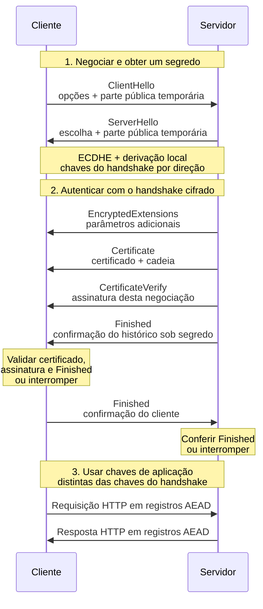
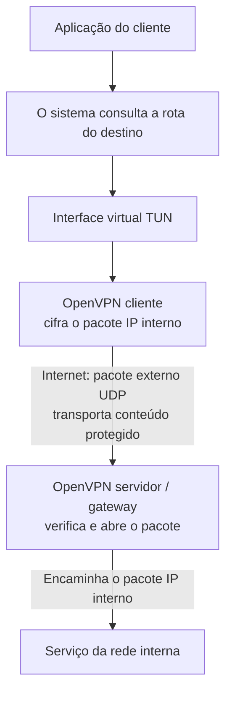
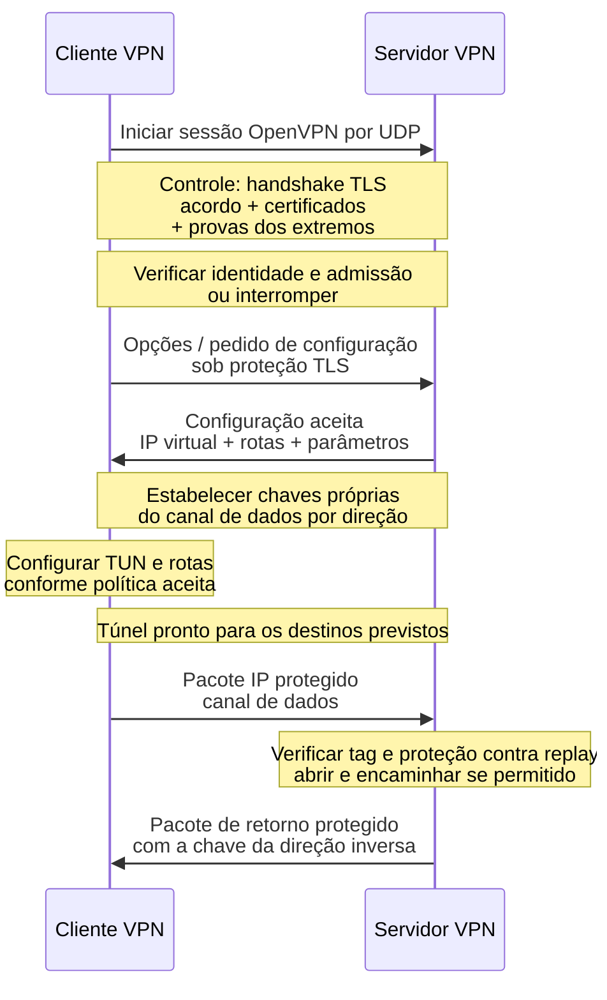
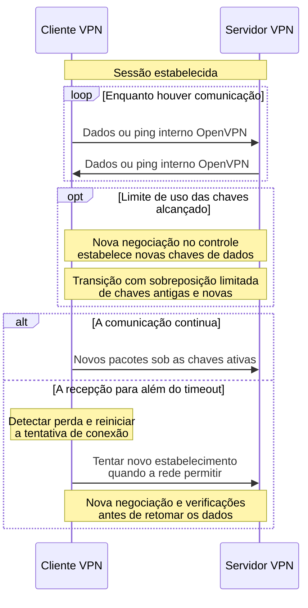
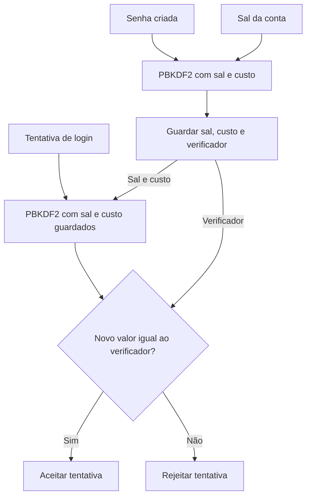

# A16 (provisória) — TLS, gestão de chaves, hash e senhas

O TLS combina acordo de chaves, certificados, assinaturas e cifra autenticada para proteger uma conexão. O OpenVPN aplica essas funções ao estabelecimento de um túnel de rede e mantém chaves próprias para transportar os pacotes.

Primeiro acompanharemos as mensagens de TLS e OpenVPN, depois a gestão das chaves. No bloco final, compararemos hash, HMAC e verificação de senhas: mecanismos que conferem dados sem necessariamente cifrá-los.

**Tempo:** 100 minutos, com exposição e prática guiada intercaladas.

**Recursos:** página HTTPS do curso, WSL/Ubuntu com OpenSSL, VS Code e Python 3. O verificador de senhas usa a biblioteca padrão do Python. Os dados fornecidos substituem a conexão quando necessário. Não informe credenciais nem contorne avisos de certificado.

**Objetivos de aprendizagem**

1. Explicar a sequência TLS e os canais do OpenVPN, relacionando acordo, certificado, assinatura e cifra autenticada; distinguir conexão protegida de autorização.
2. Justificar troca, restrição e recuperação de chaves com casos permitidos e negados.
3. Diferenciar hash, HMAC e verificador de senha usando comandos e um programa Python.

## TLS 1.3: autenticação, chaves e tráfego {#tls}

**Uso real — abrir o site do curso:** o navegador precisa confirmar a identidade de `rafaelrezo.github.io` e proteger as requisições e respostas. **HTTPS** é HTTP transportado sobre TLS; a porta usual é 443.

Antes dos dados HTTP, ocorre um **handshake**: a troca inicial que combina parâmetros, estabelece chaves e verifica a outra parte. Aqui acompanharemos uma conexão nova de TLS 1.3, com ECDHE e certificado do servidor, sem retomada de sessão nem certificado do cliente.

### As funções de A14 e A15 no protocolo

| Conceito já estudado | Função nesta conexão |
|---|---|
| ECDHE — acordo com chaves temporárias | Produzir um segredo comum sem enviá-lo pela rede. |
| Certificado | Vincular uma chave pública à identidade do servidor, conforme a cadeia e as verificações do cliente. |
| Assinatura | Provar que o servidor controla a chave privada do certificado e vincular essa prova à negociação atual. |
| Derivação de chaves | Produzir chaves específicas para cada fase e direção a partir do segredo e do contexto. |
| Cifra autenticada, como AES-GCM | Cifrar os dados e detectar alteração nos registros protegidos. |

Um **registro TLS** é uma unidade que o protocolo protege e transporta. Não é sinônimo de mensagem de handshake nem de pacote TCP: uma mensagem pode ocupar mais de um registro.

O **histórico da negociação**, chamado *transcript*, contém as mensagens de handshake em ordem. Seu hash resume os bytes acumulados até uma etapa. Essa função já apareceu na assinatura da A15; a comparação de arquivos será desenvolvida no final desta aula.

### Diagrama: da primeira mensagem ao HTTP protegido {#sequencia-tls}

Leia de cima para baixo. As linhas verticais representam cliente e servidor; cada seta horizontal é uma mensagem enviada. As notas mostram cálculos locais, que não são transmitidos. Em tela estreita, deslize a figura horizontalmente; pelo teclado, selecione a área com Tab e use as setas.

<div id="figura-21" class="diagrama-protocolo" tabindex="0" role="region" aria-label="Figura 21: sequência TLS" markdown="1">



</div>

**Figura 21 — sequência TLS 1.3 com autenticação do servidor.** Após `ServerHello`, as mensagens representadas são cifradas. Neste exemplo, o HTTP começa depois das duas confirmações. O protocolo também permite ao servidor enviar dados de aplicação após seu próprio `Finished`. ([RFC 8446, visão geral](https://www.rfc-editor.org/rfc/rfc8446.html#section-2).) [Abrir a Figura 21 para ampliar](../assets/a14-a17/figura21-tls-sequencia.svg).

### Etapa 1: combinar parâmetros e derivar chaves

O cliente cria um par temporário e envia sua parte pública em `ClientHello`. Também informa versões aceitas, opções criptográficas e o nome solicitado, na extensão **SNI** (*Server Name Indication*).

O servidor escolhe parâmetros compatíveis e envia sua parte pública temporária em `ServerHello`. Cada lado usa **sua chave privada temporária e a parte pública recebida** para calcular o mesmo segredo ECDHE. As chaves privadas e esse segredo não atravessam a rede.

**HKDF** é a função de derivação utilizada por TLS 1.3. Ela combina material secreto e contexto para obter segredos e chaves com funções distintas. Não é PBKDF2: aqui não se tenta transformar uma senha humana em chave.

Neste ponto, ambos já conseguem cifrar o restante do handshake. **O servidor ainda precisa ser autenticado.** A simples capacidade de combinar um segredo não demonstra sua identidade.

### Etapa 2: verificar identidade e confirmar a negociação

As quatro mensagens do servidor cumprem funções diferentes:

1. **`EncryptedExtensions`:** transmite parâmetros adicionais negociados, já sob proteção do handshake.
2. **`Certificate`:** apresenta o certificado e a cadeia. O cliente verifica nome, validade, finalidade e confiança, como na A15.
3. **`CertificateVerify`:** contém uma assinatura ligada ao histórico atual. O cliente usa a chave pública do certificado para conferir a prova de posse da chave privada.
4. **`Finished`:** contém um código HMAC calculado sobre o resumo do histórico, com uma chave derivada para essa confirmação. O cliente recalcula e confere o código.

**HMAC** é um código de autenticação que depende de um segredo: os mesmos bytes e a mesma chave permitem reproduzir o código. Seu funcionamento prático será estudado no final da aula. `Finished` confirma correspondência do histórico e posse do segredo; ele não é a assinatura `CertificateVerify`.

Também há **duas assinaturas com papéis distintos**: a assinatura da autoridade no certificado sustenta o vínculo de identidade; a assinatura do servidor em `CertificateVerify` prova o controle da chave privada nesta conexão.

Se as verificações passarem, o cliente envia seu `Finished`, que o servidor confere. Como este exemplo não inclui certificado do cliente, essa confirmação **não identifica uma pessoa nem realiza login**. ([RFC 8446, mensagens de autenticação](https://www.rfc-editor.org/rfc/rfc8446.html#section-4.4).)

### Etapa 3: proteger os dados com chaves por direção

A derivação produz chaves de aplicação separadas das chaves do handshake. Há também separação por direção:

- A chave usada pelo cliente para cifrar corresponde à usada pelo servidor para abrir esse tráfego.
- A direção servidor → cliente usa outra chave correspondente entre os dois extremos.

Assim, **a chave privada do certificado não cifra as respostas HTTP**. Ela participa da prova por assinatura. Os pares temporários participam do acordo; as chaves simétricas derivadas protegem os registros.

Na A14, o programa gerava um nonce aleatório para cada cifragem GCM. TLS calcula o nonce de cada registro combinando um IV derivado com o número sequencial do registro. O cabeçalho do registro entra como AAD; uma tag inválida causa rejeição. A biblioteca TLS administra esses valores. ([RFC 8446, proteção de registros](https://www.rfc-editor.org/rfc/rfc8446.html#section-5.2).)

Uma **suíte criptográfica** é uma combinação nomeada de algoritmos. Em `TLS_AES_128_GCM_SHA256`:

- `AES_128_GCM` indica AES-GCM com chave de 128 bits para os registros.
- `SHA256` indica o hash utilizado no histórico e na derivação.
- O nome da suíte TLS 1.3 não informa a curva do acordo nem o algoritmo da assinatura; esses parâmetros são negociados separadamente.

**Valide sua compreensão:** em que etapa as mensagens passam a ser cifradas? Qual verificação impede aceitar qualquer pessoa que consiga executar ECDHE? Quais chaves protegem o HTTP?

**Limite do canal:** no ponto que termina TLS, o programa autorizado recebe os dados legíveis. Se a requisição contiver uma senha, a aplicação ainda precisa conferi-la e armazenar seu verificador adequadamente. ([Django: senhas e HTTPS](https://docs.djangoproject.com/en/5.2/topics/auth/passwords/).)

Uma resposta HTTP `403` pode chegar por uma conexão TLS válida: a **aplicação recusou acesso**. Um `200` não demonstra que todos os objetos foram autorizados corretamente. A decisão `identidade → ação → recurso` continua no servidor de aplicação.


## Aplicação: aceitar ou recusar um certificado {#oficina}

**Quando esses campos são usados:** ao acessar um site, o cliente precisa conferir se a chave apresentada está vinculada ao nome solicitado e se o certificado pode ser usado naquele momento e finalidade. Um certificado vencido ou de outro nome impede essa aceitação, mesmo que a página tenha a aparência esperada.

Os cartões isolam essas condições; o comando seguinte examina a conexão real do curso.

**Pacote de teste:** nome solicitado `curso.exemplo.invalid`; data de análise: 6 out. 2026. O cartão B contém:

- SAN `curso.exemplo.invalid`, validade de 1 jan. 2026 a 1 jan. 2027 e uso `serverAuth`.
- Cadeia até raiz confiável, prova da chave privada no handshake TLS 1.3 e tráfego protegido.
- **Nenhuma informação de revogação fornecida.**

Cada cartão abaixo muda só uma condição de B. São dados didáticos, não certificados observados. Não acesse endereços `.invalid`.

| Cartão | Diferença em relação a B | Decisão inicial e motivo a preencher |
|---|---|---|
| B — base | Condições comuns; navegador aceitou a conexão. Resposta HTTP `200` para `/ordens/7`. |  |
| N — nome | SAN cobre apenas `portal.exemplo.invalid`. |  |
| V — validade | `Not After` foi 1 set. 2026. |  |
| C — cadeia | A última raiz não está entre as âncoras confiáveis do cliente. |  |
| F — finalidade | EKU contém apenas `clientAuth`, não `serverAuth`. |  |
| R — revogação | Resposta de status válida informa **revogado** antes da data da análise. |  |
| A — autorização | Certificado e TLS iguais a B; resposta HTTP `403` para `/ordens/8` da mesma conta. |  |

Para cada linha, registre `ID → campo relevante → aceitar, recusar ou não concluir → motivo → limite`. Depois confira as respostas de referência. Em B, explicite que o pacote não comprova o estado de revogação; em A, separe a aceitação do canal da recusa da aplicação.

Se a inspeção real não estiver disponível, localize os campos de B nesta página: nome solicitado, SAN, prazo, âncora e finalidade. Anote “revogação: não fornecida”. Essa leitura substitui a navegação no visualizador, mas sua fonte é **dado fornecido**, não observação de uma conexão.

**Verificação:** justifique B, dois motivos diferentes de recusa entre N/V/C/F/R e a decisão de A. Se o SAN for retirado de B, a correspondência do nome deixa de estar demonstrada. Não preencha campos ausentes por suposição.

<details>
<summary>Conferir decisões de referência após preencher os cartões</summary>

- **B:** canal aceito nas condições fornecidas; `200` é apenas a resposta da aplicação. O pacote não afirma consulta de revogação bem-sucedida.
- **N:** recusar pelo nome; **V:** recusar pelo prazo; **C:** recusar pela âncora; **F:** recusar pela finalidade; **R:** recusar pela evidência positiva de revogação.
- **A:** canal aceito como em B, objeto `/ordens/8` recusado pela aplicação (`403`). O motivo da política de autorização não é demonstrado apenas pelo código HTTP.
- **B sem SAN:** não concluir correspondência do nome com a evidência disponível; não preencher a lacuna usando o nome aparente da página.

</details>

### C3: explicar o canal e declarar o limite

No [registro único](../atividades/A14-A18-criptografia-confianca.md#atividade), preencha a parte do canal depois da prática abaixo:

1. Identifique a fonte: sua execução, recorte observado fornecido ou cartões fictícios.
2. Compare conexão aceita e recusa por nome; indique o resultado e o motivo.
3. Explique a função de `CertificateVerify` e de `Finished` no fluxo `Hello/acordo → handshake cifrado e autenticação → Finished → dados de aplicação`.
4. Declare que uma resposta HTTP `403` pode ser uma recusa da aplicação em um canal TLS válido.

No cartão B, revogação não foi fornecida. O comando desta aula também não demonstra consulta de revogação. Cartões e recortes fornecidos não são teste executado pelo estudante.

**Extensão decisória:** uma equipe propõe liberar `/ordens/8` porque o certificado de `curso.exemplo.invalid` foi aceito. Qual evidência de autorização você exigiria no servidor? Especifique **conta, ação e objeto**; o certificado do servidor não responde a essa pergunta. Na gestão das chaves, retome quem gera, guarda, rotaciona e recupera o material que sustenta esses mecanismos.

### Prática curta no terminal: acompanhar o handshake real {#terminal-tls}

**Pergunta:** as mensagens da Figura 21 aparecem em uma conexão real? Abra o WSL. `openssl s_client` funciona como cliente TLS e mostra sua própria negociação com o domínio público do curso. Não envie senha nem dados de login.

Antes de executar, leia os parâmetros:

| Trecho | Função |
|---|---|
| `-connect rafaelrezo.github.io:443` | Abre a conexão com o servidor na porta HTTPS. |
| `-servername rafaelrezo.github.io` | Envia o nome por SNI para o servidor selecionar o serviço. Não valida o certificado. |
| `-verify_hostname rafaelrezo.github.io` | Confere se o certificado corresponde ao nome esperado. |
| `-verify_return_error` | Interrompe a conexão se a verificação do certificado falhar. |
| `-tls1_3` | Exige TLS 1.3 para comparar com este diagrama. |
| `-groups X25519` | Escolhe X25519, um algoritmo de acordo ECDH, para usar ECDHE como na figura. |
| `-msg -brief` | Mostra mensagens de protocolo e um resumo da conexão. |
| Entrada redirecionada de `/dev/null` | Encerra a entrada do cliente sem digitar uma requisição HTTP. |
| `> tls-a16.txt 2>&1` | Guarda saída normal e mensagens de diagnóstico no arquivo; substitui uma cópia anterior. |

Execute uma linha por vez:

```bash
mkdir -p ~/cripto-a16
cd ~/cripto-a16
openssl s_client -connect rafaelrezo.github.io:443 -servername rafaelrezo.github.io -verify_hostname rafaelrezo.github.io -verify_return_error -tls1_3 -groups X25519 -msg -brief </dev/null > tls-a16.txt 2>&1
grep -E 'Handshake|Protocol version:|Ciphersuite:|Verification:' tls-a16.txt
```

- `mkdir -p` cria a pasta, caso necessário; `cd` entra nela.
- A terceira linha realiza o handshake e registra a saída. Ela não faz login nem busca uma página HTTP.
- `grep -E` seleciona as linhas que contêm um dos padrões separados por `|`. Assim, você lê os nomes das mensagens sem o grande bloco hexadecimal.

**Leia a direção:** `>>>` significa enviado pelo cliente OpenSSL; `<<<` significa recebido. Compare a ordem com a Figura 21. A ferramenta mostra mensagens que ela própria consegue abrir: isso **não significa que o certificado passou em texto aberto na rede** em TLS 1.3.

O recorte abaixo foi observado no domínio do curso durante a revisão; comprimentos foram omitidos. Sua execução pode negociar outra suíte ou incluir mensagens adicionais:

```text
>>> TLS 1.3, Handshake [...], ClientHello
<<< TLS 1.3, Handshake [...], ServerHello
<<< TLS 1.3, Handshake [...], EncryptedExtensions
<<< TLS 1.3, Handshake [...], Certificate
<<< TLS 1.3, Handshake [...], CertificateVerify
<<< TLS 1.3, Handshake [...], Finished
>>> TLS 1.3, Handshake [...], Finished
Protocol version: TLSv1.3
Ciphersuite: TLS_AES_128_GCM_SHA256
Verification: OK
```

`NewSessionTicket`, quando presente, fornece material para uma futura retomada de sessão. Não é uma resposta HTTP. Uma linha de cabeçalho com `TLS 1.2` pode ser um campo legado de compatibilidade; confira a versão efetiva em `Protocol version`.

**Contraprova — mudar somente o nome esperado:** mantenha conexão e SNI no domínio do curso, mas peça ao cliente para conferir um nome que o certificado não cobre:

```bash
openssl s_client -connect rafaelrezo.github.io:443 -servername rafaelrezo.github.io -verify_hostname nome-incorreto.example.invalid -verify_return_error -tls1_3 -groups X25519 -brief </dev/null
```

Esse comando continua conectando ao curso; não consulta o endereço `.invalid`. O resultado esperado é `hostname mismatch` e falha de verificação. O erro é intencional: demonstra que **conseguir falar com o servidor e receber seu certificado não basta para aceitar o nome esperado**.

**Registre:** suíte, direção de `CertificateVerify`, direção dos dois `Finished` e motivo da recusa. Um recorte somente dessas linhas basta; não entregue o arquivo bruto. O teste não comprova autorização da aplicação nem uma consulta de revogação.

**Pare** após a comparação. Se faltar OpenSSL, rede ou suporte TLS 1.3, registre a falha e use o recorte acima como **dado fornecido**; não retire a verificação para conseguir uma conexão. Não identifique uma falha de rede como recusa de certificado. ([OpenSSL: `s_client`](https://docs.openssl.org/3.0/man1/openssl-s_client/).)


## VPN com OpenVPN: estabelecer um túnel de rede {#vpn}

**Uso real — acesso remoto:** uma pessoa fora da organização precisa alcançar um serviço interno. Uma **VPN** (*Virtual Private Network*, rede privada virtual) cria um caminho protegido entre seu dispositivo e um servidor VPN através da rede pública.

No OpenVPN, o **túnel** recebe pacotes destinados à rede interna, protege seu conteúdo e os transporta até o outro extremo. Um **gateway** é o equipamento ou programa que encaminha os pacotes entre redes; aqui, o servidor VPN faz esse papel.

Usaremos como referência OpenVPN 2.6 em modo TLS, com certificados de cliente e servidor, transporte UDP e interface TUN. **UDP** transporta datagramas; **TUN** é uma interface virtual que permite ao OpenVPN receber e entregar pacotes IP ao sistema operacional. São escolhas deste exemplo, não requisitos de toda VPN. Neste percurso, os extremos suportam TLS 1.3; a versão real precisa ser conferida no registro da conexão.

### Ilustração: onde a proteção começa e termina {#topologia-vpn}

<div id="figura-22" class="diagrama-protocolo" tabindex="0" role="region" aria-label="Figura 22: percurso pela VPN" markdown="1">



</div>

**Figura 22 — percurso de um pacote pela VPN.** As setas indicam entrega ou transporte. O trecho cifrado pela VPN termina no gateway; o caminho gateway → serviço exige sua própria proteção quando necessária. HTTPS pode continuar dentro do túnel e proteger até o servidor da aplicação. [Abrir a Figura 22 para ampliar](../assets/a14-a17/figura22-vpn-percurso.svg).

Há **dois conjuntos de endereços**: o pacote externo alcança o servidor VPN pela Internet; dentro dele segue o pacote IP destinado ao serviço interno. Esse transporte de um pacote dentro de outro se chama **encapsulamento**.

Uma **rota** informa ao sistema por qual interface e próximo salto alcançar um destino. Sem uma rota adequada, o pacote pode seguir pela conexão habitual, mesmo com uma VPN conectada.

| Escolha de rota | Consequência |
|---|---|
| Túnel dividido (*split tunnel*) | Só os destinos selecionados seguem pela VPN; outros continuam pela rota habitual. |
| Túnel completo (*full tunnel*) | O tráfego abrangido pelas rotas padrão segue pela VPN, com exceções necessárias para alcançar o próprio servidor VPN. IPv4, IPv6 e DNS precisam ser considerados na configuração. |

### Dois canais: negociar a conexão e transportar os pacotes

**Canal de controle** é a comunicação que estabelece e administra a conexão. **Canal de dados** é a comunicação que transporta os pacotes da rede interna. Ambos podem compartilhar a mesma porta UDP, mas têm funções e proteção próprias.

| Canal | O que transporta | Como é protegido neste exemplo |
|---|---|---|
| Controle | Handshake, parâmetros e informações necessárias para estabelecer/renovar as chaves de dados. | TLS com certificados e provas das chaves privadas. |
| Dados | Pacotes IP recebidos da interface TUN. | Cifra autenticada negociada, como AES-GCM, com chaves próprias por direção. |

Portanto, o OpenVPN usa TLS para preparar a conexão, mas **não transforma cada pacote IP em uma resposta HTTPS**. As chaves de dados são estabelecidas por mecanismos do OpenVPN apoiados no canal TLS; não se deve copiar a chave dos registros TLS para cifrar os pacotes da VPN.

A seleção da cifra de dados também é separada da suíte do canal TLS. `data-ciphers` configura as opções do canal de dados; `tls-ciphersuites` configura as suítes TLS 1.3. Uma escolha de AES-GCM em um canal não demonstra a escolha no outro. ([Manual OpenVPN 2.6](https://openvpn.net/community-docs/community-articles/openvpn-2-6-manual.html).)

### Sequência: autenticar, configurar e começar a transportar {#sequencia-vpn}

O cliente já possui seu perfil, a autoridade confiável e seu certificado/chave privada. O servidor também possui certificado/chave privada e uma política de admissão. As chaves privadas permanecem nos respectivos extremos.

O perfil indica como alcançar o servidor e como verificar sua identidade. A autoridade e as condições de identidade esperada precisam vir de uma distribuição confiável: obter qualquer certificado não basta.

<div id="figura-23" class="diagrama-protocolo" tabindex="0" role="region" aria-label="Figura 23: estabelecimento OpenVPN" markdown="1">



</div>

**Figura 23 — estabelecimento funcional do OpenVPN.** A configuração e a preparação de chaves foram agrupadas por função; a figura não enumera cada mensagem interna do protocolo. O handshake é o do TLS, agora com autenticação também do cliente. ([OpenVPN: protocolo](https://openvpn.net/community-docs/openvpn-protocol.html).) [Abrir a Figura 23 para ampliar](../assets/a14-a17/figura23-vpn-estabelecimento.svg).

Ao pedir certificado de cliente, o servidor acrescenta ao handshake TLS as mensagens necessárias para recebê-lo e conferir sua prova por assinatura. Uma política pode exigir também usuário/senha ou outro fator; isso depende da implantação.

Na configuração de servidor que distribui parâmetros, `PUSH_REQUEST` é o pedido do cliente e `PUSH_REPLY` é a resposta com opções. Elas circulam no controle protegido. Aceitar um certificado e admitir a sessão não significa liberar todos os destinos: rotas, firewall e permissões dos serviços continuam limitando o acesso.

**Compare com A14:** o nonce distingue operações sob uma chave; a tag detecta alteração; o receptor também mantém estado para recusar pacotes repetidos. Um pacote copiado pode ter tag válida e ainda ser rejeitado como **replay**, porque seu identificador já foi recebido. O OpenVPN administra a identificação e a janela de recepção, inclusive para pacotes fora de ordem.

### Sequência: manter, renovar e reconectar {#manutencao-vpn}

Uma VPN precisa permanecer funcional durante uma conexão longa. Três ações diferentes sustentam isso:

- **Manutenção de atividade (*keepalive*):** enviar mensagens periódicas quando necessário e detectar ausência prolongada de recepção.
- **Renovação de chaves:** estabelecer novas chaves de dados conforme limites de tempo, volume ou quantidade de pacotes.
- **Reconexão:** refazer a comunicação e a negociação depois de uma interrupção. A configuração decide o que preservar ou reaplicar.

<div id="figura-24" class="diagrama-protocolo" tabindex="0" role="region" aria-label="Figura 24: manutenção OpenVPN" markdown="1">



</div>

**Figura 24 — manutenção da conexão.** `loop` significa repetição; `opt`, uma etapa que ocorre quando sua condição é atingida; `alt/else`, caminhos diferentes. As setas de ping representam atividade em ambos os sentidos, não um pedido/resposta ICMP. [Abrir a Figura 24 para ampliar](../assets/a14-a17/figura24-vpn-manutencao.svg).

O **ping interno do OpenVPN** não é o comando Linux `ping`. Cada extremo acompanha a recepção; mensagens de atividade ajudam a detectar interrupções e manter o estado em equipamentos intermediários.

Exemplo de leitura de duas diretivas, sem aplicá-las à sua máquina:

```text
keepalive 10 60
reneg-sec 3600
```

| Diretiva | O que significa |
|---|---|
| `keepalive 10 60` | Atalho para parâmetros de ping e reinício: atividade periódica de 10 s e timeout de 60 s no cliente quando distribuído pelo servidor. O servidor usa timeout duplicado. Não é garantia de disponibilidade. |
| `reneg-sec 3600` | Limita por tempo o uso das chaves de dados. Na referência 2.6, o servidor pode antecipar a renovação dentro de uma faixa; o menor limite efetivo entre os extremos também pode iniciá-la. Não é duração de certificado. |

Essas linhas são opções de configuração, não comandos Bash. Na renovação, chaves antigas e novas podem coexistir por um intervalo limitado para acomodar a transição. **Não confunda essa renegociação do OpenVPN com uma mensagem de renegociação TLS 1.3:** o OpenVPN administra novas negociações/sessões TLS; TLS 1.3 não implementa a renegociação antiga de TLS 1.2.

Trocar as chaves de dados não emite nem renova os certificados dos participantes.

Se a Internet cair, a criptografia não restaura a conectividade. O timeout permite reconhecer a perda; reconectar exige conseguir alcançar o servidor e passar pelas verificações novamente. ([OpenVPN 2.6: `keepalive`, `reneg-sec` e transição de chaves](https://openvpn.net/community-docs/community-articles/openvpn-2-6-manual.html).)

### Prática curta no WSL: observar interfaces e decisão de rota {#vpn-terminal}

**Pergunta:** como o sistema escolhe a saída de um pacote? Esses comandos consultam o estado real de rede sem modificar rotas nem enviar pacotes ao destino:

```bash
ip -br address
ip route
ip route get 1.1.1.1
```

| Linha | O que observar |
|---|---|
| `ip -br address` | Lista resumida de interfaces e endereços. `lo` é a interface local; outras dependem do seu ambiente. |
| `ip route` | Mostra rotas IPv4. `default` é a rota padrão; `via` indica o próximo salto; `dev` indica a interface. |
| `ip route get 1.1.1.1` | Consulta como alcançar esse endereço IPv4. Leia `dev`, `via`, quando houver, e `src`, o endereço de origem escolhido. Não testa alcance do destino. |

**Registre:** interface escolhida e existência ou ausência de próximo salto. Localize essa decisão na Figura 22. Sem uma VPN configurada, você observa a rota habitual: isso **não é execução de OpenVPN**.

Se já houver uma VPN de laboratório autorizada **dentro do Linux**, compare as saídas antes e depois de conectar usando o perfil fornecido pelo docente. A interface pode se chamar `tun0`, mas o nome sozinho não identifica a tecnologia nem demonstra proteção. No túnel dividido, a rota para `1.1.1.1` pode continuar igual.

Uma VPN executada no Windows pode influenciar o acesso do WSL sem aparecer como `tun0` dentro dele; o comportamento depende do modo de rede do WSL. Não deduza ausência de VPN apenas dessa interface. ([Microsoft: rede do WSL](https://learn.microsoft.com/en-us/windows/wsl/networking).)

**Pare** após consultar as rotas. Não instale perfis de terceiros, modifique a rede institucional nem envie credenciais. Se `ip` não estiver disponível, use a Figura 22 como **esquema fornecido**, sem inventar uma saída observada.

**Conclua em duas frases na mesma C3:** qual canal negocia e renova as chaves? Onde a proteção VPN termina e que controle ainda decide o acesso ao serviço? A competência será retomada no acesso remoto OT: alcançar a rede de um equipamento não autoriza alterar seu processo.


## Gestão das chaves: manter leitura e reduzir exposição {#ciclo}

**Uso real — arquivos cifrados na nuvem:** o AWS KMS centraliza o controle de chaves usadas por aplicações. Na rotação de uma chave simétrica gerida pelo serviço, novo material passa a proteger novas operações; o material anterior é conservado para abrir dados antigos.

Rotação não reescreve automaticamente os arquivos. ([Documentação de rotação do AWS KMS](https://docs.aws.amazon.com/kms/latest/developerguide/rotate-keys.html).)

Uma chave precisa ter **finalidade, responsável, local, período de uso e estado**. Trocar a chave usada para **novas** cifras não recifra automaticamente cópias antigas. Recuperar uma chave perdida é diferente de continuar usando uma chave suspeita de exposição ([NIST SP 800-57](https://csrc.nist.gov/pubs/sp/800/57/pt1/r5/final)).

## Inventário: localizar dependências antes da troca {#inventario}

**Para que o inventário serve:** antes de trocar ou retirar uma chave, a equipe precisa localizar os arquivos que ainda dependem dela e os serviços autorizados a usá-la. Um backup pode continuar íntegro, mas ficar inutilizável se a chave necessária for perdida ou eliminada.

Identificador, responsável e procedimento de recuperação ajudam a preservar essa dependência; nenhum deles substitui o segredo.

No KMS, a rotação pode preservar **o mesmo identificador lógico**, com versões internas do material. No quadro abaixo, K-A e K-B são duas chaves distintas, para deixar visível a dependência de cada cópia. Não são uma reprodução da interface do serviço. ([AWS KMS](https://docs.aws.amazon.com/kms/latest/developerguide/rotate-keys.html).)

O pacote tem identificadores estáveis. `K-A` e `K-B` são **rótulos**, nunca material secreto. “Selada” descreve a política proposta de guarda da cópia da chave, não uma operação executada nesta página. `C-01` e `C-02` são cópias fictícias da ordem `ordem=7;estado=aprovado`; os metadados `tipo=ordem;versao=1` são públicos neste exercício. O quadro mostra a situação **antes de E-1**. As decisões P1–P3/N1–N3 são análise de política; nenhuma cifra ou abertura é executada nesse quadro.

| ID | Estado inicial do pacote | Responsável e propósito |
|---|---|---|
| K-A | Ativa para **novas cifras** e para abrir C-01; cópia de recuperação selada em repositório separado. | Serviço de ordens usa; custodiante autoriza recuperação. |
| C-01 | Cifrada sob K-A, com rótulo público e identificador da chave. | Serviço autorizado precisa abrir para manter a função. |
| K-B | Ainda não existe; proposta de geração para troca planejada. | Equipe de segurança aprova geração; serviço passa a usar. |
| C-02 | Será cifrada depois da troca, sob K-B. | Serve para comprovar novo uso. |
| E-1 | Troca planejada: K-A encerra uso para **novas** cifras; K-B entra em uso. | Operações registra momento, versão e teste. |
| E-2 | Suspeita de exposição de K-A **após** E-1. | Resposta a incidentes suspende seu uso e investiga cópias antigas. |
| E-3 | Perda da instância de K-B no serviço; cópia selada permanece disponível. | Custodiante e operações aprovam recuperação controlada. |

**Síntese:** registre propósito, responsável, estado e período de uso de cada chave. A troca de K-A por K-B impede novas cifras com K-A, mas não altera automaticamente C-01, que continua sob K-A.

O identificador da chave ajuda a localizar a correta; não é segredo nem autorização. A cópia de recuperação precisa ficar separada, protegida e testável. A [NIST SP 800-57](https://csrc.nist.gov/pubs/sp/800/57/pt1/r5/final) distingue o período de aplicar proteção do período de processar dados antigos.

### Exemplo trabalhado: a troca que preserva leitura

Depois de E-1, o serviço cifra C-02 com K-B. C-01 continua identificado como objeto de K-A. Um serviço **autorizado** ainda pode precisar de K-A para abrir C-01 enquanto se planeja migrá-la. A regra correta para novas cifras é `K-B`; a regra para leitura de C-01, antes de E-2, é `K-A + autorização`. Tentar abrir C-01 com K-B deve falhar. **Trocar a chave ativa não reescreve cópias anteriores.** Registre `C-01 → K-A` e `C-02 → K-B` antes de avançar.

### Prática curta: três decisões no inventário

A partir de E-1 (troca planejada), preveja e confira estas relações **fornecidas**, sem fingir que um sistema real foi configurado:

| ID | Operação | Resultado esperado | Motivo |
|---|---|---|---|
| P1 | Serviço autorizado cifra nova cópia com K-B | Permitir | K-B está ativa para novas cifras. |
| N1 | Mesmo serviço cifra nova cópia com K-A | Negar | K-A saiu do período de nova proteção. |
| P2 | Serviço autorizado abre C-01 com K-A antes de E-2 | Permitir | A cópia antiga ainda depende de K-A. |
| N2 | Serviço tenta abrir C-01 com K-B | Negar | Trocar chave ativa não muda C-01. |
| N3 | Operador sem permissão tenta abrir C-02 com K-B | Negar | Possuir o identificador correto não concede acesso. |
| P3 | Custodiante e operações aprovam recuperar K-B selada | Permitir condicionalmente | Falta restaurar e testar abertura real. |

**Registre:** um caso permitido, dois negados e o teste funcional ainda pendente. Em E-2, suspeita de exposição de K-A, interrompa seu uso novo, investigue dependências e planeje recifrar C-01 a partir de fonte confiável. Em E-3, perda da instância de K-B, restaure a cópia selada sob dupla autorização e teste uma abertura representativa; gerar outra chave chamada “K-B” não recupera os mesmos bytes. **Pare:** essa análise é de política, não execução de restauração.

## Hash e digest: comparar o conteúdo exato {#digest}

**Uso real — conferir um download do Ubuntu:** a distribuição publica `SHA256SUMS`, com resumos das imagens de instalação, e uma assinatura desse arquivo. Primeiro se verifica a origem da referência; depois se calcula o resumo da imagem baixada e se compara.

Isso ajuda a detectar download incompleto ou conteúdo modificado. ([Tutorial oficial do Ubuntu](https://ubuntu.com/tutorials/how-to-verify-ubuntu).)

Uma **função hash criptográfica** recebe bytes e produz um resumo de tamanho fixo, chamado **digest**. SHA-256 produz 256 bits (32 bytes). Os mesmos bytes produzem o mesmo digest; alterar os bytes quase certamente muda o resultado. Hash não cifra: o conteúdo pode continuar legível.

A função é projetada para dificultar encontrar duas entradas diferentes com o mesmo digest. Ainda assim, um digest igual não identifica quem criou ou publicou o arquivo.

Para conferir uma cópia, calcule seu digest e compare com um valor publicado pelo fornecedor **por um canal confiável**. Se alguém puder substituir tanto a cópia quanto a referência, a igualdade não demonstra legitimidade. Essa distinção entre comparação de bytes e confiança na origem será usada novamente em assinaturas e certificados.

O exemplo `abc` tem um digest SHA-256 conhecido: `ba7816bf8f01cfea414140de5dae2223b00361a396177a9cb410ff61f20015ad` ([exemplo NIST](https://csrc.nist.gov/csrc/media/projects/cryptographic-standards-and-guidelines/documents/examples/sha256.pdf)).

A entrada são exatamente três bytes ASCII, sem aspas, espaço ou quebra de linha. Uma comparação exige os mesmos bytes e a mesma codificação; aparência semelhante não basta.

**Prática curta no WSL:** abra uma pasta própria para a A16. `mkdir -p` cria a pasta se necessário; `cd` entra nela. Preveja os dois resumos e execute:

Os arquivos de três bytes tornam essa comparação rápida, sem baixar uma imagem de instalação. A operação de calcular o resumo é a mesma; a referência conhecida vem do exemplo NIST.

```bash
mkdir -p ~/cripto-a16
cd ~/cripto-a16
printf 'abc' > hash-a.txt
printf 'abd' > hash-b.txt
sha256sum hash-a.txt hash-b.txt
```

As duas linhas com `printf` criam arquivos de três bytes, sem quebra de linha; `>` cria ou substitui cada arquivo. `sha256sum` calcula e mostra o digest SHA-256 **de cada arquivo**, seguido do nome. O primeiro deve corresponder ao valor NIST acima; o segundo deve diferir.

**Registre D1:** `abc` coincide com a referência NIST; `abd` difere. Anote os bytes comparados e a origem da referência. Se `sha256sum` faltar, use o valor NIST como **dado fornecido**. A igualdade não atribui autoria.

## HMAC: verificar mensagem com segredo compartilhado {#hmac}

Um **código de autenticação de mensagem** (*MAC*) depende de uma chave secreta compartilhada. **HMAC** é um MAC construído a partir de hash ([RFC 2104](https://www.rfc-editor.org/info/rfc2104/)). Quem recebe a mensagem confere o código com a **mesma chave** usada para produzi-lo.

**Uso real — notificações automáticas do GitHub:** um **webhook** envia uma mensagem HTTP quando ocorre um evento, como uma alteração no repositório. Quando configurado com um segredo, o GitHub calcula HMAC-SHA256 do corpo enviado e inclui o resultado em `X-Hub-Signature-256`, um cabeçalho da requisição. ([Documentação do GitHub](https://docs.github.com/en/webhooks/using-webhooks/validating-webhook-deliveries).)

O programa receptor recalcula o código com o segredo que já possui e compara antes de processar o evento. Uma divergência exige rejeição. O corpo continua legível no receptor; o HMAC verifica sua correspondência sob o segredo, enquanto HTTPS protege o transporte.

| Operação | Entrada necessária | Resultado | O conteúdo fica secreto? |
|---|---|---|---|
| SHA-256 de D1 | Bytes do arquivo. | Digest para comparar com uma referência confiável. | Não. |
| HMAC de M1–M3 | Bytes da mensagem **e chave compartilhada**. | Código que deve mudar se a mensagem ou a chave mudar. | Não. |

Um código válido demonstra correspondência sob a chave. Se duas partes a conhecem, não distingue qual delas criou a mensagem.

**Prática curta no WSL:** no mesmo diretório, execute:

`msg-a.txt` representa um corpo recebido; mudar `valor=10` para `valor=11` altera seus bytes. Recalcular o HMAC permite observar a divergência que um receptor precisaria detectar. O ensaio não envia um webhook e usa um segredo descartável.

```bash
printf 'pedido=7;valor=10' > msg-a.txt
printf 'pedido=7;valor=11' > msg-b.txt
openssl dgst -sha256 -hmac 'chave-aula-descartavel' msg-a.txt msg-b.txt
openssl dgst -sha256 -hmac 'chave-aula-descartavel' msg-a.txt
openssl dgst -sha256 -hmac 'outra-chave-aula' msg-a.txt
```

**Leia cada linha:**

| Linha | O que faz |
|---|---|
| `printf ... > msg-a.txt` | Cria a mensagem original com `valor=10`, sem quebra de linha. |
| `printf ... > msg-b.txt` | Cria a mensagem alterada com `valor=11`. |
| Primeiro `openssl dgst` | Calcula um HMAC por arquivo. `-sha256` escolhe SHA-256; `-hmac` usa a chave literal de teste. Os nomes finais indicam os arquivos de entrada. |
| Segundo `openssl dgst` | Recalcula o HMAC de `msg-a.txt` com **a mesma chave**: o código deve coincidir com o primeiro. |
| Terceiro `openssl dgst` | Usa **outra chave** sobre `msg-a.txt`: o código deve diferir. |

A saída traz códigos HMAC, **não mensagens cifradas**. Os dois textos continuam legíveis nos arquivos.

**Registre M1–M3:** compare os códigos gerados para mesma mensagem/chave, mensagem alterada e chave alterada. A chave literal é pública nesta página e serve apenas ao ensaio. Se OpenSSL faltar, use M1–M3 abaixo como **dados fornecidos**. O código não identifica qual detentor da chave produziu a mensagem.

### Quadro de resultados para acompanhar ou substituir o terminal

Estas linhas são **referência de comportamento esperado**. O valor calculado no terminal depende exatamente dos bytes da mensagem e da chave literal de teste.

| ID | Entradas | Resultado esperado | O que ainda não foi provado |
|---|---|---|---|
| D1 | SHA-256 de `abc` contra a referência NIST; depois `abd` | Coincide; depois difere | Autoria e procedência de qualquer arquivo externo. |
| M1 | Mensagem original e mesma chave de teste | Código coincide ao recalcular | Qual detentor da chave produziu a primeira versão. |
| M2 | Mensagem com `valor=11`, mesma chave | Código difere do M1 | Qual campo mudou fora deste teste controlado. |
| M3 | Mensagem original, outra chave | Código difere do M1 | Se a chave real está protegida no sistema. |

Se `sha256sum` ou OpenSSL não funcionar, leia o quadro na ordem D1–M3 e identifique-o como resultado fornecido. Se houver outro erro, anote comando e mensagem sem dados sensíveis. Espaços, acentos, quebras de linha e codificação mudam os bytes; confira a entrada exata antes de atribuir divergência a adulteração. A aceitação e rejeição do HMAC dependem da chave correta, mas não entregam diagnóstico causal de um evento real por si só.

## Senhas: conferir uma tentativa sem guardar a senha {#senhas}

**Uso real — cadastro e login no Django:** Django é um framework para desenvolver aplicações web. Na versão 5.2, seu esquema padrão usa PBKDF2 e guarda uma representação com **algoritmo, iterações, sal e valor derivado**. A aplicação pode conferir a senha digitada usando esse registro, sem guardar a senha legível. ([Documentação do Django 5.2](https://docs.djangoproject.com/en/5.2/topics/auth/passwords/).)

Na prática D1 acima, SHA-256 permitiu comparar os bytes de **arquivos**. Agora a pergunta é outra: quando alguém cria uma conta e depois digita uma senha, como um programa confere essa tentativa sem manter uma cópia da senha na base de contas? Aqui, **serviço** significa o programa que recebe e confere a senha, como o responsável pelo login de um site. Nesta aula, vamos executar somente as operações locais, sem criar um site ou contas reais.

Guardar a senha em texto legível expõe todas as contas se a base for copiada. Guardar apenas `SHA-256(senha)` também é inadequado: SHA-256 é rápido, e uma base vazada permite testar muitos palpites fora do serviço. O hash de D1 continua útil para comparar arquivos; a finalidade de **verificar senhas** pede um esquema próprio, com sal e custo ([OWASP](https://cheatsheetseries.owasp.org/cheatsheets/Password_Storage_Cheat_Sheet.html)).

### Cadastro e conferência: duas operações sobre o mesmo registro



No **cadastro**, o programa gera um sal para aquela conta, deriva um **verificador** da senha e guarda `esquema + custo + sal + verificador`. A senha legível não entra nesse registro. O sal pode ser público; sua função é separar contas, inclusive quando duas pessoas escolhem a mesma senha.

Na **conferência**, o programa recebe uma tentativa, usa o **sal e o custo guardados para aquela conta** e calcula outro valor. Se ele corresponder ao verificador, a tentativa é aceita. Não existe operação de “decifrar o verificador” para recuperar a senha.

**No fluxo de login, cada mecanismo tem uma função:**

- **HTTPS:** protege a senha em trânsito até o servidor.
- **Derivação e comparação:** conferem a tentativa usando o registro da conta.
- **Autorização:** decide o que a conta pode fazer após entrar.

A base de contas guarda o registro necessário à conferência. Essas proteções atuam em pontos diferentes do mesmo fluxo.

O **custo** define trabalho repetido para cada derivação. Isso também torna mais caras as tentativas de um atacante que obteve a base. Não torna uma senha fraca segura nem substitui a limitação de tentativas no serviço. O [NIST SP 800-63B-4](https://pages.nist.gov/800-63-4/sp800-63b/authenticators/) descreve sal, custo e registro do esquema para verificadores de senha.

A prática usa **PBKDF2-HMAC-SHA256**, usado em T2 na A14. Lá ele derivou chave e IV para cifrar uma cópia; aqui gera um verificador para conferir uma senha. As **100.000 iterações são apenas um parâmetro didático**. Para um sistema real, escolha um esquema e custo conforme recomendações atuais, como [Argon2id na OWASP](https://cheatsheetseries.owasp.org/cheatsheets/Password_Storage_Cheat_Sheet.html), e meça o desempenho no ambiente.

### Prática curta no VS Code e WSL: observar cadastro e conferência {#senha-terminal}

**Objetivo:** com a **mesma senha fictícia** em duas contas, observar o efeito de sais diferentes e conferir uma tentativa correta e outra incorreta. Os valores são gerados e verificados pelo próprio programa.

1. No WSL, entre em `~/cripto-a16` e digite `code .` para abrir a pasta no VS Code. Se esse comando faltar, use **Conectar ao WSL** no editor e abra a pasta. Crie `verificador_senhas_a16.py`. Copie somente o código Python abaixo e salve. O [arquivo `.py` para download](../assets/a14-a17/verificador_senhas_a16.py) contém o mesmo código.
2. Antes de executar, preveja S1–S3: os dois verificadores serão iguais? Qual tentativa será aceita?

```python
from hashlib import pbkdf2_hmac
from hmac import compare_digest
from os import urandom

# Dados fictícios: o programa não recebe nem guarda uma senha real.
senha_de_teste = b'senha-ficticia-123'
iteracoes = 100_000  # valor didático; não é configuração de produção


def derivar(senha_digitada, sal):
    return pbkdf2_hmac('sha256', senha_digitada, sal, iteracoes)


# Cadastro: duas contas usam a mesma senha, mas recebem sais próprios.
sal_7 = urandom(16)
sal_8 = urandom(16)
verificador_7 = derivar(senha_de_teste, sal_7)
verificador_8 = derivar(senha_de_teste, sal_8)

print('Conta 7 — sal:', sal_7.hex())
print('Conta 7 — verificador:', verificador_7.hex())
print('Conta 8 — sal:', sal_8.hex())
print('Conta 8 — verificador:', verificador_8.hex())
print('Custo: ', iteracoes, 'iterações')
print('S1 — verificadores iguais?', compare_digest(verificador_7, verificador_8))

# Conferência: usar o sal e o custo guardados com o verificador da conta 7.
tentativa_correta = b'senha-ficticia-123'
tentativa_incorreta = b'outra-senha'
print('S2 — senha correta aceita?', compare_digest(
    derivar(tentativa_correta, sal_7), verificador_7
))
print('S3 — senha incorreta aceita?', compare_digest(
    derivar(tentativa_incorreta, sal_7), verificador_7
))
```

No terminal WSL, entre na pasta e execute:

```bash
cd ~/cripto-a16
python3 verificador_senhas_a16.py
```

`cd` seleciona a pasta onde o arquivo foi salvo. `python3` executa o arquivo. **Leia o código e a saída:**

- `urandom(16)` gera **16 bytes de sal** para cada conta; `.hex()` permite ver esses bytes. Os valores mudam a cada execução.
- `pbkdf2_hmac('sha256', senha, sal, iteracoes)` deriva o verificador. O `sha256` aqui **faz parte do PBKDF2**, com sal e repetições; não é o SHA-256 direto de D1.
- `compare_digest` compara os valores derivados. Na conferência de S2/S3, o programa usa o sal da conta 7; a senha de teste só existe em memória neste exercício.

| Saída | Resultado esperado | O que demonstra |
|---|---|---|
| S1 — verificadores iguais? | `False` | A mesma senha com sais diferentes produz verificadores diferentes. |
| S2 — senha correta aceita? | `True` | A tentativa refeita com o sal e o custo da conta 7 corresponde ao registro. |
| S3 — senha incorreta aceita? | `False` | A tentativa diferente não corresponde ao verificador da conta 7. |

**Experimente uma mudança:** no VS Code, troque somente `sal_8 = urandom(16)` por `sal_8 = sal_7`, salve e execute outra vez. Preveja S1 antes de olhar. **S4:** S1 passa a `True`, porque senha, sal e custo agora coincidem nas duas contas. Restaure `sal_8 = urandom(16)` e salve: cada conta deve voltar a ter sal próprio. Não use essa configuração alterada para guardar senhas.

**Registre S1–S4:** anote os valores lógicos (`True`/`False`) e explique a mudança em S4 em uma frase. Não copie a senha nem os verificadores completos para a entrega. Se Python não abrir o arquivo, confira `pwd` e `ls`; se `pbkdf2_hmac` não estiver disponível, use a tabela S1–S3 e a previsão de S4 como **dados fornecidos**, sem marcar o teste como executado.

### O que este teste permite decidir

O programa executou a derivação e a comparação de bytes em memória. Ele **não criou uma base de dados nem um login de produção**. Para armazenar um registro real, seriam necessários ao menos o esquema, seus parâmetros, o sal e o verificador por conta; acesso à base, proteção contra tentativas online e atualização futura do custo também precisam ser planejados.

Na [atividade única](../atividades/A14-A18-criptografia-confianca.md#atividade), acrescente a C3 uma conclusão curta: **quais campos o programa precisaria guardar para repetir a conferência e qual dado não deveria guardar?** Use S1/S4 para justificar o sal individual e S2/S3 para justificar a comparação. Essa conclusão se apoia no que foi executado, sem exigir desenho de um serviço imaginário.

## Atividade {#atividade}

Conclua **C3** na [atividade única de A14–A16](../atividades/A14-A18-criptografia-confianca.md#atividade) à medida que analisar o canal TLS, os dois canais do OpenVPN, a gestão de chaves e os testes D1, M1–M3 e S1–S4. Escolha os recortes pedidos no registro único; não é necessário anexar todos os quadros da página. Faça uma decisão final para **repouso, trânsito, backup e endpoint**: `mecanismo → evidência → contraprova → limite → responsável`. Revise com a dupla e entregue um único PDF no prazo definido pelo docente.

## Revisão rápida

1. Por que a chave pública do certificado não cifra cada resposta HTTP?
2. Por que uma VPN conectada não garante acesso a todos os serviços? Separe controle, dados, rota e autorização.
3. Que diferença há entre comparar um arquivo com SHA-256, autenticar uma mensagem com HMAC e conferir uma senha com sal e custo?


## Referências

- [RFC 8446 — TLS 1.3](https://www.rfc-editor.org/info/rfc8446/), [RFC 5280](https://www.rfc-editor.org/info/rfc5280/), [NIST SP 800-57 Part 1 Rev. 5](https://csrc.nist.gov/pubs/sp/800/57/pt1/r5/final).
- [OpenVPN 2.6 — manual](https://openvpn.net/community-docs/community-articles/openvpn-2-6-manual.html) e [protocolo](https://openvpn.net/community-docs/openvpn-protocol.html).
- [OpenSSL `s_client`](https://docs.openssl.org/3.5/man1/openssl-s_client/) e [`dgst`](https://docs.openssl.org/3.5/man1/openssl-dgst/).
- [NIST FIPS 180-4 — hash](https://csrc.nist.gov/pubs/fips/180-4/upd1/final), [RFC 2104 — HMAC](https://www.rfc-editor.org/info/rfc2104/).
- [Python — `hashlib.pbkdf2_hmac`](https://docs.python.org/3/library/hashlib.html#hashlib.pbkdf2_hmac), [RFC 8018](https://www.rfc-editor.org/info/rfc8018/), [OWASP Password Storage Cheat Sheet](https://cheatsheetseries.owasp.org/cheatsheets/Password_Storage_Cheat_Sheet.html).
