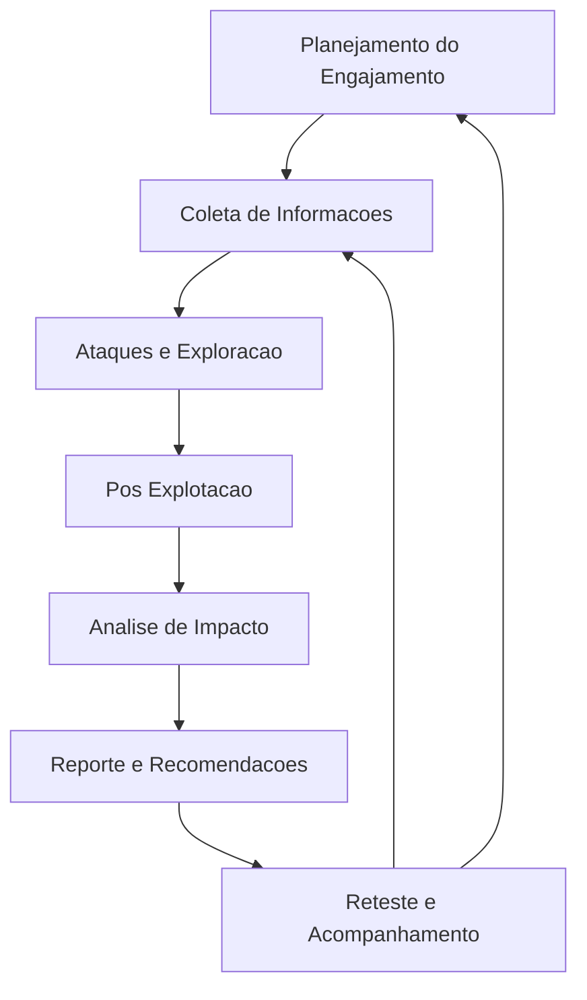

# Visão Geral Prática de um Teste de Intrusão (Pentest) — Do Início ao Fim

Nesta parte do curso, você terá uma **visão completa e realista** de como um pentest tradicional acontece na prática — desde o primeiro contato até o relatório final.  
O objetivo é apresentar o fluxo real de trabalho que ocorre em ambientes corporativos, industriais e híbridos, permitindo que você compreenda **o que realmente acontece em um teste de intrusão profissional**.

Embora esse conteúdo ajude bastante na compreensão global, alguns itens podem ir além do que é cobrado diretamente no exame **CompTIA PenTest+**. Caso seu foco seja **somente a prova**, você pode pular esta seção — mas se deseja se tornar um pentester melhor na prática, é fortemente recomendável estudá-la.

---

# 1. O que é um Teste de Intrusão?

Um **pentest** é uma simulação controlada de ataques cibernéticos com o objetivo de:

- identificar vulnerabilidades,
- explorá-las de forma ética e controlada,
- validar riscos reais,
- e orientar a correção.

### Em TI  
É como executar um chaos engineering controlado: você tenta quebrar o sistema para saber onde reforçar antes que alguém mal-intencionado o faça.

### Em Automação Industrial  
É como testar a robustez de uma célula industrial submetendo-a a falhas simuladas — porém, aqui estamos simulando **falhas causadas por um adversário**, como um atacante mexendo em um CLP, uma IHM ou um gateway OT/IT.

Essa prática é essencial para:

- fortalecer a postura de segurança,  
- atender normas e auditorias (ISO, NIST, IEC 62443),  
- reduzir riscos reais de invasão.

---

# 2. O que Será Estudado Nesta Seção

Esta parte do curso cobre todas as fases práticas de um pentest profissional.  
Cada etapa é apresentada com foco no **fluxo natural de um teste real**, não limitado aos domínios da certificação.

---

## 2.1 Planejamento do Engajamento

Primeiro, é preciso entender **o que pode e não pode ser testado**.

Você aprenderá a:

- definir o escopo (sistemas, redes, APIs, equipamentos industriais etc.),
- estabelecer objetivos claros,
- alinhar expectativas,
- definir regras de engajamento (ROE),
- compreender limites contratuais e legais.

### Exemplo  
Se o alvo for um ambiente industrial, o planejamento define:

- se o teste será apenas em rede OT;  
- se será permitido tocar em CLPs de backup;  
- se a planta pode sofrer interrupções;  
- quais horários são seguros para teste;  
- qual é o impacto aceitável no processo.

---

## 2.2 Coleta de Informações

Depois do planejamento, inicia-se a fase de **Information Gathering**, que inclui:

- coleta OSINT,  
- enumeração de redes,  
- descoberta de serviços,  
- análise de superfícies de ataque,  
- identificação de fraquezas humanas via engenharia social.

### Analogia TI  
É o equivalente a mapear toda a infraestrutura antes de configurar seu stack de observabilidade.

### Analogia Automação Industrial  
É como identificar cada nó de uma rede Profinet, Modbus ou EtherNet/IP antes de ajustar tempos de ciclo.

---

## 2.3 Ataques e Exploração

Com as informações coletadas, é hora de **tentar explorar vulnerabilidades**.

Você aprenderá técnicas e ferramentas para:

- exploração de sistemas,
- ataques web,
- manipulação de protocolos,
- ataques sociais,
- exploração de serviços,
- uso de frameworks como Metasploit.

### Exemplo  
Se durante a enumeração você descobre um CLP antigo com porta de programação exposta, a fase de exploração consiste em verificar até onde é possível interagir com ele — sempre seguindo as regras do contrato.

---

## 2.4 Pós-Explotação

Depois de obter acesso inicial, o objetivo passa a ser:

- avaliar o impacto,  
- escalar privilégios,  
- coletar credenciais,  
- manter acesso,  
- mover-se dentro da rede (pivoting, lateral movement).

### Analogia Automação Industrial  
É como, após acessar uma IHM, conseguir navegar pela rede industrial para chegar ao CLP principal — cenário crítico em ICS.

---

## 2.5 Reporte dos Resultados

A fase final é tão importante quanto as demais.

Você aprenderá a:

- documentar descobertas,  
- apresentar metodologias utilizadas,  
- evidenciar riscos concretos,  
- escrever recomendações,  
- produzir relatórios com valor técnico e executivo.

O relatório é o que permite ao cliente **corrigir** as falhas antes que seja tarde.

---
## 2.6 Fluxo do Pentest

# Fluxo Didático de um Pentest

Esta seção apresenta o fluxo completo de um teste de intrusão profissional, organizado de forma didática e visual, utilizando Mermaid para representar cada etapa e seus ciclos naturais.

---

## Fluxo Completo de um Teste de Intrusão

O diagrama abaixo resume todas as fases de um pentest e seus relacionamentos.

## 2.7 Demonstração Prática Completa

Ao fim desta seção, você verá um **pentest completo simulando um caso real**, passando por:

- planejamento,  
- reconhecimento,  
- exploração,  
- pós-exploração,  
- e elaboração do relatório.

A ideia é mostrar como todas as peças se encaixam — como em um fluxo industrial onde sensores, atuadores e controladores trabalham em cadeia.

---

## 2.8 Mini-quiz de Revisão

Será apresentado um pequeno quiz para avaliar sua compreensão desta seção.  
Cada resposta será explicada para garantir clareza total sobre os conceitos abordados.

---

# 3. Recomendação de Estudo

Se você tem pouca experiência com testes de intrusão — especialmente em ambientes complexos como data centers, clusters Kubernetes, redes industriais, ou ambientes híbridos OT/IT — esta seção é **altamente recomendada**.

Se o seu foco é exclusivamente no exame, ainda assim essa prática reforça:

- entendimento de fluxo de ataque,  
- contexto operacional,  
- raciocínio analítico.

---

# 4. Conclusão

Ao finalizar esta seção você terá:

- uma compreensão profunda do ciclo completo de um pentest,  
- visão prática de atacantes éticos,  
- entendimento de etapas e interdependências,  
- base sólida para estudos avançados e execução real.

Se estiver pronto para mergulhar nas metodologias, ferramentas e etapas reais de um teste de intrusão profissional, siga para a próxima aula e vamos começar.

