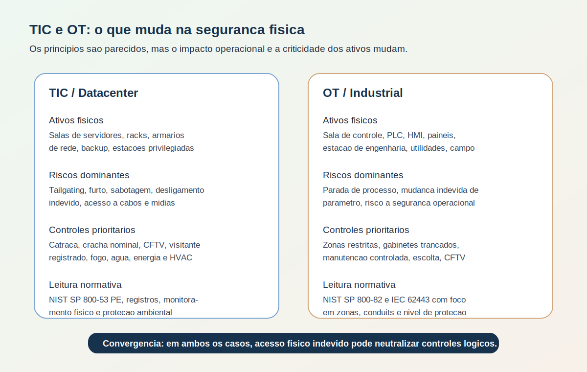
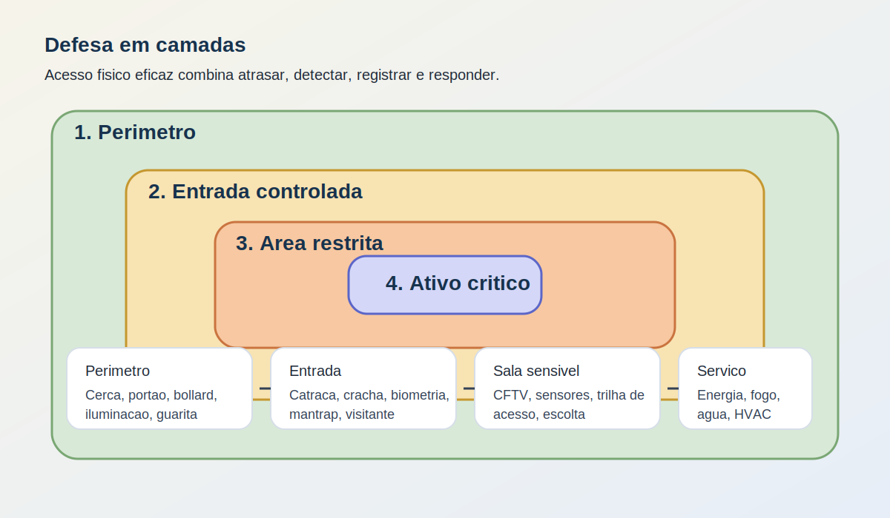

# Segurança Física em TIC e Ambientes Industriais

> **Objetivos de aprendizagem**
> - Diferenciar controles perimetrais, controles de acesso, vigilância e proteção ambiental.
> - Relacionar segurança física com risco cibernético em ambientes de TIC e industriais.
> - Aplicar boas práticas alinhadas a referências como NIST SP 800-53, NIST SP 800-82 e IEC 62443.
>
> **Tempo estimado:** 28 minutos

## Vídeo de contexto

## 1. O que é segurança física em segurança digital?

Segurança física é o conjunto de medidas que protege **pessoas, instalações, equipamentos, mídias e áreas sensíveis** contra acesso indevido, sabotagem, furto, dano ambiental e interrupção operacional.

Na prática, ela existe para evitar que um incidente no mundo real vire um incidente digital ou operacional.

- **Perímetro:** cerca, portão, bollard, barreira de veículo, guarita.
- **Acesso:** crachá, biometria, catraca, mantrap, controle de chaves.
- **Vigilância:** câmeras, vigilantes, sensores, iluminação, alarmes.
- **Proteção ambiental:** energia, climatização, incêndio, água, cabeamento e salas técnicas.

Em uma organização moderna, segurança física e cibersegurança não competem entre si. Elas se reforçam. Se alguém entra fisicamente em uma sala de rede, em um rack OT ou em uma estação de engenharia, muitos controles lógicos perdem valor rapidamente.

---

## 2. Onde a segurança física atua em TIC e OT

Em **TIC**, o foco costuma estar em datacenters, salas de telecomunicações, escritórios, armários de rede, arquivos físicos e áreas com estações privilegiadas.

Em **OT/industrial**, o foco se expande para salas de controle, painéis de PLC, estações de engenharia, subestações, utilidades, almoxarifados de peças, áreas de processo e acessos de manutenção de terceiros.

{ width="900" }
*Figura 1. Comparação didática entre áreas críticas de TIC e ambientes industriais, com ênfase em controles físicos e convergência com risco cibernético.*

### 2.1 Diferença prática entre os contextos

| Contexto | Ativo físico mais sensível | Impacto de uma falha física | Controle prioritário |
|---|---|---|---|
| **Datacenter/TIC** | Sala de servidores, racks, mídia de backup, armários de rede | Vazamento, indisponibilidade, adulteração de equipamento | Controle de acesso forte, CFTV, visitantes e proteção ambiental |
| **Campus corporativo** | Portarias, salas administrativas, dispositivos de usuário, arquivos | Furto, fraude presencial, tailgating, sabotagem | Catracas, crachá, recepção, monitoramento e segregação de áreas |
| **OT/industrial** | Sala de controle, PLCs, HMIs, painéis, utilidades, subestação | Parada de produção, risco de segurança operacional, dano físico ao processo | Zonas restritas, escolta, gabinetes trancados, vigilância e manutenção controlada |

O **NIST SP 800-82 Rev. 3** reforça esse ponto ao tratar OT como um conjunto amplo de sistemas que interagem com o ambiente físico, incluindo **industrial control systems**, **building automation systems**, **physical access control systems** e **physical environment monitoring systems**.

---

## 3. Mecanismos visuais de segurança física

### 3.1 Barreira perimetral e proteção contra impacto

Barreiras físicas não servem apenas para "fechar" um espaço. Elas atrasam, canalizam e expõem o invasor, o que aumenta a chance de detecção antes do acesso à área crítica.

- **Cercas e gradis:** definem o limite do ambiente e reduzem acesso oportunista.
- **Bollards:** protegem fachadas, entradas de pedestres, geradores, depósitos e salas técnicas contra colisão intencional ou acidental.
- **Portões e eclusas de veículo:** ajudam a separar tráfego logístico de áreas restritas.

{ width="760" }
*Figura 2. Exemplo de bollards como barreira de proteção entre fluxo de veículos e área de circulação. Fonte: [Wikimedia Commons - Safety Bollards 01.jpg](https://commons.wikimedia.org/wiki/File:Safety_Bollards_01.jpg), Vijayanrajapuram, CC BY-SA 4.0.*

### 3.2 Controle de acesso e anti-tailgating

O objetivo do controle de acesso físico não é apenas abrir e fechar portas. Ele deve responder a quatro perguntas:

1. **Quem entrou?**
2. **Em qual área?**
3. **Em qual horário?**
4. **Com qual autorização e rastreabilidade?**

Controles mais comuns:

- crachá com identidade nominal;
- biometria ou segundo fator para áreas de maior criticidade;
- catraca, fechadura eletrônica ou mantrap;
- política de visitantes com registro, crachá temporário e escolta;
- revisão periódica de permissões de terceiros e ex-colaboradores.

{ width="700" }
*Figura 3. Exemplo ilustrativo de mantrap para reduzir tailgating e piggybacking em entradas sensíveis. Fonte: [Wikimedia Commons - Security Mantrap Portal.jpg](https://commons.wikimedia.org/wiki/File:Security_Mantrap_Portal.jpg), McGov1258, CC BY-SA 4.0.*

### 3.3 Vigilância, evidência e resposta

Vigilância eficaz combina **capacidade de observação**, **qualidade de evidência** e **procedimento de resposta**.

- **CFTV** ajuda a detectar, investigar e desestimular.
- **Sensores** elevam cobertura em áreas com pouca circulação.
- **Iluminação** reduz pontos cegos e melhora gravação.
- **Vigilância humana** interpreta contexto, aciona resposta e verifica exceções.

{ width="760" }
*Figura 4. Exemplo de câmera CCTV usada como controle detectivo e dissuasório. Fonte: [Wikimedia Commons - CCTV camera.JPG](https://commons.wikimedia.org/wiki/File:CCTV_camera.JPG), KRoock74, CC BY-SA 3.0.*

---

## 4. Defesa em camadas para áreas críticas

Uma boa arquitetura física evita depender de um único controle. A ideia correta é **defesa em profundidade**:

{ width="920" }
*Figura 5. Exemplo de defesa em camadas aplicada a campus, prédios administrativos, salas de TI e áreas de controle industrial.*

### 4.1 Melhores práticas que se repetem em bons ambientes

- **Separar zonas por criticidade**, e não apenas por conveniência arquitetônica.
- **Restringir áreas sensíveis por necessidade real de acesso**.
- **Registrar visitantes, entregas e remoção de ativos**.
- **Revisar crachás, chaves, perfis biométricos e credenciais temporárias**.
- **Integrar eventos físicos com monitoramento de segurança**, sempre que possível.
- **Proteger energia, climatização, incêndio e água** como parte da segurança do serviço.
- **Testar falha segura e saída de emergência** para não criar risco à vida.
- **Tratar câmeras, controladoras, leitores e sensores como ativos que também precisam de hardening e manutenção**.

### 4.2 Erros comuns

- confiar apenas na portaria e não proteger salas internas;
- manter rack, painel ou armário técnico aberto "porque a equipe precisa de agilidade";
- permitir acesso recorrente de terceiros sem trilha de auditoria;
- não revogar crachá ou chave após mudança de função;
- instalar CFTV sem cobertura real, retenção adequada ou processo de resposta;
- esquecer que climatização, água, fogo e energia também causam indisponibilidade crítica.

---

## 5. O que o NIST SP 800 traz para este tema

Quando o curso mencionar **"NIST 80"** neste contexto, a referência prática mais útil está na **família NIST SP 800**, principalmente em **SP 800-53 Rev. 5** e **SP 800-82 Rev. 3**.

### 5.1 NIST SP 800-53 Rev. 5

O **SP 800-53 Rev. 5** mantém a família **Physical and Environmental Protection (PE)**, que organiza controles diretamente ligados ao tema.

| Controle/família | Tradução prática para sala, datacenter e planta |
|---|---|
| **PE-2 Physical Access Authorizations** | Formalizar quem pode acessar cada área física |
| **PE-3 Physical Access Control** | Aplicar portas, leitores, biometria, catracas e segregação |
| **PE-6 Monitoring Physical Access** | Monitorar entradas, saídas e exceções |
| **PE-7 Visitor Control / PE-8 Access Records** | Registrar visitantes e manter rastreabilidade |
| **PE-9 a PE-15** | Proteger energia, cabos, desligamento, iluminação, fogo, temperatura, umidade e água |
| **PE-16 Delivery and Removal** | Controlar entrada e retirada de equipamentos, peças e mídias |
| **PE-18 Location of Information System Components** | Posicionar ativos críticos em locais fisicamente protegidos |

Em outras palavras, o NIST não trata segurança física como tema periférico. Ele a coloca no mesmo nível de disciplina operacional que acesso, auditoria e continuidade.

### 5.2 NIST SP 800-82 Rev. 3

O **SP 800-82 Rev. 3**, publicado em **setembro de 2023**, é especialmente útil para convergir segurança física com OT. O documento:

- trata OT como sistemas que interagem com o ambiente físico;
- inclui **physical access control systems** e **physical environment monitoring systems** no escopo de exemplos de OT;
- destaca que os controles devem respeitar requisitos de **desempenho, confiabilidade e segurança operacional**.

Tradução prática:

- em OT, abrir uma porta errada pode ter impacto maior do que em um escritório comum;
- a proteção física de estações de engenharia, painéis, salas de controle e utilidades não pode ser tratada como detalhe predial;
- controles compensatórios precisam considerar continuidade do processo, segurança da operação e resposta de campo.

---

## 6. Como a IEC 62443 reforça a segurança física industrial

A **IEC 62443** não substitui procedimentos de portaria ou normas prediais, mas ajuda a estruturar como a segurança física se conecta ao risco cibernético industrial.

### 6.1 Pontos mais úteis da série para este tema

| Referência | O que ela traz | Reflexo na segurança física |
|---|---|---|
| **IEC TS 62443-1-1:2009** | Terminologia, conceitos e modelos para IACS | Ajuda a falar de zonas, conduítes e ativos de forma consistente |
| **IEC 62443-3-2:2020** | Avaliação de risco e particionamento em **zones and conduits** | Exige separar ambientes conforme criticidade e fluxo autorizado |
| **IEC 62443-3-3:2013** | Requisitos de sistema e **security levels** | Pressiona a definir controles coerentes com o nível de proteção desejado |
| **IEC PAS 62443-2-2:2025** | Esquema de proteção do IACS com medidas **technical, physical, and process** | Reforça que segurança física faz parte do programa de proteção do ativo industrial |

### 6.2 Tradução prática para planta e utilidades

Em uma fábrica, campus técnico ou laboratório industrial, a leitura correta da IEC 62443 costuma levar a estas decisões:

- separar **escritório corporativo**, **DMZ industrial**, **sala de controle**, **painéis/campos** e **áreas de manutenção**;
- restringir fisicamente estações de engenharia e portas de manutenção;
- manter gabinetes, painéis e switches industriais fechados e com trilha de acesso;
- controlar acesso remoto e presencial de integradores e fornecedores;
- evitar que um visitante chegue a uma HMI, PLC ou painel elétrico apenas por falha de portaria.

Esse raciocínio também melhora a integração com páginas específicas desta trilha, como [Controles de Segurança Física](controles_fisicos.md), [Sistemas de Vigilância](sistema_vigilancia.md), [Câmaras de acesso controlado](camaras_acesso.md) e [Clonagem de acesso](clonagem_cracha.md).

---

## 7. Vídeo complementar

Para conectar o tema ao contexto industrial e de supervisão:

---

## 8. Mini-caso prático

Uma instituição mantém um **datacenter acadêmico** e um **laboratório de automação** no mesmo campus.

- **Problema inicial:** visitantes entram com escolta informal, racks ficam em sala compartilhada e o laboratório industrial mantém painéis acessíveis durante aulas externas.
- **Ameaça:** acesso indevido com furto de mídia, alteração de equipamento e conexão local não autorizada em estação de engenharia.
- **Impacto potencial:** indisponibilidade do portal institucional, perda de evidência, parada de experimentos e risco de dano ao processo controlado.
- **Tratamento prioritário:** separar zonas por criticidade, adotar registro de visitantes, instalar controle de acesso em salas sensíveis, fechar painéis, revisar permissões físicas de terceiros e integrar eventos físicos ao monitoramento.

Se a equipe alinhar o ambiente às boas práticas discutidas:

- o **NIST SP 800-53** ajuda a estruturar autorizações, monitoramento, visitantes e proteção ambiental;
- o **NIST SP 800-82** ajuda a tratar controle de acesso e monitoramento ambiental como parte do ecossistema OT;
- a **IEC 62443** ajuda a justificar segregação física por zonas, risco e nível de proteção esperado.

---

## 9. Perguntas de revisão rápida

1. Por que segurança física não pode ser tratada separadamente da segurança digital em TIC e OT?
2. Qual a diferença prática entre aplicar controle físico em um datacenter e em uma sala de controle industrial?
3. Como NIST SP 800-53, NIST SP 800-82 e IEC 62443 se complementam em uma decisão de acesso físico?

---

## 10. Fontes de referência

- NIST SP 800-53 Rev. 5 - Security and Privacy Controls for Information Systems and Organizations  
  https://csrc.nist.gov/pubs/sp/800/53/r5/final
- NIST Risk Management Framework - Physical and Environmental Protection assessment cases  
  https://csrc.nist.gov/projects/risk-management/about-rmf/assess-step/assessment-cases-download-page
- NIST SP 800-82 Rev. 3 - Guide to Operational Technology (OT) Security  
  https://csrc.nist.gov/pubs/sp/800/82/r3/final
- IEC TS 62443-1-1:2009 - Terminology, concepts and models  
  https://webstore.iec.ch/en/publication/7029
- IEC 62443-3-2:2020 - Security risk assessment for system design  
  https://webstore.iec.ch/en/publication/30727
- IEC 62443-3-3:2013 - System security requirements and security levels  
  https://webstore.iec.ch/en/publication/7033
- IEC PAS 62443-2-2:2025 - IACS security protection scheme  
  https://webstore.iec.ch/en/publication/63886
- Video: Treinamento Segurança da Informação - Controle de acesso físico e lógico  
  https://www.youtube.com/watch?v=rSR3pmO2DC8
- Video: Aplicação da norma de Ciber Segurança IEC 62443 em Sistemas de Supervisão e Controle  
  https://www.youtube.com/watch?v=oI73xRC_55Q
