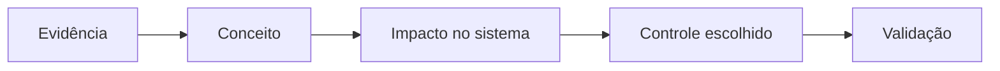

# Axx — Título orientado ao problema

> **Objetivos de aprendizagem**
>
> Ao final deste encontro, você será capaz de:
>
> - investigar uma evidência e formular uma hipótese verificável;
> - explicar o mecanismo que conecta a evidência ao impacto;
> - escolher e validar uma intervenção compatível com o cenário.
>
> **Tempo estimado:** 104 minutos — 52 minutos de conceituação ativa e 52 minutos de prática.
>
> **Pré-requisitos:** indique somente conhecimentos e recursos indispensáveis.

## O cenário

Comece com uma situação profissional curta. Apresente sistema, atores, restrições e consequência, mas não antecipe a explicação.

!!! question "Pergunta mobilizadora"
    Que evidência permitiria distinguir duas hipóteses concorrentes?

---

## 1. Observe antes de explicar

Inclua log, captura, trecho de configuração, pacote, diagrama ou comportamento observável. Diferencie explicitamente:

| Elemento | Pergunta |
|---|---|
| Observação | O que a evidência mostra diretamente? |
| Hipótese | Que mecanismo poderia explicar isso? |
| Lacuna | O que ainda precisa ser medido ou testado? |

## 2. Conceito necessário

Defina o mecanismo no contexto da evidência. Explique termos no primeiro uso e inclua pelo menos um exemplo aplicado.

## 3. Impacto para a engenharia

Traduza o achado para processo, pessoas, produção, disponibilidade, qualidade, segurança operacional e risco, conforme aplicável.

## 4. Controles e trade-offs

| Opção | Melhor uso | Esforço/custo | Como validar | Limitação/risco |
|---|---|---|---|---|
| Controle A |  |  |  |  |
| Controle B |  |  |  |  |

Finalize com recomendação condicionada ao cenário, não com uma solução universal.

## 5. Ponte para a prática

A atividade distribuída no Google Classroom pedirá que você formule uma hipótese, investigue, tome uma decisão e demonstre o resultado. O PDF contém o escopo autorizado, os passos, os critérios e a limpeza do ambiente.

---

## Síntese

Retome a relação entre evidência, conceito, impacto, ação e validação em poucas linhas.

## Perguntas de revisão rápida

1. Qual observação sustentou a hipótese principal?
2. Por que o controle escolhido é adequado às restrições do cenário?
3. Que evidência demonstraria que a intervenção funcionou?

## Fontes para aprofundamento

- [NIST](https://www.nist.gov/)
- [OWASP](https://owasp.org/)
- [MITRE ATT&CK](https://attack.mitre.org/)

As fontes complementam o estudo; todos os conceitos indispensáveis devem estar explicados nesta página.
